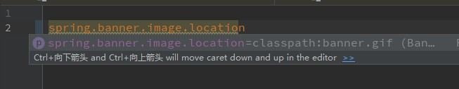

# SpringBoot启动

在这里分析SpringBoot的run方法执行过程， 主要是研究SpringBoot是如何整合Spring、SpringMVC、Tomcat


## 启动入口

首先看传统的run方法执行过程，直接调用SpringApplication的静态run方法

```java
@SpringBootApplication
public class SpringbootNoteApplication {

   public static void main(String[] args) {
      SpringApplication.run(SpringbootNoteApplication.class, args);
   }
}


// -----------------------------------------------------------------------------
public static ConfigurableApplicationContext run(Class<?> primarySource, String... args) {
    return run(new Class[]{primarySource}, args);
}
// -----------------------------------------------------------------------------    
public static ConfigurableApplicationContext run(Class<?>[] primarySources, String[] args) {
    return (new SpringApplication(primarySources)).run(args);
}

```


### 自定义启动

从上面可以看到，其实我们可以手动创建SpringApplication，然后手动调用run方法，在run方法之前我们就可以进行一些扩展了。在这里 可以留个疑问，这里传入当前类(SpringbootNoteApplication) 的用处是什么？

```java
@SpringBootApplication
public class SpringbootNoteApplication {

   public static void main(String[] args) {
      // 方式一
      SpringApplication application = new SpringApplication(SpringbootNoteApplication.class);
      application.run(args);

      // 方式二
      //new SpringApplicationBuilder(SpringbootNoteApplication.class)
      //    .web(WebApplicationType.SERVLET)
      //    .run();

      // 方式三
      //SpringApplication.run(SpringbootNoteApplication.class, args);
   }

}
```


### 创建SpringApplication实例

创建SpringApplication实例，应用的上下文将会从指定的主要资源加载Bean。在这里构造函数主要做以下几个事情：

1.  设置primarySources
2.  设置应用的类型
3.  设置ApplicationContextInitializer
4.  设置ApplicationListener
5.  设置main class

``` java
public SpringApplication(Class<?>... primarySources) {
   this(null, primarySources);
}

// -----------------------------------------------------------------------------    

	/**
	 * Create a new {@link SpringApplication} instance. The application context will load
	 * beans from the specified primary sources (see {@link SpringApplication class-level}
	 * documentation for details. The instance can be customized before calling
	 * {@link #run(String...)}.
	 * @param resourceLoader the resource loader to use
	 * @param primarySources the primary bean sources
	 * @see #run(Class, String[])
	 * @see #setSources(Set)
	 */
	@SuppressWarnings({ "unchecked", "rawtypes" })
	public SpringApplication(ResourceLoader resourceLoader, Class<?>... primarySources) {
        // 设置资源加载器，这里为null
		this.resourceLoader = resourceLoader;
		Assert.notNull(primarySources, "PrimarySources must not be null");
        // 设置primarySources
		this.primarySources = new LinkedHashSet<>(Arrays.asList(primarySources));
        // 设置web应用的类型
		this.webApplicationType = WebApplicationType.deduceFromClasspath();
        // 设置ApplicationContextInitializer
		setInitializers((Collection) getSpringFactoriesInstances(ApplicationContextInitializer.class));
        // 设置ApplicationListener
		setListeners((Collection) getSpringFactoriesInstances(ApplicationListener.class));
        // 设置main class
		this.mainApplicationClass = deduceMainApplicationClass();
	}
```


#### 设置应用的类型

设置应用的类型，通常我们用的比较多的是**SERVLET**类型，也就是常用的WEB项目。

```java
	static WebApplicationType deduceFromClasspath() {
		if (ClassUtils.isPresent(WEBFLUX_INDICATOR_CLASS, null) && !ClassUtils.isPresent(WEBMVC_INDICATOR_CLASS, null)
				&& !ClassUtils.isPresent(JERSEY_INDICATOR_CLASS, null)) {
			return WebApplicationType.REACTIVE;
		}
		for (String className : SERVLET_INDICATOR_CLASSES) {
			if (!ClassUtils.isPresent(className, null)) {
				return WebApplicationType.NONE;
			}
		}
		return WebApplicationType.SERVLET;
	}

// -----------------------------------------------------------------------------   
/**
 * An enumeration of possible types of web application.
 *
 * @author Andy Wilkinson
 * @author Brian Clozel
 * @since 2.0.0
 */
public enum WebApplicationType {

   /**
    * The application should not run as a web application and should not start an
    * embedded web server.
    */
   NONE,

   /**
    * The application should run as a servlet-based web application and should start an
    * embedded servlet web server.
    */
   SERVLET,

   /**
    * The application should run as a reactive web application and should start an
    * embedded reactive web server.
    */
   REACTIVE;
```

那如果非WEB项目我们就可以在run之前，手动设置为NONE类型，比如provider模块

```java
SpringApplication application = new SpringApplication(SpringbootNoteApplication.class);
application.setWebApplicationType(WebApplicationType.NONE);
application.run(args);
```


#### 设置ApplicationContextInitializer

在这里获取spring.factories文件下配置的所有ApplicationContextInitializer，实例化然后放到集合中去。如果了解SpringBoot自动装配原理，就知道这里是从Spring.factories文件获取自动装配的类

```java
setInitializers((Collection) getSpringFactoriesInstances(ApplicationContextInitializer.class));

// -----------------------------------------------------------------------------  
public void setInitializers(Collection<? extends ApplicationContextInitializer<?>> initializers) {
    this.initializers = new ArrayList<>(initializers);
}
// -----------------------------------------------------------------------------  
private <T> Collection<T> getSpringFactoriesInstances(Class<T> type, Class<?>[] parameterTypes, Object... args) {
    // 获取类加载器，如果 
    ClassLoader classLoader = getClassLoader();
    // Use names and ensure unique to protect against duplicates
    // 如果了解SpringBoot自动装配原理，就知道这里是从Spring.factories文件获取自动装配的类
    // 用set是为了保护name不重复
    Set<String> names = new LinkedHashSet<>(SpringFactoriesLoader.loadFactoryNames(type, classLoader));
    // 实例化
    List<T> instances = createSpringFactoriesInstances(type, parameterTypes, classLoader, args, names);
    // 排序
    AnnotationAwareOrderComparator.sort(instances);
    return instances;
}
```


createSpringFactoriesInstances

将从SpringFactories 所获取的类名，进行创建实例化。主要的步骤：先通过 Class.forName获取class类型，再根据参数parameterTypes获取对应的构造函数，最后调用Constructor.newInstance即可。

```java
private <T> List<T> createSpringFactoriesInstances(Class<T> type, Class<?>[] parameterTypes,
      ClassLoader classLoader, Object[] args, Set<String> names) {
   List<T> instances = new ArrayList<>(names.size());
   for (String name : names) {
      try {
         Class<?> instanceClass = ClassUtils.forName(name, classLoader);
         Assert.isAssignable(type, instanceClass);
         Constructor<?> constructor = instanceClass.getDeclaredConstructor(parameterTypes);
         T instance = (T) BeanUtils.instantiateClass(constructor, args);
         instances.add(instance);
      }
      catch (Throwable ex) {
         throw new IllegalArgumentException("Cannot instantiate " + type + " : " + name, ex);
      }
   }
   return instances;
}
```


 AnnotationAwareOrderComparator.sort(instances);

AnnotationAwareOrderComparator继承了OrderComparator，而OrderComparator实现了Comparator接口，这里其实就是对PriorityOrdered 或Ordered注解的进行排序。说明我们对应多个ApplicationContextInitializer可以使用注解进行排序。

另外，这里还用到了单例模式。

```java
/**
 * {@code AnnotationAwareOrderComparator} is an extension of
 * {@link OrderComparator} that supports Spring's
 * {@link org.springframework.core.Ordered} interface as well as the
 * {@link Order @Order} and {@link javax.annotation.Priority @Priority}
 * annotations, with an order value provided by an {@code Ordered}
 * instance overriding a statically defined annotation value (if any).
 *
 * <p>Consult the Javadoc for {@link OrderComparator} for details on the
 * sort semantics for non-ordered objects.
 *
 * @author Juergen Hoeller
 * @author Oliver Gierke
 * @author Stephane Nicoll
 * @since 2.0.1
 * @see org.springframework.core.Ordered
 * @see org.springframework.core.annotation.Order
 * @see javax.annotation.Priority
 */
public class AnnotationAwareOrderComparator extends OrderComparator {

   /**
    * Shared default instance of {@code AnnotationAwareOrderComparator}.
    */
    // 单例模式
   public static final AnnotationAwareOrderComparator INSTANCE = new AnnotationAwareOrderComparator();
```


#### 设置ApplicationListener

同设置ApplicationContextInitializer


#### 设置main class

有意思的是，这里是通过new RuntimeException()去判断的，这种方式我们是否也有采用之处？

``` java
private Class<?> deduceMainApplicationClass() {
   try {
      StackTraceElement[] stackTrace = new RuntimeException().getStackTrace();
      for (StackTraceElement stackTraceElement : stackTrace) {
         if ("main".equals(stackTraceElement.getMethodName())) {
            return Class.forName(stackTraceElement.getClassName());
         }
      }
   }
   catch (ClassNotFoundException ex) {
      // Swallow and continue
   }
   return null;
}
```


### 小结

在创建SpringApplication的过程中，主要是进行一些自动装配的初始化动作。设置应用的类型等。


## run

在进行一堆设置后，便开始执行run方法，创建并刷新应用。

下面是执行流程的注释：

```java
public ConfigurableApplicationContext run(String... args) {
    StopWatch stopWatch = new StopWatch();
    stopWatch.start();
    ConfigurableApplicationContext context = null;
    Collection<SpringBootExceptionReporter> exceptionReporters = new ArrayList();
    // 设置SYSTEM_PROPERTY_JAVA_AWT_HEADLESS = "java.awt.headless"
    this.configureHeadlessProperty();
    // 获取所有的SpringApplicationRunListener监听器
    SpringApplicationRunListeners listeners = this.getRunListeners(args);
    // 调用所有SpringApplicationRunListeners的starting()
    listeners.starting();

    Collection exceptionReporters;
    try {
        ApplicationArguments applicationArguments = new DefaultApplicationArguments(args);
        // 创建和准备ConfigurableEnvironment
        // 并且会调用所有SpringApplicationRunListener的environmentPrepared()
        ConfigurableEnvironment environment = this.prepareEnvironment(listeners, applicationArguments); 
        // 配置忽略的Bean
        this.configureIgnoreBeanInfo(environment);
        // 打印banner
        Banner printedBanner = this.printBanner(environment);
        // 创建Spring的应用上下文
        context = this.createApplicationContext();
        // 获取SpringBootExceptionReporter
        exceptionReporters = this.getSpringFactoriesInstances(SpringBootExceptionReporter.class, new Class[]{ConfigurableApplicationContext.class}, context);
        // 准备Spring的应用上下文
        // 并且会调用所有调用SpringApplicationRunListeners的contextPrepared()和SpringApplicationRunListener的contextLoaded()
        this.prepareContext(context, environment, listeners, applicationArguments, printedBanner);
        // 刷新容器，refresh()
        this.refreshContext(context);
        // 刷新容器后的回调，钩子方法，空实现
        this.afterRefresh(context, applicationArguments);
        stopWatch.stop();
        // 打印记录
        if (this.logStartupInfo) {
            (new StartupInfoLogger(this.mainApplicationClass)).logStarted(this.getApplicationLog(), stopWatch);
        }
 		// 调用所有SpringApplicationRunListeners的started()
        listeners.started(context);
        // 回调ApplicationRunner和CommandLineRunner的run方法
        this.callRunners(context, applicationArguments);
    } catch (Throwable var10) {
        this.handleRunFailure(context, var10, exceptionReporters, listeners);
        throw new IllegalStateException(var10);
    }

    try { 
        // 调用所有SpringApplicationRunListeners的running()
        listeners.running(context);
        return context;
    } catch (Throwable var9) {
        // 调用所有SpringApplicationRunListeners的failed() 
        // 关闭容器
        this.handleRunFailure(context, var9, exceptionReporters, (SpringApplicationRunListeners)null);
        throw new IllegalStateException(var9);
    }
}
```


### configureHeadlessProperty

配置Headless，headless模式是缺少显示设备，键盘或鼠标的系统配置。文章：[什么是Java Headless模式？](http://jimolonely.github.io/2019/03/26/java/039-java-headless/)

先从Property获取，没有则用默认值true。

```java
private void configureHeadlessProperty() {
    // 默认值headless = true;
    // 默认值SYSTEM_PROPERTY_JAVA_AWT_HEADLESS = "java.awt.headless";
   System.setProperty(SYSTEM_PROPERTY_JAVA_AWT_HEADLESS,
         System.getProperty(SYSTEM_PROPERTY_JAVA_AWT_HEADLESS, Boolean.toString(this.headless)));
}
```


### getRunListeners

获取所有的监听器，getSpringFactoriesInstances原理同设置ApplicationListener。ApplicationListener是Spring的，而SpringApplicationRunListener是设置SpringBoot的，可以看到SpringBoot的设置顺序 < Spring

```java 
private SpringApplicationRunListeners getRunListeners(String[] args) {
   Class<?>[] types = new Class<?>[] { SpringApplication.class, String[].class };
   return new SpringApplicationRunListeners(logger,
         getSpringFactoriesInstances(SpringApplicationRunListener.class, types, this, args));
}
```

将获取的所有实例化的SpringApplicationRunListener放入到SpringApplicationRunListeners中，可以看到在SpringApplicationRunListeners维护了一个list，便于在初始化的时候统一调用所有的SpringApplicationRunListener监听器。

```java
class SpringApplicationRunListeners {

   private final Log log;

   private final List<SpringApplicationRunListener> listeners;
```


### listeners.starting()

调用所有SpringApplicationRunListeners的starting，在后面的阅读中，我们也可以留意一下其它方法调用的地方，**其实都在run方法里面。**

- starting：在第一次调用run方法时马上执行，可以用于比较早的初始化
- environmentPrepared：environment准备完毕，但是还没创建完毕
- contextPrepared：  ApplicationContext准备完毕
- contextLoaded：ApplicationContext加载完毕，但是未刷新容器前(refreshed)
- started：Spring ApplicationContext刷新启动完毕，但是CommandLineRunner和ApplicationRunner未执行
- running：CommandLineRunner和ApplicationRunner执行完毕
- failed：在running时发生异常

```java
/**
 * Listener for the {@link SpringApplication} {@code run} method.
 * {@link SpringApplicationRunListener}s are loaded via the {@link SpringFactoriesLoader}
 * and should declare a public constructor that accepts a {@link SpringApplication}
 * instance and a {@code String[]} of arguments. A new
 * {@link SpringApplicationRunListener} instance will be created for each run.
 *
 * @author Phillip Webb
 * @author Dave Syer
 * @author Andy Wilkinson
 * @since 1.0.0
 */
public interface SpringApplicationRunListener {

   /**
    * Called immediately when the run method has first started. Can be used for very
    * early initialization.
    */
   default void starting() {
   }

   /**
    * Called once the environment has been p
    repared, but before the
    * {@link ApplicationContext} has been created.
    * @param environment the environment
    */
   default void environmentPrepared(ConfigurableEnvironment environment) {
   }

   /**
    * Called once the {@link ApplicationContext} has been created and prepared, but
    * before sources have been loaded.
    * @param context the application context
    */
   default void contextPrepared(ConfigurableApplicationContext context) {
   }

   /**
    * Called once the application context has been loaded but before it has been
    * refreshed.
    * @param context the application context
    */
   default void contextLoaded(ConfigurableApplicationContext context) {
   }

   /**
    * The context has been refreshed and the application has started but
    * {@link CommandLineRunner CommandLineRunners} and {@link ApplicationRunner
    * ApplicationRunners} have not been called.
    * @param context the application context.
    * @since 2.0.0
    */
   default void started(ConfigurableApplicationContext context) {
   }

   /**
    * Called immediately before the run method finishes, when the application context has
    * been refreshed and all {@link CommandLineRunner CommandLineRunners} and
    * {@link ApplicationRunner ApplicationRunners} have been called.
    * @param context the application context.
    * @since 2.0.0
    */
   default void running(ConfigurableApplicationContext context) {
   }

   /**
    * Called when a failure occurs when running the application.
    * @param context the application context or {@code null} if a failure occurred before
    * the context was created
    * @param exception the failure
    * @since 2.0.0
    */
   default void failed(ConfigurableApplicationContext context, Throwable exception) {
   }

}
```


### prepareEnvironment

创建和准备ConfigurableEnvironment

```java
private ConfigurableEnvironment prepareEnvironment(SpringApplicationRunListeners listeners,
      ApplicationArguments applicationArguments) {
   // Create and configure the environment
   // 创建ConfigurableEnvironment
   ConfigurableEnvironment environment = getOrCreateEnvironment();
   // 配置environment，如设置激活的配置文件
   configureEnvironment(environment, applicationArguments.getSourceArgs());
   ConfigurationPropertySources.attach(environment);
   // 调用所有SpringApplicationRunListener的environmentPrepared 方法 
   listeners.environmentPrepared(environment);
   // 绑定当前environment到SpringApplication
   bindToSpringApplication(environment);
   if (!this.isCustomEnvironment) {
      environment = new EnvironmentConverter(getClassLoader()).convertEnvironmentIfNecessary(environment,
            deduceEnvironmentClass());
   }
   ConfigurationPropertySources.attach(environment);
   return environment;
}

// --------------------------------------------------------------------------------
// 根据应用类型创建默认的environment
	private ConfigurableEnvironment getOrCreateEnvironment() {
		if (this.environment != null) {
			return this.environment;
		}
		switch (this.webApplicationType) {
		case SERVLET:
			return new StandardServletEnvironment();
		case REACTIVE:
			return new StandardReactiveWebEnvironment();
		default:
			return new StandardEnvironment();
		}
	}

```


configureEnvironment(environment, applicationArguments.getSourceArgs());

```java
// --------------------------------------------------------------------------------
	protected void configureEnvironment(ConfigurableEnvironment environment, String[] args) {
		if (this.addConversionService) {
			ConversionService conversionService = ApplicationConversionService.getSharedInstance();
			environment.setConversionService((ConfigurableConversionService) conversionService);
		}
		configurePropertySources(environment, args);
		// 设置激活的Profiles
		configureProfiles(environment, args);
	}
	
// --------------------------------------------------------------------------------	
protected void configureProfiles(ConfigurableEnvironment environment, String[] args) {
    Set<String> profiles = new LinkedHashSet<>(this.additionalProfiles);
    profiles.addAll(Arrays.asList(environment.getActiveProfiles()));
    environment.setActiveProfiles(StringUtils.toStringArray(profiles));
}
// environment.getActiveProfiles()
// --------------------------------------------------------------------------------	 
public String[] getActiveProfiles() {
    return StringUtils.toStringArray(doGetActiveProfiles());
}

protected Set<String> doGetActiveProfiles() {
    synchronized (this.activeProfiles) {
        if (this.activeProfiles.isEmpty()) {
            // ACTIVE_PROFILES_PROPERTY_NAME = "spring.profiles.active"
            String profiles = getProperty(ACTIVE_PROFILES_PROPERTY_NAME);
            if (StringUtils.hasText(profiles)) {
                setActiveProfiles(StringUtils.commaDelimitedListToStringArray(
                    StringUtils.trimAllWhitespace(profiles)));
            }
        }
        return this.activeProfiles;
    }
}
```

从这里我们就可以知道，可以通过"spring.profiles.active"设置激活的配置


### configureIgnoreBeanInfo

 配置忽略的Bean，通过"spring.beaninfo.ignore"配置。

```java
// IGNORE_BEANINFO_PROPERTY_NAME = "spring.beaninfo.ignore";
private void configureIgnoreBeanInfo(ConfigurableEnvironment environment) {
   if (System.getProperty(CachedIntrospectionResults.IGNORE_BEANINFO_PROPERTY_NAME) == null) {
      Boolean ignore = environment.getProperty("spring.beaninfo.ignore", Boolean.class, Boolean.TRUE);
      System.setProperty(CachedIntrospectionResults.IGNORE_BEANINFO_PROPERTY_NAME, ignore.toString());
   }
}
```


### printBanner

打印banner，banner的好处是：第一用于打印开发的环境，第二可以打印SpringBoot 的相关版本信息

这里简单研究一下Banner的打印内容

```java
private Banner printBanner(ConfigurableEnvironment environment) {
   if (this.bannerMode == Banner.Mode.OFF) {
      return null;
   }
   ResourceLoader resourceLoader = (this.resourceLoader != null) ? this.resourceLoader
         : new DefaultResourceLoader(null);
   SpringApplicationBannerPrinter bannerPrinter = new SpringApplicationBannerPrinter(resourceLoader, this.banner);
    // 如果是log，则以log的方式打印
   if (this.bannerMode == Mode.LOG) {
      return bannerPrinter.print(environment, this.mainApplicationClass, logger);
   }
   // 控制台的方式，使用PringStream，也就是我们常用的System.out
   return bannerPrinter.print(environment, this.mainApplicationClass, System.out);
}


// --------------------------------------------------------------------------------	
// bannerPrinter.print
Banner print(Environment environment, Class<?> sourceClass, PrintStream out) {
    // 创建banner，并调用printBanner进行打印
    Banner banner = getBanner(environment);
    banner.printBanner(environment, sourceClass, out);
    return new PrintedBanner(banner, sourceClass);
}

// --------------------------------------------------------------------------------	
private Banner getBanner(Environment environment) {
    Banners banners = new Banners();
    // 有意思的是，其实我们还可以设置图片
    banners.addIfNotNull(getImageBanner(environment));
    // 自定义banner文件
    banners.addIfNotNull(getTextBanner(environment));
    if (banners.hasAtLeastOneBanner()) {
        return banners;
    }
    if (this.fallbackBanner != null) {
        return this.fallbackBanner;
    }
    // 默认banner
    return DEFAULT_BANNER;
}
// --------------------------------------------------------------------------------	
 // 配置banner图片路径，"spring.banner.image.location"
	private Banner getImageBanner(Environment environment) {
        //BANNER_IMAGE_LOCATION_PROPERTY = "spring.banner.image.location"
		String location = environment.getProperty(BANNER_IMAGE_LOCATION_PROPERTY);
		if (StringUtils.hasLength(location)) {
			Resource resource = this.resourceLoader.getResource(location);
			return resource.exists() ? new ImageBanner(resource) : null;
		}
        // 支持的格式String[] IMAGE_EXTENSION = { "gif", "jpg", "png" };
		for (String ext : IMAGE_EXTENSION) {
			Resource resource = this.resourceLoader.getResource("banner." + ext);
			if (resource.exists()) {
				return new ImageBanner(resource);
			}
		}
		return null;
	}
// --------------------------------------------------------------------------------	
// 自定义banner文件， 命名为banner.txt即可
	private Banner getTextBanner(Environment environment) {
        // BANNER_LOCATION_PROPERTY = "spring.banner.location";
        // DEFAULT_BANNER_LOCATION = "banner.txt";   
		String location = environment.getProperty(BANNER_LOCATION_PROPERTY, DEFAULT_BANNER_LOCATION);
		Resource resource = this.resourceLoader.getResource(location);
		if (resource.exists()) {
			return new ResourceBanner(resource);
		}
		return null;
	}
```

我们可以在  application.properties文件中 ，输入相应的key查看默认值，例如spring.banner.image.location对应的路径就是classpath:banner.gif，也就是说我们只要将banner.gif(或其他格式)放到Resource路径下即可。spring.banner.location同。




当然，我们也可以来看一下默认的banner，  一切尽在代码中

```java
class SpringBootBanner implements Banner {

   private static final String[] BANNER = { "", "  .   ____          _            __ _ _",
         " /\\\\ / ___'_ __ _ _(_)_ __  __ _ \\ \\ \\ \\", "( ( )\\___ | '_ | '_| | '_ \\/ _` | \\ \\ \\ \\",
         " \\\\/  ___)| |_)| | | | | || (_| |  ) ) ) )", "  '  |____| .__|_| |_|_| |_\\__, | / / / /",
         " =========|_|==============|___/=/_/_/_/" };

   private static final String SPRING_BOOT = " :: Spring Boot :: ";

   private static final int STRAP_LINE_SIZE = 42;

   @Override
   public void printBanner(Environment environment, Class<?> sourceClass, PrintStream printStream) {
      for (String line : BANNER) {
          // System.out.println，打印BANNER数组
         printStream.println(line);
      }
      String version = SpringBootVersion.getVersion();
      version = (version != null) ? " (v" + version + ")" : "";
      StringBuilder padding = new StringBuilder();
      while (padding.length() < STRAP_LINE_SIZE - (version.length() + SPRING_BOOT.length())) {
         padding.append(" ");
      }
	  // 打印版本
      // 设置一些颜色
      printStream.println(AnsiOutput.toString(AnsiColor.GREEN, SPRING_BOOT, AnsiColor.DEFAULT, padding.toString(),
            AnsiStyle.FAINT, version));
      printStream.println();
   }

}
```

自定义banner

```txt
${AnsiColor.BLUE}
+-++-++-++-++-+ +-++-++-++-++-++-++-++-+ +-++-++-++-+
|o||r||d||e||r| |p||r||o||v||i||d||e||r| |t||e||s||t|
+-++-++-++-++-+ +-++-++-++-++-++-++-++-+ +-++-++-++-+
 :: Spring Boot ::      (${spring-boot.formatted-version})
${AnsiStyle.NORMAL}${AnsiColor.GREEN}
```


### createApplicationContext

创建Spring的应用上下文，通过应用类型判断，用JDK的反射创建不同的Spring应用上下文 。

```java
protected ConfigurableApplicationContext createApplicationContext() {
   Class<?> contextClass = this.applicationContextClass;
   if (contextClass == null) {
      try {
         switch (this.webApplicationType) {
         case SERVLET:
            contextClass = Class.forName(DEFAULT_SERVLET_WEB_CONTEXT_CLASS);
            break;
         case REACTIVE:
            contextClass = Class.forName(DEFAULT_REACTIVE_WEB_CONTEXT_CLASS);
            break;
         default:
            contextClass = Class.forName(DEFAULT_CONTEXT_CLASS);
         }
      }
      catch (ClassNotFoundException ex) {
         throw new IllegalStateException(
               "Unable create a default ApplicationContext, please specify an ApplicationContextClass", ex);
      }
   }
    // Spring的BeanUtils工具类 ，其实我们也可以拿来用
   return (ConfigurableApplicationContext) BeanUtils.instantiateClass(contextClass);
}
```


###  获取SpringBootExceptionReporter

原理同设置ApplicationListener

```java
exceptionReporters = getSpringFactoriesInstances(SpringBootExceptionReporter.class,
      new Class[] { ConfigurableApplicationContext.class }, context);
```


### prepareContext

在createApplicationContext已经创建了Spring的应用上下文，这里便开始准备设置Spring的应用上下文。

1. ApplicationContext后置处理器
2. 调用ApplicationContextInitializer的initialize
3. 调用SpringApplicationRunListeners的contextPrepared()
4. 打印启动信息，默认true
5. 将springApplicationArguments和springBootBanner添加到Spring容器
6.  默认false，是否需要懒初始化Bean，这里其实用的是BeanFactoryPostProcessor实现
7. 加载Bean和 application context，加载BeanDefinition
8. 调用SpringApplicationRunListeners的contextLoaded()

```java
private void prepareContext(ConfigurableApplicationContext context, ConfigurableEnvironment environment,
      SpringApplicationRunListeners listeners, ApplicationArguments applicationArguments, Banner printedBanner) {
   context.setEnvironment(environment);
   // ApplicationContext后置处理器
   postProcessApplicationContext(context);
   // 调用ApplicationContextInitializer的initialize
   applyInitializers(context);
   // 调用SpringApplicationRunListeners的contextPrepared()
   listeners.contextPrepared(context);
   // 打印启动信息，默认true
   if (this.logStartupInfo) {
      logStartupInfo(context.getParent() == null);
      logStartupProfileInfo(context);
   }
   // Add boot specific singleton beans
   // 将springApplicationArguments和springBootBanner添加到Spring容器
   // 这里也就是为什么printBanner打印banner的时候还需要返回一个实例。
   ConfigurableListableBeanFactory beanFactory = context.getBeanFactory();
   beanFactory.registerSingleton("springApplicationArguments", applicationArguments);
   if (printedBanner != null) {
      beanFactory.registerSingleton("springBootBanner", printedBanner);
   }
   if (beanFactory instanceof DefaultListableBeanFactory) {
      ((DefaultListableBeanFactory) beanFactory)
            .setAllowBeanDefinitionOverriding(this.allowBeanDefinitionOverriding);
   }
   // 默认false，是否需要懒初始化Bean，这里其实用的是BeanFactoryPostProcessor实现
   if (this.lazyInitialization) {
      context.addBeanFactoryPostProcessor(new LazyInitializationBeanFactoryPostProcessor());
   }
   // Load the sources
   // 获取所有的资源，如primarySources和sources，primarySources就是我们Main方法的类
   Set<Object> sources = getAllSources();
   Assert.notEmpty(sources, "Sources must not be empty");
    // 加载Bean和 application context
   load(context, sources.toArray(new Object[0]));
   // 调用SpringApplicationRunListeners的contextLoaded()
   listeners.contextLoaded(context);
}
```


postProcessApplicationContext

设置ApplicationContext

```java
protected void postProcessApplicationContext(ConfigurableApplicationContext context) {
   if (this.beanNameGenerator != null) {
      context.getBeanFactory().registerSingleton(AnnotationConfigUtils.CONFIGURATION_BEAN_NAME_GENERATOR,
            this.beanNameGenerator);
   }
   if (this.resourceLoader != null) {
      if (context instanceof GenericApplicationContext) {
         ((GenericApplicationContext) context).setResourceLoader(this.resourceLoader);
      }
      if (context instanceof DefaultResourceLoader) {
         ((DefaultResourceLoader) context).setClassLoader(this.resourceLoader.getClassLoader());
      }
   }
   if (this.addConversionService) {
      context.getBeanFactory().setConversionService(ApplicationConversionService.getSharedInstance());
   }
}
```

applyInitializers

```java
protected void applyInitializers(ConfigurableApplicationContext context) {
   for (ApplicationContextInitializer initializer : getInitializers()) {
      Class<?> requiredType = GenericTypeResolver.resolveTypeArgument(initializer.getClass(),
            ApplicationContextInitializer.class);
      Assert.isInstanceOf(requiredType, context, "Unable to call initializer.");
       // 调用ApplicationContextInitializer的initialize
      initializer.initialize(context);
   }
}
```

load(context, sources.toArray(new Object[0]));

```java
protected void load(ApplicationContext context, Object[] sources) {
   if (logger.isDebugEnabled()) {
      logger.debug("Loading source " + StringUtils.arrayToCommaDelimitedString(sources));
   }
    // 创建BeanDefinitionLoader，如AnnotatedBeanDefinitionReader用于解析注解，XmlBeanDefinitionReader用于解析xml配置。
   BeanDefinitionLoader，如AnnotatedBeanDefinitionReader用于解析注解，XmlBeanDefinitionReader用于解析xml配置。 loader = createBeanDefinitionLoader(getBeanDefinitionRegistry(context), sources);
   if (this.beanNameGenerator != null) {
      loader.setBeanNameGenerator(this.beanNameGenerator);
   }
   if (this.resourceLoader != null) {
      loader.setResourceLoader(this.resourceLoader);
   }
   if (this.environment != null) {
      loader.setEnvironment(this.environment);
   }
   // 加载BeanDefinition
   loader.load();
}

// ---------------------------------------------------------------------------
	/**
	 * Load the sources into the reader.
	 * @return the number of loaded beans
	 */
	int load() {
        // 记录加载Bean的个数
		int count = 0;
		for (Object source : this.sources) {
			count += load(source);
		}
		return count;
	}

// ---------------------------------------------------------------------------
	private int load(Object source) {
		Assert.notNull(source, "Source must not be null");
		if (source instanceof Class<?>) {
			return load((Class<?>) source);
		}
		if (source instanceof Resource) {
			return load((Resource) source);
		}
		if (source instanceof Package) {
			return load((Package) source);
		}
		if (source instanceof CharSequence) {
			return load((CharSequence) source);
		}
		throw new IllegalArgumentException("Invalid source type " + source.getClass());
	}
// ---------------------------------------------------------------------------
// 例如使用xmlReade加载BeanDefinitions
	private int load(Resource source) {
		if (source.getFilename().endsWith(".groovy")) {
			if (this.groovyReader == null) {
				throw new BeanDefinitionStoreException("Cannot load Groovy beans without Groovy on classpath");
			}
			return this.groovyReader.loadBeanDefinitions(source);
		}
        // loadBeanDefinitions
		return this.xmlReader.loadBeanDefinitions(source);
	}
```


### refreshContext

刷新容器，这里其实调用的就是applicationContext.refresh();

prepareContext和refreshContext

```java
private void refreshContext(ConfigurableApplicationContext context) {
   refresh((ApplicationContext) context);
   if (this.registerShutdownHook) {
      try {
         context.registerShutdownHook();
      }
      catch (AccessControlException ex) {
         // Not allowed in some environments.
      }
   }
}
// ---------------------------------------------------------------------------
	protected void refresh(ApplicationContext applicationContext) {
		Assert.isInstanceOf(ConfigurableApplicationContext.class, applicationContext);
		refresh((ConfigurableApplicationContext) applicationContext);
	}
// ---------------------------------------------------------------------------
	protected void refresh(ConfigurableApplicationContext applicationContext) {
		applicationContext.refresh();
	}
```


### afterRefresh

刷新容器后的回调，钩子方法，空实现。因此我们可以继承SpringApplication，然后重写该方法进行扩展。


### callRunners

回调ApplicationRunner和CommandLineRunner的run方法

``` java
private void callRunners(ApplicationContext context, ApplicationArguments args) {
   List<Object> runners = new ArrayList<>();
   runners.addAll(context.getBeansOfType(ApplicationRunner.class).values());
   runners.addAll(context.getBeansOfType(CommandLineRunner.class).values());
   AnnotationAwareOrderComparator.sort(runners);
   for (Object runner : new LinkedHashSet<>(runners)) {
      if (runner instanceof ApplicationRunner) {
         callRunner((ApplicationRunner) runner, args);
      }
      if (runner instanceof CommandLineRunner) {
         callRunner((CommandLineRunner) runner, args);
      }
   }
}
```


### 小结

在run这一步，我们可以了解到SpringBoot初始化的一个流程，执行监听器，准备环境，打印banner，创建Spring容器，刷新容器，刷新后的回调，Runner的回调。

这里看到了SpringBoot是如何整合Spring的，但是整个过程下来并没有看到Tomcat的启动，那这一步的执行流程又是在哪？

答案就是在刷新容器的时候。


## Tomcat

```java
// run
refreshContext(context);

// ----------------------------------------------------------------------------------
	private void refreshContext(ConfigurableApplicationContext context) {
		refresh((ApplicationContext) context);
		if (this.registerShutdownHook) {
			try {
				context.registerShutdownHook();
			}
			catch (AccessControlException ex) {
				// Not allowed in some environments.
			}
		}
	}
// ----------------------------------------------------------------------------------
protected void refresh(ApplicationContext applicationContext) {
    Assert.isInstanceOf(ConfigurableApplicationContext.class, applicationContext);
    refresh((ConfigurableApplicationContext) applicationContext);
}
// ----------------------------------------------------------------------------------
protected void refresh(ConfigurableApplicationContext applicationContext) {
	applicationContext.refresh();
}
```


### ServletWebServerApplicationContext

```java
@Override
public final void refresh() throws BeansException, IllegalStateException {
   try {
      super.refresh();
   }
   catch (RuntimeException ex) {
      WebServer webServer = this.webServer;
      if (webServer != null) {
         webServer.stop();
      }
      throw ex;
   }
}
// 熟悉refresh方法
	@Override
	public void refresh() throws BeansException, IllegalStateException {
		synchronized (this.startupShutdownMonitor) {
			// Prepare this context for refreshing.
			prepareRefresh();

			// Tell the subclass to refresh the internal bean factory.
			ConfigurableListableBeanFactory beanFactory = obtainFreshBeanFactory();

			// Prepare the bean factory for use in this context.
			prepareBeanFactory(beanFactory);

			try {
				// Allows post-processing of the bean factory in context subclasses.
				postProcessBeanFactory(beanFactory);

				// Invoke factory processors registered as beans in the context.
				invokeBeanFactoryPostProcessors(beanFactory);

				// Register bean processors that intercept bean creation.
				registerBeanPostProcessors(beanFactory);

				// Initialize message source for this context.
				initMessageSource();

				// Initialize event multicaster for this context.
				initApplicationEventMulticaster();

				// Initialize other special beans in specific context subclasses.
				onRefresh();

				// Check for listener beans and register them.
				registerListeners();

				// Instantiate all remaining (non-lazy-init) singletons.
				finishBeanFactoryInitialization(beanFactory);

				// Last step: publish corresponding event.
				finishRefresh();
			}

			catch (BeansException ex) {
				if (logger.isWarnEnabled()) {
					logger.warn("Exception encountered during context initialization - " +
							"cancelling refresh attempt: " + ex);
				}

				// Destroy already created singletons to avoid dangling resources.
				destroyBeans();

				// Reset 'active' flag.
				cancelRefresh(ex);

				// Propagate exception to caller.
				throw ex;
			}

			finally {
				// Reset common introspection caches in Spring's core, since we
				// might not ever need metadata for singleton beans anymore...
				resetCommonCaches();
			}
		}
	}
```


### onRefresh

在onRefresh允许子类初始化其他的Bean，这里便是Tomcat的初始化

```java
// Initialize other special beans in specific context subclasses.
onRefresh();
// ----------------------------------------------------------------------------------
// ServletWebServerApplicationContext
	@Override
	protected void onRefresh() {
		super.onRefresh();
		try {
			createWebServer();
		}
		catch (Throwable ex) {
			throw new ApplicationContextException("Unable to start web server", ex);
		}
	}
```


### createWebServer

```java
private void createWebServer() {
   WebServer webServer = this.webServer;
   ServletContext servletContext = getServletContext();
   if (webServer == null && servletContext == null) {
      ServletWebServerFactory factory = getWebServerFactory();
      this.webServer = factory.getWebServer(getSelfInitializer());
      getBeanFactory().registerSingleton("webServerGracefulShutdown",
            new WebServerGracefulShutdownLifecycle(this.webServer));
      getBeanFactory().registerSingleton("webServerStartStop",
            new WebServerStartStopLifecycle(this, this.webServer));
   }
   else if (servletContext != null) {
      try {
         // 启动Web服务，Tomcat
         getSelfInitializer().onStartup(servletContext);
      }
      catch (ServletException ex) {
         throw new ApplicationContextException("Cannot initialize servlet context", ex);
      }
   }
   initPropertySources();
}
```


### getSelfInitializer

初始化Tomcat，需懂得Tomcat内部启动原理，在此存疑。

```java
private org.springframework.boot.web.servlet.ServletContextInitializer getSelfInitializer() {
   return this::selfInitialize;
}

private void selfInitialize(ServletContext servletContext) throws ServletException {
   prepareWebApplicationContext(servletContext);
   registerApplicationScope(servletContext);
   WebApplicationContextUtils.registerEnvironmentBeans(getBeanFactory(), servletContext);
   for (ServletContextInitializer beans : getServletContextInitializerBeans()) {
      beans.onStartup(servletContext);
   }
}
```


### 自定义Tomcat

其实就是利用了WebServerFactoryCustomizerBeanPostProcessor，也就是Spring的BeanPostProcessor

```java
/**
 * Strategy interface for customizing {@link WebServerFactory web server factories}. Any
 * beans of this type will get a callback with the server factory before the server itself
 * is started, so you can set the port, address, error pages etc.
 * <p>
 * Beware: calls to this interface are usually made from a
 * {@link WebServerFactoryCustomizerBeanPostProcessor} which is a
 * {@link BeanPostProcessor} (so called very early in the ApplicationContext lifecycle).
 * It might be safer to lookup dependencies lazily in the enclosing BeanFactory rather
 * than injecting them with {@code @Autowired}.
 *
 * @param <T> the configurable web server factory
 * @author Phillip Webb
 * @author Dave Syer
 * @author Brian Clozel
 * @since 2.0.0
 * @see WebServerFactoryCustomizerBeanPostProcessor
 */
@FunctionalInterface
public interface WebServerFactoryCustomizer<T extends WebServerFactory> {

	/**
	 * Customize the specified {@link WebServerFactory}.
	 * @param factory the web server factory to customize
	 */
	void customize(T factory);

}

// ---------------------------------------------------------------------------
// 利用BeanPostProcessor
/**
 * {@link BeanPostProcessor} that applies all {@link WebServerFactoryCustomizer} beans
 * from the bean factory to {@link WebServerFactory} beans.
 *
 * @author Dave Syer
 * @author Phillip Webb
 * @author Stephane Nicoll
 * @since 2.0.0
 */
public class WebServerFactoryCustomizerBeanPostProcessor implements BeanPostProcessor, BeanFactoryAware {

```


示例

```java
package com.example.common.config;

import org.springframework.boot.autoconfigure.web.ServerProperties;
import org.springframework.boot.web.embedded.tomcat.ConfigurableTomcatWebServerFactory;
import org.springframework.boot.web.server.WebServerFactoryCustomizer;
import org.springframework.context.annotation.Configuration;
import org.springframework.core.env.ConfigurableEnvironment;
import javax.annotation.Resource;

@Configuration
public class TomcatCustomization implements WebServerFactoryCustomizer<ConfigurableTomcatWebServerFactory> {
    @Resource
    private ServerProperties serverProperties;
    @Resource
    private ConfigurableEnvironment environment;

    @Override
    public void customize(ConfigurableTomcatWebServerFactory factory) {
        factory.setBaseDirectory(new File("/usr/local/tomcat/" + environment.getProperty("spring.application.name") + File.separator + serverProperties.getPort() + File.separator));
    }
}

```

