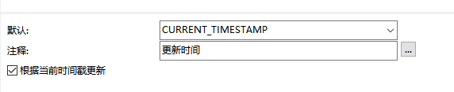

# 1 MySQL

## 1 联表

[一张图看懂 SQL 的各种 join 用法](https://www.javazhiyin.com/32279.html)

- 内连接 INNER JOIN、JOIN
- 外连接 Left JOIN、Right JOIN
- 全连接 FULL JOIN
- 交叉连接 N*N CROSS JOIN
- 联合查询 UNION、UNION ALL


## 2 join on和where区别

1、 on条件是在**生成临时表时**使用的条件，它不管on中的条件是否为真，都会返回左边表中的记录。

2、where条件是在临时表生成好后，再对临时表进行过滤的条件。这时已经没有left join的含义（必须返回左边表的记录）了，条件不为真的就全部过滤掉。


Nested-Loop 

Block Nested-Loop

join的本质是嵌套循环，因此建议是小表join大表，因为如果有索引的话，小表查询速度更快，循环次数更少。

joins_buffer

```mysql
-- 默认262144 256k
show variables like '%join_buffer%';
```


## 3 性能优化

[Mysql性能优化实践](https://www.javazhiyin.com/30033.html)


## 4 死锁

MySQL 行级锁、间隙锁gapLock 解决：用主键id删除


[Innodb_pool_size](https://www.cnblogs.com/wanbin/p/9530833.html)

覆盖索引， select 字段 不走filesort


## 5 打印死锁日志


MySQL

```
show engine innodb status
```


Java

```
// catch异常
catch (org.springframework.dao.DeadlockLoserDataAccessException e) {
    // 日志获取 见下方Dao
    
    // 日志打印
    log.error("死锁：type:{},name:{},status:{}", map.get("Type"), map.get("Name"),map.get("Status").split("LATEST DETECTED DEADLOCK")[1].split("FILE I/O")[0]);
}

Dao
@Select("show engine innodb status")
Map<String,String> getCurrentDeadLockLog();
```


## 6 存储过程插入数据过慢

```
set sync_bin=0;set innodb_flush_log_at_trx_commit=0
select GLOBAL STATUS like 'innodb_page_size'
```


## 7 MySQL悲观锁

for update


## 6、left函数 


## 7、\G

表示将查询结果进行按列打印，可以使每个字段打印到单独的行。即**将查到的结构旋转90度变成纵向；**


### 8、SHOW PROFILES;

```MYSQL
set profiling =1 ;

show profiles;

show status like 'Handler_read%'
```


查询的生命周期


设计，一个表最好有创建人、创建时间，更新时间，更新人，便于业务追踪

