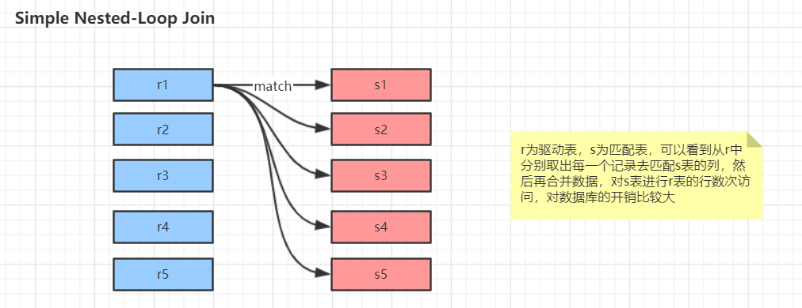
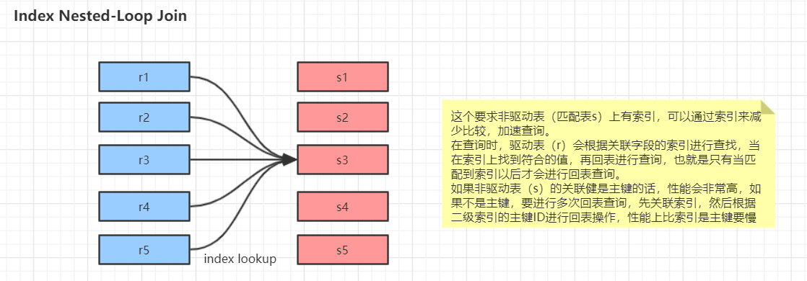
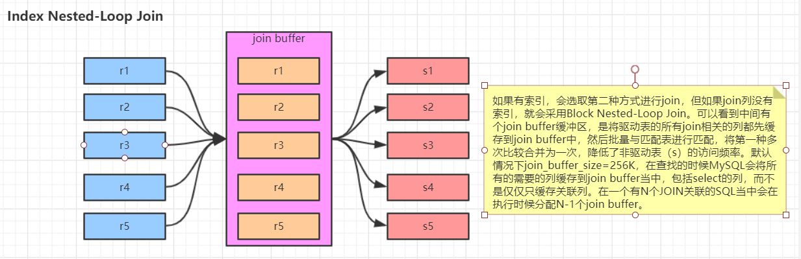

# MySQL

在这里列出MySQL中的基本知识，对于索引和事务是比较重要的内容，因此会单独一章说明。

一些内容来源：https://github.com/bjmashibing/InternetArchitect


## MySQL知识


### MySQL执行SQL过程

对于一条数据执行，并不是一个简单过程。了解执行SQL的生命周期，便于我们分析是哪一个过程导致了慢执行。

生命周期：

连接器 ——> 解析器  ——> 优化器  ——> 执行器

1. 在解析一个查询语句之前，如果查询缓存是打开的，那么MySQL会优先检查这个查询是否命中查询缓存中的数据，如果查询恰好命中了查询缓存，那么会在返回结果之前会检查用户权限，如果权限没有问题，那么MySQL会跳过所有的阶段，就直接从缓存中拿到结果并返回给客户端
2. MySQL通过关键字将SQL语句进行解析，并生成一颗解析树，MySQL解析器将使用MySQL语法规则验证和解析查询，例如验证使用使用了错误的关键字或者顺序是否正确等等，预处理器会进一步检查解析树是否合法，例如表名和列名是否存在，是否有歧义，还会验证权限等等


### 性能监控

当我们分析执行SQL时，有时想知道执行过程所花费的时间，cpu，io等，便可以用下面的命令。


#### show profiles;

```mysql
-- 开启profiling
mysql> set profiling=1;

-- 执行query
mysql> select * from T1;
mysql> select * from T2;

-- 展示最近的一次执行所花费的时间，status表示的不同的阶段
mysql> show profile;
+---------------+----------+
| Status        | Duration |
+---------------+----------+
| starting      | 0.000137 |
| freeing items | 4.7E-5   |
| cleaning up   | 2.4E-5   |
+---------------+----------+
3 rows in set


-- 当然也可以用以下命令查看从开启profiling所统计数据
mysql> show profiles;
+----------+------------+---------------------------------------+
| Query_ID | Duration   | Query                                 |
+----------+------------+---------------------------------------+
|        1 |   0.034193 | select * from iconsignment limit 10   |
|        2 | 0.00046575 | select * from iconsignment limit 10\G |
|        3 |   0.000418 | select * from iconsignment limit 10   |
|        4 |   0.000208 | \G

-- 也可以通过Query_ID指定要查询哪一次的
mysql> show profile for query 2

-- 还可以指定获取更多的属性属性
mysql> show profile cpu for query 2;
-- all表示查看所有的属性
mysql> show profile all for query 2;

```

注：使用performance schema来更加容易的监控mysql，详细见[performance schema详解.md](


#### show PROCESSLIST

使用show processlist查看连接的线程个数，来观察是否有大量线程处于不正常的状态或者其他不正常的特征

performance schema详解.md)


#### show status like 'Handler_read%'

 查看服务器状态

- Handler_read_first：读取索引第一个条目的次数（说明进行了全表扫描）

- **Handler_read_key：通过index获取数据的次数**（较高，说明使用索引情况较多）
- Handler_read_last：读取索引最后一个条目的次数

- Handler_read_next：通过索引读取下一条数据的次数

- Handler_read_prev：通过索引读取上一条数据的次数（一般是使用了order by）

- Handler_read_rnd：从固定位置读取数据的次数 （很多时候表现为没有使用索引或者文件排序）

- Handler_read_rnd_next：从数据节点读取下一条数据的次数（常说明你的表索引不正确或写入的查询没有利用索引）


#### show status like 'last_query_cost'

当我们执行查询的时候，MySQL会自动生成一个执行计划。查看执行的成本，数值越大说明花费越大

```mysql
show status like 'last_query_cost';
```


### 数据类型知识

#### BLOB 和 TEXT 

MySQL 把每个 BLOB 和 TEXT 值当作一个独立的对象处理。两者都是为了存储很大数据而设计的字符串类型，

- BLOB：采用二进制存储
- TEXT ：采用**字符方式**存储


#### datetime和timestamp

- datetime：**占用8个字节，与时区无关**，可保存到毫米
- timestamp：**占用4个字节，与时区有关**，精确到秒，采用整型存储。保存时间范围：1970-01-01到**2038-01-19**


#### int(11) 和varchar(255)

- int(11)，长度 无意义
- varchar(255)，长度 表现最大限制


## JOIN联表

join的本质是嵌套循环，因此建议是**小表join大表**，因为如果有索引的话，小表查询速度更快，循环次数更少。

当表A和表B使用列C关联的时候，如果优化器的关联顺序是B、A，那么就不需要再B表的对应列上建上索引，**没有用到的索引只会带来额外的负担**，一般情况下来说**，只需要在关联顺序中的第二个表的相应列上创建索引**

官方文档：https://dev.mysql.com/doc/refman/8.0/en/nested-loop-joins.html


### Simple Nested-Loop Join

驱动表和匹配表无索引情况




### Index Nested-Loop Join

驱动表和匹配表有索引情况




### Block Nested-Loop Join

将**驱动表放到join buffer中**，然后匹配表就能**一次**与join buffer中的数据进行对比。

> 举例来说：
>
> 外层循环的结果集是100行
>
> 1. 使用NLJ 算法需要扫描内部表100次。
> 2. 如果使用BNL算法，先把对Outer Loop表(外部表)每次读取的10行记录放到join buffer，然后在InnerLoop表(内部表)中**直接匹配这10行数据**，**内存循环就可以一次与这10行进行比较**, 这样只需要比较10次，对内部表的扫描减少了9/10。所以BNL算法就能够显著减少内层循环表扫描的次数。


1. Join Buffer会缓存**所有参与查询的列**而不是只有Join的列
2. 可以通过调整join_buffer_size缓存大小，默认262144，即：256k
3. join_buffer_size的最大值在MySQL 5.1.22版本前是4G-1，而之后的版本才能在64位操作系统下申请大于4G的Join Buffer空间
4. 使用Block Nested-Loop Join算法需要开启优化器管理配置的optimizer_switch的设置block_nested_loop为on，默认为开启




### Nested-Loop 与Block Nested-Loop

文章：[Using join buffer (Block Nested Loop)](https://www.cnblogs.com/wqbin/p/12127711.html)

- Nested Loop Join(NLJ)算法
- Block Nested-Loop Join(BNL)算法，与NLJ区别在于多了join_buffer


### join_buffer

```mysql
-- 默认262144 256k
show variables like '%join_buffer%';
-- join_buffer_size
```


### optimizer_switch

**优化器管理配置**，block_nested_loop=on为开启

```mysql
show variables like '%optimizer_switch%';

-- value 
-- block_nested_loop=on
index_merge=on,index_merge_union=on,index_merge_sort_union=on,index_merge_intersection=on,engine_condition_pushdown=on,index_condition_pushdown=on,mrr=on,mrr_cost_based=on,block_nested_loop=on,batched_key_access=off,materialization=on,semijoin=on,loosescan=on,firstmatch=on,duplicateweedout=on,subquery_materialization_cost_based=on,use_index_extensions=on,condition_fanout_filter=on,derived_merge=on
```


### 一张图看懂 SQL 的各种 join 用法

文章：[一张图看懂 SQL 的各种 join 用法](https://www.javazhiyin.com/32279.html)

- 内连接 INNER JOIN、JOIN
- 外连接 Left JOIN、Right JOIN
- 全连接 FULL JOIN
- 交叉连接 N*N CROSS JOIN
- 联合查询 UNION、UNION ALL


###  left join on和where区别

1.  on条件是在**生成临时表时**使用的条件，它不管on中的条件是否为真，都会返回左边表中的记录。
2. where条件是在临时表生成好后，再对临时表进行过滤的条件。这时已经没有left join的含义（必须返回左边表的记录）了，条件不为真的就全部过滤掉。


## 分区

https://dev.mysql.com/doc/refman/8.0/en/partitioning-types.html


### 分区表的底层原理

分区表由多个相关的底层表实现，**这个底层表也是由句柄对象(inode)标识，我们可以直接访问各个分区。**存储引擎管理分区的各个底层表和管理普通表一样（所有的底层表都必须使用相同的存储引擎），分区表的索引知识在各个底层表上各自加上一个完全相同的索引。从存储引擎的角度来看，底层表和普通表没有任何不同，存储引擎也无须知道这是一个普通表还是一个分区表的一部分。


### 应用场景

- 表非常大以至于无法全部都放在内存中，或者只在表的**最后部分有热点数据，其他均是历史数据**
- 分区表的数据可以分布在不同的物理设备上，从而高效地利用多个硬件设备
- 可以使用分区表来避免某些特殊的瓶颈（innodb的单个索引的互斥访问、ext3文件系统的inode锁竞争）
- 可以备份和恢复独立的分区


### 分区限制

- 一个表最多只能有1024个分区，在5.7版本的时候可以支持8196个分区
- 如果分区字段中有主键或者唯一索引的列，那么**分区表无法使用外键约束**都必须包含进来
- 分区表无法使用外键约束


### 分区类型

- HASH 分区
- KEY 分区
- LINEAR KEY 线性Key分区
- LINEAR HASH 线性Hash分区
- RANGE 范围分区
- LIST 列表分区
- COLUMNS 列分区
-  Subpartitioning 子分区


#### HASH 分区、LINEAR HASH 线性Hash分区

基于用户定义的表达式的返回值来进行选择的分区，该表达式使用将要插入到表中的这些行的列值进行计算。这个函数可以包含myql中有效的、产生非负整数值的任何表达式

```mysql
CREATE TABLE employees (
    id INT NOT NULL,
    fname VARCHAR(30),
    lname VARCHAR(30),
    hired DATE NOT NULL DEFAULT '1970-01-01',
    separated DATE NOT NULL DEFAULT '9999-12-31',
    job_code INT,
    store_id INT
)
PARTITION BY HASH(store_id)
PARTITIONS 4;
```


#### KEY 分区、LINEAR KEY 

https://dev.mysql.com/doc/refman/8.0/en/partitioning-key.html

类似于hash分区，区别在于key分区只支持一列或多列，且mysql服务器提供其自身的哈希函数，必须有一列或多列包含整数值

KEY分区

```mysql
CREATE TABLE tm1 (
    s1 CHAR(32) PRIMARY KEY
)
PARTITION BY KEY(s1)
PARTITIONS 10;
```

LINEAR KEY：线性Key分区

```mysql
CREATE TABLE tk (
    col1 INT NOT NULL,
    col2 CHAR(5),
    col3 DATE
)
PARTITION BY LINEAR KEY (col1)
PARTITIONS 3;
```


#### RANGE 范围分区

根据列值在给定范围内将行分配给分区

```mysql
CREATE TABLE employees (
    id INT NOT NULL,
    fname VARCHAR(30),
    lname VARCHAR(30),
    hired DATE NOT NULL DEFAULT '1970-01-01',
    separated DATE NOT NULL DEFAULT '9999-12-31',
    job_code INT NOT NULL,
    store_id INT NOT NULL
)
PARTITION BY RANGE (store_id) (
    PARTITION p0 VALUES LESS THAN (6),
    PARTITION p1 VALUES LESS THAN (11),
    PARTITION p2 VALUES LESS THAN (16),
    PARTITION p3 VALUES LESS THAN MAXVALUE
);
```


#### LIST 列表分区

类似于按range分区，区别在于list分区是基于**列值匹配**一个离散值集合中的某个值来进行选择

```mysql
CREATE TABLE employees (
    id INT NOT NULL,
    fname VARCHAR(30),
    lname VARCHAR(30),
    hired DATE NOT NULL DEFAULT '1970-01-01',
    separated DATE NOT NULL DEFAULT '9999-12-31',
    job_code INT,
    store_id INT
)
PARTITION BY LIST(store_id) (
    PARTITION pNorth VALUES IN (3,5,6,9,17),
    PARTITION pEast VALUES IN (1,2,10,11,19,20),
    PARTITION pWest VALUES IN (4,12,13,14,18),
    PARTITION pCentral VALUES IN (7,8,15,16)
);
```


#### COLUMNS 列分区

https://dev.mysql.com/doc/refman/8.0/en/partitioning-columns.html

mysql从5.5开始支持column分区，可以认为是range和list的升级版，在5.5之后，可以使用column分区替代range和list，但是column分区只接受普通列不接受表达式

```mysql
-- LIST COLUMNS partitioning
CREATE TABLE customers_1 (
    first_name VARCHAR(25),
    last_name VARCHAR(25),
    street_1 VARCHAR(30),
    street_2 VARCHAR(30),
    city VARCHAR(15),
    renewal DATE
)
PARTITION BY LIST COLUMNS(city) (
    PARTITION pRegion_1 VALUES IN('Oskarshamn', 'Högsby', 'Mönsterås'),
    PARTITION pRegion_2 VALUES IN('Vimmerby', 'Hultsfred', 'Västervik'),
    PARTITION pRegion_3 VALUES IN('Nässjö', 'Eksjö', 'Vetlanda'),
    PARTITION pRegion_4 VALUES IN('Uppvidinge', 'Alvesta', 'Växjo')
);


--  RANGE COLUMNS partitioning
mysql> CREATE TABLE rcx (
    ->     a INT,
    ->     b INT,
    ->     c CHAR(3),
    ->     d INT
    -> )
    -> PARTITION BY RANGE COLUMNS(a,d,c) (
    ->     PARTITION p0 VALUES LESS THAN (5,10,'ggg'),
    ->     PARTITION p1 VALUES LESS THAN (10,20,'mmm'),
    ->     PARTITION p2 VALUES LESS THAN (15,30,'sss'),
    ->     PARTITION p3 VALUES LESS THAN (MAXVALUE,MAXVALUE,MAXVALUE)
    -> );
Query OK, 0 rows affected (0.15 sec)
```


####  Subpartitioning 子分区

分区里面再包含分区

```mysql
CREATE TABLE ts (id INT, purchased DATE)
    PARTITION BY RANGE( YEAR(purchased) )
    SUBPARTITION BY HASH( TO_DAYS(purchased) ) (
        PARTITION p0 VALUES LESS THAN (1990) (
            SUBPARTITION s0,
            SUBPARTITION s1
        ),
        PARTITION p1 VALUES LESS THAN (2000) (
            SUBPARTITION s2,
            SUBPARTITION s3
        ),
        PARTITION p2 VALUES LESS THAN MAXVALUE (
            SUBPARTITION s4,
            SUBPARTITION s5
        )
    );
```


### 分区表的时候需要注意的问题

- null值会使分区过滤无效
- 分区列和索引列不匹配，会导致查询无法进行分区过滤
- 选择分区的成本可能很高
- 打开并锁住所有底层表的成本可能很高
- 维护分区的成本可能很高


## 服务器参数设置

### general

datadir=/var/lib/mysql

数据文件存放的目录


socket=/var/lib/mysql/mysql.sock

mysql.socket表示server和client在同一台服务器，并且使用localhost进行连接，就会使用socket进行连接


pid_file=/var/lib/mysql/mysql.pid
存储mysql的pid


port=3306
mysql服务的端口号


default_storage_engine=InnoDB
mysql存储引擎


skip-grant-tables

当忘记mysql的用户名密码的时候，可以在mysql配置文件中配置该参数，跳过权限表验证，不需要密码即可登录mysql


### character

character_set_client
客户端数据的字符集


character_set_connection
mysql处理客户端发来的信息时，会把这些数据转换成连接的字符集格式


character_set_results
mysql发送给客户端的结果集所用的字符集


character_set_database
数据库默认的字符集
		


character_set_server

mysql server的默认字符集


### connection

max_connections
mysql的最大连接数，**如果数据库的并发连接请求比较大，应该调高该值**


max_user_connections

限制每个用户的连接个数
		

back_log
mysql能够暂存的连接数量，当mysql的线程在一个很短时间内得到非常多的连接请求时，就会起作用，如果mysql的连接数量达到max_connections时，**新的请求会被存储在堆栈中，以等待某一个连接释放资源，如果等待连接的数量超过back_log,则不再接受连接资源**


wait_timeout
mysql在关闭一个非交互的连接之前需要等待的时长


interactive_timeout
关闭一个交互连接之前需要等待的秒数


### log

log_error
指定错误日志文件名称，用于记录当mysqld启动和停止时，以及服务器在运行中发生任何严重错误时的相关信息

log_bin
**指定二进制日志文件名称，用于记录对数据造成更改的所有查询语句**


binlog_do_db
指定将更新记录到二进制日志的数据库，其他所有没有显式指定的数据库更新将忽略，不记录在日志中
		


binlog_ignore_db
指定不将更新记录到二进制日志的数据库


sync_binlog
**指定多少次写日志后同步磁盘**


general_log
是否开启查询日志记录


general_log_file
指定查询日志文件名，用于记录所有的查询语句


slow_query_log
是否开启慢查询日志记录


slow_query_log_file
指定慢查询日志文件名称，用于记录耗时比较长的查询语句


long_query_time
设置慢查询的时间，超过这个时间的查询语句才会记录日志
		

log_slow_admin_statements
是否将管理语句写入慢查询日志
	


### cache

#### key_buffer_size

索引缓存区的大小（只对myisam表起作用）


#### query cache

query_cache_size
查询缓存的大小，未来版本被删除


- show status like '%Qcache%';查看缓存的相关属性

- Qcache_free_blocks：缓存中相邻内存块的个数，如果值比较大，那么查询缓存中碎片比较多

- Qcache_free_memory：查询缓存中剩余的内存大小

- Qcache_hits：表示有多少此命中缓存

- Qcache_inserts：表示多少次未命中而插入

- Qcache_lowmen_prunes：多少条query因为内存不足而被移除cache

- Qcache_queries_in_cache：当前cache中缓存的query数量

- Qcache_total_blocks：当前cache中block的数量

  

query_cache_limit
超出此大小的查询将不被缓存


query_cache_min_res_unit
缓存块最小大小


query_cache_type
缓存类型，决定缓存什么样的查询

- 0表示禁用

- 1表示将缓存所有结果，除非sql语句中使用sql_no_cache禁用查询缓存

- 2表示只缓存select语句中通过sql_cache指定需要缓存的查询

  

#### sort_buffer_size

每个需要排序的线程分派该大小的缓冲区


#### max_allowed_packet=32M

限制server接受的数据包大小
		

#### join_buffer_size=2M

表示关联缓存的大小
		

#### thread_cache_size

- Threads_cached：代表当前此时此刻线程缓存中有多少空闲线程
- Threads_connected：代表当前已建立连接的数量
- Threads_created：代表最近一次服务启动，已创建现成的数量，如果该值比较大，那么服务器会一直再创建线程
- Threads_running：代表当前激活的线程数


### INNODB

innodb_buffer_pool_size=
该参数指定大小的内存来缓冲数据和索引，最大可以设置为物理内存的80%。[Innodb_pool_size](https://www.cnblogs.com/wanbin/p/9530833.html)


innodb_flush_log_at_trx_commit
主要控制innodb将log buffer中的数据写入日志文件并flush磁盘的时间点，值分别为**0，1，2**


innodb_thread_concurrency
设置innodb线程的并发数，默认为0表示不受限制，**如果要设置建议跟服务器的cpu核心数一致或者是cpu核心数的两倍**


innodb_log_buffer_size
此参数确定日志文件所用的内存大小，以M为单位


innodb_log_file_size
此参数确定数据日志文件的大小，以M为单位


innodb_log_files_in_group
以循环方式将日志文件写到多个文件中


read_buffer_size
mysql读入缓冲区大小，对表进行顺序扫描的请求将分配到一个读入缓冲区


read_rnd_buffer_size
mysql随机读的缓冲区大小


innodb_file_per_table
此参数确定为每张表分配一个新的文件


## 存储过程插入数据过慢

```mysql
set sync_bin=0;set innodb_flush_log_at_trx_commit=0
select GLOBAL STATUS like 'innodb_page_size'
```


