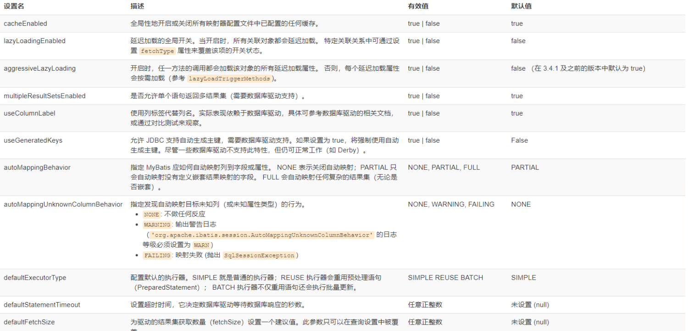
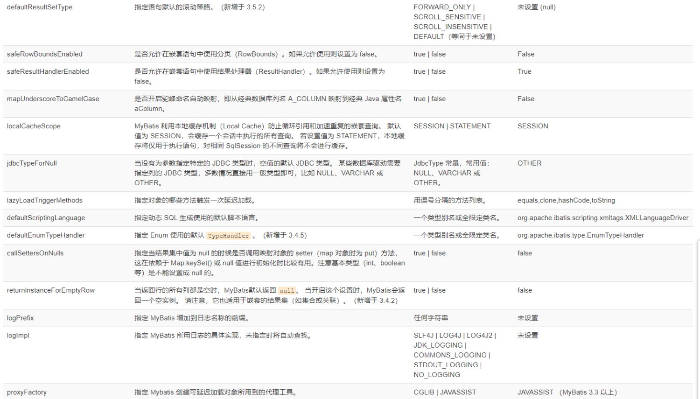
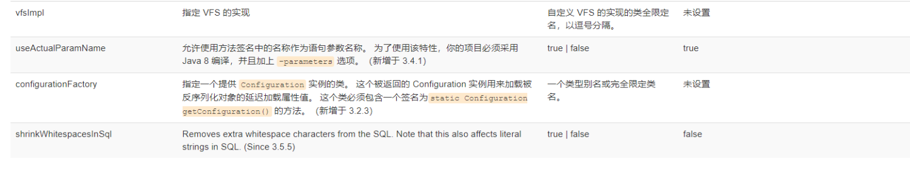
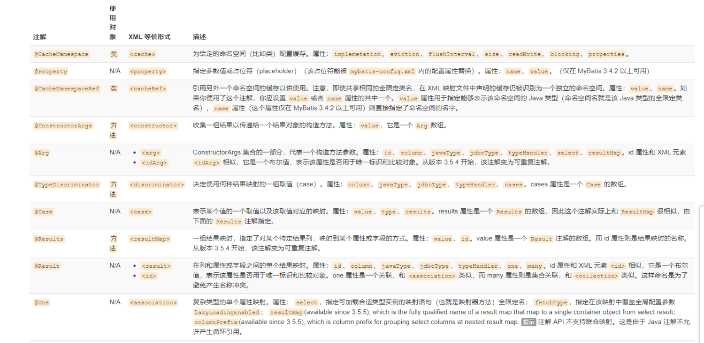
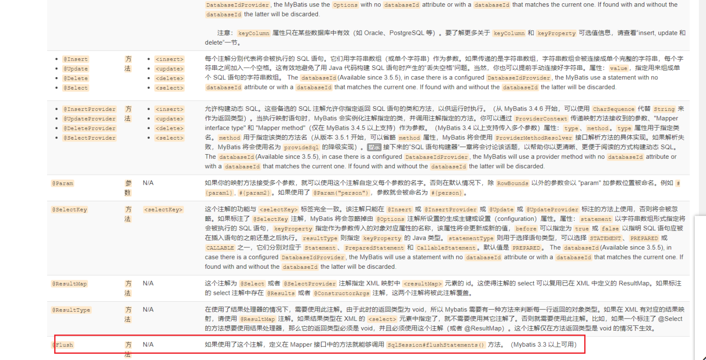
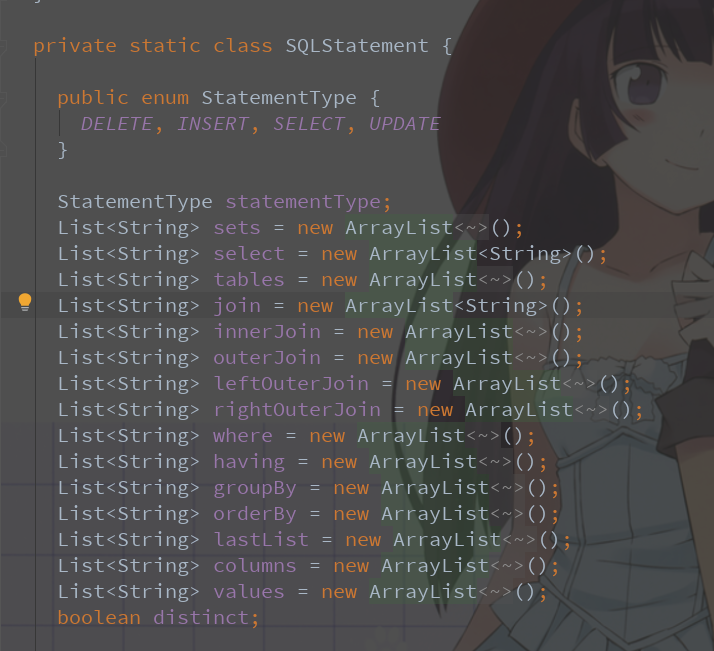

# 1 Mybatis学习

# Mybatis

在这里，是阅读Mybatis官方文档的总结，选择文档中的一些重点记录在这里，这并不是Mybatis的入门教程，因此需要你对Mybatis有一定的了解。如果想学习Mybatis的架构，可以阅读右边的Mybatis源码学习。

## 配置

MyBatis 的配置文件包含了会深深影响 MyBatis 行为的设置和属性信息。 配置文档的顶层结构如下：

- configuration（配置）

- - [properties（属性）](https://mybatis.org/mybatis-3/zh/configuration.html#properties)
  - [settings（设置）](https://mybatis.org/mybatis-3/zh/configuration.html#settings)
  - [typeAliases（类型别名）](https://mybatis.org/mybatis-3/zh/configuration.html#typeAliases)
  - [typeHandlers（类型处理器）](https://mybatis.org/mybatis-3/zh/configuration.html#typeHandlers)
  - [objectFactory（对象工厂）](https://mybatis.org/mybatis-3/zh/configuration.html#objectFactory)
  - [plugins（插件）](https://mybatis.org/mybatis-3/zh/configuration.html#plugins)
  - [environments（环境配置）](https://mybatis.org/mybatis-3/zh/configuration.html#environments)

- - - environment（环境变量）

- - - - transactionManager（事务管理器）
      - dataSource（数据源）

- - [databaseIdProvider（数据库厂商标识）](https://mybatis.org/mybatis-3/zh/configuration.html#databaseIdProvider)
  - [mappers（映射器）](https://mybatis.org/mybatis-3/zh/configuration.html#mappers)


### 作用域和生命周期  

理解我们之前讨论过的不同作用域和生命周期类别是至关重要的，因为错误的使用会导致非常严重的并发问题。

**提示** **对象生命周期和依赖注入框架**

依赖注入框架可以创建线程安全的、基于事务的 SqlSession 和映射器，并将它们直接注入到你的 bean 中，因此可以直接忽略它们的生命周期。 如果对如何通过依赖注入框架使用 MyBatis 感兴趣，可以研究一下 MyBatis-Spring 或 MyBatis-Guice 两个子项目。

#### SqlSessionFactoryBuilder

这个类可以被实例化、使用和丢弃，一旦创建了 SqlSessionFactory，就不再需要它了。 因此 SqlSessionFactoryBuilder 实例的最佳作用域是方法作用域（也就是局部方法变量）。 你可以重用 SqlSessionFactoryBuilder 来创建多个 SqlSessionFactory 实例，但最好还是不要一直保留着它，以保证所有的 XML 解析资源可以被释放给更重要的事情。

#### SqlSessionFactory

SqlSessionFactory 一旦被创建就应该在应用的运行期间一直存在，没有任何理由丢弃它或重新创建另一个实例。 使用 SqlSessionFactory 的最佳实践是在应用运行期间不要重复创建多次，多次重建 SqlSessionFactory 被视为一种代码“坏习惯”。因此 SqlSessionFactory 的最佳作用域是应用作用域。 有很多方法可以做到，最简单的就是使用单例模式或者静态单例模式。

#### SqlSession

每个线程都应该有它自己的 SqlSession 实例。SqlSession 的实例不是线程安全的，因此是不能被共享的，所以它的最佳的作用域是请求或方法作用域。 绝对不能将 SqlSession 实例的引用放在一个类的静态域，甚至一个类的实例变量也不行。 也绝不能将 SqlSession 实例的引用放在任何类型的托管作用域中，比如 Servlet 框架中的 HttpSession。 如果你现在正在使用一种 Web 框架，考虑将 SqlSession 放在一个和 HTTP 请求相似的作用域中。 换句话说，每次收到 HTTP 请求，就可以打开一个 SqlSession，返回一个响应后，就关闭它。 这个关闭操作很重要，为了确保每次都能执行关闭操作，你应该把这个关闭操作放到 finally 块中。 下面的示例就是一个确保 SqlSession 关闭的标准模式：

try (SqlSession session = sqlSessionFactory.openSession()) {

 // 你的应用逻辑代码

}

在所有代码中都遵循这种使用模式，可以保证所有数据库资源都能被正确地关闭。

### 属性（properties）

```
<!-- 导入Properties -->
<properties resource="jdbc.properties"></properties>
```


### 设置（settings）

这是 MyBatis 中极为重要的调整设置，它们会改变 MyBatis 的运行时行为。 下表描述了设置中各项设置的含义、默认值等。








### 类型处理器（typeHandlers）

```
/**
 * 自定义类型处理器
 */
public class ExampleTypeHandler extends BaseTypeHandler<String> {

    @Override
    public void setNonNullParameter(PreparedStatement ps, int i, String parameter, JdbcType jdbcType) throws SQLException {
        ps.setString(i, parameter);
    }

    @Override
    public String getNullableResult(ResultSet rs, String columnName) throws SQLException {
        return rs.getString(columnName);
    }

    @Override
    public String getNullableResult(ResultSet rs, int columnIndex) throws SQLException {
        return rs.getString(columnIndex);
    }

    @Override
    public String getNullableResult(CallableStatement cs, int columnIndex) throws SQLException {
        return cs.getString(columnIndex);
    }
}
```


### 对象工厂（objectFactory）

```
/**
 * 覆盖对象工厂的默认行为
 */
public class ExampleObjectFactory extends DefaultObjectFactory {

    public Object create(Class type) {
        return super.create(type);
    }

    public void setProperties(Properties properties) {
        super.setProperties(properties);
    }
    public <T> boolean isCollection(Class<T> type) {
        return Collection.class.isAssignableFrom(type);
    }
}
```


### 插件（plugins）

MyBatis 允许你在映射语句执行过程中的某一点进行拦截调用。默认情况下，MyBatis 允许使用插件来拦截的方法调用包括：

- Executor (update, query, flushStatements, commit, rollback, getTransaction, close, isClosed)
- ParameterHandler (getParameterObject, setParameters)
- ResultSetHandler (handleResultSets, handleOutputParameters)
- StatementHandler (prepare, parameterize, batch, update, query)

这些类中方法的细节可以通过查看每个方法的签名来发现，或者直接查看 MyBatis 发行包中的源代码。 如果你想做的不仅仅是监控方法的调用，那么你最好相当了解要重写的方法的行为。 因为在试图修改或重写已有方法的行为时，很可能会破坏 MyBatis 的核心模块。 这些都是更底层的类和方法，所以使用插件的时候要特别当心。

通过 MyBatis 提供的强大机制，使用插件是非常简单的，只需实现 Interceptor 接口，并指定想要拦截的方法签名即可。


### 环境配置（environments）


### 映射器（mappers）


### 我们可以扩展的东西

typeHandlers、objectFactory、Interceptor


## XML 映射器


## 动态 SQL

if、choose、when、otherwise、trim、where、set、foreach、script、bind

```
<select id="findActiveBlogLike"
     resultType="Blog">
  SELECT * FROM BLOG
  <where>
    <if test="state != null">
         state = #{state}
    </if>
    <if test="title != null">
        AND title like #{title}
    </if>
    <if test="author != null and author.name != null">
        AND author_name like #{author.name}
    </if>
  </where>
</select>

<update id="updateAuthorIfNecessary">
  update Author
    <set>
      <if test="username != null">username=#{username},</if>
      <if test="password != null">password=#{password},</if>
      <if test="email != null">email=#{email},</if>
      <if test="bio != null">bio=#{bio}</if>
    </set>
  where id=#{id}
</update>
```


## script

要在带注解的映射器接口类中使用动态 SQL，可以使用 *script* 元素。比如:

```
 @Update({"<script>",
      "update Author",
      "  <set>",
      "    <if test='username != null'>username=#{username},</if>",
      "    <if test='password != null'>password=#{password},</if>",
      "    <if test='email != null'>email=#{email},</if>",
      "    <if test='bio != null'>bio=#{bio}</if>",
      "  </set>",
      "where id=#{id}",
      "</script>"})
    void updateAuthorValues(Author author);
```


## Java API

https://mybatis.org/mybatis-3/zh/java-api.html


## SqlSessionFactory


## Executor

- ExecutorType.SIMPLE：该类型的执行器没有特别的行为。它为每个语句的执行创建一个新的预处理语句。
- ExecutorType.REUSE：该类型的执行器会复用预处理语句。
- ExecutorType.BATCH：该类型的执行器会批量执行所有更新语句，如果 SELECT 在多个更新中间执行，将在必要时将多条更新语句分隔开来，以方便理解。


当你将 ExecutorType 设置为 ExecutorType.BATCH 时，可以使用这个方法清除（执行）缓存在 JDBC 驱动类中的批量更新语句。


## 本地缓存

Mybatis 使用到了两种缓存：本地缓存（local cache）和二级缓存（second level cache）。

每当一个新 session 被创建，MyBatis 就会创建一个与之相关联的本地缓存(Session级别)。任何在 session 执行过的查询结果都会被保存在本地缓存中，所以，当再次执行参数相同的相同查询时，就不需要实际查询数据库了。本地缓存将会在做出修改、事务提交或回滚，以及关闭 session 时清空。


默认情况下，本地缓存数据的生命周期等同于整个 session 的周期。由于缓存会被用来解决循环引用问题和加快重复嵌套查询的速度，所以无法将其完全禁用。但是你可以通过设置 localCacheScope=STATEMENT 来只在语句执行时使用缓存。


注意，如果 localCacheScope 被设置为 SESSION，对于某个对象，MyBatis 将返回在本地缓存中唯一对象的引用。对返回的对象（例如 list）做出的任何修改将会影响本地缓存的内容，进而将会影响到在本次 session 中从缓存返回的值。因此，不要对 MyBatis 所返回的对象作出更改，以防后患。


## 映射器注解

```
@Insert("insert into table3 (id, name) values(#{nameId}, #{name})")
@SelectKey(statement="call next value for TestSequence", keyProperty="nameId", before=true, resultType=int.class)
int insertTable3(Name name);
```







## SQL 语句构建器

```
private String selectPersonSql() {
  return new SQL() {{
    SELECT("P.ID, P.USERNAME, P.PASSWORD, P.FULL_NAME");
    SELECT("P.LAST_NAME, P.CREATED_ON, P.UPDATED_ON");
    FROM("PERSON P");
    FROM("ACCOUNT A");
    INNER_JOIN("DEPARTMENT D on D.ID = P.DEPARTMENT_ID");
    INNER_JOIN("COMPANY C on D.COMPANY_ID = C.ID");
    WHERE("P.ID = A.ID");
    WHERE("P.FIRST_NAME like ?");
    OR();
    WHERE("P.LAST_NAME like ?");
    GROUP_BY("P.ID");
    HAVING("P.LAST_NAME like ?");
    OR();
    HAVING("P.FIRST_NAME like ?");
    ORDER_BY("P.ID");
    ORDER_BY("P.FULL_NAME");
  }}.toString();
}
```




# Mybatis-Spring

## SqlSessionFactoryBean

在基础的 MyBatis 用法中，是通过 SqlSessionFactoryBuilder 来创建 SqlSessionFactory 的。 而在 MyBatis-Spring 中，则使用 SqlSessionFactoryBean 来创建。


需要注意的是 SqlSessionFactoryBean 实现了 Spring 的 FactoryBean 接口（参见 Spring 官方文档 3.8 节 [通过工厂 bean 自定义实例化逻辑](https://docs.spring.io/spring/docs/current/spring-framework-reference/core.html#beans-factory-extension-factorybean)）。这意味着由 Spring 最终创建的 bean **并不是** SqlSessionFactoryBean 本身，而是工厂类（SqlSessionFactoryBean）的 getObject() 方法的返回结果。这种情况下，Spring 将会在应用启动时为你创建 SqlSessionFactory，并使用 sqlSessionFactory 这个名字存储起来。


## 事务


## SqlSessionDaoSupport

SqlSessionDaoSupport 是一个抽象的支持类，用来为你提供 SqlSession。调用 getSqlSession() 方法你会得到一个 SqlSessionTemplate，之后可以用于执行 SQL 方法，就像下面这样:

```
public class UserDaoImpl extends SqlSessionDaoSupport implements UserDao {
  public User getUser(String userId) {
    return getSqlSession().selectOne("org.mybatis.spring.sample.mapper.UserMapper.getUser", userId);
  }
}
```

## 注入映射器

@MapperScan


# 阅读

- [Mybatis官方中文文档](https://mybatis.org/mybatis-3/zh/index.html)
- [Mybatis-Spring官方中文文档](http://mybatis.org/spring/zh/index.html)