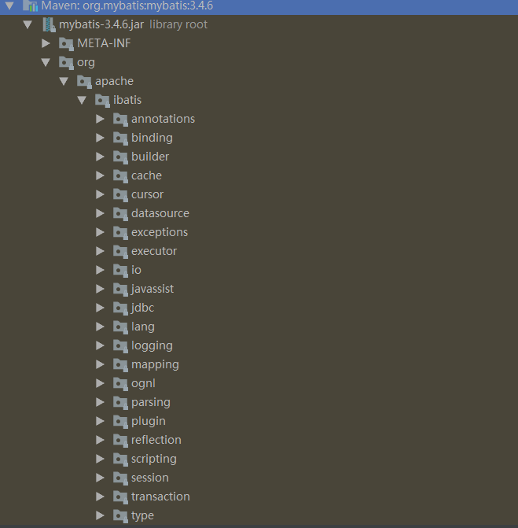
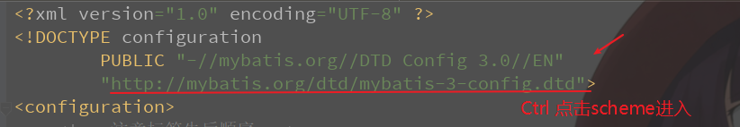
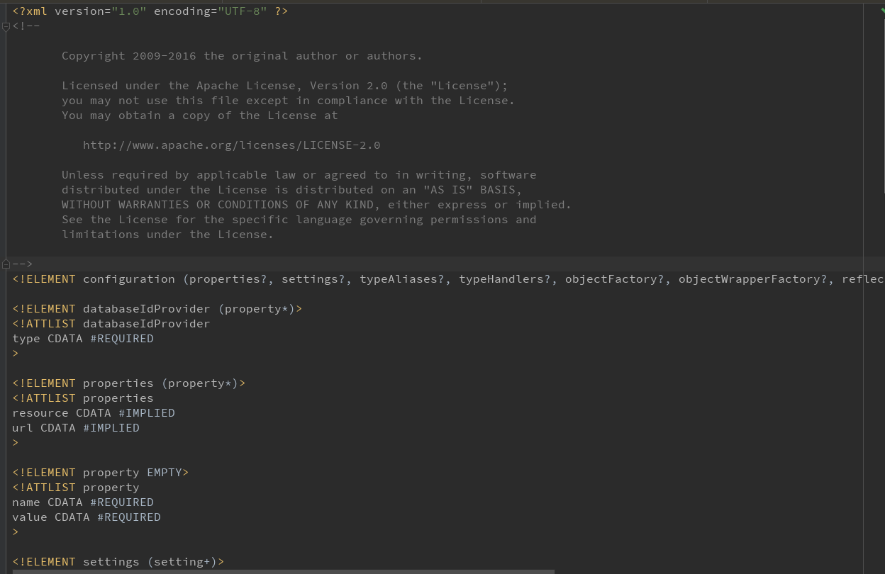
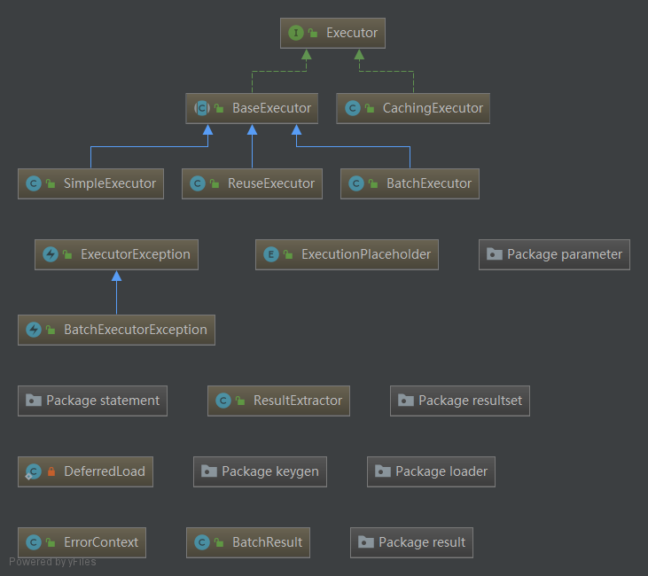
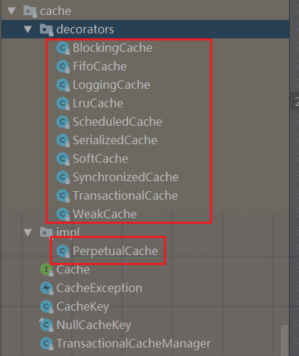

# 2 Mybatis源码分析

阅读源码的意义，学习其实现的架构和思想，其次懂得扩展。

Mybatis中重要的几个地方：一级缓存、二级缓存、自定义插件、系统配置。在这里不深入研究解析XML。


## Mybatis工程结构

首先查看Mybatis的工程结构，大致了解其包的模块分布，总的来看Mybatis的源码算是比较少的了。



##  


## Mybatis中的设计模式

接下来看看Mybatis中用到的设计模式。设计模式其实是一种设计思想，用于增加代码的鲁棒性、可扩展性。在阅读Mybatis源码之前，建议先了解基本的23种设计模式，这样在阅读源码时才能了解作者为何这样写代码。


1. 构建者模式，屏蔽底层。例如：SqlSessionFactoryBuilder
2. 工厂模式，例如：SqlSessionFactory
3. 单例模式，例如：LogFactory
4. 代理模式(JDK动态代理)，例如：MapperProxy
5. 组合模式，例如：SqlNode
6. 模板模式，例如：BaseExecutor
7. 适配器模式，例如Log的Mybatis接口和它对jdbc、log4j等各种日志框架的适配实现；
8. 装饰器模式 or 责任链模式，例如：PerpetualCache、Plugin
9. 门面模式(外观模式)：提供一个统一的门面接口API，使得系统更容易使用。例如：SqlSession


## Mybatis执行流程

SqlSessionFactoryBuilder -> SqlSessionFactory -> parseConfigure -> 动态代理接口(MapperProxy) -> 会话(SqlSession) -> 执行器(BaseExecutor) ->  JDBC(Statement Handler) -> ResultHandler


## 配置文件


小技巧：使用Ctrl  点击scheme可以进入查看详细内容





###  


### 解析XML

解析xml文件，将信息添加到Configuration

```
org.apache.ibatis.session.SqlSessionFactoryBuilder#build
    org.apache.ibatis.builder.xml.XMLConfigBuilder#parse

// 解析Mapper.xml， Configuration配置类
private void parseConfiguration(XNode root) {
    try {
      // 属性的转换
      //issue #117 read properties first
      propertiesElement(root.evalNode("properties"));
      Properties settings = settingsAsProperties(root.evalNode("settings"));
      loadCustomVfs(settings);
      typeAliasesElement(root.evalNode("typeAliases"));
      pluginElement(root.evalNode("plugins"));
      objectFactoryElement(root.evalNode("objectFactory"));
      objectWrapperFactoryElement(root.evalNode("objectWrapperFactory"));
      reflectorFactoryElement(root.evalNode("reflectorFactory"));
      settingsElement(settings);
      // read it after objectFactory and objectWrapperFactory issue #631
      environmentsElement(root.evalNode("environments"));
      // 数据源
      databaseIdProviderElement(root.evalNode("databaseIdProvider"));
      typeHandlerElement(root.evalNode("typeHandlers"));
      // Mapper扫描
      mapperElement(root.evalNode("mappers"));
    } catch (Exception e) {
      throw new BuilderException("Error parsing SQL Mapper Configuration. Cause: " + e, e);
    }
  }
```


### 扫描Mapper

扫描优先级：package > resource > url > class

```
org.apache.ibatis.builder.xml.XMLConfigBuilder#parseConfiguration
    org.apache.ibatis.builder.xml.XMLConfigBuilder#mapperElement

// 扫描Mapper
private void mapperElement(XNode parent) throws Exception {
    if (parent != null) {
      for (XNode child : parent.getChildren()) {
        if ("package".equals(child.getName())) {
          String mapperPackage = child.getStringAttribute("name");
          configuration.addMappers(mapperPackage);
        } else {
          String resource = child.getStringAttribute("resource");
          String url = child.getStringAttribute("url");
          String mapperClass = child.getStringAttribute("class");
          // 扫描优先级：package > resource > url > class
          if (resource != null && url == null && mapperClass == null) {
            ErrorContext.instance().resource(resource);
            InputStream inputStream = Resources.getResourceAsStream(resource);
            XMLMapperBuilder mapperParser = new XMLMapperBuilder(inputStream, configuration, resource, configuration.getSqlFragments());
            mapperParser.parse();
          } else if (resource == null && url != null && mapperClass == null) {
            ErrorContext.instance().resource(url);
            InputStream inputStream = Resources.getUrlAsStream(url);
            XMLMapperBuilder mapperParser = new XMLMapperBuilder(inputStream, configuration, url, configuration.getSqlFragments());
            // Mapper解析
            mapperParser.parse();
          } else if (resource == null && url == null && mapperClass != null) {
            Class<?> mapperInterface = Resources.classForName(mapperClass);
            configuration.addMapper(mapperInterface);
          } else {
            throw new BuilderException("A mapper element may only specify a url, resource or class, but not more than one.");
          }
        }
      }
    }
  }
```

### 解析Mapper

```
org.apache.ibatis.builder.xml.XMLConfigBuilder#mapperElement    
    org.apache.ibatis.builder.xml.XMLMapperBuilder#parse
        org.apache.ibatis.builder.xml.XMLMapperBuilder#configurationElement
        org.apache.ibatis.builder.xml.XMLMapperBuilder#bindMapperForNamespace
        org.apache.ibatis.builder.xml.XMLMapperBuilder#parsePendingResultMaps
        org.apache.ibatis.builder.xml.XMLMapperBuilder#parsePendingCacheRefs
        org.apache.ibatis.builder.xml.XMLMapperBuilder#parsePendingStatements

org.apache.ibatis.builder.xml.XMLMapperBuilder#parse
    // 解析Mapper
    public void parse() {
        if (!this.configuration.isResourceLoaded(this.resource)) {
            this.configurationElement(this.parser.evalNode("/mapper"));
            this.configuration.addLoadedResource(this.resource);
            this.bindMapperForNamespace();
        }

        this.parsePendingResultMaps();
        this.parsePendingCacheRefs();
        this.parsePendingStatements();
    }

org.apache.ibatis.builder.xml.XMLMapperBuilder#configurationElement
    // 配置信息
    private void configurationElement(XNode context) {
        try {
            String namespace = context.getStringAttribute("namespace");
            if (namespace != null && !namespace.equals("")) {
                this.builderAssistant.setCurrentNamespace(namespace);
                this.cacheRefElement(context.evalNode("cache-ref"));
                // 这里就是解析二级缓存的地方了，默认是不开启的，需要配置cache节点
                this.cacheElement(context.evalNode("cache"));
                this.parameterMapElement(context.evalNodes("/mapper/parameterMap"));
                this.resultMapElements(context.evalNodes("/mapper/resultMap"));
                this.sqlElement(context.evalNodes("/mapper/sql"));
                this.buildStatementFromContext(context.evalNodes("select|insert|update|delete"));
            } else {
                throw new BuilderException("Mapper's namespace cannot be empty");
            }
        } catch (Exception var3) {
            throw new BuilderException("Error parsing Mapper XML. The XML location is '" + this.resource + "'. Cause: " + var3, var3);
        }
    }

// 二级缓存
org.apache.ibatis.builder.xml.XMLMapperBuilder#cacheElement
  private void cacheElement(XNode context) throws Exception {
    if (context != null) {
      String type = context.getStringAttribute("type", "PERPETUAL");
      Class<? extends Cache> typeClass = typeAliasRegistry.resolveAlias(type);
      String eviction = context.getStringAttribute("eviction", "LRU");
      Class<? extends Cache> evictionClass = typeAliasRegistry.resolveAlias(eviction);
      Long flushInterval = context.getLongAttribute("flushInterval");
      Integer size = context.getIntAttribute("size");
      boolean readWrite = !context.getBooleanAttribute("readOnly", false);
      boolean blocking = context.getBooleanAttribute("blocking", false);
      Properties props = context.getChildrenAsProperties();
      builderAssistant.useNewCache(typeClass, evictionClass, flushInterval, size, readWrite, blocking, props);
    }
  }
  
org.apache.ibatis.builder.MapperBuilderAssistant#useNewCache
  public Cache useNewCache(Class<? extends Cache> typeClass,
      Class<? extends Cache> evictionClass,
      Long flushInterval,
      Integer size,
      boolean readWrite,
      boolean blocking,
      Properties props) {
    Cache cache = new CacheBuilder(currentNamespace)
        .implementation(valueOrDefault(typeClass, PerpetualCache.class))
        .addDecorator(valueOrDefault(evictionClass, LruCache.class))
        .clearInterval(flushInterval)
        .size(size)
        .readWrite(readWrite)
        .blocking(blocking)
        .properties(props)
        .build();
    configuration.addCache(cache);
    currentCache = cache;
    return cache;
  }

// --------------------------------------------------------------------------------------------
org.apache.ibatis.builder.xml.XMLMapperBuilder#parsePendingStatements
    org.apache.ibatis.builder.xml.XMLStatementBuilder#parseStatementNode
    
    // 解析Statement
    public void parseStatementNode() {
        String id = this.context.getStringAttribute("id");
        String databaseId = this.context.getStringAttribute("databaseId");
        if (this.databaseIdMatchesCurrent(id, databaseId, this.requiredDatabaseId)) {
            Integer fetchSize = this.context.getIntAttribute("fetchSize");
            Integer timeout = this.context.getIntAttribute("timeout");
            String parameterMap = this.context.getStringAttribute("parameterMap");
            String parameterType = this.context.getStringAttribute("parameterType");
            Class<?> parameterTypeClass = this.resolveClass(parameterType);
            String resultMap = this.context.getStringAttribute("resultMap");
            String resultType = this.context.getStringAttribute("resultType");
            String lang = this.context.getStringAttribute("lang");
            LanguageDriver langDriver = this.getLanguageDriver(lang);
            Class<?> resultTypeClass = this.resolveClass(resultType);
            String resultSetType = this.context.getStringAttribute("resultSetType");
            StatementType statementType = StatementType.valueOf(this.context.getStringAttribute("statementType", StatementType.PREPARED.toString()));
            ResultSetType resultSetTypeEnum = this.resolveResultSetType(resultSetType);
            String nodeName = this.context.getNode().getNodeName();
            SqlCommandType sqlCommandType = SqlCommandType.valueOf(nodeName.toUpperCase(Locale.ENGLISH));
            boolean isSelect = sqlCommandType == SqlCommandType.SELECT;
            boolean flushCache = this.context.getBooleanAttribute("flushCache", !isSelect);
            boolean useCache = this.context.getBooleanAttribute("useCache", isSelect);
            boolean resultOrdered = this.context.getBooleanAttribute("resultOrdered", false);
            XMLIncludeTransformer includeParser = new XMLIncludeTransformer(this.configuration, this.builderAssistant);
            includeParser.applyIncludes(this.context.getNode());
            this.processSelectKeyNodes(id, parameterTypeClass, langDriver);
            SqlSource sqlSource = langDriver.createSqlSource(this.configuration, this.context, parameterTypeClass);
            String resultSets = this.context.getStringAttribute("resultSets");
            String keyProperty = this.context.getStringAttribute("keyProperty");
            String keyColumn = this.context.getStringAttribute("keyColumn");
            String keyStatementId = id + "!selectKey";
            keyStatementId = this.builderAssistant.applyCurrentNamespace(keyStatementId, true);
            Object keyGenerator;
            if (this.configuration.hasKeyGenerator(keyStatementId)) {
                keyGenerator = this.configuration.getKeyGenerator(keyStatementId);
            } else {
                keyGenerator = this.context.getBooleanAttribute("useGeneratedKeys", this.configuration.isUseGeneratedKeys() && SqlCommandType.INSERT.equals(sqlCommandType)) ? Jdbc3KeyGenerator.INSTANCE : NoKeyGenerator.INSTANCE;
            }

            this.builderAssistant.addMappedStatement(id, sqlSource, statementType, sqlCommandType, fetchSize, timeout, parameterMap, parameterTypeClass, resultMap, resultTypeClass, resultSetTypeEnum, flushCache, useCache, resultOrdered, (KeyGenerator)keyGenerator, keyProperty, keyColumn, databaseId, langDriver, resultSets);
        }
    
org.apache.ibatis.builder.xml.XMLStatementBuilder#parseStatementNode    
    org.apache.ibatis.builder.MapperBuilderAssistant#addMappedStatement

    // MappedStatement
     public MappedStatement addMappedStatement(
      String id,
      SqlSource sqlSource,
      StatementType statementType,
      SqlCommandType sqlCommandType,
      Integer fetchSize,
      Integer timeout,
      String parameterMap,
      Class<?> parameterType,
      String resultMap,
      Class<?> resultType,
      ResultSetType resultSetType,
      boolean flushCache,
      boolean useCache,
      boolean resultOrdered,
      KeyGenerator keyGenerator,
      String keyProperty,
      String keyColumn,
      String databaseId,
      LanguageDriver lang,
      String resultSets) {

    if (unresolvedCacheRef) {
      throw new IncompleteElementException("Cache-ref not yet resolved");
    }

    id = applyCurrentNamespace(id, false);
    boolean isSelect = sqlCommandType == SqlCommandType.SELECT;

    MappedStatement.Builder statementBuilder = new MappedStatement.Builder(configuration, id, sqlSource, sqlCommandType)
        .resource(resource)
        .fetchSize(fetchSize)
        .timeout(timeout)
        .statementType(statementType)
        .keyGenerator(keyGenerator)
        .keyProperty(keyProperty)
        .keyColumn(keyColumn)
        .databaseId(databaseId)
        .lang(lang)
        .resultOrdered(resultOrdered)
        .resultSets(resultSets)
        .resultMaps(getStatementResultMaps(resultMap, resultType, id))
        .resultSetType(resultSetType)
        .flushCacheRequired(valueOrDefault(flushCache, !isSelect))
        .useCache(valueOrDefault(useCache, isSelect))
        .cache(currentCache); // 添加二级缓存

    ParameterMap statementParameterMap = getStatementParameterMap(parameterMap, parameterType, id);
    if (statementParameterMap != null) {
      statementBuilder.parameterMap(statementParameterMap);
    }

    MappedStatement statement = statementBuilder.build();
    configuration.addMappedStatement(statement);
    return statement;
  }
```


### SqlSesssion

```
SqlSession sqlSession = sqlSessionFactory.openSession();

org.apache.ibatis.session.defaults.DefaultSqlSessionFactory#openSessionFromDataSource

    private SqlSession openSessionFromDataSource(ExecutorType execType, TransactionIsolationLevel level, boolean autoCommit) {
        Transaction tx = null;

        DefaultSqlSession var8;
        try {
            Environment environment = this.configuration.getEnvironment();
            TransactionFactory transactionFactory = this.getTransactionFactoryFromEnvironment(environment);
            tx = transactionFactory.newTransaction(environment.getDataSource(), level, autoCommit);
            Executor executor = this.configuration.newExecutor(tx, execType);
            var8 = new DefaultSqlSession(this.configuration, executor, autoCommit);
        } catch (Exception var12) {
            this.closeTransaction(tx);
            throw ExceptionFactory.wrapException("Error opening session.  Cause: " + var12, var12);
        } finally {
            ErrorContext.instance().reset();
        }

        return var8;
    }
    
// -----------------------------------------------------------------------------------------
public class DefaultSqlSession implements SqlSession {

  private final Configuration configuration;
  private final Executor executor; // 每个SqlSession中都包含一个Executor，交给Executor处理
```

### Executor

```
org.apache.ibatis.session.defaults.DefaultSqlSessionFactory#openSessionFromDataSource    
org.apache.ibatis.session.Configuration#newExecutor
    public Executor newExecutor(Transaction transaction, ExecutorType executorType) {
        // 默认  this.defaultExecutorType = ExecutorType.SIMPLE;
        executorType = executorType == null ? this.defaultExecutorType : executorType;
        executorType = executorType == null ? ExecutorType.SIMPLE : executorType;
        Object executor;
        if (ExecutorType.BATCH == executorType) {
            executor = new BatchExecutor(this, transaction);
        } else if (ExecutorType.REUSE == executorType) {
            executor = new ReuseExecutor(this, transaction);
        } else {
            executor = new SimpleExecutor(this, transaction);
        }
        // 默认是开启一级缓存的 this.cacheEnabled = true;
        if (this.cacheEnabled) {
            executor = new CachingExecutor((Executor)executor);
        }

        Executor executor = (Executor)this.interceptorChain.pluginAll(executor);
        return executor;
    }

org.apache.ibatis.session.ExecutorType   
public enum ExecutorType {
    SIMPLE,
    REUSE,
    BATCH;

    private ExecutorType() {
    }
}
```

## 


## Select

```
org.apache.ibatis.session.defaults.DefaultSqlSession#selectOne
    org.apache.ibatis.session.defaults.DefaultSqlSession#selectList
    
    public <T> T selectOne(String statement, Object parameter) {
        List<T> list = this.selectList(statement, parameter);
        if (list.size() == 1) {
            return list.get(0);
        } else if (list.size() > 1) {
            throw new TooManyResultsException("Expected one result (or null) to be returned by selectOne(), but found: " + list.size());
        } else {
            return null;
        }
    }
    
org.apache.ibatis.session.defaults.DefaultSqlSession#selectList
    org.apache.ibatis.executor.Executor#query
        org.apache.ibatis.executor.BaseExecutor#createCacheKey
        org.apache.ibatis.executor.BaseExecutor#query
        
    public <E> List<E> query(MappedStatement ms, Object parameter, RowBounds rowBounds, ResultHandler resultHandler, CacheKey key, BoundSql boundSql) throws SQLException {
        ErrorContext.instance().resource(ms.getResource()).activity("executing a query").object(ms.getId());
        if (this.closed) {
            throw new ExecutorException("Executor was closed.");
        } else {
            if (this.queryStack == 0 && ms.isFlushCacheRequired()) {
                this.clearLocalCache();
            }

            List list;
            try {
                ++this.queryStack;
                // 一级缓存
                list = resultHandler == null ? (List)this.localCache.getObject(key) : null;
                if (list != null) {
                    // 从缓存中获取
                    this.handleLocallyCachedOutputParameters(ms, key, parameter, boundSql);
                } else {
                    list = this.queryFromDatabase(ms, parameter, rowBounds, resultHandler, key, boundSql);
                }
            } finally {
                --this.queryStack;
            }

            if (this.queryStack == 0) {
                Iterator var8 = this.deferredLoads.iterator();

                while(var8.hasNext()) {
                    BaseExecutor.DeferredLoad deferredLoad = (BaseExecutor.DeferredLoad)var8.next();
                    deferredLoad.load();
                }

                this.deferredLoads.clear();
                if (this.configuration.getLocalCacheScope() == LocalCacheScope.STATEMENT) {
                    this.clearLocalCache();
                }
            }

            return list;
        }
    }

org.apache.ibatis.executor.BaseExecutor#query
    org.apache.ibatis.executor.BaseExecutor#queryFromDatabase
private <E> List<E> queryFromDatabase(MappedStatement ms, Object parameter, RowBounds rowBounds, ResultHandler resultHandler, CacheKey key, BoundSql boundSql) throws SQLException {
        // 放入缓存中
        this.localCache.putObject(key, ExecutionPlaceholder.EXECUTION_PLACEHOLDER);

        List list;
        try {
            list = this.doQuery(ms, parameter, rowBounds, resultHandler, boundSql);
        } finally {
            this.localCache.removeObject(key);
        }

        this.localCache.putObject(key, list);
        if (ms.getStatementType() == StatementType.CALLABLE) {
            this.localOutputParameterCache.putObject(key, parameter);
        }

        return list;
    }
```

##  

## Executor

1. BaseExecutor：执行器基类
2. SimpleExecutor：简单执行器，默认执行器
3. ReuseExecutor：可重用执行器，相同sql的statement 将会被缓存已重复利用
4. BatchExecutor：批处理执行器，基于 JDBC 的 addBatch、executeBatch 功能，并且在当前 sql 和上一条 sql 完全一样的时候，重用 Statement，在调用 doFlushStatements 的时候，将数据刷新到数据库
5. CachingExecutor：缓存执行器，装饰器模式，在开启二级缓存的时候。会在上面三种执行器的外面包上


## 缓存

### 一级缓存(会话级别)

Mybatis的一级缓存比较简单，底层是HashMap。默认是开启一级缓存的，作用域是SqlSession级别。


#### 命中一级缓存

1. 必须是同一会话(SqlSession)
2. statement ID相同
3. RowBounds行范围一样
4. sql语句 参数相同

```
org.apache.ibatis.executor.BaseExecutor#query
try {
      queryStack++;
      // 有缓存取缓存
      list = resultHandler == null ? (List<E>) localCache.getObject(key) : null;
      if (list != null) {
        handleLocallyCachedOutputParameters(ms, key, parameter, boundSql);
      } else {
        // 没有缓存则查询
        list = queryFromDatabase(ms, parameter, rowBounds, resultHandler, key, boundSql);
      }
    } finally {
      queryStack--;
    }


  private <E> List<E> queryFromDatabase(MappedStatement ms, Object parameter, RowBounds rowBounds, ResultHandler resultHandler, CacheKey key, BoundSql boundSql) throws SQLException {
    List<E> list;
    // 设置标志位，防止并发使用当前查询请求时，前一个请求没完成，后一个请求用了未完成请求的一级缓存
    localCache.putObject(key, EXECUTION_PLACEHOLDER);
    try {
      list = doQuery(ms, parameter, rowBounds, resultHandler, boundSql);
    } finally {
      // 清除标志
      localCache.removeObject(key);
    }
    localCache.putObject(key, list);
    if (ms.getStatementType() == StatementType.CALLABLE) {
      localOutputParameterCache.putObject(key, parameter);
    }
    return list;
  }
```


#### 清空缓存

- 手动调用clearCache  (clearLocalCache)
- commit
- rollback
- update (Mybatis中将新增和更新都视为update)
- @Options(flushCache = Options.FlushCachePolicy.TRUE)
- localCacheScope不是STATEMENT作用域

```
org.apache.ibatis.executor.BaseExecutor#clearLocalCache
// 查看调用clearLocalCache()方法的地方

// commit
  public void commit(boolean required) throws SQLException {
    if (closed) {
      throw new ExecutorException("Cannot commit, transaction is already closed");
    }
    // 清除一级缓存
    clearLocalCache();
    flushStatements();
    if (required) {
      transaction.commit();
    }
  }
  
// rollback
  public void rollback(boolean required) throws SQLException {
    if (!closed) {
      try {
        // 清除一级缓存
        clearLocalCache();
        flushStatements(true);
      } finally {
        if (required) {
          transaction.rollback();
        }
      }
    }
  
//query
   if (queryStack == 0 && ms.isFlushCacheRequired()) {
        // 清除一级缓存
      clearLocalCache();
    }
      
    if (configuration.getLocalCacheScope() == LocalCacheScope.STATEMENT) {
         // issue #482
         clearLocalCache();
     }
```


#### 重点：Spring集成Mybatis时一级缓存为什么失效？

在Spring中，如果没有事务的话，每次都会构建新的会话，一级缓存是会话级别，因此也自然就不会命中了。


Spring中Mybatis获取会话执行流程：

动态代理接口(Mapper) -> 会话模板(SqlSessionTemplate) -> 会话拦截器(SqlSessionInterceptor) -> 会话工厂(SqlSessionFactory)


org.mybatis.spring.SqlSessionTemplate

org.mybatis.spring.SqlSessionTemplate.SqlSessionInterceptor#invoke

org.mybatis.spring.SqlSessionUtils#getSqlSession

SqlSession session = sessionHolder(executorType, holder);

源码分析一

```
public static SqlSession getSqlSession(SqlSessionFactory sessionFactory, ExecutorType executorType, PersistenceExceptionTranslator exceptionTranslator) {
    Assert.notNull(sessionFactory, "No SqlSessionFactory specified");
    Assert.notNull(executorType, "No ExecutorType specified");
    // 获取事务管理器
    SqlSessionHolder holder = (SqlSessionHolder)TransactionSynchronizationManager.getResource(sessionFactory);
    // 使用同一个会话
    SqlSession session = sessionHolder(executorType, holder);
    if (session != null) {
        return session;
    } else {
        LOGGER.debug(() -> {
            return "Creating a new SqlSession";
        });
        // 构建新的会话
        session = sessionFactory.openSession(executorType);
        registerSessionHolder(sessionFactory, executorType, exceptionTranslator, session);
        return session;
    }
}
```

源码分析二

```
private static SqlSession sessionHolder(ExecutorType executorType, SqlSessionHolder holder) {
    SqlSession session = null; // 默认返回null，那么就会创建新的SqlSession
    // 是否开启了事务
    if (holder != null && holder.isSynchronizedWithTransaction()) {
        if (holder.getExecutorType() != executorType) {
            throw new TransientDataAccessResourceException("Cannot change the ExecutorType when there is an existing transaction");
        }

        holder.requested();
        LOGGER.debug(() -> {
            return "Fetched SqlSession [" + holder.getSqlSession() + "] from current transaction";
        });
        session = holder.getSqlSession();
    }

    return session;
}
```


### 二级缓存(应用级别)


Mybatis的二级缓存默认是不开启的，需要在mapper.xml中配置cache节点，或者使用注解@CacheNamespace。在解析xml的时候，会查看是否配置，如配置则加到MappedStatement中。


在这里，二级缓存用到了装饰者模式。

装饰者模式：在不改变原有类结构和继承的情况下，通过包装原对象去扩展一个新功能。

```
public class PerpetualCache implements Cache {

  private final String id;

  private Map<Object, Object> cache = new HashMap<Object, Object>();

  ...
  ...
}

// -----------------------------------------------------------------------------------
public class ScheduledCache implements Cache {

  private final Cache delegate; // 每一个Cache里又包含了一个Cache，
  ...
  ...
}
```

#### Mybatis中的缓存装饰器




单词说明：

delegate：代表

decorators：装饰


- BlockingCache：阻塞的缓存装饰器，它保证只有一个线程到数据库中查找指定key对应的数据
- FifoCache：先进先出的缓存装饰器
- LoggingCache：日志记录的缓存装饰器
- LruCache：LRU的缓存装饰器，移除最长时间不被使用的对象。（LRU算法实现：底层用LinkedList，每一次取的时候，对其进行排序，那就保证了最少的在最后面）
- ScheduledCache：
- SerializedCache：序列化的缓存装饰器，保证每次拿到的是对象的拷贝，而不是对象本身
- SoftCache：软引用的缓存装饰器，移除基于垃圾回收器状态和软引用规则的对象
- SynchronizedCache：线程安全的缓存装饰器
- TransactionalCache：事务的缓存装饰器
- WeakCache：弱引用的缓存装饰器，更积极地移除基于垃圾收集器状态和弱引用规则的对象


源码分析

```
org.apache.ibatis.builder.xml.XMLMapperBuilder#configurationElement
    // 配置信息
    private void configurationElement(XNode context) {
        try {
            String namespace = context.getStringAttribute("namespace");
            if (namespace != null && !namespace.equals("")) {
                this.builderAssistant.setCurrentNamespace(namespace);
                this.cacheRefElement(context.evalNode("cache-ref"));
                // 这里就是解析二级缓存的地方了，默认是不开启的，需要配置cache节点
                this.cacheElement(context.evalNode("cache"));
                this.parameterMapElement(context.evalNodes("/mapper/parameterMap"));
                this.resultMapElements(context.evalNodes("/mapper/resultMap"));
                this.sqlElement(context.evalNodes("/mapper/sql"));
                this.buildStatementFromContext(context.evalNodes("select|insert|update|delete"));
            } else {
                throw new BuilderException("Mapper's namespace cannot be empty");
            }
        } catch (Exception var3) {
            throw new BuilderException("Error parsing Mapper XML. The XML location is '" + this.resource + "'. Cause: " + var3, var3);
        }
    }

// 二级缓存
org.apache.ibatis.builder.xml.XMLMapperBuilder#cacheElement
  private void cacheElement(XNode context) throws Exception {
    if (context != null) {
      String type = context.getStringAttribute("type", "PERPETUAL");
      Class<? extends Cache> typeClass = typeAliasRegistry.resolveAlias(type);
      String eviction = context.getStringAttribute("eviction", "LRU");
      Class<? extends Cache> evictionClass = typeAliasRegistry.resolveAlias(eviction);
      Long flushInterval = context.getLongAttribute("flushInterval");
      Integer size = context.getIntAttribute("size");
      boolean readWrite = !context.getBooleanAttribute("readOnly", false);
      boolean blocking = context.getBooleanAttribute("blocking", false);
      Properties props = context.getChildrenAsProperties();
      builderAssistant.useNewCache(typeClass, evictionClass, flushInterval, size, readWrite, blocking, props);
    }
  }
  
org.apache.ibatis.builder.MapperBuilderAssistant#useNewCache
  public Cache useNewCache(Class<? extends Cache> typeClass,
      Class<? extends Cache> evictionClass,
      Long flushInterval,
      Integer size,
      boolean readWrite,
      boolean blocking,
      Properties props) {
    Cache cache = new CacheBuilder(currentNamespace)
        .implementation(valueOrDefault(typeClass, PerpetualCache.class))
        .addDecorator(valueOrDefault(evictionClass, LruCache.class))
        .clearInterval(flushInterval)
        .size(size)
        .readWrite(readWrite)
        .blocking(blocking)
        .properties(props)
        .build();
    configuration.addCache(cache);
    currentCache = cache;
    return cache;
  }

// --------------------------------------------------------------------------------------------
org.apache.ibatis.builder.xml.XMLMapperBuilder#parsePendingStatements
    org.apache.ibatis.builder.xml.XMLStatementBuilder#parseStatementNode
    
    // 解析Statement
    public void parseStatementNode() {
        String id = this.context.getStringAttribute("id");
        String databaseId = this.context.getStringAttribute("databaseId");
        if (this.databaseIdMatchesCurrent(id, databaseId, this.requiredDatabaseId)) {
            Integer fetchSize = this.context.getIntAttribute("fetchSize");
            Integer timeout = this.context.getIntAttribute("timeout");
            String parameterMap = this.context.getStringAttribute("parameterMap");
            String parameterType = this.context.getStringAttribute("parameterType");
            Class<?> parameterTypeClass = this.resolveClass(parameterType);
            String resultMap = this.context.getStringAttribute("resultMap");
            String resultType = this.context.getStringAttribute("resultType");
            String lang = this.context.getStringAttribute("lang");
            LanguageDriver langDriver = this.getLanguageDriver(lang);
            Class<?> resultTypeClass = this.resolveClass(resultType);
            String resultSetType = this.context.getStringAttribute("resultSetType");
            StatementType statementType = StatementType.valueOf(this.context.getStringAttribute("statementType", StatementType.PREPARED.toString()));
            ResultSetType resultSetTypeEnum = this.resolveResultSetType(resultSetType);
            String nodeName = this.context.getNode().getNodeName();
            SqlCommandType sqlCommandType = SqlCommandType.valueOf(nodeName.toUpperCase(Locale.ENGLISH));
            boolean isSelect = sqlCommandType == SqlCommandType.SELECT;
            boolean flushCache = this.context.getBooleanAttribute("flushCache", !isSelect);
            boolean useCache = this.context.getBooleanAttribute("useCache", isSelect);
            boolean resultOrdered = this.context.getBooleanAttribute("resultOrdered", false);
            XMLIncludeTransformer includeParser = new XMLIncludeTransformer(this.configuration, this.builderAssistant);
            includeParser.applyIncludes(this.context.getNode());
            this.processSelectKeyNodes(id, parameterTypeClass, langDriver);
            SqlSource sqlSource = langDriver.createSqlSource(this.configuration, this.context, parameterTypeClass);
            String resultSets = this.context.getStringAttribute("resultSets");
            String keyProperty = this.context.getStringAttribute("keyProperty");
            String keyColumn = this.context.getStringAttribute("keyColumn");
            String keyStatementId = id + "!selectKey";
            keyStatementId = this.builderAssistant.applyCurrentNamespace(keyStatementId, true);
            Object keyGenerator;
            if (this.configuration.hasKeyGenerator(keyStatementId)) {
                keyGenerator = this.configuration.getKeyGenerator(keyStatementId);
            } else {
                keyGenerator = this.context.getBooleanAttribute("useGeneratedKeys", this.configuration.isUseGeneratedKeys() && SqlCommandType.INSERT.equals(sqlCommandType)) ? Jdbc3KeyGenerator.INSTANCE : NoKeyGenerator.INSTANCE;
            }

            this.builderAssistant.addMappedStatement(id, sqlSource, statementType, sqlCommandType, fetchSize, timeout, parameterMap, parameterTypeClass, resultMap, resultTypeClass, resultSetTypeEnum, flushCache, useCache, resultOrdered, (KeyGenerator)keyGenerator, keyProperty, keyColumn, databaseId, langDriver, resultSets);
        }
    
org.apache.ibatis.builder.xml.XMLStatementBuilder#parseStatementNode    
    org.apache.ibatis.builder.MapperBuilderAssistant#addMappedStatement

    // MappedStatement
     public MappedStatement addMappedStatement(
      String id,
      SqlSource sqlSource,
      StatementType statementType,
      SqlCommandType sqlCommandType,
      Integer fetchSize,
      Integer timeout,
      String parameterMap,
      Class<?> parameterType,
      String resultMap,
      Class<?> resultType,
      ResultSetType resultSetType,
      boolean flushCache,
      boolean useCache,
      boolean resultOrdered,
      KeyGenerator keyGenerator,
      String keyProperty,
      String keyColumn,
      String databaseId,
      LanguageDriver lang,
      String resultSets) {

    if (unresolvedCacheRef) {
      throw new IncompleteElementException("Cache-ref not yet resolved");
    }

    id = applyCurrentNamespace(id, false);
    boolean isSelect = sqlCommandType == SqlCommandType.SELECT;

    MappedStatement.Builder statementBuilder = new MappedStatement.Builder(configuration, id, sqlSource, sqlCommandType)
        .resource(resource)
        .fetchSize(fetchSize)
        .timeout(timeout)
        .statementType(statementType)
        .keyGenerator(keyGenerator)
        .keyProperty(keyProperty)
        .keyColumn(keyColumn)
        .databaseId(databaseId)
        .lang(lang)
        .resultOrdered(resultOrdered)
        .resultSets(resultSets)
        .resultMaps(getStatementResultMaps(resultMap, resultType, id))
        .resultSetType(resultSetType)
        .flushCacheRequired(valueOrDefault(flushCache, !isSelect))
        .useCache(valueOrDefault(useCache, isSelect))
        .cache(currentCache); // 添加二级缓存

    ParameterMap statementParameterMap = getStatementParameterMap(parameterMap, parameterType, id);
    if (statementParameterMap != null) {
      statementBuilder.parameterMap(statementParameterMap);
    }

    MappedStatement statement = statementBuilder.build();
    configuration.addMappedStatement(statement);
    return statement;
  }
```

二级缓存需要查询数据库并提交事务后才进行缓存，commit()和close()，其实调用close()的时候也会调用commit()方法，所以原理在于commit()方法。


### 二级缓存和一级缓存区别：

- 一级缓存查询数据库操作后直接缓存，二级缓存需要查询数据库并提交事务后才进行缓存。
- 二级缓存跨线程处理，一级缓存不用。


## Plugin

Mybatis的插件比较简单，其原理是在调用Executor，ParameterHandler，ResultSetHandler，StatementHandler对象实例化后，调用拦截器链InterceptorChain的pluginAll方法，通过动态代理返回一个代理对象。因此我们要自定义拦截器，只需要创建一个新的拦截器即可。

```
public class InterceptorChain {

  private final List<Interceptor> interceptors = new ArrayList<Interceptor>();

  public Object pluginAll(Object target) {
    for (Interceptor interceptor : interceptors) {
      target = interceptor.plugin(target);
    }
    return target;
  }

  public void addInterceptor(Interceptor interceptor) {
    interceptors.add(interceptor);
  }
  
  public List<Interceptor> getInterceptors() {
    return Collections.unmodifiableList(interceptors);
  }

}

//-----------------------------------------------------------------------------------------
org.apache.ibatis.plugin.InterceptorChain#pluginAll
// 查看调用pluginAll的地方，Executor，ParameterHandler，ResultSetHandler，StatementHandler

public ParameterHandler newParameterHandler(MappedStatement mappedStatement, Object parameterObject, BoundSql boundSql) {
    ParameterHandler parameterHandler = mappedStatement.getLang().createParameterHandler(mappedStatement, parameterObject, boundSql);
    parameterHandler = (ParameterHandler) interceptorChain.pluginAll(parameterHandler);
    return parameterHandler;
}

public ResultSetHandler newResultSetHandler(Executor executor, MappedStatement mappedStatement, RowBounds rowBounds, ParameterHandler parameterHandler,
  ResultHandler resultHandler, BoundSql boundSql) {
    ResultSetHandler resultSetHandler = new DefaultResultSetHandler(executor, mappedStatement, parameterHandler, resultHandler, boundSql, rowBounds);
    resultSetHandler = (ResultSetHandler) interceptorChain.pluginAll(resultSetHandler);
    return resultSetHandler;
}

public StatementHandler newStatementHandler(Executor executor, MappedStatement mappedStatement, Object parameterObject, RowBounds rowBounds, ResultHandler resultHandler, BoundSql boundSql) {
    StatementHandler statementHandler = new RoutingStatementHandler(executor, mappedStatement, parameterObject, rowBounds, resultHandler, boundSql);
    statementHandler = (StatementHandler) interceptorChain.pluginAll(statementHandler);
    return statementHandler;
}

public Executor newExecutor(Transaction transaction, ExecutorType executorType, boolean autoCommit) {
    executorType = executorType == null ? defaultExecutorType : executorType;
    executorType = executorType == null ? ExecutorType.SIMPLE : executorType;
    Executor executor;
    if (ExecutorType.BATCH == executorType) {
      executor = new BatchExecutor(this, transaction);
    } else if (ExecutorType.REUSE == executorType) {
      executor = new ReuseExecutor(this, transaction);
    } else {
      executor = new SimpleExecutor(this, transaction);
    }
    if (cacheEnabled) {
      executor = new CachingExecutor(executor, autoCommit);
    }
    executor = (Executor) interceptorChain.pluginAll(executor);
    return executor;
}
```


## 推荐阅读

[Mybatis源码解析优秀博文合集](https://blog.csdn.net/nmgrd/article/details/54608702)