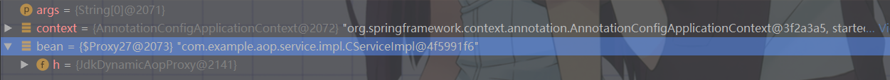

# Spring AOP

在这一章分析Spring AOP的实现过程，其实很多人都知道Spring AOP利用的是动态代理，可是却不知在何处进行动态代理，那么今天来一起探究一下。


参考文章：

[spring源码阅读--aop实现原理分析](https://blog.csdn.net/qq_20597727/article/details/84800176)

[spring-analysis-spring-aop](https://github.com/seaswalker/spring-analysis/blob/master/note/spring-aop.md)


## 示例

首先我们先写一个Demo，然后通过debug方式查看调用链路信息。需要注意的是：这里如果切入点的格式错误会启动不了，需要小心。

```java
@Service
public class CServiceImpl implements CService {

    @Override
    public void dosomething() {
        System.out.println("do something");
    }
}
// ----------------------------------------------------------------------------------------------------------------------------

@Aspect
@Order(1)
@Component
public class AopDemo {

    @Pointcut("execution(public * com.example.aop..*(..))")
    public void pointcut(){}

    @Around("pointcut()")
    public Object around(ProceedingJoinPoint joinPoint) throws Throwable{
        System.out.println("around");
        return joinPoint.proceed();
    }

    @Before("pointcut()")
    public void before(){
        System.out.println("before");
    }

    @After("pointcut()")
    public void after(){
        System.out.println("after");
    }
}


// ----------------------------------------------------------------------------------------------------------------------------
    public static void main(String[] args) {
        AnnotationConfigApplicationContext context = new AnnotationConfigApplicationContext(AopMain.class);

        CService bean = context.getBean(CService.class);
        bean.dosomething();

    }
```

从下面的截图，我们看到获取的Bean是一个代理$Proxy，一个代理类有个特点，就是以**h**标识




## 起步

在开始之前，了解一些知识。


### 基本术语（一些名词）

https://www.cnblogs.com/zhangzongle/p/5944906.html

（1）切面(Aspect)
切面泛指[*交叉业务逻辑*]。事务处理和日志处理可以理解为切面。常用的切面有通知(Advice)与顾问(Advisor)。实际就是对主业务逻辑的一种增强。

(2)织入（Weaving）
织入是指将切面代码插入到目标对象的过程。代理的invoke方法完成的工作，可以称为织入。

（3） 连接点(JoinPoint)
连接点是指可以被切面织入的方法。通常业务接口的方法均为连接点

（4）切入点(PointCut)
切入点指切面具体织入的方法
注意：被标记为final的方法是不能作为连接点与切入点的。因为最终的是不能被修改的，不能被增强的。

(5)目标对象（Target）
目标对象指将要被增强的对象。即包含主业务逻辑的类的对象。

（6）通知（Advice）
通知是**切面的一种实现**，可以完成简单的织入功能。通知定义了增强代码切入到目标代码的时间点，是目标方法执行之前执行，还是执行之后执行等。切入点定义切入的位置，通知定义切入的时间。

（7）顾问(Advisor)
顾问是**切面的另一种实现**，能够将通知以更为复杂的方式织入到目标对象中，是将通知包装为更复杂切面的装配器。


### aop:aspect与aop:advisor的区别

文章：[aop:aspect与aop:advisor的区别](https://www.jianshu.com/p/40f79da0cdef)

- < aop:aspect>：定义切面（切面包括通知和切点）大多用于日志，缓存
- < aop:advisor>：定义通知器（通知器跟切面一样，也包括通知和切点）大多用于事务管理


aop:advisor

```csharp
//定义通知
public class SleepHelper implements MethodBeforeAdvice,AfterReturningAdvice{
    @Override
    public void before(Method arg0, Object[] arg1, Object arg2)
            throws Throwable {
        System.out.println("睡觉前要脱衣服！");
    }

    @Override
    public void afterReturning(Object arg0, Method arg1, Object[] arg2,
                               Object arg3) throws Throwable {
        System.out.println("起床后要穿衣服！");
    }
}

//aop配置
<bean id="sleepHelper" class="com.ghs.aop.SleepHelper"></bean>

<aop:config>
<aop:pointcut expression="execution(* *.sleep(..))" id="sleepPointcut"/>
<aop:advisor advice-ref="sleepHelper" pointcut-ref="sleepPointcut"/>
</aop:config>

<bean id="human" class="com.ghs.aop.Human"/>
```


### Spring AOP流程

解析切面信息——>bean实例化是否有使用切面——>是则创建代理对象


## AnnotationAwareAspectJAutoProxyCreator

在Spring中，通过@EnableAspectJAutoProxy注解开启AOP，那我们便从这里开始入手。在此之前，需要你了解Spring的IOC和Bean的生命周期。

```java
@Target(ElementType.TYPE)
@Retention(RetentionPolicy.RUNTIME)
@Documented
@Import(AspectJAutoProxyRegistrar.class)
public @interface EnableAspectJAutoProxy {

   /**
    * Indicate whether subclass-based (CGLIB) proxies are to be created as opposed
    * to standard Java interface-based proxies. The default is {@code false}.
    */
   boolean proxyTargetClass() default false;

   /**
    * Indicate that the proxy should be exposed by the AOP framework as a {@code ThreadLocal}
    * for retrieval via the {@link org.springframework.aop.framework.AopContext} class.
    * Off by default, i.e. no guarantees that {@code AopContext} access will work.
    * @since 4.3.1
    */
   boolean exposeProxy() default false;

}

// ------------------------------------------------------------------------------------------------------------------------
// 注册 org.springframework.aop.aspectj.annotation.AnnotationAwareAspectJAutoProxyCreator到beanDefinitions中
**
 * Registers an {@link org.springframework.aop.aspectj.annotation.AnnotationAwareAspectJAutoProxyCreator
 * AnnotationAwareAspectJAutoProxyCreator} against the current {@link BeanDefinitionRegistry}
 * as appropriate based on a given @{@link EnableAspectJAutoProxy} annotation.
 *
 * @author Chris Beams
 * @author Juergen Hoeller
 * @since 3.1
 * @see EnableAspectJAutoProxy
 */
class AspectJAutoProxyRegistrar implements ImportBeanDefinitionRegistrar {

	/**
	 * Register, escalate, and configure the AspectJ auto proxy creator based on the value
	 * of the @{@link EnableAspectJAutoProxy#proxyTargetClass()} attribute on the importing
	 * {@code @Configuration} class.
	 */
	@Override
	public void registerBeanDefinitions(
			AnnotationMetadata importingClassMetadata, BeanDefinitionRegistry registry) {

		AopConfigUtils.registerAspectJAnnotationAutoProxyCreatorIfNecessary(registry);

		AnnotationAttributes enableAspectJAutoProxy =
				AnnotationConfigUtils.attributesFor(importingClassMetadata, EnableAspectJAutoProxy.class);
		if (enableAspectJAutoProxy != null) {
			if (enableAspectJAutoProxy.getBoolean("proxyTargetClass")) {
				AopConfigUtils.forceAutoProxyCreatorToUseClassProxying(registry);
			}
			if (enableAspectJAutoProxy.getBoolean("exposeProxy")) {
				AopConfigUtils.forceAutoProxyCreatorToExposeProxy(registry);
			}
		}
	}

}

```


可以看到@EnableAspectJAutoProxy注解自动将AnnotationAwareAspectJAutoProxyCreator注册到了BeanDefinitions中，AnnotationAwareAspectJAutoProxyCreator便是Spring AOP的核心，

AnnotationAwareAspectJAutoProxyCreator体系结构

——> AspectJAwareAdvisorAutoProxyCreator

——>AbstractAdvisorAutoProxyCreator

——>AbstractAutoProxyCreator

——>SmartInstantiationAwareBeanPostProcessor，BeanFactoryAware

——>InstantiationAwareBeanPostProcessor

——>BeanPostProcessor

**从AspectJAwareAdvisorAutoProxyCreator的结构可以看出，此类实现了SmartInstantiationAwareBeanPostProcessor接口，所以很容易想到入口应该位于此接口及其父接口(BeanPostProcessor)的相关方法中。**


### AbstractAutoProxyCreator#postProcessBeforeInstantiation

**注意**：这里的是postProcessBefore**Instantiation**，这个是InstantiationAwareBeanPostProcessor的

这一步处理在

```java
try {
   // Give BeanPostProcessors a chance to return a proxy instead of the target bean instance.
   Object bean = resolveBeforeInstantiation(beanName, mbdToUse);
   if (bean != null) {
      return bean;
   }
}
// ----------------------------------------------------------------------------------------------------------------------------
	protected Object resolveBeforeInstantiation(String beanName, RootBeanDefinition mbd) {
		Object bean = null;
		if (!Boolean.FALSE.equals(mbd.beforeInstantiationResolved)) {
			// Make sure bean class is actually resolved at this point.
			if (!mbd.isSynthetic() && hasInstantiationAwareBeanPostProcessors()) {
				Class<?> targetType = determineTargetType(beanName, mbd);
				if (targetType != null) {
					bean = applyBeanPostProcessorsBeforeInstantiation(targetType, beanName);
					if (bean != null) {
						bean = applyBeanPostProcessorsAfterInitialization(bean, beanName);
					}
				}
			}
			mbd.beforeInstantiationResolved = (bean != null);
		}
		return bean;
	}
```


代理并预先缓存切面

```java
public Object postProcessBeforeInstantiation(Class<?> beanClass, String beanName) {
   // 获取缓存key
   Object cacheKey = getCacheKey(beanClass, beanName);

   if (!StringUtils.hasLength(beanName) || !this.targetSourcedBeans.contains(beanName)) {
      if (this.advisedBeans.containsKey(cacheKey)) {
         return null;
      }
      // 检测是否需要代理
      if (isInfrastructureClass(beanClass) || shouldSkip(beanClass, beanName)) {
         this.advisedBeans.put(cacheKey, Boolean.FALSE);
         return null;
      }
   }

   // Create proxy here if we have a custom TargetSource.
   // Suppresses unnecessary default instantiation of the target bean:
   // The TargetSource will handle target instances in a custom fashion.
   TargetSource targetSource = getCustomTargetSource(beanClass, beanName);
   if (targetSource != null) {
      if (StringUtils.hasLength(beanName)) {
         this.targetSourcedBeans.add(beanName);
      }
      Object[] specificInterceptors = getAdvicesAndAdvisorsForBean(beanClass, beanName, targetSource);
      Object proxy = createProxy(beanClass, beanName, specificInterceptors, targetSource);
      this.proxyTypes.put(cacheKey, proxy.getClass());
      return proxy;
   }

   return null;
}
```


**Spring首先会对当前的beanClass进行检查(是否应该/可以对其进行代理)。**

不应该代理的类分为两种情况:

- 用于实现AOP的Spring基础类，此种情况在isInfrastructureClass方法中完成检测(单词Infrastructure正是基础设施的意思)。
- 子类定义的应该跳过的类，默认AbstractAutoProxyCreator的实现直接返回false，即都不应该跳过。


#### 基础类检测

AbstractAutoProxyCreator.isInfrastructureClass:

```java
protected boolean isInfrastructureClass(Class<?> beanClass) {
    boolean retVal = Advice.class.isAssignableFrom(beanClass) ||
            Pointcut.class.isAssignableFrom(beanClass) ||
            Advisor.class.isAssignableFrom(beanClass) ||
            AopInfrastructureBean.class.isAssignableFrom(beanClass);
    return retVal;
}
```


#### 跳过类检测

即shouldSkip方法。前面提到了，AbstractAutoProxyCreator的默认实现直接返回fasle，这一特性被子类AspectJAwareAdvisorAutoProxyCreator重写:

AbstractAutoProxyCreator#shouldSkip

```java
/**
 * Subclasses should override this method to return {@code true} if the
 * given bean should not be considered for auto-proxying by this post-processor.
 * <p>Sometimes we need to be able to avoid this happening, e.g. if it will lead to
 * a circular reference or if the existing target instance needs to be preserved.
 * This implementation returns {@code false} unless the bean name indicates an
 * "original instance" according to {@code AutowireCapableBeanFactory} conventions.
 * @param beanClass the class of the bean
 * @param beanName the name of the bean
 * @return whether to skip the given bean
 * @see org.springframework.beans.factory.config.AutowireCapableBeanFactory#ORIGINAL_INSTANCE_SUFFIX
 */
protected boolean shouldSkip(Class<?> beanClass, String beanName) {
   return AutoProxyUtils.isOriginalInstance(beanName, beanClass);
}
```


子类-AspectJAwareAdvisorAutoProxyCreator#shouldSkip

```java
@Override
protected boolean shouldSkip(Class<?> beanClass, String beanName) {
   // TODO: Consider optimization by caching the list of the aspect names
   // 预先解析缓存切面信息
   List<Advisor> candidateAdvisors = findCandidateAdvisors();
   for (Advisor advisor : candidateAdvisors) {
      if (advisor instanceof AspectJPointcutAdvisor &&
            ((AspectJPointcutAdvisor) advisor).getAspectName().equals(beanName)) {
         return true;
      }
   }
   return super.shouldSkip(beanClass, beanName);
}
```


#### Advisor寻找

```java
@Override
protected List<Advisor> findCandidateAdvisors() {
   // Add all the Spring advisors found according to superclass rules.
   List<Advisor> advisors = super.findCandidateAdvisors();
   // Build Advisors for all AspectJ aspects in the bean factory.
   if (this.aspectJAdvisorsBuilder != null) {
      advisors.addAll(this.aspectJAdvisorsBuilder.buildAspectJAdvisors());
   }
   return advisors;
}
```


findAdvisorBeans

```java
/**
 * Find all eligible Advisor beans in the current bean factory,
 * ignoring FactoryBeans and excluding beans that are currently in creation.
 * @return the list of {@link org.springframework.aop.Advisor} beans
 * @see #isEligibleBean
 */
public List<Advisor> findAdvisorBeans() {
   // Determine list of advisor bean names, if not cached already.
   // 缓存advisor bean
   String[] advisorNames = this.cachedAdvisorBeanNames;
   if (advisorNames == null) {
      // Do not initialize FactoryBeans here: We need to leave all regular beans
      // uninitialized to let the auto-proxy creator apply to them!
      // 从容器中找
      advisorNames = BeanFactoryUtils.beanNamesForTypeIncludingAncestors(
            this.beanFactory, Advisor.class, true, false);
      this.cachedAdvisorBeanNames = advisorNames;
   }
   if (advisorNames.length == 0) {
      return new ArrayList<>();
   }

   List<Advisor> advisors = new ArrayList<>();
   for (String name : advisorNames) {
      if (isEligibleBean(name)) {
         if (this.beanFactory.isCurrentlyInCreation(name)) {
            if (logger.isTraceEnabled()) {
               logger.trace("Skipping currently created advisor '" + name + "'");
            }
         }
         else {
            try {
               advisors.add(this.beanFactory.getBean(name, Advisor.class));
            }
            catch (BeanCreationException ex) {
               Throwable rootCause = ex.getMostSpecificCause();
               if (rootCause instanceof BeanCurrentlyInCreationException) {
                  BeanCreationException bce = (BeanCreationException) rootCause;
                  String bceBeanName = bce.getBeanName();
                  if (bceBeanName != null && this.beanFactory.isCurrentlyInCreation(bceBeanName)) {
                     if (logger.isTraceEnabled()) {
                        logger.trace("Skipping advisor '" + name +
                              "' with dependency on currently created bean: " + ex.getMessage());
                     }
                     // Ignore: indicates a reference back to the bean we're trying to advise.
                     // We want to find advisors other than the currently created bean itself.
                     continue;
                  }
               }
               throw ex;
            }
         }
      }
   }
   return advisors;
}
```


#### this.aspectJAdvisorsBuilder.buildAspectJAdvisors()

解析所有切面信息的调用点

```java
/**
 * Look for AspectJ-annotated aspect beans in the current bean factory,
 * and return to a list of Spring AOP Advisors representing them.
 * <p>Creates a Spring Advisor for each AspectJ advice method.
 * @return the list of {@link org.springframework.aop.Advisor} beans
 * @see #isEligibleBean
 */
public List<Advisor> buildAspectJAdvisors() {
   List<String> aspectNames = this.aspectBeanNames;

   if (aspectNames == null) {
      synchronized (this) {
         aspectNames = this.aspectBeanNames;
         if (aspectNames == null) {
            List<Advisor> advisors = new ArrayList<>();
            aspectNames = new ArrayList<>();
            // 从容器中获取所以注册的BeanName
            String[] beanNames = BeanFactoryUtils.beanNamesForTypeIncludingAncestors(
                  this.beanFactory, Object.class, true, false);
            for (String beanName : beanNames) {
               // 判断Advisor是否适用于当前bean
               if (!isEligibleBean(beanName)) {
                  continue;
               }
               // We must be careful not to instantiate beans eagerly as in this case they
               // would be cached by the Spring container but would not have been weaved.
               Class<?> beanType = this.beanFactory.getType(beanName);
               if (beanType == null) {
                  continue;
               }
               // 判断Bean是否是切面Bean
               // 1.@Aspect注解
               if (this.advisorFactory.isAspect(beanType)) {
                  aspectNames.add(beanName);
                  AspectMetadata amd = new AspectMetadata(beanType, beanName);
                  if (amd.getAjType().getPerClause().getKind() == PerClauseKind.SINGLETON) {
                     MetadataAwareAspectInstanceFactory factory =
                           new BeanFactoryAspectInstanceFactory(this.beanFactory, beanName);
                     // 解析aop class的配置和包，返回一个Advisor
                     List<Advisor> classAdvisors = this.advisorFactory.getAdvisors(factory);
                     if (this.beanFactory.isSingleton(beanName)) {
                        this.advisorsCache.put(beanName, classAdvisors);
                     }
                     else {
                        this.aspectFactoryCache.put(beanName, factory);
                     }
                     advisors.addAll(classAdvisors);
                  }
                  else {
                     // Per target or per this.
                     if (this.beanFactory.isSingleton(beanName)) {
                        throw new IllegalArgumentException("Bean with name '" + beanName +
                              "' is a singleton, but aspect instantiation model is not singleton");
                     }
                     MetadataAwareAspectInstanceFactory factory =
                           new PrototypeAspectInstanceFactory(this.beanFactory, beanName);
                     this.aspectFactoryCache.put(beanName, factory);
                     advisors.addAll(this.advisorFactory.getAdvisors(factory));
                  }
               }
            }
            this.aspectBeanNames = aspectNames;
            return advisors;
         }
      }
   }

   if (aspectNames.isEmpty()) {
      return Collections.emptyList();
   }
   List<Advisor> advisors = new ArrayList<>();
   for (String aspectName : aspectNames) {
      List<Advisor> cachedAdvisors = this.advisorsCache.get(aspectName);
      if (cachedAdvisors != null) {
         advisors.addAll(cachedAdvisors);
      }
      else {
         MetadataAwareAspectInstanceFactory factory = this.aspectFactoryCache.get(aspectName);
         advisors.addAll(this.advisorFactory.getAdvisors(factory));
      }
   }
   return advisors;
}

/**
 * Return whether the aspect bean with the given name is eligible.
 * @param beanName the name of the aspect bean
 * @return whether the bean is eligible
 */
protected boolean isEligibleBean(String beanName) {
   return true;
}
```


获取Advisors

```java
@Override
public List<Advisor> getAdvisors(MetadataAwareAspectInstanceFactory aspectInstanceFactory) {
   Class<?> aspectClass = aspectInstanceFactory.getAspectMetadata().getAspectClass();
   String aspectName = aspectInstanceFactory.getAspectMetadata().getAspectName();
   validate(aspectClass);

   // We need to wrap the MetadataAwareAspectInstanceFactory with a decorator
   // so that it will only instantiate once.
   MetadataAwareAspectInstanceFactory lazySingletonAspectInstanceFactory =
         new LazySingletonAspectInstanceFactoryDecorator(aspectInstanceFactory);

   List<Advisor> advisors = new ArrayList<>();
   for (Method method : getAdvisorMethods(aspectClass)) {
      Advisor advisor = getAdvisor(method, lazySingletonAspectInstanceFactory, advisors.size(), aspectName);
      if (advisor != null) {
         advisors.add(advisor);
      }
   }

   // If it's a per target aspect, emit the dummy instantiating aspect.
   if (!advisors.isEmpty() && lazySingletonAspectInstanceFactory.getAspectMetadata().isLazilyInstantiated()) {
      Advisor instantiationAdvisor = new SyntheticInstantiationAdvisor(lazySingletonAspectInstanceFactory);
      advisors.add(0, instantiationAdvisor);
   }

   // Find introduction fields.
   for (Field field : aspectClass.getDeclaredFields()) {
      Advisor advisor = getDeclareParentsAdvisor(field);
      if (advisor != null) {
         advisors.add(advisor);
      }
   }

   return advisors;
}

// ----------------------------------------------------------------------------------------------------------------------
	@Override
	@Nullable
	public Advisor getAdvisor(Method candidateAdviceMethod, MetadataAwareAspectInstanceFactory aspectInstanceFactory,
			int declarationOrderInAspect, String aspectName) {

		validate(aspectInstanceFactory.getAspectMetadata().getAspectClass());
		// 解析判断候选方法是否有@Before，@After，@Around等注解，如果有，就继续执行新建Advisor对象。
		AspectJExpressionPointcut expressionPointcut = getPointcut(
				candidateAdviceMethod, aspectInstanceFactory.getAspectMetadata().getAspectClass());
		if (expressionPointcut == null) {
			return null;
		}
		// 创建advisor
		return new InstantiationModelAwarePointcutAdvisorImpl(expressionPointcut, candidateAdviceMethod,
				this, aspectInstanceFactory, declarationOrderInAspect, aspectName);
	}
// ----------------------------------------------------------------------------------------------------------------------
	@Nullable
	private AspectJExpressionPointcut getPointcut(Method candidateAdviceMethod, Class<?> candidateAspectClass) {
        // 找到方法上的注解
		AspectJAnnotation<?> aspectJAnnotation =
				AbstractAspectJAdvisorFactory.findAspectJAnnotationOnMethod(candidateAdviceMethod);
		if (aspectJAnnotation == null) {
			return null;
		}

		AspectJExpressionPointcut ajexp =
				new AspectJExpressionPointcut(candidateAspectClass, new String[0], new Class<?>[0]);
		ajexp.setExpression(aspectJAnnotation.getPointcutExpression());
		if (this.beanFactory != null) {
			ajexp.setBeanFactory(this.beanFactory);
		}
		return ajexp;
	}
// ----------------------------------------------------------------------------------------------------------------------
	/**
	 * Find and return the first AspectJ annotation on the given method
	 * (there <i>should</i> only be one anyway...).
	 */
	@SuppressWarnings("unchecked")
	@Nullable
	protected static AspectJAnnotation<?> findAspectJAnnotationOnMethod(Method method) {
        // ASPECTJ_ANNOTATION_CLASSES = new Class<?>[] { 
        // Pointcut.class, Around.class, Before.class, After.class, AfterReturning.class, AfterThrowing.class};
        // 这里便是我们熟悉的注解
		for (Class<?> clazz : ASPECTJ_ANNOTATION_CLASSES) {
			AspectJAnnotation<?> foundAnnotation = findAnnotation(method, (Class<Annotation>) clazz);
			if (foundAnnotation != null) {
				return foundAnnotation;
			}
		}
		return null;
	}
```


### AbstractAutoProxyCreator#postProcessAfterInitialization

**注意**：这里的是postProcessAfter**Initialization**，这个是BeanPostProcessor。

InstantiationAwareBeanPostProcessor是BeanPostProcessor的子接口。


**Instantiation 与 Initialization 对比**

单词很像，意思却不相同

- Instantiation 实例化
- Initialization 初始化


这一步处理在

BeanPostProcessor后置处理器

```java
// Initialize the bean instance.
		Object exposedObject = bean;
		try {
			populateBean(beanName, mbd, instanceWrapper);
			exposedObject = initializeBean(beanName, exposedObject, mbd);
		}
// ----------------------------------------------------------------------------------------------------------------------------
protected Object initializeBean(final String beanName, final Object bean, @Nullable RootBeanDefinition mbd) {
		if (System.getSecurityManager() != null) {
			AccessController.doPrivileged((PrivilegedAction<Object>) () -> {
				invokeAwareMethods(beanName, bean);
				return null;
			}, getAccessControlContext());
		}
		else {
			invokeAwareMethods(beanName, bean);
		}

		Object wrappedBean = bean;
		if (mbd == null || !mbd.isSynthetic()) {
			wrappedBean = applyBeanPostProcessorsBeforeInitialization(wrappedBean, beanName);
		}

		try {
			invokeInitMethods(beanName, wrappedBean, mbd);
		}
		catch (Throwable ex) {
			throw new BeanCreationException(
					(mbd != null ? mbd.getResourceDescription() : null),
					beanName, "Invocation of init method failed", ex);
		}
		if (mbd == null || !mbd.isSynthetic()) {
			wrappedBean = applyBeanPostProcessorsAfterInitialization(wrappedBean, beanName);
		}

		return wrappedBean;
	}
```


后置处理，创建代理类

```java
/**
 * Create a proxy with the configured interceptors if the bean is
 * identified as one to proxy by the subclass.
 * @see #getAdvicesAndAdvisorsForBean
 */
@Override
public Object postProcessAfterInitialization(@Nullable Object bean, String beanName) {
   if (bean != null) {
      Object cacheKey = getCacheKey(bean.getClass(), beanName);
      if (this.earlyProxyReferences.remove(cacheKey) != bean) {
         return wrapIfNecessary(bean, beanName, cacheKey);
      }
   }
   return bean;
}
```


```java
/**
 * Wrap the given bean if necessary, i.e. if it is eligible for being proxied.
 * @param bean the raw bean instance
 * @param beanName the name of the bean
 * @param cacheKey the cache key for metadata access
 * @return a proxy wrapping the bean, or the raw bean instance as-is
 */
protected Object wrapIfNecessary(Object bean, String beanName, Object cacheKey) {
   //自定义TargetSource，已经进行过代理子类生成
   if (StringUtils.hasLength(beanName) && this.targetSourcedBeans.contains(beanName)) {
      return bean;
   }
   if (Boolean.FALSE.equals(this.advisedBeans.get(cacheKey))) {
      return bean;
   }
   // 检测是否需要代理，同上
   if (isInfrastructureClass(bean.getClass()) || shouldSkip(bean.getClass(), beanName)) {
      this.advisedBeans.put(cacheKey, Boolean.FALSE);
      return bean;
   }

   // Create proxy if we have advice.
   // 去容器中寻找适用于当前bean的Advisor
   Object[] specificInterceptors = getAdvicesAndAdvisorsForBean(bean.getClass(), beanName, null);
   if (specificInterceptors != DO_NOT_PROXY) {
      this.advisedBeans.put(cacheKey, Boolean.TRUE);
      // 动态代理
      Object proxy = createProxy(
            bean.getClass(), beanName, specificInterceptors, new SingletonTargetSource(bean));
      this.proxyTypes.put(cacheKey, proxy.getClass());
      return proxy;
   }

   this.advisedBeans.put(cacheKey, Boolean.FALSE);
   return bean;
}
```


#### 动态代理

```java
/**
 * Create an AOP proxy for the given bean.
 * @param beanClass the class of the bean
 * @param beanName the name of the bean
 * @param specificInterceptors the set of interceptors that is
 * specific to this bean (may be empty, but not null)
 * @param targetSource the TargetSource for the proxy,
 * already pre-configured to access the bean
 * @return the AOP proxy for the bean
 * @see #buildAdvisors
 */
protected Object createProxy(Class<?> beanClass, @Nullable String beanName,
      @Nullable Object[] specificInterceptors, TargetSource targetSource) {

   if (this.beanFactory instanceof ConfigurableListableBeanFactory) {
      AutoProxyUtils.exposeTargetClass((ConfigurableListableBeanFactory) this.beanFactory, beanName, beanClass);
   }
   // 新建代理对象工厂
   ProxyFactory proxyFactory = new ProxyFactory();
   proxyFactory.copyFrom(this);
   // 设置工厂代理类
   if (!proxyFactory.isProxyTargetClass()) {
      if (shouldProxyTargetClass(beanClass, beanName)) {
         proxyFactory.setProxyTargetClass(true);
      }
      else {
         evaluateProxyInterfaces(beanClass, proxyFactory);
      }
   }
   // 将interceptor适配为Advisor，设置拦截切面
   Advisor[] advisors = buildAdvisors(beanName, specificInterceptors);
   proxyFactory.addAdvisors(advisors);
   // 设置被代理对象
   proxyFactory.setTargetSource(targetSource);
   customizeProxyFactory(proxyFactory);

   proxyFactory.setFrozen(this.freezeProxy);
   if (advisorsPreFiltered()) {
      proxyFactory.setPreFiltered(true);
   }
   // 创建代理对象
   return proxyFactory.getProxy(getProxyClassLoader());
}
```


创建代理对象

```java
return proxyFactory.getProxy(getProxyClassLoader());

// ---------------------------------------------------------------------------------------------------------------
	/**
	 * Create a new proxy according to the settings in this factory.
	 * <p>Can be called repeatedly. Effect will vary if we've added
	 * or removed interfaces. Can add and remove interceptors.
	 * <p>Uses the given class loader (if necessary for proxy creation).
	 * @param classLoader the class loader to create the proxy with
	 * (or {@code null} for the low-level proxy facility's default)
	 * @return the proxy object
	 */
	public Object getProxy(@Nullable ClassLoader classLoader) {
		return createAopProxy().getProxy(classLoader);
	}

// ---------------------------------------------------------------------------------------------------------------
	/**
	 * Subclasses should call this to get a new AOP proxy. They should <b>not</b>
	 * create an AOP proxy with {@code this} as an argument.
	 */
	protected final synchronized AopProxy createAopProxy() {
		if (!this.active) {
			activate();
		}
		return getAopProxyFactory().createAopProxy(this);
	}
// ---------------------------------------------------------------------------------------------------------------
// 如果指定了(proxy-target-classs设为true)那么就会使用Cglib的方式，、
// 如果没有指定(或为false)，那么先检测被代理类是否实现了自己的接口，如果实现了，那么就采用JDK动态代理的方式。
	@Override
	public AopProxy createAopProxy(AdvisedSupport config) throws AopConfigException {
		if (config.isOptimize() || config.isProxyTargetClass() || hasNoUserSuppliedProxyInterfaces(config)) {
			Class<?> targetClass = config.getTargetClass();
			if (targetClass == null) {
				throw new AopConfigException("TargetSource cannot determine target class: " +
						"Either an interface or a target is required for proxy creation.");
			}
			if (targetClass.isInterface() || Proxy.isProxyClass(targetClass)) {
				return new JdkDynamicAopProxy(config);
			}
			return new ObjenesisCglibAopProxy(config);
		}
		else {
			return new JdkDynamicAopProxy(config);
		}
	}
```


### Spring与SpringBoot设置代理方式

注: 在springboot中默认为cglib代理方式，官方认为使用cglib更不容易出现转换错误。

> This was changed in 1.4 (see [5423](https://github.com/spring-projects/spring-boot/issues/5423)). We’ve generally found cglib proxies less likely to cause unexpected cast exceptions.

如果偏要springboot 走JDK动态代理，那么需要在application.properties里面配置

```properties
spring.aop.proxy-target-class=false // 默认是true
```


### CGlib代理分析

```java
@Override
public Object getProxy(@Nullable ClassLoader classLoader) {
   if (logger.isTraceEnabled()) {
      logger.trace("Creating CGLIB proxy: " + this.advised.getTargetSource());
   }

   try {
      Class<?> rootClass = this.advised.getTargetClass();
      Assert.state(rootClass != null, "Target class must be available for creating a CGLIB proxy");

      Class<?> proxySuperClass = rootClass;
      if (rootClass.getName().contains(ClassUtils.CGLIB_CLASS_SEPARATOR)) {
         proxySuperClass = rootClass.getSuperclass();
         Class<?>[] additionalInterfaces = rootClass.getInterfaces();
         for (Class<?> additionalInterface : additionalInterfaces) {
            this.advised.addInterface(additionalInterface);
         }
      }

      // Validate the class, writing log messages as necessary.
      validateClassIfNecessary(proxySuperClass, classLoader);

      // Configure CGLIB Enhancer...
      Enhancer enhancer = createEnhancer();
      if (classLoader != null) {
         enhancer.setClassLoader(classLoader);
         if (classLoader instanceof SmartClassLoader &&
               ((SmartClassLoader) classLoader).isClassReloadable(proxySuperClass)) {
            enhancer.setUseCache(false);
         }
      }
      enhancer.setSuperclass(proxySuperClass);
      enhancer.setInterfaces(AopProxyUtils.completeProxiedInterfaces(this.advised));
      enhancer.setNamingPolicy(SpringNamingPolicy.INSTANCE);
      enhancer.setStrategy(new ClassLoaderAwareGeneratorStrategy(classLoader));

      // 获取拦截回调函数
      Callback[] callbacks = getCallbacks(rootClass);
      Class<?>[] types = new Class<?>[callbacks.length];
      for (int x = 0; x < types.length; x++) {
         types[x] = callbacks[x].getClass();
      }
      // fixedInterceptorMap only populated at this point, after getCallbacks call above
      enhancer.setCallbackFilter(new ProxyCallbackFilter(
            this.advised.getConfigurationOnlyCopy(), this.fixedInterceptorMap, this.fixedInterceptorOffset));
      enhancer.setCallbackTypes(types);

      // Generate the proxy class and create a proxy instance.
      // 返回一个cglib代理对象
      return createProxyClassAndInstance(enhancer, callbacks);
   }
   catch (CodeGenerationException | IllegalArgumentException ex) {
      throw new AopConfigException("Could not generate CGLIB subclass of " + this.advised.getTargetClass() +
            ": Common causes of this problem include using a final class or a non-visible class",
            ex);
   }
   catch (Throwable ex) {
      // TargetSource.getTarget() failed
      throw new AopConfigException("Unexpected AOP exception", ex);
   }
}
```


## 调用

### CallbackFilter & Callback

还有一个关键的问题，从上面可以知道我们获取的是一个代理对象，那当调用代理对象相应的方法(例如：dosomething)时，实际又是如何调用的呢？


### CGLIB

首先如何是CGlib代理，要理解两个概念Callback和CallbackFilter

- Callback：是Cglib所有自定义逻辑(增强)的共同接口。
- CallbackFilter：在CGLib回调时可以设置对不同方法执行不同的回调逻辑，或者根本不执行回调。

但是jdk并不支持这么搞，只支持设置一个InvocationHandler处理(拦截)所有的方法。


DynamicAdvisedInterceptor

——>MethodInterceptor

——>Callback

```java
/**
	 * General purpose AOP callback. Used when the target is dynamic or when the
	 * proxy is not frozen.
	 */
	private static class DynamicAdvisedInterceptor implements MethodInterceptor, Serializable {

		private final AdvisedSupport advised;

		public DynamicAdvisedInterceptor(AdvisedSupport advised) {
			this.advised = advised;
		}

		@Override
		@Nullable
		public Object intercept(Object proxy, Method method, Object[] args, MethodProxy methodProxy) throws Throwable {
			Object oldProxy = null;
			boolean setProxyContext = false;
			Object target = null;
			TargetSource targetSource = this.advised.getTargetSource();
			try {
				if (this.advised.exposeProxy) {
					// Make invocation available if necessary.
					oldProxy = AopContext.setCurrentProxy(proxy);
					setProxyContext = true;
				}
				// Get as late as possible to minimize the time we "own" the target, in case it comes from a pool...
                // 获得被代理的对象
				target = targetSource.getTarget();
				Class<?> targetClass = (target != null ? target.getClass() : null);
				List<Object> chain = this.advised.getInterceptorsAndDynamicInterceptionAdvice(method, targetClass);
				Object retVal;
				// Check whether we only have one InvokerInterceptor: that is,
				// no real advice, but just reflective invocation of the target.
				if (chain.isEmpty() && Modifier.isPublic(method.getModifiers())) {
					// We can skip creating a MethodInvocation: just invoke the target directly.
					// Note that the final invoker must be an InvokerInterceptor, so we know
					// it does nothing but a reflective operation on the target, and no hot
					// swapping or fancy proxying.
					Object[] argsToUse = AopProxyUtils.adaptArgumentsIfNecessary(method, args);
					retVal = methodProxy.invoke(target, argsToUse);
				}
				else {
					// We need to create a method invocation...
					retVal = new CglibMethodInvocation(proxy, target, method, args, targetClass, chain, methodProxy).proceed();
				}
				retVal = processReturnType(proxy, target, method, retVal);
				return retVal;
			}
			finally {
				if (target != null && !targetSource.isStatic()) {
					targetSource.releaseTarget(target);
				}
				if (setProxyContext) {
					// Restore old proxy.
					AopContext.setCurrentProxy(oldProxy);
				}
			}
		}
```


### 回调

一般的方法使用的是DynamicAdvisedInterceptor作为回调逻辑，其intercept关键源码:

```
@Override
public Object intercept(Object proxy, Method method, Object[] args, MethodProxy methodProxy) {
    Object target = getTarget();
}
```

target就是被代理对象。

getTarget:

```
protected Object getTarget() throws Exception {
    return this.advised.getTargetSource().getTarget();
}
```

TargetSource前面说过了，默认是SimpleBeanTargetSource:

```
@Override
public Object getTarget() throws Exception {
    return getBeanFactory().getBean(getTargetBeanName());
}
```


## 总结

Spring AOP主要流程：解析切面信息——>bean实例化是否有适用切面——>是则创建代理对象


先解析切面信息，生产Advisor。然后利用BeanPostProcessors，在Bean的生命周期进行回调处理，判断是否有适用的切面类，如果有则创建代理对象。

在这里可以自由选择是JDK动态代理还是CGlib代理。