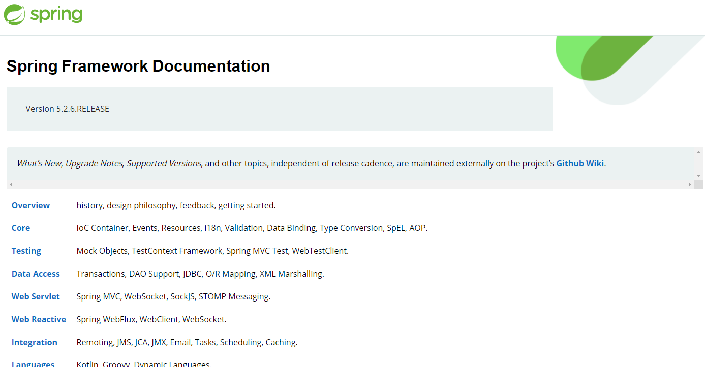

# Spring Core

spring的源码很多，这里主要是了解spring的主流应用，如spring-core，spring-aop，spring-ioc，spring-bean，spring-tx，spring-mvc等。

https://docs.spring.io/spring/docs/5.2.6.RELEASE/spring-framework-reference/index.html




注：本篇文章是阅读[spring-core源码分析](https://github.com/seaswalker/spring-analysis/blob/master/note/Spring.md)的笔记，外接自己的理解和总结，原文写的比较详细和深入，一些个人不了解的地方会跳过。如果是方法，会加上双括号**()**作为和类的命名区分。


# 起步

首先从spring的加载开始，了解其对bean的管理。在这里使用ClassPathXmlApplicationContext的方式启动spring容器，其实也可以通过AnnotationConfigApplicationContext配置类的形式。我们知道Spring是支持注解和xml配置两种形式的。


**ClassPathXmlApplicationContext**

```java
public static void main(String[] args) {
        ClassPathXmlApplicationContext applicationContext = new ClassPathXmlApplicationContext("classpath:/META-INF/spring-core.xml");
}
```


**AnnotationConfigApplicationContext**

```java
public static void main(String[] args) {
        AnnotationConfigApplicationContext applicationContext = new AnnotationConfigApplicationContext();
        applicationContext.register(BeanConfiguration.class);
        applicationContext.refresh();
}
```


# ClassPathXmlApplicationContext体系架构

**DefaultResourceLoader** (org.springframework.core.io)

  **AbstractApplicationContext** (org.springframework.context.support)

​     AbstractRefreshableApplicationContext (org.springframework.context.support)

​       AbstractRefreshableConfigApplicationContext (org.springframework.context.support)

​         AbstractXmlApplicationContext (org.springframework.context.support)

​          **ClassPathXmlApplicationContext** (org.springframework.context.support)


# ClassPathXmlApplicationContext执行流程

总的执行流程

1. **加载资源**
2. **设置配置文件路径**
3. **刷新容器**

```java
public ClassPathXmlApplicationContext(
            String[] configLocations, boolean refresh, @Nullable ApplicationContext parent)
            throws BeansException {
        // 1.ResourceLoader加载资源（策略模式）
        super(parent);
        // 2.设置配置文件路径
        setConfigLocations(configLocations);
        if (refresh) {
            // 3.刷新容器
            refresh();
        }
    }
```


## 1 加载资源

ResourceLoader是对资源加载器的抽象

```java
public AbstractApplicationContext(ApplicationContext parent) {
    this();
    setParent(parent);
}
public AbstractApplicationContext() {
    this.resourcePatternResolver = getResourcePatternResolver();
}
```


### getResourcePatternResolver()

```java
protected ResourcePatternResolver getResourcePatternResolver() {
    return new PathMatchingResourcePatternResolver(this);
}
```

PathMatchingResourcePatternResolver支持Ant风格的路径解析


### classpath*: 与classpath:

**ApplicationContext**(org.springframework.context)

​	ResourcePatternResolver(org.springframework.core.io.support)

classpath*: 表示能从所有的目录查找，例如能从jar包中加载

classpath: 从当前目录加载

```java
public interface ResourcePatternResolver extends ResourceLoader {

	/**
	 * Pseudo URL prefix for all matching resources from the class path: "classpath*:"
	 * This differs from ResourceLoader's classpath URL prefix in that it
	 * retrieves all matching resources for a given name (e.g. "/beans.xml"),
	 * for example in the root of all deployed JAR files.
	 * @see org.springframework.core.io.ResourceLoader#CLASSPATH_URL_PREFIX
	 */
	String CLASSPATH_ALL_URL_PREFIX = "classpath*:";

```


ResourceLoader

```java
public interface ResourceLoader {

	/** Pseudo URL prefix for loading from the class path: "classpath:". */
	String CLASSPATH_URL_PREFIX = ResourceUtils.CLASSPATH_URL_PREFIX;
```


## 2 设置配置文件路径

解析的方法就是resolvePath()

```java
    /**
     * Set the config locations for this application context.
     * <p>If not set, the implementation may use a default as appropriate.
     */
    public void setConfigLocations(@Nullable String... locations) {
        if (locations != null) {
            Assert.noNullElements(locations, "Config locations must not be null");
            this.configLocations = new String[locations.length];
            for (int i = 0; i < locations.length; i++) {
                // 解析配置文件路径
                this.configLocations[i] = resolvePath(locations[i]).trim();
            }
        }
        else {
            this.configLocations = null;
        }
    }
```


### 2.1 AbstractRefreshableConfigApplicationContext.resolvePath()

此方法的目的在于将占位符(placeholder)解析成实际的地址。比如可以这么写: 

`new ClassPathXmlApplicationContext("classpath:config.xml");`那么classpath:就是需要被解析的。

```java
    /**
     * Resolve the given path, replacing placeholders with corresponding
     * environment property values if necessary. Applied to config locations.
     * @param path the original file path
     * @return the resolved file path
     * @see org.springframework.core.env.Environment#resolveRequiredPlaceholders(String)
     */
    protected String resolvePath(String path) {
        return getEnvironment().resolveRequiredPlaceholders(path);
    }
```


### 2.2 Environment体系架构

在解析path的时候，我们看到有个**getEnvironment()**方法，这里会创建**StandardEnvironment**。Environmen接口代表了**当前应用所处的环境**。提供了两方面的应用：profiles、properties。


**PropertyResolver**(org.springframework.core.env)

**Environment** (org.springframework.core.env)

Environment (org.springframework.core.env)

ConfigurablePropertyResolver (org.springframework.core.env)

ConfigurablePropertyResolver (org.springframework.core.env)


**Environment** (org.springframework.core.env)

**ConfigurableEnvironment** (org.springframework.core.env)

   ConfigurableWebEnvironment (org.springframework.web.context)

​    **StandardServletEnvironment** (org.springframework.web.context.support)

​     StandardServletEnvironment (org.springframework.web.context.support)

   ConfigurableWebEnvironment (org.springframework.web.context)

​     StandardServletEnvironment (org.springframework.web.context.support)

   ConfigurableReactiveWebEnvironment (org.springframework.boot.web.reactive.context)

​     StandardReactiveWebEnvironment (org.springframework.boot.web.reactive.context)

   AbstractEnvironment (org.springframework.core.env)

​     StandardEnvironment (org.springframework.core.env)

​       StandardServletEnvironment (org.springframework.web.context.support)

​       StandardServletEnvironment (org.springframework.web.context.support)

​       StandardReactiveWebEnvironment (org.springframework.boot.web.reactive.context)

​     MockEnvironment (org.springframework.mock.env)


**EnvironmentAware扩展** 

org.springframework.context.EnvironmentAware

```java
 * @author Chris Beams
 * @since 3.1
 * @see PropertyResolver
 * @see EnvironmentCapable
 * @see ConfigurableEnvironment
 * @see AbstractEnvironment
 * @see StandardEnvironment
 * @see org.springframework.context.EnvironmentAware // 扩展
 * @see org.springframework.context.ConfigurableApplicationContext#getEnvironment
 * @see org.springframework.context.ConfigurableApplicationContext#setEnvironment
 * @see org.springframework.context.support.AbstractApplicationContext#createEnvironment
 */
public interface Environment extends PropertyResolver {
```


**Profile**

org.springframework.context.annotation.Profile @Profile

用于不同环境的切换，Spring容器管理的所有bean都是和一个profile绑定在一起的。


**Property**

org.springframework.core.env.PropertyResolver


### 2.3 AbstractEnvironment

默认的MutablePropertySources实现内部含有一个CopyOnWriteArrayList作为存储载体

```java
public abstract class AbstractEnvironment implements ConfigurableEnvironment {
    
    // 默认的MutablePropertySources实现内部含有一个CopyOnWriteArrayList作为存储载体
    private final MutablePropertySources propertySources = new MutablePropertySources(this.logger);
    
    public AbstractEnvironment() {
        this.propertyResolver = new PropertySourcesPropertyResolver(this.propertySources);
        this.customizePropertySources(this.propertySources);
    }
}
```

**PropertySources**

PropertySource接口代表了键值对的Property来源


**StandardEnvironment.customizePropertySources()**

这里研究StandardEnvironment里的是如何添加PropertySources，底层其实调用的是System.getProperty(attributeName);

```java
public class StandardEnvironment extends AbstractEnvironment {

    /** System environment property source name: {@value}. */
    public static final String SYSTEM_ENVIRONMENT_PROPERTY_SOURCE_NAME = "systemEnvironment";

    /** JVM system properties property source name: {@value}. */
    public static final String SYSTEM_PROPERTIES_PROPERTY_SOURCE_NAME = "systemProperties";


    /**
     * Customize the set of property sources with those appropriate for any standard
     * Java environment:
     * <ul>
     * <li>{@value #SYSTEM_PROPERTIES_PROPERTY_SOURCE_NAME}
     * <li>{@value #SYSTEM_ENVIRONMENT_PROPERTY_SOURCE_NAME}
     * </ul>
     * <p>Properties present in {@value #SYSTEM_PROPERTIES_PROPERTY_SOURCE_NAME} will
     * take precedence over those in {@value #SYSTEM_ENVIRONMENT_PROPERTY_SOURCE_NAME}.
     * @see AbstractEnvironment#customizePropertySources(MutablePropertySources)
     * @see #getSystemProperties()
     * @see #getSystemEnvironment()
     */
    @Override
    protected void customizePropertySources(MutablePropertySources propertySources) {
        propertySources.addLast(
                new PropertiesPropertySource(SYSTEM_PROPERTIES_PROPERTY_SOURCE_NAME, getSystemProperties()));
        propertySources.addLast(
                new SystemEnvironmentPropertySource(SYSTEM_ENVIRONMENT_PROPERTY_SOURCE_NAME, getSystemEnvironment()));
    }

}
```

**AbstractEnvironment.getSystemProperties()**

底层调用的是System.getProperty(attributeName);这里的实现很有意思，如果安全管理器阻止获取全部的系统属性，那么会尝试获取单个属性的可能性，如果还不行就抛异常了。**getSystemEnvironment()同。**

```java
@Override
public Map<String, Object> getSystemProperties() {
    try {
        return (Map) System.getProperties();
    }
    catch (AccessControlException ex) {
        return (Map) new ReadOnlySystemAttributesMap() {
            @Override
            protected String getSystemAttribute(String attributeName) {
                try {
                    return System.getProperty(attributeName);
                }
                catch (AccessControlException ex) {
                    if (logger.isInfoEnabled()) {
                        logger.info(format("Caught AccessControlException when accessing system " +
                                "property [%s]; its value will be returned [null]. Reason: %s",
                                attributeName, ex.getMessage()));
                    }
                    return null;
                }
            }
        };
    }
}
```


**AbstractEnvironment.getSystemEnvironment()**

底层调用的是System.*getenv*(attributeName)


### 2.4 AbstractPropertyResolver.resolveRequiredPlaceholders()

解析占位符

```java
@Override
public String resolveRequiredPlaceholders(String text) throws IllegalArgumentException {
    if (this.strictHelper == null) {
        this.strictHelper = createPlaceholderHelper(false);
    }
    return doResolvePlaceholders(text, this.strictHelper);
}
```


### 2.5 AbstractPropertyResolver.createPlaceholderHelper()

三个参数分别是

-   placeholderPrefix =  "**${"**
-   placeholderSuffix = **"}"**
-   valueSeparator = **":"
  **

```java
private PropertyPlaceholderHelper createPlaceholderHelper(boolean ignoreUnresolvablePlaceholders) {

    return new PropertyPlaceholderHelper(this.placeholderPrefix, this.placeholderPrefix,
        this.valueSeparator, ignoreUnresolvablePlaceholders);
}
```


### 2.6 AbstractPropertyResolver.doResolvePlaceholders()

解析占位符

```java
    private String doResolvePlaceholders(String text, PropertyPlaceholderHelper helper) {
        return helper.replacePlaceholders(text, this::getPropertyAsRawString);
    }
```


**PropertySourcesPropertyResolver.getPropertyAsRawString()**

其实代码执行到这里的时候还没有进行xml配置文件的解析，那么这里的解析placeHolder是什么意思呢，原因在于可以这么写:

```java
System.setProperty("spring", "classpath");
ClassPathXmlApplicationContext context = new ClassPathXmlApplicationContext("${spring}:config.xml");
SimpleBean bean = context.getBean(SimpleBean.class);
```

getPropertyAsRawString()

将占位符（placeHolder）还原为原生字符串。

```java
    /**
     * Retrieve the specified property as a raw String,
     * i.e. without resolution of nested placeholders.
     * @param key the property name to resolve
     * @return the property value or {@code null} if none found
     */
protected String getPropertyAsRawString(String key) {
   return getProperty(key, String.class, false);
}


@Nullableprotected <T> T getProperty(String key, Class<T> targetValueType, boolean resolveNestedPlaceholders) {
   if (this.propertySources != null) {
      for (PropertySource<?> propertySource : this.propertySources) {
         if (logger.isTraceEnabled()) {
            logger.trace("Searching for key '" + key + "' in PropertySource '" +
                  propertySource.getName() + "'");         }
         Object value = propertySource.getProperty(key);         if (value != null) {
            if (resolveNestedPlaceholders && value instanceof String) {
               value = resolveNestedPlaceholders((String) value);            }
            logKeyFound(key, propertySource, value);            return convertValueIfNecessary(value, targetValueType);         }
      }
   }
   if (logger.isTraceEnabled()) {
      logger.trace("Could not find key '" + key + "' in any property source");   }
   return null;}
```

**PropertyPlaceholderHelper.replacePlaceholders()**

parseStringValue

这里的parseStringValue就会替换placeholder了，例如${name}

```java
    public String replacePlaceholders(String value, PlaceholderResolver placeholderResolver) {
        Assert.notNull(value, "'value' must not be null");
        return parseStringValue(value, placeholderResolver, null);
    }
```


### 小结

这一部分并还未开始解析xml配置，主要是解析占位符，设置配置文件路径。在这里引入了Environment的概念，应用的两个方面是：profiles、properties。如果你注意到Environment上的注释，这里还引入了**Aware**的概念，提供一个回调的函数。例如：EnvironmentAware。

```java
/**
 * A marker superinterface indicating that a bean is eligible to be notified by the
 * Spring container of a particular framework object through a callback-style method.
 * The actual method signature is determined by individual subinterfaces but should
 * typically consist of just one void-returning method that accepts a single argument.
 *
 * <p>Note that merely implementing {@link Aware} provides no default functionality.
 * Rather, processing must be done explicitly, for example in a
 * {@link org.springframework.beans.factory.config.BeanPostProcessor}.
 * Refer to {@link org.springframework.context.support.ApplicationContextAwareProcessor}
 * for an example of processing specific {@code *Aware} interface callbacks.
 *
 * @author Chris Beams
 * @author Juergen Hoeller
 * @since 3.1
 */
public interface Aware {

}
```


## 3 refresh()刷新容器

从这里，就开始解析xml，初始化Bean容器，然后设置Bean容器，添加各种“特征”，如：Aware、事件、监听器。


总的执行流程

1. prepareRefresh() 
2. obtainFreshBeanFactory()
3. prepareBeanFactory()
4. postProcessBeanFactory()
5. invokeBeanFactoryPostProcessors()
6. registerBeanPostProcessors()
7. initMessageSource()
8. initApplicationEventMulticaster()
9. onRefresh()
10. registerListeners()
11. finishBeanFactoryInitialization()
12. finishRefresh()
13. resetCommonCaches()


**AbstractApplicationContext.refresh()**

容器的刷新是最重要的环节，这里会一步一步进行分析，首先这里会加一个synchronized锁，锁的是一个Object对象。

```java
/** Synchronization monitor for the "refresh" and "destroy". */
private final Object startupShutdownMonitor = new Object();

public void refresh() throws BeansException, IllegalStateException {
        synchronized (this.startupShutdownMonitor) {
            // Prepare this context for refreshing.
            prepareRefresh();

            // Tell the subclass to refresh the internal bean factory.
            ConfigurableListableBeanFactory beanFactory = obtainFreshBeanFactory();

            // Prepare the bean factory for use in this context.
            prepareBeanFactory(beanFactory);

            try {
                // Allows post-processing of the bean factory in context subclasses.
                postProcessBeanFactory(beanFactory);

                // Invoke factory processors registered as beans in the context.
                invokeBeanFactoryPostProcessors(beanFactory);

                // Register bean processors that intercept bean creation.
                registerBeanPostProcessors(beanFactory);

                // Initialize message source for this context.
                initMessageSource();

                // Initialize event multicaster for this context.
                initApplicationEventMulticaster();

                // Initialize other special beans in specific context subclasses.
                onRefresh();

                // Check for listener beans and register them.
                registerListeners();

                // Instantiate all remaining (non-lazy-init) singletons.
                finishBeanFactoryInitialization(beanFactory);

                // Last step: publish corresponding event.
                finishRefresh();
            }

            catch (BeansException ex) {
                if (logger.isWarnEnabled()) {
                    logger.warn("Exception encountered during context initialization - " +
                            "cancelling refresh attempt: " + ex);
                }

                // Destroy already created singletons to avoid dangling resources.
                destroyBeans();

                // Reset 'active' flag.
                cancelRefresh(ex);

                // Propagate exception to caller.
                throw ex;
            }

            finally {
                // Reset common introspection caches in Spring's core, since we
                // might not ever need metadata for singleton beans anymore...
                resetCommonCaches();
            }
        }
    }
```


### 3.1 进行refresh的准备 prepareRefresh()

refresh前的准备，**如设置一下启动时间和属性校验，初始化Environment**

这里有个initPropertySources()方法，但是默认是空实现，由其子类去实现。

```java
/**
     * Prepare this context for refreshing, setting its startup date and
     * active flag as well as performing any initialization of property sources.
     */
    protected void prepareRefresh() {
        // Switch to active.
        this.startupDate = System.currentTimeMillis();
        this.closed.set(false);
        this.active.set(true);

        if (logger.isDebugEnabled()) {
            if (logger.isTraceEnabled()) {
                logger.trace("Refreshing " + this);
            }
            else {
                logger.debug("Refreshing " + getDisplayName());
            }
        }

        // Initialize any placeholder property sources in the context environment.
        // 空方法，由子类实现，钩子函数
        initPropertySources();

        // Validate that all properties marked as required are resolvable:
        // see ConfigurablePropertyResolver#setRequiredProperties
        getEnvironment().validateRequiredProperties();

        // Store pre-refresh ApplicationListeners...
        if (this.earlyApplicationListeners == null) {
            this.earlyApplicationListeners = new LinkedHashSet<>(this.applicationListeners);
        }
        else {
            // Reset local application listeners to pre-refresh state.
            this.applicationListeners.clear();
            this.applicationListeners.addAll(this.earlyApplicationListeners);
        }

        // Allow for the collection of early ApplicationEvents,
        // to be published once the multicaster is available...
        this.earlyApplicationEvents = new LinkedHashSet<>();
    }
```


**getEnvironment().validateRequiredProperties()**

requiredProperties默认是空的，也就是不需要校验任何属性

```java
private final Set<String> requiredProperties = new LinkedHashSet<>();

public void validateRequiredProperties() {
        MissingRequiredPropertiesException ex = new MissingRequiredPropertiesException();
        for (String key : this.requiredProperties) {
            if (this.getProperty(key) == null) {
                ex.addMissingRequiredProperty(key);
            }
        }
        if (!ex.getMissingRequiredProperties().isEmpty()) {
            throw ex;
        }
    }
```


### 3.2  获取刷新、创建的容器 obtainFreshBeanFactory()

**AbstractApplicationContext.obtainFreshBeanFactory()**

这一步开始创建BeanFactory容器，解析xml，加载BeanDefinition并放到容器里的Collection中


告诉子类去刷新内部的容器，由方法名称refreshBeanFactory我们大概可以猜到，这个BeanFactory就是Bean容器

```java
    /**
     * Tell the subclass to refresh the internal bean factory.
     * @return the fresh BeanFactory instance
     * @see #refreshBeanFactory()
     * @see #getBeanFactory()
     */ 
protected ConfigurableListableBeanFactory obtainFreshBeanFactory() {
        refreshBeanFactory();
        return getBeanFactory();
    }
```


#### 刷新BeanFactory

**AbstractRefreshableApplicationContext.refreshBeanFactory()**


**DefaultListableBeanFactory**

ConfigurableListableBeanFactory

ListableBeanFactory

**BeanFactory**

```java
    /**
     * This implementation performs an actual refresh of this context's underlying
     * bean factory, shutting down the previous bean factory (if any) and
     * initializing a fresh bean factory for the next phase of the context's lifecycle.
     */
    @Override
    protected final void refreshBeanFactory() throws BeansException {
        // 如果已经存在则进行销毁
        if (hasBeanFactory()) {
            // 清除Bean，这里会清除各种缓存，工厂，Bean的信息
            destroyBeans();
            // 关闭BeanFactory，设置序列化serializationId为null
            closeBeanFactory();
        }
        try {
            // 创建默认的DefaultListableBeanFactory对象，这便是Bean容器
            DefaultListableBeanFactory beanFactory = createBeanFactory();
            // 设置serializationId
            beanFactory.setSerializationId(getId());
            customizeBeanFactory(beanFactory);
            loadBeanDefinitions(beanFactory);
            synchronized (this.beanFactoryMonitor) {
                this.beanFactory = beanFactory;
            }
        }
        catch (IOException ex) {
            throw new ApplicationContextException("I/O error parsing bean definition source for " + getDisplayName(), ex);
        }
    }
```


#### BeanFactory创建 createBeanFactory()

创建默认的DefaultListableBeanFactory对象


#### BeanFactory(Spring Bean容器)体系架构


**BeanFactory**

**HierarchicalBeanFactory** (org.springframework.beans.factory)

   ConfigurableBeanFactory (org.springframework.beans.factory.config)

​     AbstractBeanFactory (org.springframework.beans.factory.support)

​    **ConfigurableListableBeanFactory** (org.springframework.beans.factory.config)

  **ApplicationContext** (org.springframework.context)

​     ReactiveWebApplicationContext (org.springframework.boot.web.reactive.context)

​    **ConfigurableApplicationContext** (org.springframework.context)

​       ConfigurableWebServerApplicationContext (org.springframework.boot.web.context)

​      **AbstractApplicationContext** (org.springframework.context.support)

​        **AbstractRefreshableApplicationContext** (org.springframework.context.support)

​         GenericApplicationContext (org.springframework.context.support)

​       AssertableApplicationContext (org.springframework.boot.test.context.assertj)

​       ConfigurableWebApplicationContext (org.springframework.web.context)

​     ConfigurableApplicationContext (org.springframework.context)

​     WebServerApplicationContext (org.springframework.boot.web.context)

​     WebApplicationContext (org.springframework.web.context)

​     ApplicationContextAssertProvider (org.springframework.boot.test.context.assertj)


**SimpleJndiBeanFactory** (org.springframework.jndi.support)


**AutowireCapableBeanFactory** (org.springframework.beans.factory.config)

  **ConfigurableListableBeanFactory** (org.springframework.beans.factory.config)

​    **DefaultListableBeanFactory** (org.springframework.beans.factory.support)

​      **XmlBeanFactory** (org.springframework.beans.factory.xml)

  **AbstractAutowireCapableBeanFactory** (org.springframework.beans.factory.support)

​    **DefaultListableBeanFactory** (org.springframework.beans.factory.support)

​      **XmlBeanFactory** (org.springframework.beans.factory.xml)

   StubBeanFactory in StubWebApplicationContext (org.springframework.test.web.servlet.setup)


**ListableBeanFactory** (org.springframework.beans.factory)


**ListableBeanFactory：用于处理迭代器的工厂**

**HierarchicalBeanFactory：用于处理父子容器的工厂**

```java
/**
 * Extension of the {@link BeanFactory} interface to be implemented by bean factories
 * that can enumerate all their bean instances, rather than attempting bean lookup
 * by name one by one as requested by clients. BeanFactory implementations that
 * preload all their bean definitions (such as XML-based factories) may implement
 * this interface.
 *
 * <p>If this is a {@link HierarchicalBeanFactory}, the return values will <i>not</i>
 * take any BeanFactory hierarchy into account, but will relate only to the beans
 * defined in the current factory. Use the {@link BeanFactoryUtils} helper class
 * to consider beans in ancestor factories too.
 *
 * <p>The methods in this interface will just respect bean definitions of this factory.
 * They will ignore any singleton beans that have been registered by other means like
 * {@link org.springframework.beans.factory.config.ConfigurableBeanFactory}'s
 * {@code registerSingleton} method, with the exception of
 * {@code getBeanNamesOfType} and {@code getBeansOfType} which will check
 * such manually registered singletons too. Of course, BeanFactory's {@code getBean}
 * does allow transparent access to such special beans as well. However, in typical
 * scenarios, all beans will be defined by external bean definitions anyway, so most
 * applications don't need to worry about this differentiation.
 *
 * <p><b>NOTE:</b> With the exception of {@code getBeanDefinitionCount}
 * and {@code containsBeanDefinition}, the methods in this interface
 * are not designed for frequent invocation. Implementations may be slow.
 *
 * @author Rod Johnson
 * @author Juergen Hoeller
 * @since 16 April 2001
 * @see HierarchicalBeanFactory
 * @see BeanFactoryUtils
 */
public interface ListableBeanFactory extends BeanFactory {
    
    
/**
 * Sub-interface implemented by bean factories that can be part
 * of a hierarchy.
 *
 * <p>The corresponding {@code setParentBeanFactory} method for bean
 * factories that allow setting the parent in a configurable
 * fashion can be found in the ConfigurableBeanFactory interface.
 *
 * @author Rod Johnson
 * @author Juergen Hoeller
 * @since 07.07.2003
 * @see org.springframework.beans.factory.config.ConfigurableBeanFactory#setParentBeanFactory
 */
public interface HierarchicalBeanFactory extends BeanFactory {
```


注：从上面我们可以看到BeanFactory的体系架构非常复杂，抽象了很多层，我们可以先留个印象，后面再逐步了解主要的几层抽象类的作用，如**AbstractRefreshableApplicationContext、AbstractApplicationContext等。**


#### BeanFactory定制

**AbstractRefreshableApplicationContext.customizeBeanFactory()**给子类提供一个自由配置的机会

```java
/**
     * Customize the internal bean factory used by this context.
     * Called for each {@link #refresh()} attempt.
     * <p>The default implementation applies this context's
     * {@linkplain #setAllowBeanDefinitionOverriding "allowBeanDefinitionOverriding"}
     * and {@linkplain #setAllowCircularReferences "allowCircularReferences"} settings,
     * if specified. Can be overridden in subclasses to customize any of
     * {@link DefaultListableBeanFactory}'s settings.
     * @param beanFactory the newly created bean factory for this context
     * @see DefaultListableBeanFactory#setAllowBeanDefinitionOverriding
     * @see DefaultListableBeanFactory#setAllowCircularReferences
     * @see DefaultListableBeanFactory#setAllowRawInjectionDespiteWrapping
     * @see DefaultListableBeanFactory#setAllowEagerClassLoading
     */
    protected void customizeBeanFactory(DefaultListableBeanFactory beanFactory) {
        if (this.allowBeanDefinitionOverriding != null) {
            //默认false，不允许覆盖
            beanFactory.setAllowBeanDefinitionOverriding(this.allowBeanDefinitionOverriding);
        }
        if (this.allowCircularReferences != null) {
            //默认true，允许循环引用
            beanFactory.setAllowCircularReferences(this.allowCircularReferences);
        }
    }

	/**
	 * Set whether to allow the raw injection of a bean instance into some other
	 * bean's property, despite the injected bean eventually getting wrapped
	 * (for example, through AOP auto-proxying).
	 * <p>This will only be used as a last resort in case of a circular reference
	 * that cannot be resolved otherwise: essentially, preferring a raw instance
	 * getting injected over a failure of the entire bean wiring process.
	 * <p>Default is "false", as of Spring 2.0. Turn this on to allow for non-wrapped
	 * raw beans injected into some of your references, which was Spring 1.2's
	 * (arguably unclean) default behavior.
	 * <p><b>NOTE:</b> It is generally recommended to not rely on circular references
	 * between your beans, in particular with auto-proxying involved.
	 * @see #setAllowCircularReferences
	 */
	public void setAllowRawInjectionDespiteWrapping(boolean allowRawInjectionDespiteWrapping) {
		this.allowRawInjectionDespiteWrapping = allowRawInjectionDespiteWrapping;
	}


    // 得到的是一个半引用，没有完全初始化的，默认是true
    // 尽量不要循环依赖，而是抽取一个公共的
	/**
	 * Set whether to allow circular references between beans - and automatically
	 * try to resolve them.
	 * <p>Note that circular reference resolution means that one of the involved beans
	 * will receive a reference to another bean that is not fully initialized yet.
	 * This can lead to subtle and not-so-subtle side effects on initialization;
	 * it does work fine for many scenarios, though.
	 * <p>Default is "true". Turn this off to throw an exception when encountering
	 * a circular reference, disallowing them completely.
	 * <p><b>NOTE:</b> It is generally recommended to not rely on circular references
	 * between your beans. Refactor your application logic to have the two beans
	 * involved delegate to a third bean that encapsulates their common logic.
	 */
	public void setAllowCircularReferences(boolean allowCircularReferences) {
		this.allowCircularReferences = allowCircularReferences;
	}
```


#### 加载BeanDefinitions

**AbstractRefreshableApplicationContext.loadBeanDefinitions()**

解析xml，加载BeanDefinitions到容器里


```java
    /**
     * Loads the bean definitions via an XmlBeanDefinitionReader.
     * @see org.springframework.beans.factory.xml.XmlBeanDefinitionReader
     * @see #initBeanDefinitionReader
     * @see #loadBeanDefinitions
     */
    @Override
    protected void loadBeanDefinitions(DefaultListableBeanFactory beanFactory) throws BeansException, IOException {
        // Create a new XmlBeanDefinitionReader for the given BeanFactory.
        XmlBeanDefinitionReader beanDefinitionReader = new XmlBeanDefinitionReader(beanFactory);

        // Configure the bean definition reader with this context's
        // resource loading environment.
        beanDefinitionReader.setEnvironment(this.getEnvironment());
        beanDefinitionReader.setResourceLoader(this);
        beanDefinitionReader.setEntityResolver(new ResourceEntityResolver(this));

        // Allow a subclass to provide custom initialization of the reader,
        // then proceed with actually loading the bean definitions.
        initBeanDefinitionReader(beanDefinitionReader);
        // 重载的loadBeanDefinitions，加载BeanDefinitions
        loadBeanDefinitions(beanDefinitionReader);
    }
```


**ResourceEntityResolver**： 继承DelegatingEntityResolver，用于schema和dtd的解析。

**BeanDefinitionReader：**读取BeanDefinition


**loadBeanDefinitions(beanDefinitionReader);**

```java
    /**
     * Load the bean definitions with the given XmlBeanDefinitionReader.
     * <p>The lifecycle of the bean factory is handled by the {@link #refreshBeanFactory}
     * method; hence this method is just supposed to load and/or register bean definitions.
     * @param reader the XmlBeanDefinitionReader to use
     * @throws BeansException in case of bean registration errors
     * @throws IOException if the required XML document isn't found
     * @see #refreshBeanFactory
     * @see #getConfigLocations
     * @see #getResources
     * @see #getResourcePatternResolver
     */
    protected void loadBeanDefinitions(XmlBeanDefinitionReader reader) throws BeansException, IOException {
        Resource[] configResources = getConfigResources();
        if (configResources != null) {
            reader.loadBeanDefinitions(configResources);
        }
        // 这里的configLocations获取的就是 设置配置文件路径时的属性
        // 见ClassPathXmlApplicationContext#setConfigLocations(configLocations);
        String[] configLocations = getConfigLocations();
        if (configLocations != null) {
            reader.loadBeanDefinitions(configLocations);
        }
    }
```


解析xml这一部分过程比较复杂繁琐，这里详细内容可阅读[bean加载](https://github.com/seaswalker/spring-analysis/blob/master/note/Spring.md#bean加载)，这里总结一下：

1. 配置文件路径configLocations支持ant风格
2. 解析入口org.springframework.beans.factory.xml.XmlBeanDefinitionReader#registerBeanDefinitions

org.springframework.beans.factory.xml.DefaultBeanDefinitionDocumentReader#doRegisterBeanDefinitions

1. 默认命名空间解析import, alias, bean, 嵌套的beans四种元素，感兴趣的可以看一下Bean的解析org.springframework.beans.factory.xml.DefaultBeanDefinitionDocumentReader#parseDefaultElement
2. Bean注册时，调用了org.springframework.beans.factory.support.BeanDefinitionReaderUtils#registerBeanDefinition，这里的**registry其实就是DefaultListableBeanFactory对象**。DefaultListableBeanFactory维护了两个集合beanDefinitionMap、beanDefinitionNames，存储BeanDefinition。
3. Spring中用到了很多策略模式，抽象了很多层。


**ant 风格**

| 通配符 | 说明                    |
| ------ | ----------------------- |
| ?      | 匹配任何单字符          |
| *      | 匹配0或者任意数量的字符 |
| **     | 匹配0或者更多的目录     |


### BeanDefinition 

```java
/**
 * A BeanDefinition describes a bean instance, which has property values,
 * constructor argument values, and further information supplied by
 * concrete implementations.
 *
 * <p>This is just a minimal interface: The main intention is to allow a
 * {@link BeanFactoryPostProcessor} such as {@link PropertyPlaceholderConfigurer}
 * to introspect and modify property values and other bean metadata.
 *
 * @author Juergen Hoeller
 * @author Rob Harrop
 * @since 19.03.2004
 * @see ConfigurableListableBeanFactory#getBeanDefinition
 * @see org.springframework.beans.factory.support.RootBeanDefinition
 * @see org.springframework.beans.factory.support.ChildBeanDefinition
 */
public interface BeanDefinition extends AttributeAccessor, BeanMetadataElement {
```


### 3.3 prepareBeanFactory()

这一部分是在准备容器，为容器设置一些“特征”，例如SpEL解释器、属性编辑器(用于类型转换)、添加Aware回调、依赖解析忽略、注册环境。


**StandardBeanExpressionResolver**：SpEL解释器

**ResourceEditorRegistrar**： 属性编辑器。在编写xml配置时，我们设置的值都是字符串形式，所以在使用时肯定需要转为我们需要的类型。

**loadTimeWeaver**: 待了解


流程如下注释

```java
    /**
     * Configure the factory's standard context characteristics,
     * such as the context's ClassLoader and post-processors.
     * @param beanFactory the BeanFactory to configure
     */
    protected void prepareBeanFactory(ConfigurableListableBeanFactory beanFactory) {
        // Tell the internal bean factory to use the context's class loader etc.
        beanFactory.setBeanClassLoader(getClassLoader());
        // 1.添加SpEL解释器
        beanFactory.setBeanExpressionResolver(new StandardBeanExpressionResolver(beanFactory.getBeanClassLoader()));
        // 2.添加属性编辑器
        beanFactory.addPropertyEditorRegistrar(new ResourceEditorRegistrar(this, getEnvironment()));

        // Configure the bean factory with context callbacks.
        // 3.添加Aware
        beanFactory.addBeanPostProcessor(new ApplicationContextAwareProcessor(this));
        // 4.依赖解析忽略，设置哪些接口在进行依赖注入的时候应该被忽略
        beanFactory.ignoreDependencyInterface(EnvironmentAware.class);
        beanFactory.ignoreDependencyInterface(EmbeddedValueResolverAware.class);
        beanFactory.ignoreDependencyInterface(ResourceLoaderAware.class);
        beanFactory.ignoreDependencyInterface(ApplicationEventPublisherAware.class);
        beanFactory.ignoreDependencyInterface(MessageSourceAware.class);
        beanFactory.ignoreDependencyInterface(ApplicationContextAware.class);

        // BeanFactory interface not registered as resolvable type in a plain factory.
        // MessageSource registered (and found for autowiring) as a bean.
        // 5.bean伪装
        // 有些对象并不在BeanFactory中，但是我们依然想让它们可以被装配，这就需要伪装一下
        beanFactory.registerResolvableDependency(BeanFactory.class, beanFactory);
        beanFactory.registerResolvableDependency(ResourceLoader.class, this);
        beanFactory.registerResolvableDependency(ApplicationEventPublisher.class, this);
        beanFactory.registerResolvableDependency(ApplicationContext.class, this);

        // Register early post-processor for detecting inner beans as ApplicationListeners.
        beanFactory.addBeanPostProcessor(new ApplicationListenerDetector(this));

        // Detect a LoadTimeWeaver and prepare for weaving, if found.
        // 6.检测LoadTimeWeave
        if (beanFactory.containsBean(LOAD_TIME_WEAVER_BEAN_NAME)) {
            beanFactory.addBeanPostProcessor(new LoadTimeWeaverAwareProcessor(beanFactory));
            // Set a temporary ClassLoader for type matching.
            beanFactory.setTempClassLoader(new ContextTypeMatchClassLoader(beanFactory.getBeanClassLoader()));
        }

        // Register default environment beans.
        // 7.注册环境
        if (!beanFactory.containsLocalBean(ENVIRONMENT_BEAN_NAME)) {
            beanFactory.registerSingleton(ENVIRONMENT_BEAN_NAME, getEnvironment());
        }
        if (!beanFactory.containsLocalBean(SYSTEM_PROPERTIES_BEAN_NAME)) {
            beanFactory.registerSingleton(SYSTEM_PROPERTIES_BEAN_NAME, getEnvironment().getSystemProperties());
        }
        if (!beanFactory.containsLocalBean(SYSTEM_ENVIRONMENT_BEAN_NAME)) {
            beanFactory.registerSingleton(SYSTEM_ENVIRONMENT_BEAN_NAME, getEnvironment().getSystemEnvironment());
        }
    }
```


### 3.4 postProcessBeanFactory()

从这一块开始，是放在一个try-catch-finally中。

此方法允许子类在所有的bean尚未初始化之前注册**BeanPostProcessor**。空实现且没有子类覆盖。

```java
try {
                // Allows post-processing of the bean factory in context subclasses.
                postProcessBeanFactory(beanFactory);
```


### 3.5 invokeBeanFactoryPostProcessors()

BeanFactoryPostProcessor接口允许我们在bean正是初始化之前改变其值。此接口只有一个方法:

```java
void postProcessBeanFactory(ConfigurableListableBeanFactory beanFactory);
```

有两种方式可以向Spring添加此对象:

- 通过代码的方式:

> context.addBeanFactoryPostProcessor

- 通过xml配置的方式:

> <bean class="base.SimpleBeanFactoryPostProcessor" />

注意此时尚未进行bean的初始化工作，初始化是在后面的finishBeanFactoryInitialization进行的，所以在BeanFactoryPostProcessor对象中获取bean会导致提前初始化。

此方法的关键源码:

```java
protected void invokeBeanFactoryPostProcessors(ConfigurableListableBeanFactory beanFactory) {
    PostProcessorRegistrationDelegate.invokeBeanFactoryPostProcessors(beanFactory,
        getBeanFactoryPostProcessors());
}
```

getBeanFactoryPostProcessors获取的就是AbstractApplicationContext的成员beanFactoryPostProcessors(ArrayList)，但是很有意思，**只有通过context.addBeanFactoryPostProcessor这种方式添加的才会出现在这个List里，所以对于xml配置方式，此List其实没有任何元素。玄机就在PostProcessorRegistrationDelegate里**。

核心思想就是使用BeanFactory的getBeanNamesForType方法获取相应的BeanDefinition的name数组，之后逐一调用getBean方法获取到bean(初始化)，getBean方法后面再说。

注意此处有一个**优先级**的概念，如果你的BeanFactoryPostProcessor同时实现了**Ordered或者是PriorityOrdered**接口，那么会被首先执行。


### 3.6 BeanPostProcessors注册 registerBeanPostProcessors()

此部分实质上是在BeanDefinitions中寻找BeanPostProcessor，之后调用BeanFactory.addBeanPostProcessor方法保存在一个List中，注意添加时仍然有优先级的概念，优先级高的在前面。


### 3.7 初始化国际化 initMessageSource()


此方法在BeanFactory中查找MessageSource的bean

- **如果配置了此bean**，那么调用getBean方法完成其初始化并将其保存在AbstractApplicationContext内部messageSource成员变量中，用以处理ApplicationContext的getMessage调用，因为从继承体系上来看，ApplicationContext是MessageSource的子类，此处是委托模式的体现。
- **如果没有配置此bean**，那么初始化一个**DelegatingMessageSource**对象，此类是一个空实现，同样用以处理getMessage调用请求。


MESSAGE_SOURCE_BEAN_NAME = messageSource

```java
protected void initMessageSource() {
        ConfigurableListableBeanFactory beanFactory = getBeanFactory();
        if (beanFactory.containsLocalBean(MESSAGE_SOURCE_BEAN_NAME)) {
            this.messageSource = beanFactory.getBean(MESSAGE_SOURCE_BEAN_NAME, MessageSource.class);
            // Make MessageSource aware of parent MessageSource.
            if (this.parent != null && this.messageSource instanceof HierarchicalMessageSource) {
                HierarchicalMessageSource hms = (HierarchicalMessageSource) this.messageSource;
                if (hms.getParentMessageSource() == null) {
                    // Only set parent context as parent MessageSource if no parent MessageSource
                    // registered already.
                    hms.setParentMessageSource(getInternalParentMessageSource());
                }
            }
            if (logger.isTraceEnabled()) {
                logger.trace("Using MessageSource [" + this.messageSource + "]");
            }
        }
        else {
            // Use empty MessageSource to be able to accept getMessage calls.
            DelegatingMessageSource dms = new DelegatingMessageSource();
            dms.setParentMessageSource(getInternalParentMessageSource());
            this.messageSource = dms;
            beanFactory.registerSingleton(MESSAGE_SOURCE_BEAN_NAME, this.messageSource);
            if (logger.isTraceEnabled()) {
                logger.trace("No '" + MESSAGE_SOURCE_BEAN_NAME + "' bean, using [" + this.messageSource + "]");
            }
        }
    }
```


**Locale** 语言和国家/地区信息的本地化类

**MessageSource 国际化资源获取**

**ResourceBundleMessageSource**

**ReloadableResourceBundleMessageSource 刷新资源**


**MessageSource体系架构**

**MessageSource**

HierarchicalMessageSource (org.springframework.context)

   DelegatingMessageSource (org.springframework.context.support)

   AbstractMessageSource (org.springframework.context.support)

​     AbstractResourceBasedMessageSource (org.springframework.context.support)

​      **ResourceBundleMessageSource** (org.springframework.context.support)

​      **ReloadableResourceBundleMessageSource** (org.springframework.context.support)

​     StaticMessageSource (org.springframework.context.support)

ApplicationContext (org.springframework.context)


**自定义国际化**

```java
@Component("messageSource") // 注入名称未messageSource，原因是由上面代码可以看出初始化国际化时，
// 寻找的Bean名称就是MESSAGE_SOURCE_BEAN_NAME = messageSource
public class TranslationSource extends ResourceBundleMessageSource {
    
     /**
     * 重写spring中messageSource获取国际化数据方法
     */
    @Override
    protected String resolveCodeWithoutArguments(String code, Locale locale) {
        // do something
    }
}
```


参考: [学习Spring必学的Java基础知识(8)----国际化信息](http://stamen.iteye.com/blog/1541732)

注：中文的本地化资源文件内容采用了**特殊的编码表示中文字符**，这是因为资源文件对文件内容有严格的要求：只能包含ASCII字符。所以必须将非ASCII字符的内容转换为Unicode代码的表示方式。


### 3.8 初始化事件驱动 initApplicationEventMulticaster()

初始化事件驱动，事件发布者。

事件驱动，类似于我们常说的观察者模式。

```java
    /**
     * Initialize the ApplicationEventMulticaster.
     * Uses SimpleApplicationEventMulticaster if none defined in the context.
     * @see org.springframework.context.event.SimpleApplicationEventMulticaster
     */
    protected void initApplicationEventMulticaster() {
        ConfigurableListableBeanFactory beanFactory = getBeanFactory();
        if (beanFactory.containsLocalBean(APPLICATION_EVENT_MULTICASTER_BEAN_NAME)) {
            this.applicationEventMulticaster =
                    beanFactory.getBean(APPLICATION_EVENT_MULTICASTER_BEAN_NAME, ApplicationEventMulticaster.class);
            if (logger.isTraceEnabled()) {
                logger.trace("Using ApplicationEventMulticaster [" + this.applicationEventMulticaster + "]");
            }
        }
        else {
            this.applicationEventMulticaster = new SimpleApplicationEventMulticaster(beanFactory);
            beanFactory.registerSingleton(APPLICATION_EVENT_MULTICASTER_BEAN_NAME, this.applicationEventMulticaster);
            if (logger.isTraceEnabled()) {
                logger.trace("No '" + APPLICATION_EVENT_MULTICASTER_BEAN_NAME + "' bean, using " +
                        "[" + this.applicationEventMulticaster.getClass().getSimpleName() + "]");
            }
        }
    }
```


阅读：[Spring源码分析-事件驱动](https://github.com/seaswalker/spring-analysis/blob/master/note/Spring.md#事件驱动)


- 事件EventObject ，如ApplicationEvent，其实现例如ContextRefreshedEven
- 发布者ApplicationEventPublisher，如ApplicationEventMulticaster
- 监听器EventListener，如ApplicationListener


**EventObject** (java.util)

  **ApplicationEvent** (org.springframework.context)

​     ApplicationContextEvent (org.springframework.context.event)

​      **ContextClosedEvent** (org.springframework.context.event)

​      **ContextRefreshedEvent** (org.springframework.context.event)

​      **ContextStoppedEvent** (org.springframework.context.event)

​      **ContextStartedEvent** (org.springframework.context.event)


**自定义事件**

```java
public class ContentEvent extends ApplicationEvent {  
    public ContentEvent(final String content) {  
        super(content);  
    }  
} 
```

**自定义监听器**

```java
@Component
public class MyListener implements ApplicationListener<ContentEvent> {  // ContentEvent通过泛型注入
    @Override  
    public void onApplicationEvent(final ContentEvent event) {  
        System.out.println("msg：" + event.getSource());  
    }  
}  
```


注：SmartApplicationListener 可定义有序监听器

1. supportsEventType：用于指定支持的事件类型，只有支持的才调用onApplicationEvent；
2. supportsSourceType：支持的目标类型，只有支持的才调用onApplicationEvent；
3. getOrder：即顺序，越小优先级越高

###  

### 3.9 onRefresh()

允许子类在进行bean初始化之前进行一些定制操作。默认空实现。


### 3.10 ApplicationListener注册 registerListeners()

在initApplicationEventMulticaster()只是初始化事件驱动，在这里接着就是注册监听器了。

```java
    /**
     * Add beans that implement ApplicationListener as listeners.
     * Doesn't affect other listeners, which can be added without being beans.
     */
    protected void registerListeners() {
        // Register statically specified listeners first.
        for (ApplicationListener<?> listener : getApplicationListeners()) {
            getApplicationEventMulticaster().addApplicationListener(listener);
        }

        // Do not initialize FactoryBeans here: We need to leave all regular beans
        // uninitialized to let post-processors apply to them!
        String[] listenerBeanNames = getBeanNamesForType(ApplicationListener.class, true, false);
        for (String listenerBeanName : listenerBeanNames) {
            getApplicationEventMulticaster().addApplicationListenerBean(listenerBeanName);
        }

        // Publish early application events now that we finally have a multicaster...
        Set<ApplicationEvent> earlyEventsToProcess = this.earlyApplicationEvents;
        this.earlyApplicationEvents = null;
        if (earlyEventsToProcess != null) {
            for (ApplicationEvent earlyEvent : earlyEventsToProcess) {
                getApplicationEventMulticaster().multicastEvent(earlyEvent);
            }
        }
    }
```


### 小结

现在我们来回顾一下Spring启动流程，第一步从加载资源开始，第二步解析占位符，设置配置文件路径，第三步刷新容器。

在refresh()方法开始，就是真正开始去解析xml文件，刷新创建默认的容器(DefaultListableBeanFactory)，然后加载BeanDefinitions。接着是初始化BeanFactoryPostProcessors，提供一个回调的方法。然后初始化国际化资源，事件驱动，提供一个子类自定义操作的onRefresh方法，接着注册监听器，在这里都会去判断是否存在自定义的Bean，否则就创建默认的。


### 3.11 finishBeanFactoryInitialization()

上面，仅仅是设置容器，我们定义的Bean并没有开始注入，这里要理解BeanDefinition，用于描述Bean的实例，有了BeanDefinition我们就可以对Bean进行各种调整改造，而如果是简单的创建一个Obeject对象，我们很难对其扩展。

在这一步，我们从名字finishBeanFactoryInitialization也可以看出真正完成BeanFactory的初始化在这里。


```java
    /**
     * Finish the initialization of this context's bean factory,
     * initializing all remaining singleton beans.
     */
    protected void finishBeanFactoryInitialization(ConfigurableListableBeanFactory beanFactory) {
        // Initialize conversion service for this context.
        // 1. 类型转换
        if (beanFactory.containsBean(CONVERSION_SERVICE_BEAN_NAME) &&
                beanFactory.isTypeMatch(CONVERSION_SERVICE_BEAN_NAME, ConversionService.class)) {
            beanFactory.setConversionService(
                    beanFactory.getBean(CONVERSION_SERVICE_BEAN_NAME, ConversionService.class));
        }

        // Register a default embedded value resolver if no bean post-processor
        // (such as a PropertyPlaceholderConfigurer bean) registered any before:
        // at this point, primarily for resolution in annotation attribute values.
        // 2.解析注解的值
        if (!beanFactory.hasEmbeddedValueResolver()) {
            beanFactory.addEmbeddedValueResolver(strVal -> getEnvironment().resolvePlaceholders(strVal));
        }

        // Initialize LoadTimeWeaverAware beans early to allow for registering their transformers early.
        // 3. 实现了此接口的bean可以得到LoadTimeWeaver，此处仅仅初始化
        String[] weaverAwareNames = beanFactory.getBeanNamesForType(LoadTimeWeaverAware.class, false, false);
        for (String weaverAwareName : weaverAwareNames) {
            getBean(weaverAwareName);
        }

        // Stop using the temporary ClassLoader for type matching.
        beanFactory.setTempClassLoader(null);

        // Allow for caching all bean definition metadata, not expecting further changes.
        beanFactory.freezeConfiguration();

        // Instantiate all remaining (non-lazy-init) singletons.
        // 4.初始化剩余的单例Bean(非懒加载初始化那些) 
        // Instantiate(中: 实例化)
        beanFactory.preInstantiateSingletons();
    }
```


#### 3.11.1 preInstantiateSingletons()

初始化Bean

```java
    @Override
    public void preInstantiateSingletons() throws BeansException {
        if (logger.isTraceEnabled()) {
            logger.trace("Pre-instantiating singletons in " + this);
        }

        // Iterate over a copy to allow for init methods which in turn register new bean definitions.
        // While this may not be part of the regular factory bootstrap, it does otherwise work fine.
        List<String> beanNames = new ArrayList<>(this.beanDefinitionNames);

        // Trigger initialization of all non-lazy singleton beans...
        /**
         * 实例化所有非懒加载的单例Bean
         */
        for (String beanName : beanNames) {
            RootBeanDefinition bd = getMergedLocalBeanDefinition(beanName);
           
            if (!bd.isAbstract() && bd.isSingleton() && !bd.isLazyInit()) {
                if (isFactoryBean(beanName)) {
                    Object bean = getBean(FACTORY_BEAN_PREFIX + beanName);
                    // Bean是否是FactoryBean
                    if (bean instanceof FactoryBean) {
                        final FactoryBean<?> factory = (FactoryBean<?>) bean;
                        boolean isEagerInit;
                        if (System.getSecurityManager() != null && factory instanceof SmartFactoryBean) {
                            isEagerInit = AccessController.doPrivileged((PrivilegedAction<Boolean>)
                                            ((SmartFactoryBean<?>) factory)::isEagerInit,
                                    getAccessControlContext());
                        }
                        else {
                            isEagerInit = (factory instanceof SmartFactoryBean &&
                                    ((SmartFactoryBean<?>) factory).isEagerInit());
                        }
                        if (isEagerInit) {
                            getBean(beanName);
                        }
                    }
                }
                else {
                    getBean(beanName);
                }
            }
        }

        // Trigger post-initialization callback for all applicable beans...
        for (String beanName : beanNames) {
            Object singletonInstance = getSingleton(beanName);
            if (singletonInstance instanceof SmartInitializingSingleton) {
                final SmartInitializingSingleton smartSingleton = (SmartInitializingSingleton) singletonInstance;
                if (System.getSecurityManager() != null) {
                    AccessController.doPrivileged((PrivilegedAction<Object>) () -> {
                        smartSingleton.afterSingletonsInstantiated();
                        return null;
                    }, getAccessControlContext());
                }
                else {
                    smartSingleton.afterSingletonsInstantiated();
                }
            }
        }
    }
```


在这里，首先通过beanName获取到对应的Beandefinition，然后判断是否是FactoryBean，是否是SmartFactoryBean，是否是isEagerInit，如果是则调用getBean方法进行创建Bean。SmartFactoryBean中有一个方法isEagerInit用于判断是否渴望初始化。但是FactoryBean和SmartFactoryBean是什么?我们可以来一起探讨一下。


在探讨之前，我们带一个问题思考，在下面代码中，首先获取的是

> Object bean = getBean(FACTORY_BEAN_PREFIX + beanName);

最后面初始化的时候

> if (isEagerInit) {
>
> ​    getBean(beanName);
>
> }

我们看到这里获取的区别，仅仅是多了 **String** **FACTORY_BEAN_PREFIX**= **"&**"; 其实这个问题源码里就有注释，如果beanName是不带&表示的是一个返回Bean实例，如果带了表示的是一个工厂(factory)，用于返回Bean实例的工厂。

```java
    /**
     * Used to dereference a {@link FactoryBean} instance and distinguish it from
     * beans <i>created</i> by the FactoryBean. For example, if the bean named
     * {@code myJndiObject} is a FactoryBean, getting {@code &myJndiObject}
     * will return the factory, not the instance returned by the factory.
     */
    String FACTORY_BEAN_PREFIX = "&";
```


#### 3.11.2 FactoryBean

之前我们还看到过一个叫BeanFactory，这个其实是Spring Bean容器，在前面我们容器创建的时候，就帮我们创建了默认的容器(**DefaultListableBeanFactory**)。


而FactoryBean和BeanFactory只是名字看起来有关联，实则它们没什么关系。下面是源码里的注释，简单来说FactoryBean是一个返回Bean实例的工厂，在这里并不直接返回Bean，这样的好处就是我们可以对Bean做更多的扩展。

```java
/**
 * Interface to be implemented by objects used within a {@link BeanFactory} which
 * are themselves factories for individual objects. If a bean implements this
 * interface, it is used as a factory for an object to expose, not directly as a
 * bean instance that will be exposed itself.
 *
 * <p><b>NB: A bean that implements this interface cannot be used as a normal bean.</b>
 * A FactoryBean is defined in a bean style, but the object exposed for bean
 * references ({@link #getObject()}) is always the object that it creates.
 *
 * <p>FactoryBeans can support singletons and prototypes, and can either create
 * objects lazily on demand or eagerly on startup. The {@link SmartFactoryBean}
 * interface allows for exposing more fine-grained behavioral metadata.
 *
 * <p>This interface is heavily used within the framework itself, for example for
 * the AOP {@link org.springframework.aop.framework.ProxyFactoryBean} or the
 * {@link org.springframework.jndi.JndiObjectFactoryBean}. It can be used for
 * custom components as well; however, this is only common for infrastructure code.
 *
 * <p><b>{@code FactoryBean} is a programmatic contract. Implementations are not
 * supposed to rely on annotation-driven injection or other reflective facilities.</b>
 * {@link #getObjectType()} {@link #getObject()} invocations may arrive early in
 * the bootstrap process, even ahead of any post-processor setup. If you need access
 * other beans, implement {@link BeanFactoryAware} and obtain them programmatically.
 *
 * <p>Finally, FactoryBean objects participate in the containing BeanFactory's
 * synchronization of bean creation. There is usually no need for internal
 * synchronization other than for purposes of lazy initialization within the
 * FactoryBean itself (or the like).
 *
 * @author Rod Johnson
 * @author Juergen Hoeller
 * @since 08.03.2003
 * @param <T> the bean type
 * @see org.springframework.beans.factory.BeanFactory
 * @see org.springframework.aop.framework.ProxyFactoryBean
 * @see org.springframework.jndi.JndiObjectFactoryBean
 */
public interface FactoryBean<T> {
```


#### 3.11.3 SmartFactoryBean

SmartFactoryBean继承了FactoryBean，源码里的注释不是很理解。

```java
/**
 * Extension of the {@link FactoryBean} interface. Implementations may
 * indicate whether they always return independent instances, for the
 * case where their {@link #isSingleton()} implementation returning
 * {@code false} does not clearly indicate independent instances.
 *
 * <p>Plain {@link FactoryBean} implementations which do not implement
 * this extended interface are simply assumed to always return independent
 * instances if their {@link #isSingleton()} implementation returns
 * {@code false}; the exposed object is only accessed on demand.
 *
 * <p><b>NOTE:</b> This interface is a special purpose interface, mainly for
 * internal use within the framework and within collaborating frameworks.
 * In general, application-provided FactoryBeans should simply implement
 * the plain {@link FactoryBean} interface. New methods might be added
 * to this extended interface even in point releases.
 *
 * @author Juergen Hoeller
 * @since 2.0.3
 * @param <T> the bean type
 * @see #isPrototype()
 * @see #isSingleton()
 */
public interface SmartFactoryBean<T> extends FactoryBean<T> {
```


#### 3.11.4 getBean()

从上面我们可以得出结论，Bean的实例化应该关注的是getBean(beanName);


第二个参数表示bean的Class类型，第三个表示创建bean需要的参数，最后一个表示不需要进行类型检查。

```java
    public Object getBean(String name) throws BeansException {
        return doGetBean(name, null, null, false);
    }
```


## doGetBean

这一部分篇幅比较长，因此单独新起一段来说。在这里先简单了解一个大体的流程：

1. 将FactoryBean的前缀&去掉，并且将别名aliasName转为真实的名字
2. Spring其实一开始会手动注册一些单例Bean，如初始化资源时。检测是不是Spring手动注册的Bean，如果是，再检测是不是FactoryBean，如果是返回工厂返回的实例getObject，否则返回Bean本身。
3. 如果父类容器存在并且定义了该Bean，则调用父类的doGetBean初始化
4. 第2步骤的else，如果是我们自定义的Bean，是否是依赖了其它Bean(@DependsOn)，依赖了会优先加载
5. 初始化singleton Bean，如果存在直接返回，否则初始化。
6. 初始化prototype Bean，在这里我们只研究单例Bean
7. 初始化其它作用域的Bean，例如web的session，request等
8. 检测所需的类型是否和实际Bean类型匹配，这里requiredType传进来是null，因此不会走到这里


```java
/**
     * Return an instance, which may be shared or independent, of the specified bean.
     * @param name the name of the bean to retrieve
     * @param requiredType the required type of the bean to retrieve
     * @param args arguments to use when creating a bean instance using explicit arguments
     * (only applied when creating a new instance as opposed to retrieving an existing one)
     * @param typeCheckOnly whether the instance is obtained for a type check,
     * not for actual use
     * @return an instance of the bean
     * @throws BeansException if the bean could not be created
     */
    @SuppressWarnings("unchecked")
    protected <T> T doGetBean(final String name, @Nullable final Class<T> requiredType,
            @Nullable final Object[] args, boolean typeCheckOnly) throws BeansException {

        // 1.将FactoryBean的前缀&去掉，并且将别名aliasName转为真实的名字
        final String beanName = transformedBeanName(name);
        Object bean;

        // Eagerly check singleton cache for manually registered singletons.
        /**
         * 2.Spring其实手动注册了一些单例bean。这一步就是检测是不是这些bean。
         * 如果是，那么再检测是不是工厂bean，如果是返回其工厂方法返回的实例，如果不是返回bean本身。
         */
        Object sharedInstance = getSingleton(beanName); // 是否已经手动注册
        if (sharedInstance != null && args == null) {
            if (logger.isTraceEnabled()) {
                if (isSingletonCurrentlyInCreation(beanName)) {
                    logger.trace("Returning eagerly cached instance of singleton bean '" + beanName +
                            "' that is not fully initialized yet - a consequence of a circular reference");
                }
                else {
                    logger.trace("Returning cached instance of singleton bean '" + beanName + "'");
                }
            }
            // 检测是不是工厂bean，如果是返回其工厂方法返回的实例，如果不是返回bean本身
            bean = getObjectForBeanInstance(sharedInstance, name, beanName, null);
        }

        else {
            // Fail if we're already creating this bean instance:
            // We're assumably within a circular reference.
            if (isPrototypeCurrentlyInCreation(beanName)) {
                throw new BeanCurrentlyInCreationException(beanName);
            }

            // Check if bean definition exists in this factory.
            // 3. 如果父容器存在并且存在此bean定义，那么交由其父容器初始化
            BeanFactory parentBeanFactory = getParentBeanFactory();
            if (parentBeanFactory != null && !containsBeanDefinition(beanName)) {
                // Not found -> check parent.
                //此方法其实是做了前面beanName转化的逆操作，因为父容器同样会进行转化操作
                String nameToLookup = originalBeanName(name);
                // 下面这里其实看到如果是父容器，也是递归掉用doGetBean()
                if (parentBeanFactory instanceof AbstractBeanFactory) {
                    return ((AbstractBeanFactory) parentBeanFactory).doGetBean(
                            nameToLookup, requiredType, args, typeCheckOnly);
                }
                else if (args != null) {
                    // Delegation to parent with explicit args.
                    return (T) parentBeanFactory.getBean(nameToLookup, args);
                }
                else if (requiredType != null) {
                    // No args -> delegate to standard getBean method.
                    return parentBeanFactory.getBean(nameToLookup, requiredType);
                }
                else {
                    return (T) parentBeanFactory.getBean(nameToLookup);
                }
            }

            if (!typeCheckOnly) {
                markBeanAsCreated(beanName);
            }

            try {
                final RootBeanDefinition mbd = getMergedLocalBeanDefinition(beanName);
                checkMergedBeanDefinition(mbd, beanName, args);

                // Guarantee initialization of beans that the current bean depends on.
                // 4.bean可以由depends-on属性配置依赖的bean。Spring会首先初始化依赖的bean
                String[] dependsOn = mbd.getDependsOn();
                if (dependsOn != null) {
                    for (String dep : dependsOn) {
                        // 检测是否存在循环依赖，维护了一个依赖的map
                        if (isDependent(beanName, dep)) {
                            throw new BeanCreationException(mbd.getResourceDescription(), beanName,
                                    "Circular depends-on relationship between '" + beanName + "' and '" + dep + "'");
                        }
                        // registerDependentBean进行了依赖关系的注册，
                        // 这么做的原因是Spring在即进行bean销毁的时候会首先销毁被依赖的bean
                        registerDependentBean(dep, beanName);
                        try {
                            // 递归调用
                            getBean(dep);
                        }
                        catch (NoSuchBeanDefinitionException ex) {
                            throw new BeanCreationException(mbd.getResourceDescription(), beanName,
                                    "'" + beanName + "' depends on missing bean '" + dep + "'", ex);
                        }
                    }
                }

                // Create bean instance.
                // 5. 初始化singleton Bean
                if (mbd.isSingleton()) {
                    // 会检测是否已经存在，如果存在，直接返回:
                    sharedInstance = getSingleton(beanName, () -> {
                        try {
                            return createBean(beanName, mbd, args);
                        }
                        catch (BeansException ex) {
                            // Explicitly remove instance from singleton cache: It might have been put there
                            // eagerly by the creation process, to allow for circular reference resolution.
                            // Also remove any beans that received a temporary reference to the bean.
                            destroySingleton(beanName);
                            throw ex;
                        }
                    });
                    bean = getObjectForBeanInstance(sharedInstance, name, beanName, mbd);
                }

                // 6.初始化prototype Bean
                else if (mbd.isPrototype()) {
                    // It's a prototype -> create a new instance.
                    Object prototypeInstance = null;
                    try {
                        beforePrototypeCreation(beanName);
                        prototypeInstance = createBean(beanName, mbd, args);
                    }
                    finally {
                        afterPrototypeCreation(beanName);
                    }
                    bean = getObjectForBeanInstance(prototypeInstance, name, beanName, mbd);
                }

                // 7.其它作用域的Bean，例如web的session，request等
                else {
                    String scopeName = mbd.getScope();
                    final Scope scope = this.scopes.get(scopeName);
                    if (scope == null) {
                        throw new IllegalStateException("No Scope registered for scope name '" + scopeName + "'");
                    }
                    try {
                        Object scopedInstance = scope.get(beanName, () -> {
                            beforePrototypeCreation(beanName);
                            try {
                                return createBean(beanName, mbd, args);
                            }
                            finally {
                                afterPrototypeCreation(beanName);
                            }
                        });
                        bean = getObjectForBeanInstance(scopedInstance, name, beanName, mbd);
                    }
                    catch (IllegalStateException ex) {
                        throw new BeanCreationException(beanName,
                                "Scope '" + scopeName + "' is not active for the current thread; consider " +
                                "defining a scoped proxy for this bean if you intend to refer to it from a singleton",
                                ex);
                    }
                }
            }
            catch (BeansException ex) {
                cleanupAfterBeanCreationFailure(beanName);
                throw ex;
            }
        }

        // Check if required type matches the type of the actual bean instance.
        // 8.检测所需的类型是否和实际Bean类型匹配，这里requiredType传进来是null，因此不会走到这里
        if (requiredType != null && !requiredType.isInstance(bean)) {
            try {
                T convertedBean = getTypeConverter().convertIfNecessary(bean, requiredType);
                if (convertedBean == null) {
                    throw new BeanNotOfRequiredTypeException(name, requiredType, bean.getClass());
                }
                return convertedBean;
            }
            catch (TypeMismatchException ex) {
                if (logger.isTraceEnabled()) {
                    logger.trace("Failed to convert bean '" + name + "' to required type '" +
                            ClassUtils.getQualifiedName(requiredType) + "'", ex);
                }
                throw new BeanNotOfRequiredTypeException(name, requiredType, bean.getClass());
            }
        }
        return (T) bean;
    }
```


在上面解释一下流程后，我们了解了doGetBean的大体流程。接下来对于一些重点的方法，下面会进行分析。


**转换为Bean真实名称 transformedBeanName()**

这个比较简单，随意看看。

将FactoryBean的前缀&去掉，并且将别名aliasName转为真实的名字


处理前缀&，subString

```java
    public static String transformedBeanName(String name) {
        Assert.notNull(name, "'name' must not be null");
        if (!name.startsWith(BeanFactory.FACTORY_BEAN_PREFIX)) {
            return name;
        }
        return transformedBeanNameCache.computeIfAbsent(name, beanName -> {
            do {
                beanName = beanName.substring(BeanFactory.FACTORY_BEAN_PREFIX.length());
            }
            while (beanName.startsWith(BeanFactory.FACTORY_BEAN_PREFIX));
            return beanName;
        });
    }
```


处理别名，可以看到这里缓存了一个别名的map

```java
    /**
     * Determine the raw name, resolving aliases to canonical names.
     * @param name the user-specified name
     * @return the transformed name
     */
    public String canonicalName(String name) {
        String canonicalName = name;
        // Handle aliasing...
        String resolvedName;
        do {
            resolvedName = this.aliasMap.get(canonicalName);
            if (resolvedName != null) {
                canonicalName = resolvedName;
            }
        }
        while (resolvedName != null);
        return canonicalName;
    }
```


#### getSingleton(beanName) -> getSingleton(String beanName, boolean allowEarlyReference) 

获取单例Bean，注意这个getSingleton其实重载了好几个方法。


参数一BeanName，参数二是否要创建EarlyReference

```java
    public Object getSingleton(String beanName) {
        return getSingleton(beanName, true);
    }
```


#### 三级缓存

三级缓存指的是对Bean的缓存，其实在前面我们也可以看到其实Spring中用了很多Map做为缓存，如：beanDefinitionMap、beanDefinitionNames、dependentBeanMap等


- **一级缓存singletonObjects**: 缓存单例Bean，也就是经历了完整的生命周期的Bean
- **二级缓存earlySingletonObjects**:  缓存早期(early)的Bean，也就是未完成生命周期的Bean
- **三级缓存singletonFactories**: 缓存ObjectFactory，对象的工厂

```java
    /** Cache of singleton objects: bean name to bean instance. */
    private final Map<String, Object> singletonObjects = new ConcurrentHashMap<>(256);

    /** Cache of singleton factories: bean name to ObjectFactory. */
    private final Map<String, ObjectFactory<?>> singletonFactories = new HashMap<>(16);

    /** Cache of early singleton objects: bean name to bean instance. */
    private final Map<String, Object> earlySingletonObjects = new HashMap<>(16);


    /**
     * Return the (raw) singleton object registered under the given name.
     * <p>Checks already instantiated singletons and also allows for an early
     * reference to a currently created singleton (resolving a circular reference).
     * @param beanName the name of the bean to look for
     * @param allowEarlyReference whether early references should be created or not
     * @return the registered singleton object, or {@code null} if none found
     */
    @Nullable
    protected Object getSingleton(String beanName, boolean allowEarlyReference) {
        // 1.从一级缓存中取
        Object singletonObject = this.singletonObjects.get(beanName);
        if (singletonObject == null && isSingletonCurrentlyInCreation(beanName)) {
            synchronized (this.singletonObjects) {
                // 从二级缓存中取
                singletonObject = this.earlySingletonObjects.get(beanName);
                if (singletonObject == null && allowEarlyReference) {
                    // 二级缓存没有，从三级缓存取
                    ObjectFactory<?> singletonFactory = this.singletonFactories.get(beanName);
                    if (singletonFactory != null) {
                        // 三级缓存取成功，则放入到二级缓存中，移除三级缓存对应的beanName
                        singletonObject = singletonFactory.getObject();
                        this.earlySingletonObjects.put(beanName, singletonObject);
                        this.singletonFactories.remove(beanName);
                    }
                }
            }
        }
        return singletonObject;
    }
```


在这里是获取而不是创建，如果是非Spring手动注入的Bean，那么第一次肯定获取返回的是null，就会走创建的逻辑。这里我们关注的单例Bean的创建。

```java
// Create bean instance.
if (mbd.isSingleton()) {
    sharedInstance = getSingleton(beanName, () -> {
        try {
            return createBean(beanName, mbd, args);
        }
        catch (BeansException ex) {
            // Explicitly remove instance from singleton cache: It might have been put there
            // eagerly by the creation process, to allow for circular reference resolution.
            // Also remove any beans that received a temporary reference to the bean.
            destroySingleton(beanName);
            throw ex;
        }
    });
    bean = getObjectForBeanInstance(sharedInstance, name, beanName, mbd);
}
```


#### AbstractAutowireCapableBeanFactory.createBean()

1. 检测lookup-method标签配置的方法是否存在
2. 给BeanPostProcessors一个返回代理对象机会
3. 创建Bean


```java
    /**
     * Central method of this class: creates a bean instance,
     * populates the bean instance, applies post-processors, etc.
     * @see #doCreateBean
     */
    @Override
    protected Object createBean(String beanName, RootBeanDefinition mbd, @Nullable Object[] args)
            throws BeanCreationException {

        if (logger.isTraceEnabled()) {
            logger.trace("Creating instance of bean '" + beanName + "'");
        }
        RootBeanDefinition mbdToUse = mbd;

        // Make sure bean class is actually resolved at this point, and
        // clone the bean definition in case of a dynamically resolved Class
        // which cannot be stored in the shared merged bean definition.
        Class<?> resolvedClass = resolveBeanClass(mbd, beanName);
        if (resolvedClass != null && !mbd.hasBeanClass() && mbd.getBeanClassName() != null) {
            mbdToUse = new RootBeanDefinition(mbd);
            mbdToUse.setBeanClass(resolvedClass);
        }

        // Prepare method overrides.
        // 1.检测lookup-method标签配置的方法是否存在
        try {
            mbdToUse.prepareMethodOverrides();
        }
        catch (BeanDefinitionValidationException ex) {
            throw new BeanDefinitionStoreException(mbdToUse.getResourceDescription(),
                    beanName, "Validation of method overrides failed", ex);
        }

        try {
            // Give BeanPostProcessors a chance to return a proxy instead of the target bean instance.
            // 2.触发postProcessBeforeInitialization和postProcessAfterInstantiation方法
            // 给BeanPostProcessors一个返回代理对象机会
            Object bean = resolveBeforeInstantiation(beanName, mbdToUse);
            // 如果不为空，则直接返回
            if (bean != null) {
                return bean;
            }
        }
        catch (Throwable ex) {
            throw new BeanCreationException(mbdToUse.getResourceDescription(), beanName,
                    "BeanPostProcessor before instantiation of bean failed", ex);
        }

        try {
            // 3.创建Bean
            Object beanInstance = doCreateBean(beanName, mbdToUse, args);
            if (logger.isTraceEnabled()) {
                logger.trace("Finished creating instance of bean '" + beanName + "'");
            }
            return beanInstance;
        }
        catch (BeanCreationException | ImplicitlyAppearedSingletonException ex) {
            // A previously detected exception with proper bean creation context already,
            // or illegal singleton state to be communicated up to DefaultSingletonBeanRegistry.
            throw ex;
        }
        catch (Throwable ex) {
            throw new BeanCreationException(
                    mbdToUse.getResourceDescription(), beanName, "Unexpected exception during bean creation", ex);
        }
    }
```


现在，我们总结一下创建Bean的路线流程：

ClassPathXmlApplicationContext#**refresh**

——>ClassPathXmlApplicationContext#**finishBeanFactoryInitialization**

——>DefaultListableBeanFactory#**preInstantiateSingletons**

——>AbstractBeanFactory#**getBean**

——>AbstractBeanFactory#**doGetBean**

——>AbstractAutowireCapableBeanFactory#**createBean**

——>AbstractAutowireCapableBeanFactory#**doCreateBean**


#### AbstractAutowireCapableBeanFactory.doCreateBean()

1. createBeanInstance创建BeanWrapper
2. populateBean属性解析，根据autowire类型进行autowire by name，by type 或者是直接进行设置

```java
    /**
     * Actually create the specified bean. Pre-creation processing has already happened
     * at this point, e.g. checking {@code postProcessBeforeInstantiation} callbacks.
     * <p>Differentiates between default bean instantiation, use of a
     * factory method, and autowiring a constructor.
     * @param beanName the name of the bean
     * @param mbd the merged bean definition for the bean
     * @param args explicit arguments to use for constructor or factory method invocation
     * @return a new instance of the bean
     * @throws BeanCreationException if the bean could not be created
     * @see #instantiateBean
     * @see #instantiateUsingFactoryMethod
     * @see #autowireConstructor
     */
    protected Object doCreateBean(final String beanName, final RootBeanDefinition mbd, final @Nullable Object[] args)
            throws BeanCreationException {

        // Instantiate the bean.
        BeanWrapper instanceWrapper = null;
        if (mbd.isSingleton()) {
            instanceWrapper = this.factoryBeanInstanceCache.remove(beanName);
        }
        if (instanceWrapper == null) {
            instanceWrapper = createBeanInstance(beanName, mbd, args);
        }
        final Object bean = instanceWrapper.getWrappedInstance();
        Class<?> beanType = instanceWrapper.getWrappedClass();
        if (beanType != NullBean.class) {
            mbd.resolvedTargetType = beanType;
        }

        // Allow post-processors to modify the merged bean definition.
        synchronized (mbd.postProcessingLock) {
            if (!mbd.postProcessed) {
                try {
                    applyMergedBeanDefinitionPostProcessors(mbd, beanType, beanName);
                }
                catch (Throwable ex) {
                    throw new BeanCreationException(mbd.getResourceDescription(), beanName,
                            "Post-processing of merged bean definition failed", ex);
                }
                mbd.postProcessed = true;
            }
        }

        // Eagerly cache singletons to be able to resolve circular references
        // even when triggered by lifecycle interfaces like BeanFactoryAware.
        boolean earlySingletonExposure = (mbd.isSingleton() && this.allowCircularReferences &&
                isSingletonCurrentlyInCreation(beanName));
        if (earlySingletonExposure) {
            if (logger.isTraceEnabled()) {
                logger.trace("Eagerly caching bean '" + beanName +
                        "' to allow for resolving potential circular references");
            }
            addSingletonFactory(beanName, () -> getEarlyBeanReference(beanName, mbd, bean));
        }

        // Initialize the bean instance.
        Object exposedObject = bean;
        try {
            // 属性解析， populateBean -> applyPropertyValues设置值
            populateBean(beanName, mbd, instanceWrapper);
            exposedObject = initializeBean(beanName, exposedObject, mbd);
        }
        catch (Throwable ex) {
            if (ex instanceof BeanCreationException && beanName.equals(((BeanCreationException) ex).getBeanName())) {
                throw (BeanCreationException) ex;
            }
            else {
                throw new BeanCreationException(
                        mbd.getResourceDescription(), beanName, "Initialization of bean failed", ex);
            }
        }

        if (earlySingletonExposure) {
            Object earlySingletonReference = getSingleton(beanName, false);
            if (earlySingletonReference != null) {
                if (exposedObject == bean) {
                    exposedObject = earlySingletonReference;
                }
                else if (!this.allowRawInjectionDespiteWrapping && hasDependentBean(beanName)) {
                    String[] dependentBeans = getDependentBeans(beanName);
                    Set<String> actualDependentBeans = new LinkedHashSet<>(dependentBeans.length);
                    for (String dependentBean : dependentBeans) {
                        if (!removeSingletonIfCreatedForTypeCheckOnly(dependentBean)) {
                            actualDependentBeans.add(dependentBean);
                        }
                    }
                    if (!actualDependentBeans.isEmpty()) {
                        throw new BeanCurrentlyInCreationException(beanName,
                                "Bean with name '" + beanName + "' has been injected into other beans [" +
                                StringUtils.collectionToCommaDelimitedString(actualDependentBeans) +
                                "] in its raw version as part of a circular reference, but has eventually been " +
                                "wrapped. This means that said other beans do not use the final version of the " +
                                "bean. This is often the result of over-eager type matching - consider using " +
                                "'getBeanNamesOfType' with the 'allowEagerInit' flag turned off, for example.");
                    }
                }
            }
        }

        // Register bean as disposable.
        try {
            registerDisposableBeanIfNecessary(beanName, bean, mbd);
        }
        catch (BeanDefinitionValidationException ex) {
            throw new BeanCreationException(
                    mbd.getResourceDescription(), beanName, "Invalid destruction signature", ex);
        }

        return exposedObject;
    }
```


#### 创建Bean的实例 createBeanInstance

1. BeanWrapper
2. 构造器自动装配autowire

```java
	/**
	 * Create a new instance for the specified bean, using an appropriate instantiation strategy:
	 * factory method, constructor autowiring, or simple instantiation.
	 * @param beanName the name of the bean
	 * @param mbd the bean definition for the bean
	 * @param args explicit arguments to use for constructor or factory method invocation
	 * @return a BeanWrapper for the new instance
	 * @see #obtainFromSupplier
	 * @see #instantiateUsingFactoryMethod
	 * @see #autowireConstructor
	 * @see #instantiateBean
	 */
	protected BeanWrapper createBeanInstance(String beanName, RootBeanDefinition mbd, @Nullable Object[] args) {
		// Make sure bean class is actually resolved at this point.
		Class<?> beanClass = resolveBeanClass(mbd, beanName);

		if (beanClass != null && !Modifier.isPublic(beanClass.getModifiers()) && !mbd.isNonPublicAccessAllowed()) {
			throw new BeanCreationException(mbd.getResourceDescription(), beanName,
					"Bean class isn't public, and non-public access not allowed: " + beanClass.getName());
		}

		Supplier<?> instanceSupplier = mbd.getInstanceSupplier();
		if (instanceSupplier != null) {
			return obtainFromSupplier(instanceSupplier, beanName);
		}

		if (mbd.getFactoryMethodName() != null) {
 		    // 初始化一个BeanWrapperImpl对象
 		    // 根据设置的参数列表使用反射的方法寻找相应的方法对象
			return instantiateUsingFactoryMethod(beanName, mbd, args);
		}

		// Shortcut when re-creating the same bean...
		boolean resolved = false;
		boolean autowireNecessary = false;
		if (args == null) {
			synchronized (mbd.constructorArgumentLock) {
				if (mbd.resolvedConstructorOrFactoryMethod != null) {
					resolved = true;
					autowireNecessary = mbd.constructorArgumentsResolved;
				}
			}
		}
		if (resolved) {
			if (autowireNecessary) {
				return autowireConstructor(beanName, mbd, null, null);
			}
			else {
				return instantiateBean(beanName, mbd);
			}
		}

		// Candidate constructors for autowiring?
		// 构造器自动装配
		// 1.得到合适的构造器对象
		// 2.根据构造器参数的类型去BeanFactory查找相应的bean
		Constructor<?>[] ctors = determineConstructorsFromBeanPostProcessors(beanClass, beanName);
		if (ctors != null || mbd.getResolvedAutowireMode() == AUTOWIRE_CONSTRUCTOR ||
				mbd.hasConstructorArgumentValues() || !ObjectUtils.isEmpty(args)) {
			return autowireConstructor(beanName, mbd, ctors, args);
		}

		// Preferred constructors for default construction?
		ctors = mbd.getPreferredConstructors();
		if (ctors != null) {
			return autowireConstructor(beanName, mbd, ctors, null);
		}

		// No special handling: simply use no-arg constructor.
		return instantiateBean(beanName, mbd);
	}
```


#### initializeBean

1. invokeAwareMethods 触发Aware方法
2. applyBeanPostProcessorsBeforeInitialization 触发BeanPostProcessorsBeforeInitialization
3. applyBeanPostProcessorsAfterInitialization 触发BeanPostProcessorsAfterInitialization

```java
	/**
	 * Initialize the given bean instance, applying factory callbacks
	 * as well as init methods and bean post processors.
	 * <p>Called from {@link #createBean} for traditionally defined beans,
	 * and from {@link #initializeBean} for existing bean instances.
	 * @param beanName the bean name in the factory (for debugging purposes)
	 * @param bean the new bean instance we may need to initialize
	 * @param mbd the bean definition that the bean was created with
	 * (can also be {@code null}, if given an existing bean instance)
	 * @return the initialized bean instance (potentially wrapped)
	 * @see BeanNameAware
	 * @see BeanClassLoaderAware
	 * @see BeanFactoryAware
	 * @see #applyBeanPostProcessorsBeforeInitialization
	 * @see #invokeInitMethods
	 * @see #applyBeanPostProcessorsAfterInitialization
	 */
	protected Object initializeBean(final String beanName, final Object bean, @Nullable RootBeanDefinition mbd) {
		if (System.getSecurityManager() != null) {
			AccessController.doPrivileged((PrivilegedAction<Object>) () -> {
				invokeAwareMethods(beanName, bean);
				return null;
			}, getAccessControlContext());
		}
		else {
		    // Aware方法触发
			invokeAwareMethods(beanName, bean);
		}

		Object wrappedBean = bean;
		if (mbd == null || !mbd.isSynthetic()) {
		    // BeanPostProcessorsBeforeInitialization触发
			wrappedBean = applyBeanPostProcessorsBeforeInitialization(wrappedBean, beanName);
		}

		try {
		    // 调用init方法
		    // 1. afterPropertiesSet
		    // 2. invokeCustomInitMethod
			invokeInitMethods(beanName, wrappedBean, mbd);
		}
		catch (Throwable ex) {
			throw new BeanCreationException(
					(mbd != null ? mbd.getResourceDescription() : null),
					beanName, "Invocation of init method failed", ex);
		}
		if (mbd == null || !mbd.isSynthetic()) {
		    // 触发BeanPostProcessorsAfterInitialization
			wrappedBean = applyBeanPostProcessorsAfterInitialization(wrappedBean, beanName);
		}

		return wrappedBean;
	}
```


#### Bean的生命周期

1. Aware

2. BeanPostProcessors beforeInitilaz

3. initializeBean

4. init-method

5. BeanPostProcessors afterInitilaz

6. DisposableBean

7. destroy-method

   

   