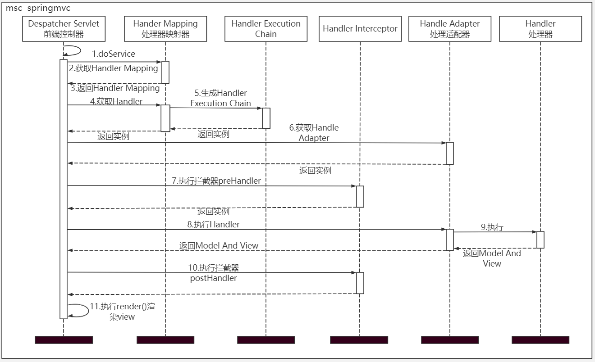
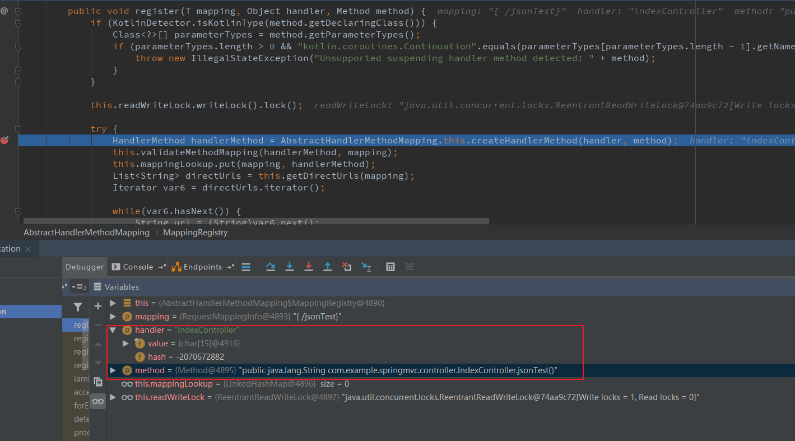

# Spring MVC


在这里学习SpringMVC的执行过程，了解其设计的思路和可扩展的地方。在这里记录的内容比较少，更推荐大家去阅读文末的推荐阅读文章，写的很详细明了。


## 简单的执行流程



## DispatcherServlet

### doService

```java
    protected void doService(HttpServletRequest request, HttpServletResponse response) throws Exception {
        this.logRequest(request);
        Map<String, Object> attributesSnapshot = null;
        if (WebUtils.isIncludeRequest(request)) {
            attributesSnapshot = new HashMap();
            Enumeration attrNames = request.getAttributeNames();

            label95:
            while(true) {
                String attrName;
                do {
                    if (!attrNames.hasMoreElements()) {
                        break label95;
                    }

                    attrName = (String)attrNames.nextElement();
                } while(!this.cleanupAfterInclude && !attrName.startsWith("org.springframework.web.servlet"));

                attributesSnapshot.put(attrName, request.getAttribute(attrName));
            }
        }

        request.setAttribute(WEB_APPLICATION_CONTEXT_ATTRIBUTE, this.getWebApplicationContext());
        request.setAttribute(LOCALE_RESOLVER_ATTRIBUTE, this.localeResolver);
        request.setAttribute(THEME_RESOLVER_ATTRIBUTE, this.themeResolver);
        request.setAttribute(THEME_SOURCE_ATTRIBUTE, this.getThemeSource());
        if (this.flashMapManager != null) {
            FlashMap inputFlashMap = this.flashMapManager.retrieveAndUpdate(request, response);
            if (inputFlashMap != null) {
                request.setAttribute(INPUT_FLASH_MAP_ATTRIBUTE, Collections.unmodifiableMap(inputFlashMap));
            }

            request.setAttribute(OUTPUT_FLASH_MAP_ATTRIBUTE, new FlashMap());
            request.setAttribute(FLASH_MAP_MANAGER_ATTRIBUTE, this.flashMapManager);
        }

        try {
            this.doDispatch(request, response);
        } finally {
            if (!WebAsyncUtils.getAsyncManager(request).isConcurrentHandlingStarted() && attributesSnapshot != null) {
                this.restoreAttributesAfterInclude(request, attributesSnapshot);
            }

        }

    }
```

### doDispatch

这里是重点地方，整个大体的执行流程都在这里了。

```java
    protected void doDispatch(HttpServletRequest request, HttpServletResponse response) throws Exception {
        HttpServletRequest processedRequest = request;
        HandlerExecutionChain mappedHandler = null;
        boolean multipartRequestParsed = false;
        WebAsyncManager asyncManager = WebAsyncUtils.getAsyncManager(request);

        try {
            try {
                ModelAndView mv = null;
                Object dispatchException = null;

                try {
                    processedRequest = this.checkMultipart(request);
                    multipartRequestParsed = processedRequest != request;
                    // 1.获取对应的处理器映射器，并包装到HandlerExecutionChain
                    mappedHandler = this.getHandler(processedRequest);
                    if (mappedHandler == null) {
                        this.noHandlerFound(processedRequest, response);
                        return;
                    }
                    // 2.获取最佳匹配的HandlerInterceptor
                    // HandlerAdapter处理器适配器
                    HandlerAdapter ha = this.getHandlerAdapter(mappedHandler.getHandler());
                    String method = request.getMethod();
                    boolean isGet = "GET".equals(method);
                    if (isGet || "HEAD".equals(method)) {
                        long lastModified = ha.getLastModified(request, mappedHandler.getHandler());
                        if ((new ServletWebRequest(request, response)).checkNotModified(lastModified) && isGet) {
                            return;
                        }
                    }
                    //3.执行调用反射前HandlerInterceptor集合中每个元素的preHandle
                    if (!mappedHandler.applyPreHandle(processedRequest, response)) {
                        return;
                    }
                    // 4.反射执行处理
                    mv = ha.handle(processedRequest, response, mappedHandler.getHandler());
                    if (asyncManager.isConcurrentHandlingStarted()) {
                        return;
                    }
                    // 5.设置viewName
                    this.applyDefaultViewName(processedRequest, mv);
                    // 6.执行调用反射后HandlerInterceptor集合中每个元素的postHandle
                    mappedHandler.applyPostHandle(processedRequest, response, mv);
                } catch (Exception var20) {
                    dispatchException = var20;
                } catch (Throwable var21) {
                    dispatchException = new NestedServletException("Handler dispatch failed", var21);
                }
                // 7.渲染视图view，并输出
                this.processDispatchResult(processedRequest, response, mappedHandler, mv, (Exception)dispatchException);
            } catch (Exception var22) {
                this.triggerAfterCompletion(processedRequest, response, mappedHandler, var22);
            } catch (Throwable var23) {
                this.triggerAfterCompletion(processedRequest, response, mappedHandler, new NestedServletException("Handler processing failed", var23));
            }

        } finally {
            if (asyncManager.isConcurrentHandlingStarted()) {
                if (mappedHandler != null) {
                    mappedHandler.applyAfterConcurrentHandlingStarted(processedRequest, response);
                }
            } else if (multipartRequestParsed) {
                this.cleanupMultipart(processedRequest);
            }

        }
    }
```

### MappingRegistry的初始化

HandlerMethod和Handler

```java
 public void register(T mapping, Object handler, Method method) {
            if (KotlinDetector.isKotlinType(method.getDeclaringClass())) {
                Class<?>[] parameterTypes = method.getParameterTypes();
                if (parameterTypes.length > 0 && "kotlin.coroutines.Continuation".equals(parameterTypes[parameterTypes.length - 1].getName())) {
                    throw new IllegalStateException("Unsupported suspending handler method detected: " + method);
                }
            }

            this.readWriteLock.writeLock().lock();

            try {
                HandlerMethod handlerMethod = AbstractHandlerMethodMapping.this.createHandlerMethod(handler, method);
                this.validateMethodMapping(handlerMethod, mapping);
                this.mappingLookup.put(mapping, handlerMethod);
                List<String> directUrls = this.getDirectUrls(mapping);
                Iterator var6 = directUrls.iterator();

                while(var6.hasNext()) {
                    String url = (String)var6.next();
                    this.urlLookup.add(url, mapping);
                }

                String name = null;
                if (AbstractHandlerMethodMapping.this.getNamingStrategy() != null) {
                    name = AbstractHandlerMethodMapping.this.getNamingStrategy().getName(handlerMethod, mapping);
                    this.addMappingName(name, handlerMethod);
                }

                CorsConfiguration corsConfig = AbstractHandlerMethodMapping.this.initCorsConfiguration(handler, method, mapping);
                if (corsConfig != null) {
                    this.corsLookup.put(handlerMethod, corsConfig);
                }

                this.registry.put(mapping, new AbstractHandlerMethodMapping.MappingRegistration(mapping, handlerMethod, directUrls, name));
            } finally {
                this.readWriteLock.writeLock().unlock();
            }

        }
```



在这里可以看到一个HandlerMethod的生成就是通过Handler(Controller)和Method(Controller下对应的方法)生成的。


## 简单总结

在这里也简单总结一下， DispatcherServlet是总的控制器，在请求时，会遍历去寻找合适的HandlerMethod或Handle。

```
private List<HandlerMapping> handlerMappings;
初始化可阅读：org.springframework.web.servlet.DispatcherServlet#initHandlerMappings
```

如果匹配到多个则会报错。


另外这里用到了拦截器链，因此我们可以注入拦截器，从而实现一些扩展。在执行前会调用preHandle，在执行后会postHandle方法。如果你阅读过Mybatis的源码，你会发现Mybatis中拦截器也是用到了这一种设计，这其实是很常见的一种设计。


最后就是调用render方法渲染视图view，并输出。


## 推荐阅读

[深入分析Spring MVC](https://blog.csdn.net/qq_20597727/article/details/82292481)