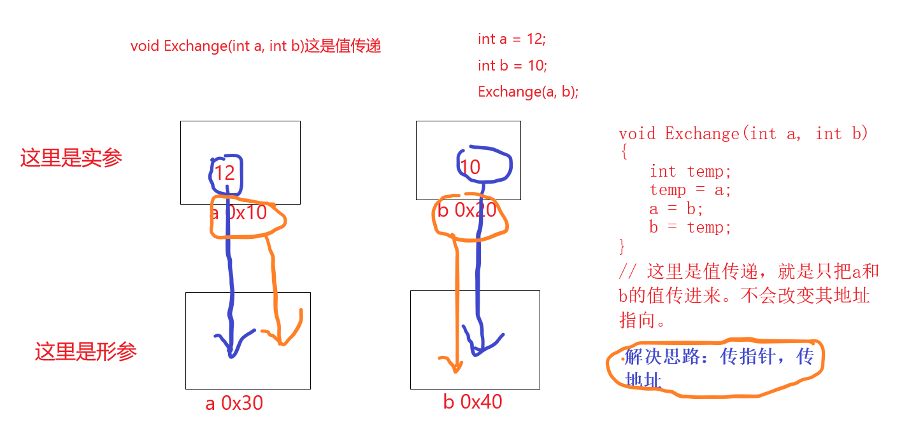

# 第五章-函数和函数指针

这里的函数跟数学中的函数很像，比如x+y = z。那么这里x和y就相当于函数的形参，z就相当于我们的返回值。

### 无参无返回函数

在标准C语言中，函数没参数要写个void。void表示不支持任何类型参数，没写代表参数不确定。


### 函数名就是函数的地址

我们知道数组名其实就是数组的首元素的首地址，其实这里函数名也是一样。那么我们怎么测试呢？可以看看下面，我也是后来才知道原来函数还有这么多好玩的东西。
```c
//int* fun(char ch, long* lg);
//int main(void)
//{
//  // 函数指针
//   int* (*p)(char, long*) = fun == &amp;fun; // 函数名就是函数的地址
//   p('a', NULL); // 我们就可以这样直接调用函数了。
//
//  system("pause");
//  return 0;
//}
```


### 传值和传地址

<strong>传值</strong>
```c
    // 传值
    void Exchange1(int a, int b)
    {
        // 这里传入的是实参的值，那这里a变量装的就是值，我们操作是形参。
        int temp;
        temp = a;
        a = b;
        b = temp;
        printf("函数里传值后：%d, %d\n", a, b);
        printf("函数里传值后：%p, %p\n", &amp;a, &amp;b);
    }
```

<strong>传地址</strong>
```c
// 传地址
void Exchange2(int* a, int* b)
{
    // 这里传入的是实参的地址，那这里a变量装的是地址，我们通过形参间接操作实参。
    int temp;
    temp = *a;
    *a = *b;
    *b = temp;
    printf("函数里传址后：%p, %p\n", a, b);
    printf("函数里传址后：%d, %d\n", *a, *b);
    printf("函数里传址后：%p, %p\n", &amp;a, &amp;b); 
}
```


形参和实参：
1.形参在函数未调用时是不占用内存中的存储单元的。<strong>只有在发生调用函数时，函数的形参才被分配内存单元，函数结束后形参所占的内存单元会被释放</strong>
2.在函数调用时，会将实参的值赋给形参。
3.实参与形参类型应相同。
4.实参与参数之间是单项传递，只能由实参传递给形参，而不能由形参传回来给实参。


### return的意义

<ol>
<li>返回数据类型</li>
<li>结束所在函数
我记得有个问题是如何结束一个多层循环，那么有时候我们就可以通过return结束函数来结束多层循环，这里有很多方法，我们到时就按照自己的需求来用。比如：还可以用标签，goto这些，或者设置一个flag在循环的控制条件里。</li>
</ol>