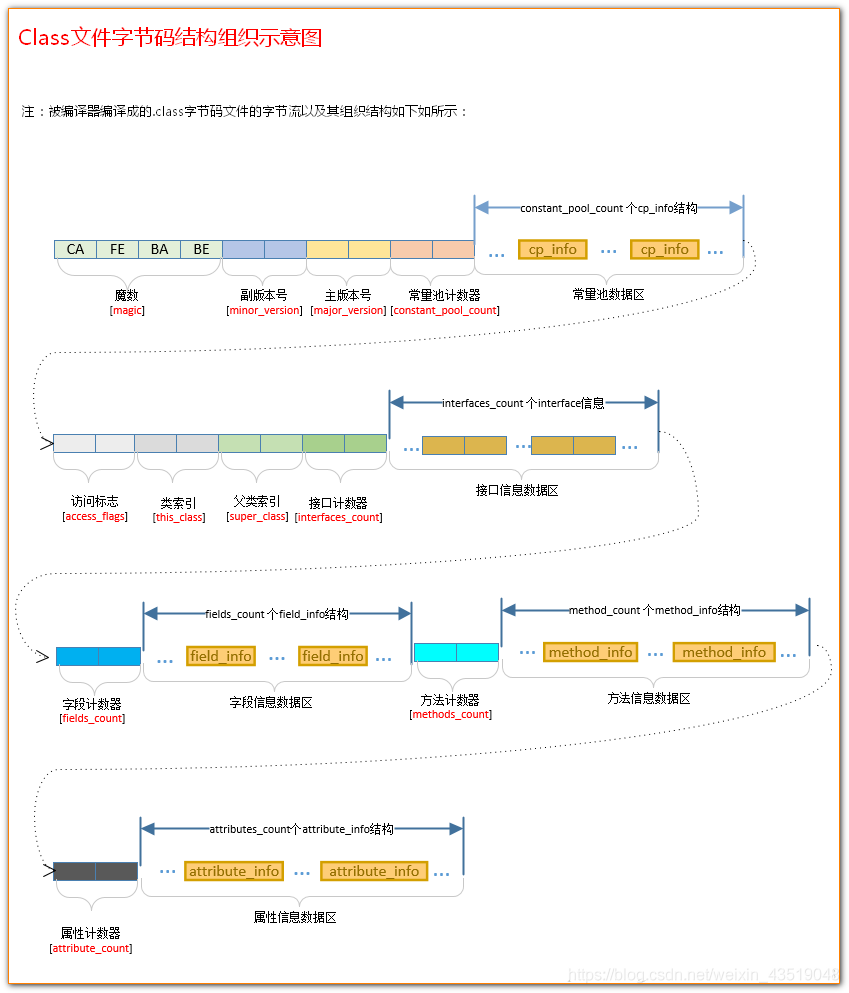
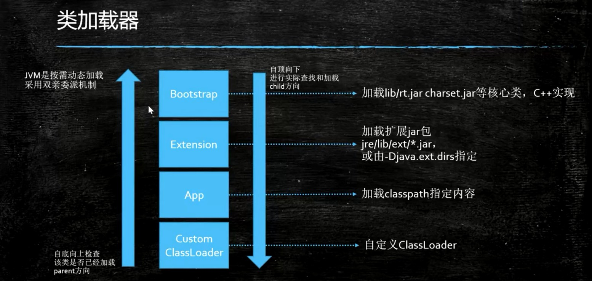
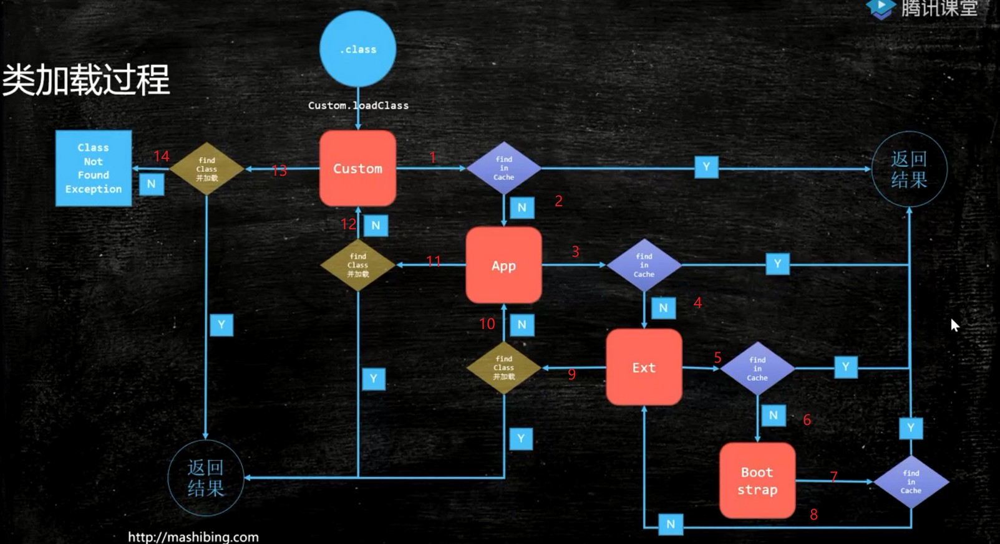

# JVM - 基本概念

https://docs.oracle.com/javase/8/docs/technotes/guides/vm/gctuning/index.html

## 基本概念

首先从Java编码到执行的一个过程开始：

- 首先是java文件经过javac之后编译成*.class
- 然后通过java命令，加载ClassLoader（同时也会加载相应的Java类库，例如String、HashMap、Object等）
- 接着，交给字节码解释器或JIT即时编译器处理
- 然后交给执行引擎，最后交给操作系统OS硬件处理。


### JVM

JVM：Java虚拟机（Java Virtual Machine）JVM是一种规范，JVM与Java无关，只跟class有关。

将class文件 加载——>验证——>准备——>解释——>初始化，最后执行的过程，这一部分便统称为Java虚拟机。


注意：Java是一门跨平台的语言，而JVM则是跨语言的平台

原因：**JVM与Java无关，只跟class有关**，任何语言只要能编译成class文件，就能在JVM上执行。

任何语言——>class文件——>JVM


## Class File Format

Class文件是一组以8位字节为基础单位的二进制流，Class文件中**包含了Java虚拟机指令集和符号表以及若干其他辅助信息**。因此我们需了解Class文件的结构内容，研究一下其设计。


### classfile结构

https://blog.csdn.net/weixin_43519048/article/details/104448697

Class文件格式采用一种类似于C语言结构体的**伪结构**来存储数据，这种伪结构中只有两种数据类型：无符号数和表

- 无符号u\*：u1、u2、u4、u8分别代表1个字节、2个字节、4个字节和8个字节的无符号数

- 表\*_info:  表示的是表。表是由多个无符号数或者其他表构成的复合数据类型，用于描述层次关系

```java
ClassFile {

    u4             magic; //Class 文件的标志
    u2             minor_version;//Class 的小版本号
    u2             major_version;//Class 的大版本号
    u2             constant_pool_count;//常量池的数量
    cp_info        constant_pool[constant_pool_count-1];//常量池
    u2             access_flags;//Class 的访问标记
    u2             this_class;//当前类
    u2             super_class;//父类
    u2             interfaces_count;//接口
    u2             interfaces[interfaces_count];//一个类可以实现多个接口
    u2             fields_count;//Class 文件的字段属性
    field_info     fields[fields_count];//一个类会可以有个字段
    u2             methods_count;//Class 文件的方法数量
    method_info    methods[methods_count];//一个类可以有个多个方法
    u2             attributes_count;//此类的属性表中的属性数
    attribute_info attributes[attributes_count];//属性表集合
}
```


#### magic

魔数。确定Class文件类型，是否是Class文件。

Class文件的头四个字节存储，例如：class的是：CA FE BA BE （咖啡宝贝）


#### minor_version、major_version

class文件版本：前两个字节存主版本号，后两个字节存此版本号。


#### constant_pool_count、constant_pool[constant_pool_count-1]

常量池数量，两个字节存储。主要存放两大常量：**字面量**和**符号引用**。

- 字面量比较接近于 Java 语言层面的的常量概念，如文本字符串、声明为 final 的常量值等。
- 符号引用则属于编译原理方面的概念,包括下面三类常量：

1. 类和接口的全限定名
2. 字段的名称和描述符
3. 方法的名称和描述符

注：常量池的数量是 constant_pool_count-1(常量池计数器是从1开始计数的，将第0项常量空出来是有特殊考虑的，**索引值为0代表“不引用任何一个常量池项”**）


#### access_flags

访问标志 ：标志⽤于识别⼀些类或者接⼝层次的访问信息

包括：这个 Class 是类还是接⼝，是否为 public 或者 abstract 类型，如果是类的话是否声明为 final 等等。


#### this_class、super_class、interfaces_count、interfaces[interfaces_count]

this_class：当前类索引

super_class：父类索引。除了 java.lang.Object 外，所有 Java 类的⽗类索引都不为 0

interfaces_count：接⼝索引集合


#### fields_count、fields[fields_count]

字段表集合：描述接口或者类中声明的变量


#### methods_count、methods[methods_count]

⽅法表集合 ：类中的⽅法


#### attributes_count、attributes[attributes_count]

属性表集合 ： 在 Class ⽂件，字段表，⽅法表中都可以携带⾃⼰的属性表集合


#### 示例

将class文件以十六进制打开

```
  Offset: 00 01 02 03 04 05 06 07 08 09 0A 0B 0C 0D 0E 0F 	
00000000: CA FE BA BE 00 00 00 34 00 0D 0A 00 03 00 0A 07    J~:>...4........
00000010: 00 0B 07 00 0C 01 00 06 3C 69 6E 69 74 3E 01 00    ........<init>..
00000020: 03 28 29 56 01 00 04 43 6F 64 65 01 00 0F 4C 69    .()V...Code...Li
00000030: 6E 65 4E 75 6D 62 65 72 54 61 62 6C 65 01 00 0A    neNumberTable...
00000040: 53 6F 75 72 63 65 46 69 6C 65 01 00 11 4A 56 4D    SourceFile...JVM
00000050: 5F 42 79 74 65 43 6F 64 65 2E 6A 61 76 61 0C 00    _ByteCode.java..
00000060: 04 00 05 01 00 18 63 6F 6D 2F 65 78 61 6D 70 6C    ......com/exampl
00000070: 65 2F 4A 56 4D 5F 42 79 74 65 43 6F 64 65 01 00    e/JVM_ByteCode..
00000080: 10 6A 61 76 61 2F 6C 61 6E 67 2F 4F 62 6A 65 63    .java/lang/Objec
00000090: 74 00 21 00 02 00 03 00 00 00 00 00 01 00 01 00    t.!.............
000000a0: 04 00 05 00 01 00 06 00 00 00 1D 00 01 00 01 00    ................
000000b0: 00 00 05 2A B7 00 01 B1 00 00 00 01 00 07 00 00    ...*7..1........
000000c0: 00 06 00 01 00 00 00 03 00 01 00 08 00 00 00 02    ................
000000d0: 00 09                                              ..
```



### 查看字节码ByteCode

#### javap

查看字节码，第一种方式可以使用Java自带的javap命令。

可以用直接输入javap，查看可选参数。常用的是：javap -v *.class    （注：-v输出附加信息)

```txt
C:\Users\AkaneMurakawa>javap
用法: javap <options> <classes>
其中, 可能的选项包括:
  -help  --help  -?        输出此用法消息
  -version                 版本信息
  -v  -verbose             输出附加信息
  -l                       输出行号和本地变量表
  -public                  仅显示公共类和成员
  -protected               显示受保护的/公共类和成员
  -package                 显示程序包/受保护的/公共类
                           和成员 (默认)
  -p  -private             显示所有类和成员
  -c                       对代码进行反汇编
  -s                       输出内部类型签名
  -sysinfo                 显示正在处理的类的
                           系统信息 (路径, 大小, 日期, MD5 散列)
  -constants               显示最终常量
  -classpath <path>        指定查找用户类文件的位置
  -cp <path>               指定查找用户类文件的位置
  -bootclasspath <path>    覆盖引导类文件的位置
```


#### IDEA插件-JclassLib

第二种方式可以使用IDEA的插件工具`jclasslib Bytecode Viewer`，更详细和方便阅读，推荐使用

https://plugins.jetbrains.com/plugin/9248-jclasslib-bytecode-viewer


## Class加载过程

前面介绍了Java编码到执行的一个过程开始，那现在就先来看看类加载的过程。

类加载过程：

1. Loading加载（双亲委派机制，懒加载：需要再加载）
2. Linking连接
   1. Verification验证 (验证文件是否符合JVM规定)
   2. Preparation准备 (例如：给静态变量赋**默认值**0)
   3. resolution解析 (将类、方法、属性等符合应用解析为直接引用。常量池中的各种符合引用解析为指针、偏移量等内存地址的直接引用)
3. initializing初始化 (静态变量赋值为初始值)


类加载过程：**加载**——>连接——>初始化。连接过程⼜可分为三步:验证——>准备——>解析

**加载**——>验证——>准备——>解析——>**初始化**


## 类加载器

当class被load到内存时，其实做了两件事情：一件是将在内存中分配给一块内存给class文件，另一件是生成了一个class对象，并指向了前面分配的地址。

```sequence
class load-->class文件:
class对象-->class文件:
```


### 有哪些类加载器?

 JVM 中内置了三个重要的 ClassLoader，除了 BootstrapClassLoader 其他类加载器均由 Java 实现且 全部继承⾃ java.lang.ClassLoader ： 

1. **BootstrapClassLoader**(启动类加载器) ：最顶层的加载类，由C++实现，负责加载 %JAVA_HOME%/**lib** ⽬录下的jar包和类或者或被 -Xbootclasspath 参数指定的路径中的所有类。 
2. **ExtensionClassLoader**(扩展类加载器) ：主要负责加载⽬录 %JRE_HOME%/lib/ext ⽬录下 的jar包和类，或被 java.ext.dirs 系统变量所指定的路径下的jar包。 
3. **AppClassLoader**(应⽤程序类加载器) :⾯向我们⽤户的加载器，负责加载当前应⽤**classpath**下 的所有jar包和类。
4. 自定义加载器



示例：

```java
public class ClassLoaderDemo {

    public static void main(String[] args) {
        System.out.println("ClassLodarDemo's ClassLoader is " + ClassLoaderDemo.class.getClassLoader());
        System.out.println("The Parent of ClassLodarDemo's ClassLoader is " + ClassLoaderDemo.class.getClassLoader().getParent());
        // 当⽗类加载器为null时，表示的是启动类加载器是BootstrapClassLoader作为⽗类加载器
        // 由于BootstrapClassLoader 是由C++实现，在Java中访问是没有直接的class和其对应，因此最后为null
        System.out.println("The GrandParent of ClassLodarDemo's ClassLoader is " + ClassLoaderDemo.class.getClassLoader().getParent().getParent());
    }
}
```

结果：

```
ClassLodarDemo's ClassLoader is sun.misc.Launcher$AppClassLoader@18b4aac2
The Parent of ClassLodarDemo's ClassLoader is sun.misc.Launcher$ExtClassLoader@6e3c1e69
The GrandParent of ClassLodarDemo's ClassLoader is null
```

AppClassLoader 的⽗类加载器为 ExtClassLoader ExtClassLoader 的⽗类加载器为null，null 并不代表 ExtClassLoader 没有⽗类加载器，⽽是 Bootstrap ClassLoader 。

从结果上来看，AppClassLoader和ExtClassLoader其实是Launcher的一个内部类。查看其源码发现就是在 System.getProperty()获取需要加载的类范围。

```java
public class Launcher {
    private static URLStreamHandlerFactory factory = new Launcher.Factory();
    private static Launcher launcher = new Launcher();
    // 类加载器范围
    private static String bootClassPath = System.getProperty("sun.boot.class.path");
    
	static class AppClassLoader extends URLClassLoader {
        final URLClassPath ucp = SharedSecrets.getJavaNetAccess().getURLClassPath(this);

        public static ClassLoader getAppClassLoader(final ClassLoader var0) throws IOException {
            // 类加载器范围
            final String var1 = System.getProperty("java.class.path");
```


### 双亲委派机制

每个类都有一个对应它的类加载器，每个类加载器都有自己的缓存。


双亲委派模型：其实是一个由子到父，由父到子的一个过程

在类加载的时候，如果有**自定义类加载器**，会先从自定义类加载器缓存中开始查找。

找到已经被加载的类则直接返回。

找不到，委派给父类加载器的loadClass查找，**AppClassLoader、ExtensionClassLoader、BootstrapClassLoader**

如果父类加载器都没找到，开始自顶向下进行查找和加载。

注：由子到父是一个查找过程，由父到子是一个查找和加载的过程。


注：网上的文章有些说的很模糊，下面是详细的过程。双亲委派模型主要分两个步骤：先查找——后查找和加载

- 自底向上**检查**（从缓冲中）该类是否加载。
- 如果找不到，自顶向下**查找和加载**。




### 为什么需要双亲委派机制？

- 为了安全，保证核心`.class`不能被篡改。如果没有双亲委派机制，那我们就可以自定义类加载器，如：自定义一个java.lang.String类加载器，当客户输入账号密码时候就会存到String中，没有双亲委派机制防止的话，就可以随便拿到客户的信息。
- 次要作用，保证每个类只需加载一次。


### 自定义类加载器

继承 ClassLoader，实现相应的方法即可

场景：

- JRebel**热部署**中需重新load class，Tomcat或Spring中都有相应的场景。
- 加密class文件，防止反编译。

https://www.cnblogs.com/szlbm/p/5504631.html


**如何打破不想⽤双亲委派模型？**

了解双亲委派模型，我们很容易就能想明白，我们可以⾃⼰定义⼀个类加载器，继承 ClassLoader，然后重载 loadClass() 即可。

1. 如果想打破双亲委派模型，那么就重写整个loadClass方法。场景：热部署，osgi tomcat都有自己的模块指定classloader（可以加载同一类库的不同版本）

2. 如果不想打破双亲委派模型，那么只需要重写**findClass**方法即可


ClassLoader源码分析

下面源码分析中体现的就是双亲委派机制

```java
 protected Class<?> loadClass(String name, boolean resolve)
        throws ClassNotFoundException
    {
        synchronized (getClassLoadingLock(name)) {
            // First, check if the class has already been loaded
            // 查找
            Class<?> c = findLoadedClass(name);
            if (c == null) {
                long t0 = System.nanoTime();
                try {
                    if (parent != null) {
                        // 调用父类的loadClass（递归）
                        c = parent.loadClass(name, false);
                    } else {
                        c = findBootstrapClassOrNull(name);
                    }
                } catch (ClassNotFoundException e) {
                    // ClassNotFoundException thrown if class not found
                    // from the non-null parent class loader
                }

                if (c == null) {
                    // If still not found, then invoke findClass in order
                    // to find the class.
                    long t1 = System.nanoTime();
                    // 如果父类都找不到，就调用findClass, 加载
                    c = findClass(name);

                    // this is the defining class loader; record the stats
                    sun.misc.PerfCounter.getParentDelegationTime().addTime(t1 - t0);
                    sun.misc.PerfCounter.getFindClassTime().addElapsedTimeFrom(t1);
                    sun.misc.PerfCounter.getFindClasses().increment();
                }
            }
            if (resolve) {
                resolveClass(c);
            }
            return c;
        }
    }
```


### 自定义类加载器示例

```java
public class Hello {

    public void say(){
        System.out.println("Hello");
    }
}
// -------------------------------------------------------------------------------------------------------------------
/**
 * 自定义类加载器
 */
public class CustomerClassLoader extends ClassLoader{ 
    
    public CustomerClassLoader() {
    }

    /**
     * 自定义父类
     * @param parent
     */
    public CustomerClassLoader(ClassLoader parent) {
        super(parent);
    }

    @Override
    protected Class<?> findClass(String name) throws ClassNotFoundException {
        File f = new File("D:\\project\\akane-note-collection\\jvm-note\\src\\main\\java\\", name.replace(".", "/").concat(".class"));
        FileInputStream fis = null;
        ByteArrayOutputStream baos = null;
        try {
            fis = new FileInputStream(f);
            baos = new ByteArrayOutputStream();
            int b = 0;

            while ((b=fis.read()) != 0){
                baos.write(b);
            }
            byte[] bytes = baos.toByteArray();
            // 调用内部的一个方法
            return defineClass(name, bytes, 0, bytes.length);
        }catch (Exception e){
        }finally {
            if (baos != null){
                try {
                    baos.close();
                } catch (IOException e) {
                    e.printStackTrace();
                }
            }
            if (fis != null){
                try {
                    fis.close();
                } catch (IOException e) {
                    e.printStackTrace();
                }
            }
        }
        return super.findClass(name);
    }

//    @Override
//    protected Class<?> loadClass(String name, boolean resolve) throws ClassNotFoundException {
//        return super.loadClass(name, resolve);
//    }

    public static void main(String[] args) throws Exception{
        CustomerClassLoader classLoader = new CustomerClassLoader();
        Class<?> loadClass = classLoader.loadClass("com.example.Hello");
        Hello instance = (Hello)loadClass.newInstance();
        instance.say();

        System.out.println(classLoader.getClass().getClassLoader());
        System.out.println(classLoader.getParent());
    }
}
```


结果：

```
Hello
sun.misc.Launcher$AppClassLoader@18b4aac2
sun.misc.Launcher$AppClassLoader@18b4aac2
```


### 类的加载方式

- 隐式加载：new
- 显示加载：loadClass、forName等


### loadClass和forName的区别

- Class.forName得到的class是已经初始化完成的
- ClassLoader.loadClass得到的class是还没有链接的

源码分析：

```
   // initialize：true 
   public static Class<?> forName(String className)
                throws ClassNotFoundException {
        Class<?> caller = Reflection.getCallerClass();
        return forName0(className, true, ClassLoader.getClassLoader(caller), caller);
    }
    
    // ----------------------------------------
    java.lang.ClassLoader#loadClass(java.lang.String, boolean)
    // resolve: 是否链接，详细见前面的class的加载过程
    if (resolve) {
    	resolveClass(c);
    }
```


### 类加载执行的两种方式

- 编译执行

- 解释执行


## 面试题

类的解析过程（注：一般都不会这样写代码，纯属面试造火箭）

```java
public class ClassLoadingProcedure {

    public static void main(String[] args) {
        System.out.println(T.count);
    }
}

class T{
    //3
//    public static int count = 2;
//    public static T t = new T();

    //2
    public static T t = new T();
    public static int count = 2;

    private T(){
        count++;
        System.out.println("---" + count);
    }
}
```

