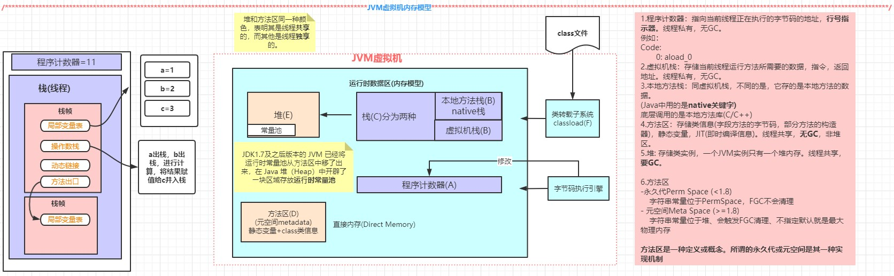

# JVM-运行时数据区和常用指令

## 面试题

```java
public class TestPlus {

    public static void main(String[] args) {
        int i = 1;
//        i = i++; // 1
        i = ++i; // 2
        System.out.println(i);
    }
}
```


## 运行时数据区

1. 程序计数器 Program Counter ： 存放指令位置
2. 堆Heap
3. 本地方法栈 native method stacks
4. 虚拟机栈 JVM stacks
5. 直接内存 Direct Memory (JVM可以直接访问的内核空间的内存，提高效率，实现零拷贝)
6. 方法区（**方法区是一种定义或概念。所谓的永久代或元空间是其一种实现机制**）

共享区域：堆、方法区


### 栈

栈里面的是栈帧，一个方法对应一个栈帧，栈帧包含以下内容：

1. 局部变量表
2. 操作数栈
3. 动态链接
4. 返回地址（或叫方法出口）


基于栈的指令集

基于寄存器的指令集


### 常见字节码指令

\<clinit\>

\<init\>

iload入栈

istore出栈

invoke_xxxx

1. InvokeStatic 静态方法

 	2. InvokeVirtual 多态
 	3. InvokeInterface  例如：List<String> list = new ArrrayList<String>(); list.add()
 	4. InvokeSpecial 可以直接定位的，不需要多态的方法，例如：构造方法、private方法
 	5. InvokeDynamic 由于lambda表达式或反射，动态语言，动态产生class


示例：

````java
public class JVM_ByteCode {


    public static void main(String[] args) {
        JVM_ByteCode jvm_byteCode = new JVM_ByteCode();
        jvm_byteCode.sum(10);
    }

    public int sum(int i){
        return i + 1;
    }
}

````

字节码

```


Classfile /D:/project/akane-note-collection/jvm-note/src/main/java/com/example/JVM_ByteCode.class
  Last modified 2020-11-19; size 374 bytes
  MD5 checksum 5b49e4a0411ba7182782d70442175867
  Compiled from "JVM_ByteCode.java"
public class com.example.JVM_ByteCode
  minor version: 0
  major version: 52
  flags: ACC_PUBLIC, ACC_SUPER
Constant pool:
   #1 = Methodref          #5.#16         // java/lang/Object."<init>":()V
   #2 = Class              #17            // com/example/JVM_ByteCode
   #3 = Methodref          #2.#16         // com/example/JVM_ByteCode."<init>":()V
   #4 = Methodref          #2.#18         // com/example/JVM_ByteCode.sum:(I)I
   #5 = Class              #19            // java/lang/Object
   #6 = Utf8               <init>
   #7 = Utf8               ()V
   #8 = Utf8               Code
   #9 = Utf8               LineNumberTable
  #10 = Utf8               main
  #11 = Utf8               ([Ljava/lang/String;)V
  #12 = Utf8               sum
  #13 = Utf8               (I)I
  #14 = Utf8               SourceFile
  #15 = Utf8               JVM_ByteCode.java
  #16 = NameAndType        #6:#7          // "<init>":()V
  #17 = Utf8               com/example/JVM_ByteCode
  #18 = NameAndType        #12:#13        // sum:(I)I
  #19 = Utf8               java/lang/Object
{
  public com.example.JVM_ByteCode();
    descriptor: ()V
    flags: ACC_PUBLIC
    Code:
      stack=1, locals=1, args_size=1
         0: aload_0
         1: invokespecial #1                  // Method java/lang/Object."<init>":()V
         4: return
      LineNumberTable:
        line 3: 0

  public static void main(java.lang.String[]);
    descriptor: ([Ljava/lang/String;)V
    flags: ACC_PUBLIC, ACC_STATIC
    Code:
      stack=2, locals=2, args_size=1
         0: new           #2                  // class com/example/JVM_ByteCode
         3: dup
         4: invokespecial #3                  // Method "<init>":()V
         7: astore_1
         8: aload_1
         9: bipush        10
        11: invokevirtual #4                  // Method sum:(I)I
        14: pop
        15: return
      LineNumberTable:
        line 7: 0
        line 8: 8
        line 9: 15

  public int sum(int);
    descriptor: (I)I
    flags: ACC_PUBLIC
    Code:
      stack=2, locals=2, args_size=2
         0: iload_1
         1: iconst_1
         2: iadd
         3: ireturn
      LineNumberTable:
        line 12: 0
}
SourceFile: "JVM_ByteCode.java"

```

解读（建议用IDEA的JclassLib插件查看，对应字节码命令可以直接点击查看解释）：

首先从main方法开始看，0 new分配一个堆内存空间，然后初始化默认值，然后4: invokespecial调用构造函数，压栈

astore出栈，aload_1压栈。bipush将10压栈，调用sum方法。

在sum方法中，iload_1将10压栈，iconst_1将常量1压栈，iadd将两个数弹出计算结果压栈，最后ireturn返回，并放入到栈中。

最后pop弹出，return结束。


### 方法区（MethodArea）

方法区是堆外的空间

注意：方法区是一种定义或概念。所谓的永久代或元空间是其一种实现机制。

- 永久代Perm Generation(<1.8) 

  > 字符串常量位于PermSpace，FGC不会清理

- 元空间Meta Space (>=1.8)

  > 字符串常量位于堆、会触发FGC清理。
  
  元空间不指定默认就是最大物理内存


## 运行时数据区




## 问题：为什么要将永久代(1.7 PermGeneration)替换为元空间(1.8 MetaSpace)呢?

- 永久代：固定⼤⼩上线，⽆法进⾏调整
- 元空间：使⽤的是直接内存，默认是最大物理内存unlimited，可通过 -XX： MaxMetaspaceSize设置