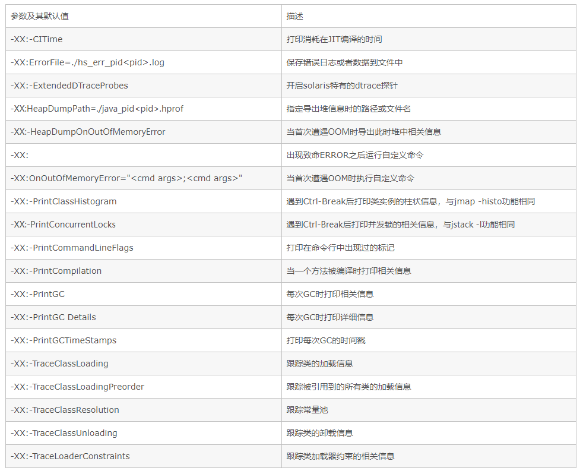

# JVM - 参数设置

## 如何设置JVM内存分配？

```
# 示例
$ java -Xms256m -Xmx256m -XX:MetaspaceSize=128m -XX:MaxMetaspaceSize=256m -XX:+HeapDumpOnOutOfMemoryError -XX:HeapDumpPath=/usr/local/xxxx.hprof" -jar xxx.jar

# 设置参数
-XX:+HeapDumpOnOutOfMemoryError
-XX:HeapDumpPath=/usr/local/xxxx.hprof -jar
-Xms1500m -Xmx1500m
-XX:MetaspaceSize=128m -XX:MaxMetaspaceSize=512m
-XX:+PrintGCDetails
```

### 分配说明

例如：`java -Xms 3072M -Xmx3072M`

表示分配的最大最小堆的大小为3G。下面来看看各个分区的分配情况：

- Young和Old默认是1：2，因此Old占2/3，也就是2G；
- Young = Eden+s0+s1，因此Yound占1/3，也就是1G;
- Eden和s0，s1为8：1：1，因此Eden占8/10，也就是800M;
- s0和s1，因此占1/10, 都是100M。

**所以增大年轻代(-Xmn)后，将会减小年老代(Xmx-Xmn)大小。此值对系统性能影响较大。**


### 参数设置说明

- -标准参数，所有HotSpot都支持，例如：-Xms，-version
- -X非标准，特定版本的HotSpot都支持，例如：
- -XX不稳定参数，下个版本可能会取消，例如：-XX:PermSize、-XX:MaxPermSize


**注：-表示去掉不适用，+表示使用，这个+-指参数前面的+-，例如：+DoEscapeAnalysis、-DoEscapeAnalysis** 

```
-XX:-EliminateAllocations  // 不使用标量替换
-XX:-DoEscapeAnalysis      // 不使用逃逸分析
-XX:-UseTLAB               // 不使用线程专有对象分配  

-XX:+DoEscapeAnalysis
```

## JVM参数主要包括三种

- 堆和栈空间设置
- 垃圾收集器设置（包括并发gc）
- 辅助配置（统计跟踪、逃逸分析)


参考

- https://docs.oracle.com/javase/8/docs/technotes/tools/unix/java.html
- [IntelliJ IDEA设置JVM运行参数](https://blog.csdn.net/sdujava2011/article/details/50086933)
- [jvm参数详解](https://blog.csdn.net/kid_2412/article/details/52633739)


### 性能优化参数说明

常用的调优参数：

- -Xms
- -Xmx
- -Xss
- -XX:MetaspaceSize
- XX:MaxMetaspaceSize
- -XX:SurvivorRatio
- XX:NewRatio
- -XX:MaxTenuringThreshold

| 参数                       | 描述                                                         |
| -------------------------- | ------------------------------------------------------------ |
| -Xms                       | **Java Heap初始值**<br />说明：最好将-Xms和-Xmx设为相同值（为了避免在运行时频繁调整Heap的大小，内存抖动） |
| -Xmx                       | **Java Heap最大值**<br />说明：默认值为物理内存的1/4最佳设值应该视物理内存大小及计算机内其他内存开销而定 |
| -Xmn                       | **Java Heap中Young区大小**<br />说明：**默认年轻代和年老代是1/3：2/3的关系。**所以增大年轻代后，将会减小**年老代**大小。此值对系统性能影响较大，Sun官方推荐配置为整个堆的3/8。 |
| -Xss                       | 规定了每个线程虚拟机栈(堆栈)                                 |
| -Xoss                      | 本地方法栈大小，对hotspot无效                                |
| XX:NewRatio                | **Young年轻代与Old老年代的比例，默认-XX:NewRatio=2**<br />说明：例如：-XX:NewRatio=4，即年轻代：年老代=1：4 |
| -XX:SurvivorRatio          | **Eden与survivor的比例，默认XX:SurvivorRatio=8**<br />说明：例如：-XX:SurvivorRatio=4，即Eden:Survivor=4:1<br />我们看JVM内存模型常看到的，Eden占新生代的8/10，From幸存区和To幸存区各占新生代的1/10 |
| -XX:MetaspaceSize          | 元空间                                                       |
| -XX:MaxMetaspaceSize       | **最大元空间**                                               |
| -XX:MaxTenuringThreshold   | **年轻代最大gc分代年龄，默认-XX:MaxTenuringThreshold=15**<br />如果超过这个阈值会直接接入老年代，如果设置为0，年轻代不经过survivor空间直接进入老年代 |
| -XX:PretenureSizeThreshold | **设置大对象直接进入老年代的阈值，默认-XX:PretenureSizeThreshold=0**<br />当大对象大小超过该值将会直接在老年代分配，默认值是0，意思是不管多大都是先在eden中分配内存 |
| -XX:TargetSurvivorRatio    | **对象动态年龄判断，默认-XX:TargetSurvivorRatio=50**<br />解释：s0 -> s1超过s1的50%，把年龄最大的放入Old。<br />当从s0、eden区放入到s1时，如果这批对象的大小超过s1的50%，则将>=这批对象年龄最大的对象，放入到Old。 |


### 垃圾收集器参数说明

| 参数及其默认值          | 描述                                                         |
| ----------------------- | ------------------------------------------------------------ |
| -XX:+UseSerialGC        | 说明**= Serial New(DefNew) + Serial Old**                    |
| -XX:+UseParNewGc        | 说明**= ParNew + Serial Old<br />**这个组合已经很少用（在某些版本中已经废弃）<br />https://stackoverflow.com/questions/34962257/why-remove-support-for-parnewserialold-anddefnewcms-in-the-future |
| -XX:+UseConcMarkSweepGC | 说明**= ParNew +CMS +Serial Old** <br />新生代使用ParNew，老年代使用CMS和Serial Old，其中老年代的Serial Old用于作为CMS失败时调用的备选gc |
| -XX:ParallelGC          | 说明**= Parallel Scavenge + Parallel Old** （1.8默认，俗称的PS+PO） |
| -XX:+UseParallelOldGC   | 说明**= Parallel Scavenge + Parallel Old**，同上             |
| XX:+UserG1GC            | 说明**= G1**，1.7开始                                        |

- **-XX:ParallelGCThread：**设置Parallel gc的垃圾PretenureSizeThreshold回收线程数，通常与cpu数量相同

- **-XX:MaxGCPauseMillis：**设置最大垃圾收集停顿时间，垃圾回收器会尽量控制回收的时间在该值范围内
- -XX:GCPauseIntervalMillis：设置停顿时间间隔
- **-XX:GCTimeRatio：**设置吞吐量大小，0~100之间的整数。若该值为n，那么jvm将会花费不超过1/(1+n)的时间用于垃圾回收。
- **-XX:+UseAdaptiveSizePolicy：**开启自适应gc策略，jvm会根据运行时吞吐量等信息自动调整eden、old等空间大小以及晋升老年代年龄
- -XX:+ParallelCMSThreads：CMS线程数量
- -XX:CMSInitiatingOccupancyFraction：设置老年代空间被使用多少后触发CMS gc，默认为68%
- -XX:CMSFullGCsBeforeCompaction：设置多少次CMS回收后，进行一次内存压缩
- -XX:+CMSClassUnloadingEnabled：在类卸载后进行CMS回收
- -XX:+CMSParallelRemarkEnabled：启用并行重标记
- -XX:CMSInitiatingPermOccupancyFraction：当永久代空间被使用多少后触发CMS gc，百分比（在使用时CMSClassUnloadingEnabled必须被配置）UseCMSInitiatingOccupancyOnly：只有当gc达到配置的阈值时才进行回收
- XX:+CMSIncrementalMode：使用增量模式，适合单CPU
- XX:+UnlockExperimentalVMOptions：允许使用实验性参数


### 行为参数说明

| 参数及其默认值            | 描述                                                      |
| ------------------------- | --------------------------------------------------------- |
| -XX:-DisableExplicitGC    | 禁止调用System.gc()；但jvm的gc仍然有效                    |
| -XX:+MaxFDLimit           | 最大化文件描述符的数量限制                                |
| -XX:+ScavengeBeforeFullGC | 新生代GC优先于Full GC执行                                 |
| -XX:+UseGCOverheadLimit   | 在抛出OOM之前限制jvm耗费在GC上的时间比例                  |
| -XX:-UseConcMarkSweepGC   | 对老生代采用并发标记交换算法进行GC                        |
| -XX:-UseParallelGC        | 启用并行GC                                                |
| -XX:-UseParallelOldGC     | 对Full GC启用并行，当-XX:-UseParallelGC启用时该项自动启用 |
| -XX:-UseSerialGC          | 启用串行GC                                                |
| -XX:+UseThreadPriorities  | 启用本地线程优先级                                        |


### 调试参数说明

常用：

- -XX:+PrintGC 每次GC时打印相关信息
- -XX:+PrintGCDetails 每次GC时打印详细信息
- -XX:+PrintFlagsInitial 默认参数值
- -XX:+PrintFlagsFinal  最终参数值，示例：`java -XX:+PrintFlagsFinal -version | grep NewSize`
- -XX:+PrintCommandLineFlags：打印在命令行中出现过的标记




### GC常用参数

- -Xmn -Xms -Xmx -Xss 年轻代 最小堆 最大堆 栈空间
- -XX:+UseTLAB 使用TLAB，默认打开
- -XX:+PrintTLAB 打印TLAB的使用情况
- -XX:TLABSize 设置TLAB大小
- -XX:+DisableExplictGC System.gc()不管用 ，FGC
- -XX:+PrintGC
- -XX:+PrintGCDetails
- -XX:+PrintHeapAtGC
- -XX:+PrintGCTimeStamps
- -XX:+PrintGCApplicationConcurrentTime (低) 打印应用程序时间
- -XX:+PrintGCApplicationStoppedTime （低） 打印暂停时长
- -XX:+PrintReferenceGC （重要性低） 记录回收了多少种不同引用类型的引用
- -verbose:class 类加载详细过程
- -XX:+PrintVMOptions
- -XX:+PrintFlagsFinal -XX:+PrintFlagsInitial 必须会用
- -Xloggc:opt/log/gc.log
- -XX:MaxTenuringThreshold 升代年龄，最大值15
- 锁自旋次数 -XX:PreBlockSpin 热点代码检测参数-XX:CompileThreshold 逃逸分析 标量替换 ... 这些不建议设置

### Parallel常用参数

- -XX:SurvivorRatio
- -XX:PreTenureSizeThreshold 大对象到底多大
- -XX:MaxTenuringThreshold
- -XX:+ParallelGCThreads 并行收集器的线程数，同样适用于CMS，一般设为和CPU核数相同
- -XX:+UseAdaptiveSizePolicy 自动选择各区大小比例

### CMS常用参数

- -XX:+UseConcMarkSweepGC
- -XX:ParallelCMSThreads CMS线程数量
- -XX:CMSInitiatingOccupancyFraction 使用多少比例的老年代后开始CMS收集，默认是68%(近似值)，如果频繁发生SerialOld卡顿，应该调小，（频繁CMS回收）
- -XX:+UseCMSCompactAtFullCollection 在FGC时进行压缩
- -XX:CMSFullGCsBeforeCompaction 多少次FGC之后进行压缩
- -XX:+CMSClassUnloadingEnabled
- -XX:CMSInitiatingPermOccupancyFraction 达到什么比例时进行Perm回收
- GCTimeRatio 设置GC时间占用程序运行时间的百分比
- -XX:MaxGCPauseMillis 停顿时间，是一个建议时间，GC会尝试用各种手段达到这个时间，比如减小年轻代

### G1常用参数

- -XX:+UseG1GC
- -XX:MaxGCPauseMillis 建议值，G1会尝试调整Young区的块数来达到这个值
- -XX:GCPauseIntervalMillis ？GC的间隔时间
- -XX:+G1HeapRegionSize 分区大小，建议逐渐增大该值，1 2 4 8 16 32。 随着size增加，垃圾的存活时间更长，GC间隔更长，但每次GC的时间也会更长 ZGC做了改进（动态区块大小）
- G1NewSizePercent 新生代最小比例，默认为5%
- G1MaxNewSizePercent 新生代最大比例，默认为60%
- GCTimeRatio GC时间建议比例，G1会根据这个值调整堆空间
- ConcGCThreads 线程数量
- InitiatingHeapOccupancyPercent 启动G1的堆空间占用比例

## IDEA优化

设置合适的参数，让IDEA不再卡顿

```
# custom IntelliJ IDEA VM options

-Xms1024m
-Xmx1024m
-XX:ReservedCodeCacheSize=240m
-XX:+UseConcMarkSweepGC
-XX:SoftRefLRUPolicyMSPerMB=50
-ea
-Dsun.io.useCanonCaches=false
-Djava.net.preferIPv4Stack=true
-Djdk.http.auth.tunneling.disabledSchemes=""
-XX:+HeapDumpOnOutOfMemoryError
-XX:-OmitStackTraceInFastThrow
```


## 查询JDK版本使用的默认回收器

`java -XX:+PrintCommandLineFlags -version`

```
C:\Users\AkaneMurakawa>java -XX:+PrintCommandLineFlags -version
-XX:InitialHeapSize=132750336 -XX:MaxHeapSize=2124005376 -XX:+PrintCommandLineFlags -XX:+UseCompressedClassPointers -XX:+UseCompressedOops -XX:-UseLargePagesIndividualAllocation -XX:+UseParallelGC
java version "1.8.0_171"
Java(TM) SE Runtime Environment (build 1.8.0_171-b11)
Java HotSpot(TM) 64-Bit Server VM (build 25.171-b11, mixed mode)
```


或 jmap -heap pid，可以看到

```
using thread-local object allocation.

Parallel GC with 8 thread(s)
```


## 查询内存分配信息

`java -XX:+PrintGCDetails -version`

```
C:\Users\AkaneMurakawa>java -XX:+PrintGCDetails -version
java version "1.8.0_171"
Java(TM) SE Runtime Environment (build 1.8.0_171-b11)
Java HotSpot(TM) 64-Bit Server VM (build 25.171-b11, mixed mode)
Heap
 PSYoungGen      total 38400K, used 2005K [0x00000000d5d00000, 0x00000000d8780000, 0x0000000100000000)
  eden space 33280K, 6% used [0x00000000d5d00000,0x00000000d5ef54b8,0x00000000d7d80000)
  from space 5120K, 0% used [0x00000000d8280000,0x00000000d8280000,0x00000000d8780000)
  to   space 5120K, 0% used [0x00000000d7d80000,0x00000000d7d80000,0x00000000d8280000)
 ParOldGen       total 87552K, used 0K [0x0000000081600000, 0x0000000086b80000, 0x00000000d5d00000)
  object space 87552K, 0% used [0x0000000081600000,0x0000000081600000,0x0000000086b80000)
 Metaspace       used 2291K, capacity 4480K, committed 4480K, reserved 1056768K
  class space    used 254K, capacity 384K, committed 384K, reserved 1048576K
```

说明：

```
eden space 33280K, 6% used [0x00000000d5d00000,0x00000000d5ef54b8,0x00000000d7d80000)
                           [起始地址，使用空间结束地址，整体空间结束地址]
```

- used：已经使用
- capacity：总容量
- committed：虚拟内存占用
- reserved：虚拟内存保留


## GC日志

### GC日志解读示例1

```
-Xms10M -Xmx10M -XX:+PrintGC
```

结果：

```
[GC (Allocation Failure)  2048K->819K(9728K), 0.0019561 secs]
[GC (Allocation Failure)  8309K->7036K(9728K), 0.0016655 secs]
[GC (Allocation Failure) -- 8060K->8068K(9728K), 0.0024159 secs]
[Full GC (Ergonomics)  8068K->7983K(9728K), 0.0102982 secs]
[GC (Allocation Failure) -- 7983K->7983K(9728K), 0.0022455 secs]
[Full GC (Allocation Failure)  7983K->7961K(9728K), 0.0107370 secs]
Exception in thread "main" java.lang.OutOfMemoryError: Java heap space
	at com.example.GCTest.main(GCTest.java:11)
```

说明：

```
[GC (Allocation Failure)  2048K->819K(9728K), 0.0019561 secs]
[Full GC (Allocation Failure)  7983K->7961K(9728K), 0.0107370 secs]

GC：表示YGC
Full GC：表示Full GC
Allocation Failure：失败原因
2048K->819K(9728K)：堆从多少 经过回收后 变成了多少
0.0019561 secs：花费时间
```


### GC日志解读示例2

```
-Xms10M -Xmx10M -XX:+PrintGCDetail
```

结果：

```
"C:\Program Files\Java\jdk1.8.0_171\bin\java.exe" -agentlib:jdwp=transport=dt_socket,address=127.0.0.1:3783,suspend=y,server=n -Xms10M -Xmx10M -XX:+PrintGCDetails -javaagent:C:\Users\AkaneMurakawa\.IntelliJIdea2018.3\system\captureAgent\debugger-agent.jar -Dfile.encoding=UTF-8 -classpath "C:\Program Files\Java\jdk1.8.0_171\jre\lib\charsets.jar;C:\Program Files\Java\jdk1.8.0_171\jre\lib\deploy.jar;C:\Program Files\Java\jdk1.8.0_171\jre\lib\ext\access-bridge-64.jar;C:\Program Files\Java\jdk1.8.0_171\jre\lib\ext\cldrdata.jar;C:\Program Files\Java\jdk1.8.0_171\jre\lib\ext\dnsns.jar;C:\Program Files\Java\jdk1.8.0_171\jre\lib\ext\jaccess.jar;C:\Program Files\Java\jdk1.8.0_171\jre\lib\ext\jfxrt.jar;C:\Program Files\Java\jdk1.8.0_171\jre\lib\ext\localedata.jar;C:\Program Files\Java\jdk1.8.0_171\jre\lib\ext\nashorn.jar;C:\Program Files\Java\jdk1.8.0_171\jre\lib\ext\sunec.jar;C:\Program Files\Java\jdk1.8.0_171\jre\lib\ext\sunjce_provider.jar;C:\Program Files\Java\jdk1.8.0_171\jre\lib\ext\sunmscapi.jar;C:\Program Files\Java\jdk1.8.0_171\jre\lib\ext\sunpkcs11.jar;C:\Program Files\Java\jdk1.8.0_171\jre\lib\ext\zipfs.jar;C:\Program Files\Java\jdk1.8.0_171\jre\lib\javaws.jar;C:\Program Files\Java\jdk1.8.0_171\jre\lib\jce.jar;C:\Program Files\Java\jdk1.8.0_171\jre\lib\jfr.jar;C:\Program Files\Java\jdk1.8.0_171\jre\lib\jfxswt.jar;C:\Program Files\Java\jdk1.8.0_171\jre\lib\jsse.jar;C:\Program Files\Java\jdk1.8.0_171\jre\lib\management-agent.jar;C:\Program Files\Java\jdk1.8.0_171\jre\lib\plugin.jar;C:\Program Files\Java\jdk1.8.0_171\jre\lib\resources.jar;C:\Program Files\Java\jdk1.8.0_171\jre\lib\rt.jar;D:\project\akane-note-collection\jvm-note\target\classes;C:\Program Files\JetBrains\IntelliJ IDEA 2018.3.4\lib\idea_rt.jar" com.example.GCTest
Connected to the target VM, address: '127.0.0.1:3783', transport: 'socket'
[GC (Allocation Failure) [PSYoungGen: 2048K->488K(2560K)] 2048K->771K(9728K), 0.0019629 secs] [Times: user=0.00 sys=0.00, real=0.00 secs] 
[GC (Allocation Failure) [PSYoungGen: 1840K->504K(2560K)] 8267K->7052K(9728K), 0.0014372 secs] [Times: user=0.00 sys=0.00, real=0.00 secs] 
[GC (Allocation Failure) --[PSYoungGen: 1528K->1528K(2560K)] 8076K->8076K(9728K), 0.0014171 secs] [Times: user=0.00 sys=0.00, real=0.00 secs] 
[Full GC (Ergonomics) [PSYoungGen: 1528K->1498K(2560K)] [ParOldGen: 6548K->6451K(7168K)] 8076K->7950K(9728K), [Metaspace: 3920K->3920K(1056768K)], 0.0083547 secs] [Times: user=0.00 sys=0.00, real=0.01 secs] 
[GC (Allocation Failure) --[PSYoungGen: 1498K->1498K(2560K)] 7950K->7958K(9728K), 0.0012897 secs] [Times: user=0.00 sys=0.00, real=0.00 secs] 
[Full GC (Allocation Failure) [PSYoungGen: 1498K->1489K(2560K)] [ParOldGen: 6459K->6439K(7168K)] 7958K->7928K(9728K), [Metaspace: 3920K->3920K(1056768K)], 0.0094684 secs] [Times: user=0.05 sys=0.00, real=0.01 secs] 
Exception in thread "main" java.lang.OutOfMemoryError: Java heap space
	at com.example.GCTest.main(GCTest.java:11)
Heap
 PSYoungGen      total 2560K, used 1612K [0x00000000ffd00000, 0x0000000100000000, 0x0000000100000000)
  eden space 2048K, 78% used [0x00000000ffd00000,0x00000000ffe93048,0x00000000fff00000)
  from space 512K, 0% used [0x00000000fff80000,0x00000000fff80000,0x0000000100000000)
  to   space 512K, 0% used [0x00000000fff00000,0x00000000fff00000,0x00000000fff80000)
 ParOldGen       total 7168K, used 6439K [0x00000000ff600000, 0x00000000ffd00000, 0x00000000ffd00000)
  object space 7168K, 89% used [0x00000000ff600000,0x00000000ffc49e90,0x00000000ffd00000)
 Metaspace       used 3950K, capacity 4628K, committed 4864K, reserved 1056768K
  class space    used 438K, capacity 464K, committed 512K, reserved 1048576K
```

说明：

```
[GC (Allocation Failure) [PSYoungGen: 2048K->488K(2560K)] 2048K->771K(9728K), 0.0019629 secs] [Times: user=0.00 sys=0.00, real=0.00 secs] 

GC：表示YGC
Full GC：表示Full GC
()里的Allocation Failure：失败原因
PSYoungGen：年轻代
1528K->1528K(2560K)：年轻代从多少 经过回收后 变成了多少，例如：这里回收了2048-488
2048K->771K(9728K)：整个堆从多少 经过回收后 变成了多少
9728K：整个堆的空间
0.0019629 secs：花费时间
ParOldGen：老年代

Times：时间
user=0.00 用户态花费时间
sys=0.00 内核花费时间
real=0.00 secs 总共花费时间
```


## 生产JVM参数设置

生产上JVM的参数设置，大多是按照过往经验 ，然后结合实际情况做调整

Xmx 和 Xms设置为老年代存活对象的3-4倍，即FullGC之后的老年代内存占用的3-4倍

```
$ java -Xms256m -Xmx256m -XX:MetaspaceSize=128m -XX:MaxMetaspaceSize=256m -XX:+HeapDumpOnOutOfMemoryError -XX:HeapDumpPath=/usr/local/xxxx.hprof" -jar xxx.jar
```


经验

```
cn-eu-gateway：-Xms1024m -Xmx2048m

cn-order-web：2048m

cn-order-receiver：1500m or 1000m

cn-order-provider：2048m

cn-order-provider-consumer：2048m

cn-mdata-provider：2048m

cn-dispatch-worker：2048m

eu-wms-web：1500m

eu-wms-provider-consumer：2048m

eu-wms-biz-consumer：2048m

eu-warehouse：1500m
```


