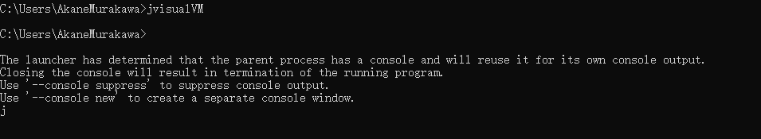

#  JVM - 工具

在这里介绍一下JVM调优会使用的一些工具。


## Java平台的结构图

可以从图中看到javap就是我们是jdk自带的tool


## top

https://www.linuxidc.com/Linux/2016-08/133871.htm

https://wangchujiang.com/linux-command/c/top.html

**命令：top**

定位耗时高的进程


从图中来看，PID为36328的占用资源高

如果垃圾回收活动过于频繁，占用了较高的 CPU 资源，可能是由内存不足或者是新生代和旧生代分配不合理导致的等。


**命令：top -d 5**

https://cloud.tencent.com/developer/article/1354695

当然直接用top显示太快了，可以用-d参数设置刷新时间。

-d：（Delay time）改变显示的更新速度，单位s。【或是在交互式指令列( interactive command)按 d或s，然后输入对应的数字。】

-n：（Number-of-iterations）设置更新次数


**命令：top -Hp pid** 

观察**进程中的线程**，哪个线程CPU和内存占比高

H：（Threads mode）设置线程模式

-p：(Monitor-PIDs mode) 指定进程，显示进程信息


## JDK自带工具

更多工具见java安装目录下的**/bin/**，如果是linux环境，可以用命令`ll $JAVA_HOME/bin`查看

例如：jvisualvm、jconsole、jps、jstack


### jconsole

**命令：jconsole**

监控JVM，线上基本不用，而是在测试监控时候用。线上一般用arthas


###  jvisualvm

**命令：jvisualvm**

jvisualvm：JDK自带的JVM工具，这个工具可以查看一些内存和CPU信息，系统配置，当然从图中也可以了解JVM堆内存模型



输入以上命令，则会自动打开该工具，从图中左侧栏目可以看到当前运行的一些线程。**应用程序-本地**


**可能你打开的时候看不到图中Visual GC这个菜单，这是因为Java VisualVM默认没有安装Visual GC插件，需要手动安装**

参考：[Java程序性能分析工具Java VisualVM（Visual GC）—程序员必备利器](https://www.cnblogs.com/linghu-java/p/5689227.html)


### javap

**命令：javap -v xxx.class**

java自带的反编译工具

从图中可以看到Code下面的数字就是程序计数器，用于了解Java是如何解释工作的


可以用直接输入javap，查看可选参数。常用的是：**javap -v *.class**    （注：-v输出附加信息)

```txt
C:\Users\AkaneMurakawa>javap
用法: javap <options> <classes>
其中, 可能的选项包括:
  -help  --help  -?        输出此用法消息
  -version                 版本信息
  -v  -verbose             输出附加信息
  -l                       输出行号和本地变量表
  -public                  仅显示公共类和成员
  -protected               显示受保护的/公共类和成员
  -package                 显示程序包/受保护的/公共类
                           和成员 (默认)
  -p  -private             显示所有类和成员
  -c                       对代码进行反汇编
  -s                       输出内部类型签名
  -sysinfo                 显示正在处理的类的
                           系统信息 (路径, 大小, 日期, MD5 散列)
  -constants               显示最终常量
  -classpath <path>        指定查找用户类文件的位置
  -cp <path>               指定查找用户类文件的位置
  -bootclasspath <path>    覆盖引导类文件的位置
```


### jps 

**命令：jps**

只查看Java运行的**进程pid**，j代表java

```
C:\Users\AkaneMurakawa>jps
6832
4484 Launcher
12408 RemoteMavenServer
5432 Jps
```


### jstack pid

**命令：jstack pid**

jps定位进程，而jstack定位线程状况，打印堆栈信息。（当用top找到耗时高的线程时，接着就用jstack命令）

**重点关注：WAITING BLOCKED**，例如：waiting on <0x0000000088ca3310> (a java.lang.Object)

```
C:\Users\AkaneMurakawa>jstack 12408
2020-11-22 22:02:08
Full thread dump OpenJDK 64-Bit Server VM (25.152-b26 mixed mode):

"RMI TCP Connection(idle)" #61 daemon prio=5 os_prio=0 tid=0x0000000018019000 nid=0x1688 waiting on condition [0x00000000013ee000]
   java.lang.Thread.State: TIMED_WAITING (parking)
        at sun.misc.Unsafe.park(Native Method)
        - parking to wait for  <0x00000000c0001a40> (a java.util.concurrent.SynchronousQueue$TransferStack)
        at java.util.concurrent.locks.LockSupport.parkNanos(LockSupport.java:215)
        at java.util.concurrent.SynchronousQueue$TransferStack.awaitFulfill(SynchronousQueue.java:460)
        at java.util.concurrent.SynchronousQueue$TransferStack.transfer(SynchronousQueue.java:362)
        at java.util.concurrent.SynchronousQueue.poll(SynchronousQueue.java:941)
        at java.util.concurrent.ThreadPoolExecutor.getTask(ThreadPoolExecutor.java:1066)
        at java.util.concurrent.ThreadPoolExecutor.runWorker(ThreadPoolExecutor.java:1127)
        at java.util.concurrent.ThreadPoolExecutor$Worker.run(ThreadPoolExecutor.java:617)
        at java.lang.Thread.run(Thread.java:745)
```

**注意：jstack 进程pid，若是jstack 子线程pid，需要转换为十六进制**


### jstat -gcutil

**命令：jstat -gcutil pid**

查看GC情况，比较不直观

```
[root@test:/root] jstat -gcutil 32368
  S0     S1     E      O      M     CCS    YGC     YGCT    FGC    FGCT     GCT   
 25.23   0.00  35.70  85.99  95.42  93.88     64    3.544     2    1.598    5.142
```

不记得参数，可以用jstat，然后使用jstat -options

```
C:\Users\AkaneMurakawa>jstat
invalid argument count
Usage: jstat -help|-options
       jstat -<option> [-t] [-h<lines>] <vmid> [<interval> [<count>]]

Definitions:
  <option>      An option reported by the -options option
  <vmid>        Virtual Machine Identifier. A vmid takes the following form:
                     <lvmid>[@<hostname>[:<port>]]
                Where <lvmid> is the local vm identifier for the target
                Java virtual machine, typically a process id; <hostname> is
                the name of the host running the target Java virtual machine;
                and <port> is the port number for the rmiregistry on the
                target host. See the jvmstat documentation for a more complete
                description of the Virtual Machine Identifier.
  <lines>       Number of samples between header lines.
  <interval>    Sampling interval. The following forms are allowed:
                    <n>["ms"|"s"]
                Where <n> is an integer and the suffix specifies the units as
                milliseconds("ms") or seconds("s"). The default units are "ms".
  <count>       Number of samples to take before terminating.
  -J<flag>      Pass <flag> directly to the runtime system.
  
 C:\Users\AkaneMurakawa>jstat -options
-class
-compiler
-gc
-gccapacity
-gccause
-gcmetacapacity
-gcnew
-gcnewcapacity
-gcold
-gcoldcapacity
-gcutil
-printcompilation
```


**命令：jstat -gcutil pid [时间隔/s] [次数]**

跟top命令一样，我们也可以指定刷新的频率，可选参数

```
 [root@test:/root] jstat -gcutil 32368 2000 5
每隔2000ms输出32368的gc情况，一共输出5次
```


**命令：jstat -gc pid**

```
 [root@test:/root] jstat -gc 32368
 S0C    S1C    S0U    S1U      EC       EU        OC         OU       MC     MU    CCSC   CCSU   YGC     YGCT    FGC    FGCT     GCT   
9728.0 9728.0  0.0   5846.5 328704.0 200373.1  187904.0   164894.9  133504.0 126570.6 15488.0 14408.1     67    3.657   2      1.598    5.255
```

结果说明

**C即Capacity 总容量，U即Used 已使用的容量，T即 time，单位(KB)**

```bash
S0C：第一个幸存区的大小
S1C：第二个幸存区的大小
S0U：第一个幸存区的使用大小
S1U：第二个幸存区的使用大小
EC：伊甸园区的大小
EU：伊甸园区的使用大小
OC：老年代大小
OU：老年代使用大小
MC：方法区大小
MU：方法区使用大小
CCSC:压缩类空间大小
CCSU:压缩类空间使用大小
YGC：年轻代垃圾回收次数
YGCT：年轻代垃圾回收消耗时间
FGC：老年代垃圾回收次数
FGCT：老年代垃圾回收消耗时间
GCT：垃圾回收消耗总时间
```


### jstat -gccause

**命令：jstat -gccause pid**

```
[root@test:/root] jstat -gccause 32368
  S0     S1     E      O      M     CCS    YGC     YGCT    FGC    FGCT     GCT    LGCC                 GCC                 
  0.00  98.03   2.25  87.76  94.44  92.25     69    3.719     2    1.598    5.317 Allocation Failure   No GC  
```


### jmap -heap

**命令：jmap -heap pid**

查看堆栈情况

```
[root@test:/root] jmap -heap 32368
Attaching to process ID 32368, please wait...
Debugger attached successfully.
Server compiler detected.
JVM version is 25.151-b12

using thread-local object allocation.
Parallel GC with 8 thread(s) // Parallel GC

Heap Configuration:
   MinHeapFreeRatio         = 0
   MaxHeapFreeRatio         = 100
   MaxHeapSize              = 1073741824 (1024.0MB)
   NewSize                  = 44564480 (42.5MB)
   MaxNewSize               = 357564416 (341.0MB)
   OldSize                  = 89653248 (85.5MB)
   NewRatio                 = 2 //对应jvm启动参数-XX:NewRatio=:新生代和老生代的大小比率
   SurvivorRatio            = 8 //对应jvm启动参数-XX:SurvivorRatio=设置年轻代中Eden区与Survivor区的大小比值 
   MetaspaceSize            = 134217728 (128.0MB)
   CompressedClassSpaceSize = 1073741824 (1024.0MB)
   MaxMetaspaceSize         = 268435456 (256.0MB)
   G1HeapRegionSize         = 0 (0.0MB)

Heap Usage:
PS Young Generation
Eden Space:
   capacity = 335544320 (320.0MB)
   used     = 74478520 (71.02825164794922MB)
   free     = 261065800 (248.97174835205078MB)
   22.19632863998413% used
From Space:
   capacity = 7864320 (7.5MB)
   used     = 7438464 (7.0938720703125MB)
   free     = 425856 (0.4061279296875MB)
   94.5849609375% used
To Space:
   capacity = 11534336 (11.0MB)
   used     = 0 (0.0MB)
   free     = 11534336 (11.0MB)
   0.0% used
PS Old Generation
   capacity = 222298112 (212.0MB)
   used     = 141324736 (134.77777099609375MB)
   free     = 80973376 (77.22222900390625MB)
   63.574420281176295% used

51342 interned Strings occupying 5596448 bytes.
```

PS Old Generation从目前来看，老年代还可以。Eden 和S0(From Space)、S1(To Space)比例失调

**因为JDK8年轻代用的ParallelScavengeGC算法，默认在内存分配压力大的时候压缩Survivor区，从此可以看出内存分配压力过大**


### jmap - histo

**命令：jmap - histo**

-histo：Histogram

jmap - histo 4655 | head -200，查找有多少对象产生【**重要**】

并且当我们对象比较复杂时，就只能dump文件下来分析了。


###  jmap –dump

**命令：jmap –dump:format=b,file=/tmp/xxx.hprof pid**

dump文件，便于后续分析。hprof猜测是heap + profiler的意思。

但是需要注意：**线上系统，内存特别大，jmap执行期间会对进程产生很大影响，甚至卡顿，按需使用，一般都会在程序启动时设置参数HeapDumpPath自动dump（电商不适合）**

```
jmap –dump:format=b,file=/tmp/20200414.hprof 32368 
```

dump堆到文件，format指定输出格式，live指明是活着的对象，file指定文件名


如果记不住命令，最直接的方法就是直接查看解释示例，直接输入jmap

> Example: jmap -dump:live,format=b,file=heap.bin  # 注：这里有示例

```\
C:\Users\AkaneMurakawa>jmap
Usage:
    jmap [option] <pid>
        (to connect to running process)
    jmap [option] <executable <core>
        (to connect to a core file)
    jmap [option] [server_id@]<remote server IP or hostname>
        (to connect to remote debug server)

where <option> is one of:
    <none>               to print same info as Solaris pmap
    -heap                to print java heap summary
    -histo[:live]        to print histogram of java object heap; if the "live"
                         suboption is specified, only count live objects
    -clstats             to print class loader statistics
    -finalizerinfo       to print information on objects awaiting finalization
    -dump:<dump-options> to dump java heap in hprof binary format
                         dump-options:
                           live         dump only live objects; if not specified,
                                        all objects in the heap are dumped.
                           format=b     binary format
                           file=<file>  dump heap to <file>
                         Example: jmap -dump:live,format=b,file=heap.bin <pid> # 注：这里有示例
    -F                   force. Use with -dump:<dump-options> <pid> or -histo
                         to force a heap dump or histogram when <pid> does not
                         respond. The "live" suboption is not supported
                         in this mode.
    -h | -help           to print this help message
    -J<flag>             to pass <flag> directly to the runtime system
```


### jinfo

**命令：jinfo pid**

查看一些JVM信息


### jhat

**命令：jhat xxx.hprof**

jhat（JVM Heap Analysis Tool）

jhat内置了一个微型的HTTP/HTML服务器，生成dump的分析结果后，可以在浏览器中查看(Http://localhost:7000)。

JDK自带工具，支持OQL查询

```

D:\>jhat temp.hprof
Reading from temp.hprof...
Dump file created Mon Nov 23 00:02:43 CST 2020
Snapshot read, resolving...
Resolving 363193 objects...
Chasing references, expect 72 dots........................................................................
Eliminating duplicate references........................................................................
Snapshot resolved.
Started HTTP server on port 7000
Server is ready.

```


## 监控JVM

如何监控JVM？

jstat、jvisualvm、jprofiler、arthas、top...

## MAT(Memory Analyzer Tool)

参考<https://www.ibm.com/developerworks/cn/java/j-lo-visualvm/> 

介绍：

MAT是Memory Analyzer tool的缩写。Eclipse开发的分析工具。

Eclipse的内存分析器是一种快速，功能丰富的Java堆分析工具，帮助你查找内存泄漏和减少内存消耗。

下载地址：https://www.eclipse.org/mat/downloads.php


基础配置：

安装目录下的MemoryAnalyzer.ini文件内容**Xmx配置要大于dump文件，否者无法对dump文件进行分析**

打开后，配置Windows ->  Preferences ->  Memory Analyzer -> General configuration for Memory Analyzer中的Keep unreachable objects勾选，如果不勾选的话，只会给你分析当前JVM栈用对象，Bytes display选择MB

### Histogram视图


可以看到堆中所有对象信息，实例个数，所占用内存空间

- Objects   对象个数
- **Shallow Heap    浅堆，对象自身大小，不包括其引用**
- **Retained Heap   深堆，对象加其引用对象总大小**


###  Dominator_tree 视图


支配树视图可以查看对象深堆的大小，可以一层一层看到对象属性信息和内容，这个视图在分析当中经常用到。

有的情况并不是某个线程引起的内存溢出，而是可能**常量池中对象太大, 导致的内存溢出**, 那么在线程视图是无法分析出来的, 只能通过这个视图推敲。


### Leak Suspects 泄漏疑点视图

自动帮你分析出可能泄漏的大对象， 一般分析的时候先大概看一下这个视图中大对象的明细能大概知道是什么对象引起的内存泄漏

### Top Consumers 顶级消耗视图

列出深栈中最大的消耗内存的对象


## 对比 jhat、mat、jvisualvm