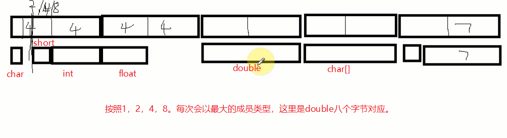

# 第七章 头文件和结构体的研究


### 头文件

我们在写程序的时候，不可能把所有的东西都写在一个文件里。这时候我们就需要多个文件进行分类，相当于这里是我们的数学，这里是语文，这里是英语。如果我们把函数放在不同的文件中，就可以大大增加程序的可读性了。
创建自己的头文件的步骤：
1.编写test.h头文件，里面放函数声明。避免重复定义，需要用到#ifndef。
```c
#ifndef _FUN_H
#define _FUN_H
void fun(void);
#endif
```

1.编写test.c源文件，里面写函数的定义。
```c
#include "test.h"
void fun(void)
{
    printf("自定义头文件测试.\n");
}
```

3.引用头文件
```
#include <stdio.h>
#include <stdlib.h>
#include "test.h"

int main(void)
...省略
```


### <> 和 "" 的区别

这个问题大家想必也经常见到，其实就是一个搜索时候路径的问题。那它们区别我也不多说了，看下面吧。
1. <>包含系统文件的， ""是包含我们自己写的头文件。
2. <>作用是告诉编译器去系统目录查找改头文件。（编译器安装的地方）
3. ""作用是告诉编译器去当前目录去找，如果没找到，则去编译器安装的环境。


### 问题：函数怎么和头文件的函数联系在一起？

同一工程下的所有文件，编译的时候所有文件都会编译。当编译的时候，编译器看到这函数名的时候，
函数名对应的函数地址，编译器就会去内存这个地址找到指令。 其实是通过地址关联的，同一个函数名对应同一个地址。


### typedef

就是定义别名，下面这种操作真的是骚的不行，暂时不知道有没有下面这种使用的地方。
```c
typedef int i1;
typedef i1 i2;
```


### 结构体

说到结构体，我就很容易想到类。因为无论是数组还是基本数据类型，描述的变量都只能表示一种类型，但是很多时候我们都需要用一个变量却能表示多种类型。那么这个实现，就是靠我们的结构体了。
```c
struct STUDENT
{
    char name[10]; // 成员
    char sex;
    int age;
    int* score;
}; 
```

我记得第一次学的时候，那时候很搞笑，我一直搞不懂为什么有时候分号前加变量有时候有不加。后来我再回去看的时候，哎呀，太蠢了我。这不就是<strong>相当于声明了一个类型</strong>吗。
就是类似于int。 如果按照下面这样写你是不是理解就好多了呢。

```c
struct STUDENT{char name[10];char sex;};
struct STUDENT{char name[10];char sex;} stu;
```

<strong>我们在结构体中可以放置不同的类型，那这个时候我也会想，像Java中或者其他面向对象编程的语言中。一个类有成员变量和成员函数，那么结构体是否也可以呢？</strong>
答案是：可以的。

实现的原理很简单，我们知道函数名就是函数的地址，那么这时候如果我们的结构体中的成员是<strong>函数指针类型</strong>就可以用来调用函数了。
注意哦这是指针，就是用来装地址的。我们还记得数组指针吗，写法是怎么样的呢？回忆一下，是int (&#42;p)[5]，那么这个函数指针我们就可以推断出来了。

```
    首先是指针类型，那就是 *p, 我们假定是int类型的指针，那就是 int *p。
    下一步是什么，接着这是一个函数，那函数是怎么表示的。假如我们声明了一个函数如下：
    void fun()
    {

    }
    那这个时候函数指针就是int (*p)()了。
```

下面我们通过在结构体中声明一个函数指针类型来实现，结构体成员包含函数的功能。
```c
    struct NODE
    {
        int(*p)(); // 函数指针
    };
    struct NODE node = { fun };
    node.p(); // 调用函数
```

这个时候，我们不得不佩服一下C语言的作者，这种设计真的很厉害。


### 结构体嵌套

在我们使用函数的时候或者流程控制语句的时候，我们就经常使用嵌套的思想，那么这里是否可以呢？当然是可以的。
```c
struct NODE
{
    int n;
    struct SMALL sma;
};
struct SMALL
{
    int n;
};
```

说到嵌套，我就想起了递归，就是自己调用自己，这个类似于循环的思想，反复执行代码块。<strong>那么嵌套自己是否可以呢？</strong>
答案是：可以的。
```c
struct NODE1
{
    int n;
    // struct NODE1 nod;  // 错误(活动) E0070   不允许使用不完整的类型。
    什么是不完整的类型？其实就是说明我们的结构体还没有分配空间。不知道分配多少空间

    //解决方法
    struct NODE1* pNod; // 
};
```

<strong>我们发现，如果是直接在里面声明一个结构体类型是不行的，但是声明一个结构体指针类型就可以，为什么会换成指针类型就可以了呢？</strong>
接下来我们就更加深入的去了解指针吧。首先指针是一种类型，指针变量是用于存储地址的，而这个时候不同数据类型决定了访问空间的形式不同，
换句话来说，<strong>在声明一个指针的时候我们需要指定指针的类型(这句话是我说的，可能有误)，比如int类型，double类型</strong>
```
    你看我们都是
    int* p;
    double* d;
    却从来没有说:
    * p;
```

所有当我们声明一个结构体的时候，如果是指针类型的成员，我们就知道了这个成员是表示什么类型的指针，而指针的大小是固定的，之前我们也用sizeof()函数测试了不同类型的指针变量。而如果是直接声明的话编译器就会一直找啊找啊，你这个是什么类型啊，我该给多少空间啊。

这个其实就是我们的链表原理，以后再详细说。


### 结构体的大小，结构体的存储方式

首先我们声明一个结构体，然后用sizeof函数打印一下结构体的大小。
```c
struct NODE2
{
    char ch; // 1
    short sh; // 2
    int in; //4
    float fl; //4
    double db; //8
    char arr[9]; //9
};
```

如果我们猜结果是28那就错了，<strong>结果竟然是40。</strong>
这个是怎么来的呢？这就涉及到影响结构体的存储的因素了。
<strong>结构体的大小，不仅与成员大小有关，还和内存对齐有关，默认是根据我们结构体最大成员类型对齐（最大的基本数据类型）</strong>

每个特定平台上的编译器都有自己的默认“对齐系数”(也叫对齐模数)。程序员可以通过预编译命令#pragma pack(n)，n=1,2,4,8,16来改变这一系数，其中的n就是你要指定的“对齐系数”。如果我们指定的n超过了默认的最大成员类型，其实是没有效果的，可以自己测试一下。
内存对齐作用：每个数据单元安排在适当的位置，增快内存数据的读取效率。

<a href="https://i.loli.net/2018/09/16/5b9dd4232b0e9.png"></a>

### union

联合的大小也是和内存对齐有关，跟最大的基本类型有关.
用法： 联合体只允许初始化一个成员。
联合体的存储：所有成员公用一块地址。

<strong>说明所有成员的地址是一样的。测试：打印所有成员的地址</strong>
用法： 联合体只允许初始化一个成员。默认是第一个。
编程建议： 初始化最大空间的成员，把最大空间成员放第一个
赋值也会覆盖. --跟最新的赋值有关


### 成员选择符->和.的区别

在结构体中，我们会经常见到这两个符号。
点运算符在C语言中也叫<strong>成员选择(对象)符</strong>，那么当结构体类型的变量如果是一个对象的时候，我们就用.

->叫做<strong>成员选择(指针)符</strong>，当结构体类型的变量如果是一个指针类型的时候就可以用它了。


### 枚举类型

作用： 增加程序的可读性。
枚举类型的大小：4字节。
我们可以直接使用枚举类型。相当于给整型常量取别名，默认从0开始。
```c
enum COLOR
{
    black, red, white, blue
    // 成员是一些有意义的字符串
    // 我们可以自己指定
    , gray = 14
    // 0，1，2
};
```