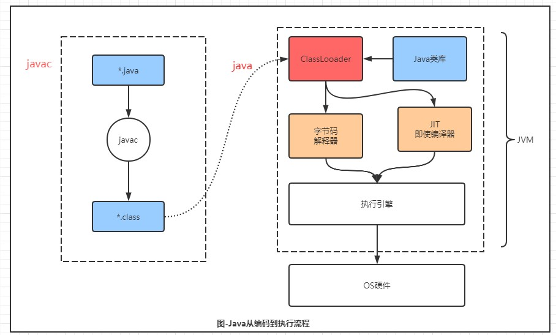

# JVM - 入门


## 基本概念

首先了解Java从编码到执行的一个过程：

- 首先是java文件经过javac之后编译成*.class
- 然后通过java命令，加载ClassLoader（同时也会加载相应的Java类库，例如String、HashMap、Object等）
- 接着，交给字节码解释器或JIT即时编译器处理
- 然后交给执行引擎，最后交给操作系统OS硬件处理。




### JVM

JVM：Java虚拟机（Java Virtual Machine）JVM是一种规范，JVM与Java无关，只跟class有关。

将class文件 加载——>验证——>解释——>初始化，最后执行的过程，这一部分便统称为Java虚拟机。


注意：Java是一门跨平台的语音，而JVM则是跨语音的平台

原因：**JVM与Java无关，只跟class有关**，任何语言只要能编译成class文件，就能在JVM上执行。

任何语言——>class文件——>JVM


## Class File Format

Class文件是一组以8位字节为基础单位的二进制流，Class文件中包含了Java虚拟机指令集和符号表以及若干其他辅助信息。因此我们需了解Class文件的结构内容。


### classfile结构

https://blog.csdn.net/weixin_43519048/article/details/104448697

```java
// Class文件格式采用一种类似于C语言结构体的伪结构来存储数据，这种伪结构中只有两种数据类型：无符号数和表
// 无符号u*：
		// u1、u2、u4、u8分别代表1个字节、2个字节、4个字节和8个字节的无符号数
// 表*_info: 
		// 表示的是表。表是由多个无符号数或者其他表构成的复合数据类型，用于描述层次关系
ClassFile {

    u4             magic; //Class 文件的标志
    u2             minor_version;//Class 的小版本号
    u2             major_version;//Class 的大版本号
    u2             constant_pool_count;//常量池的数量
    cp_info        constant_pool[constant_pool_count-1];//常量池
    u2             access_flags;//Class 的访问标记
    u2             this_class;//当前类
    u2             super_class;//父类
    u2             interfaces_count;//接口
    u2             interfaces[interfaces_count];//一个类可以实现多个接口
    u2             fields_count;//Class 文件的字段属性
    field_info     fields[fields_count];//一个类会可以有个字段
    u2             methods_count;//Class 文件的方法数量
    method_info    methods[methods_count];//一个类可以有个多个方法
    u2             attributes_count;//此类的属性表中的属性数
    attribute_info attributes[attributes_count];//属性表集合
}
```


#### magic

魔数。Class文件的头四个字节存储，作用：确定Class文件类型，是否是Class文件。例如：class的是：CA FE BA BE （咖啡宝贝）


#### minor_version、major_version

class文件版本，前两个字节存主版本号，后两个字节存此版本号。


#### constant_pool_count、constant_pool[constant_pool_count-1]

常量池数量，两个字节存储。主要存放两大常量：**字面量**和**符号引用**。

- 字面量比较接近于 Java 语言层面的的常量概念，如文本字符串、声明为 final 的常量值等。
- 符号引用则属于编译原理方面的概念,包括下面三类常量：

1. 类和接口的全限定名
2. 字段的名称和描述符
3. 方法的名称和描述符

注：常量池的数量是 constant_pool_count-1（常量池计数器是从1开始计数的，将第0项常量空出来是有特殊考虑的，索引值为0代表“不引用任何一个常量池项”）


### access_flags

访问标志 ，标志⽤于识别⼀些类或者接⼝层次的访问信息，

包括：这个 Class 是类还是接⼝，

是否为 public 或者 abstract 类型，如果是类的话是否声明为 final 等等。


5. 
6. 
7. 
8. 当前类索引**,**⽗类索引 ：类索引⽤于确定这个类的全限定名，⽗类索引⽤于确定这个类的⽗类的

全限定名，由于 Java 语⾔的单继承，所以⽗类索引只有⼀个，除了 java.lang.Object 之

外，所有的 java 类都有⽗类，因此除了 java.lang.Object 外，所有 Java 类的⽗类索引

都不为 0。

6. 接⼝索引集合 ：接⼝索引集合⽤来描述这个类实现了那些接⼝，这些被实现的接⼝将

按 implents (如果这个类本身是接⼝的话则是 extends ) 后的接⼝顺序从左到右排列在接⼝索引集合中。

7. 字段表集合 ：描述接⼝或类中声明的变量。字段包括类级变量以及实例变量，但不包括在⽅法

内部声明的局部变量。

8. ⽅法表集合 ：类中的⽅法。

9. 属性表集合 ： 在 Class ⽂件，字段表，⽅法表中都可以携带⾃⼰的属性表集合。


### 查看字节码ByteCode

#### javap

查看字节码，第一种方式可以使用Java自带的javap命令。

可以用直接输入javap，查看可选参数。常用的是：javap -v *.class    （注：-v输出附加信息)

```txt
C:\Users\AkaneMurakawa>javap
用法: javap <options> <classes>
其中, 可能的选项包括:
  -help  --help  -?        输出此用法消息
  -version                 版本信息
  -v  -verbose             输出附加信息
  -l                       输出行号和本地变量表
  -public                  仅显示公共类和成员
  -protected               显示受保护的/公共类和成员
  -package                 显示程序包/受保护的/公共类
                           和成员 (默认)
  -p  -private             显示所有类和成员
  -c                       对代码进行反汇编
  -s                       输出内部类型签名
  -sysinfo                 显示正在处理的类的
                           系统信息 (路径, 大小, 日期, MD5 散列)
  -constants               显示最终常量
  -classpath <path>        指定查找用户类文件的位置
  -cp <path>               指定查找用户类文件的位置
  -bootclasspath <path>    覆盖引导类文件的位置
```


#### IDEA插件-JclassLib

第二种方式可以使用IDEA的插件工具`jclasslib Bytecode Viewer`，更详细和方便阅读，推荐使用

https://plugins.jetbrains.com/plugin/9248-jclasslib-bytecode-viewer

