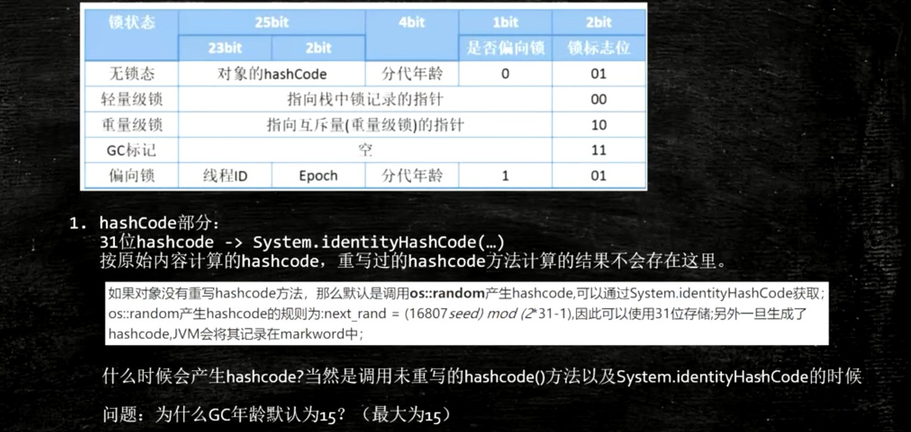

# JVM - 对象内存布局


## 观察虚拟机配置

java -XX:+PrintCommandLineFlags -version

```
C:\Users\AkaneMurakawa>java -XX:+PrintCommandLineFlags -version
-XX:InitialHeapSize=132750336 -XX:MaxHeapSize=2124005376 -XX:+PrintCommandLineFlags -XX:+UseCompressedClassPointers -XX:+UseCompressedOops -XX:-UseLargePagesIndividualAllocation -XX:+UseParallelGC
java version "1.8.0_171"
Java(TM) SE Runtime Environment (build 1.8.0_171-b11)
Java HotSpot(TM) 64-Bit Server VM (build 25.171-b11, mixed mode)
```


## 对象在内存中的存储布局

### 普通对象

1. 对象头 markword 8

2. ClassPointer指针： -XX:+UseCompressedClassPointers为4字节，不开始为8字节

3. 实例数据
   1. 引用类型： -XX:+UseCompressedOops为4字节，不开始为8字节。注：Oops：Ordinary Object Pointers

4. Padding**对齐**，8的倍数


### 数组对象

1. 对象头 markword 8
2. ClassPointer同上
3. 数组长度：4字节
4. 数组数据
5. 对齐 8的倍数


### Object obj = new Object()在内存中占多少字节

对象头8  +  ClassPointer4 + 对齐4 = 16字节


### 对象头

1. 锁
2. 分代年龄
3. GC标志


每个Java对象都有对象头。如果是非数组类型，则用2个字宽来存储对象头，如果是数组，则会用3个字宽来存储对象头。

在32位处理器中，一个字宽是32位；在64位虚拟机中，一个字宽是64位。对象头的内容如下表：

| 长度     | 内容                   | 说明                         |
| -------- | ---------------------- | ---------------------------- |
| 32/64bit | Mark Word              | 存储对象的hashCode或锁信息等 |
| 32/64bit | Class Metadata Address | 存储到对象类型数据的指针     |


如果是数组，则会用3个字宽来存储对象头

| 长度     | 内容                   | 说明                         |
| -------- | ---------------------- | ---------------------------- |
| 32/64bit | Mark Word              | 存储对象的hashCode或锁信息等 |
| 32/64bit | Class Metadata Address | 存储到对象类型数据的指针     |
| 32/64bit | Array length           | 数组的长度（如果是数组）     |


我们主要来看看Mark Word的格式：



**为什么GC年龄默认为15？**

因为用的4bit存储，因此能表达式最大的数是15。


### 对象定位

1. 句柄池（间接指针）
2. 直接指针


### 对象如何分配