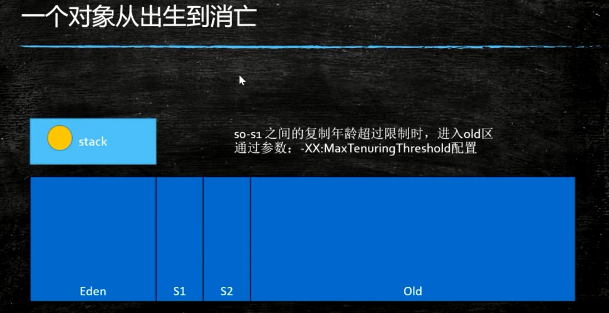

# JVM - 垃圾回收

## 如何判断对象的死亡？

- 引用计数器，为0（不能解决循环引用问题）
- 可达性分析算法（GC Roots不可达）

### 可达性分析算法

将“**GC Roots**”对象作为起点，从这些节点开始向下搜索引用的对象，搜索走过的路径被称为引用链（Reference Chain)，当一个对象到 GC Roots 没有任何引用链相连时（即从 GC Roots 节点到该节点不可达），则证明该对象是不可用的。引用链可达标记为非垃圾对象，引用链不可达是垃圾对象。

#### GC Roots根节点

虚拟栈(即线程栈)的本地变量、静态变量、常量池、本地方法栈(native)的变量等等。 

## GC算法

- 标记-清除（Mark-Sweep）

- 复制算法（Copying）
- 标记-压缩（标记整理）（Mark-Compact）

### 1、标记清除算法(Mark-Sweep)

说明：先把内存区域中的对象进行标记，标记哪些属于可回收，然后将其清理掉。

分析：

- 算法相对简单
- 存活对象较多时效率高
- 两遍扫描、效率偏低
- 由于分配内存的时候需要连续的空间，那么清理这些空间的时候，就会造成不再可用，形成垃圾碎片，浪费空间

### 2、复制算法（Copying）

说明：将内存分为两个区域，先在一个区域存储，然后将可用的对象移到另一个区域，清理掉垃圾区域。

分析：

- 适用于存活对象较少的情况
- 只扫描一次，效率提高，没有碎片
- 空间浪费
- 移动复制对象，需要调整对象引用

### 3、标记-压缩（标记整理）（Mark-Compact）

说明：标记过程仍然与标记清除算法一样，但后续步骤不是直接对可回收对象进行清理，而是让所有存活的**对象都压缩到一端**，再清理掉端边界以外的内存区域。

分析：

- 没有碎片，方便对象分配
- 不会浪费空间
- 扫描两次
- 需要移动对象，效率偏低

## JVM内存分代算法

将内存空间分配几个区域，然后每个区域选择合适的垃圾收集算法(前面说的123，标记清除、复制算法、标记压缩算法)

注：

> 除Epsilon、ZGC、Shenandoah之外的GC都是使用逻辑分代模型
>
> G1是逻辑分代，物理不分代；除此之外，逻辑分代，物理分代

### 结论

- 新生代大量死去，少量存活，适合复制算法

- 老年代存活率高，回收较少，适合标记清除或标记压缩

### 一个对象从出生到消亡的过程

### 堆内存逻辑分区

逻辑分代里分为：新生代和老年代

新生代：刚new出来的对象

老年代：垃圾回收很多次未能回收的

新生代又分为三个区域：一个eden、两个survivor（即from和to），默认比例是8：1：1

当进行一次minor gc时（既年轻代的gc），minor gc是串行的，eden空间如果没有被gc root引用的会被回收，**而依然存活的会被移动到from空间中**，如果from空间在minor gc时对象依旧可以存活，就会对该对象年龄+1，当年龄达到一定数值时会直接放入老年代，没有达到年龄的存活对象会被复制到to中。这时from和eden空间已经被清空，虚拟机会交换from和to的空间，空的from变成to，to的变成from，保证了to是空的，minor gc会不断重复这样的工作，直到to彻底被填满，这时会将对象移动到老年代。

## GC概念

https://kuaibao.qq.com/s/20190228A0656E00?refer=spider

Eden区：伊甸园区

survivor区，又分为s0、s1，或叫from区、to区

年轻代：Eden+s0+s1

Old区：老年代

-Xms：最小堆

-Xmn：（注：n代表new）

-Xmx：最大堆

MinorGC/YGC：发生在年轻代，采用复制算法（注：YGC：Young GC）

MajorGC：发生在老年代，采用标记压缩或标记清除算法

FullGC：MinorGC+MajorGC

动态年龄判断

分代年龄

逃逸对象

栈上分配（注：无需调整）

- 线程私有小对象
- 无逃逸
- 支持标量替换

线程本地分配TLAB(Thread Local Allocation Buffer)（注：无需调整）

- 占用eden，默认1%
- 多线程的时候不用竞争eden就可以申请空间，提高效率
- 小对象

老年代

- 大对象

eden

**什么情况进入老年代Old区？**
1、大对象直接进入老年代，可通过-XX:PretenureSizeThreshold设置
2、分代年龄到达15会移动老年代，可通过-XX:MaxTenuringThreshold设置

- Parallel Scavenge 15
- CMS 6
- G1 15

3、对象动态年龄判断，可通过-XX: TargetSurvivorRatio设置

 **对象动态年龄判断**

当前放对象的Survivor区域里，一批对象的总大小大于这块Survivor区域内存大小的50%(-XX: TargetSurvivorRatio可以指定)，那么此时大于等于这批对象年龄最大值的对象，就可以直接进入老年代了。例如：Survivor区域里现有一批对象，年龄1+年龄2+年龄n的多个年龄对象总和超过了Survivor区域的50%,此时就会把年龄n(含以上)的对象都放入老年代。这个规则其实是希望那些可能是长期存活的对象，尽早进入老年代。对象动态年龄判断机制一般是在minor gc之后触发的。 