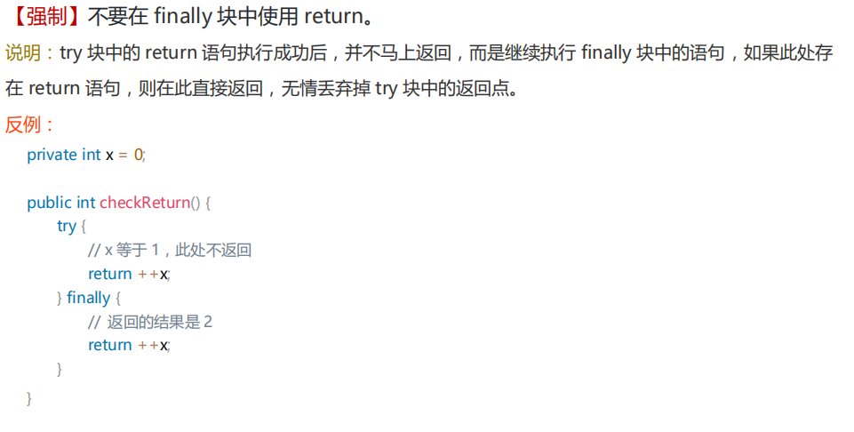

# 1 Java开发规范

参考：https://github.com/alibaba/p3c    [阿里巴巴Java开发手册（华山版）.pdf](https://github.com/alibaba/p3c/blob/master/阿里巴巴Java开发手册（华山版）.pdf)

在这里只选取一些我觉得可能比较容易被我们忽略的规范。


# 编程规约

## 1. 命名风格

首先是命名，用英文这种就不用说了。然后我们一般是在哪里需要命名呢？ 一般来说，我们的命名会出现在包、类名、方法名、参数名、成员变量、局部变量、常量

接下来我们需要注意的是命名的风格，其实命名里有些是有约定形式的。

1、类名使用 UpperCamelCase(驼峰)风格，

2、方法名、参数名、成员变量、局部变量都统一使用 lowerCamelCase 风格

3、 其他，如：测试类，工具类util(**单数**)服务Service，数据层Dao，model里的VO、DTO、BO，抽象类用Abstract开头，实现类以Impl结束，异常类以Exception结束等，枚举类名带上 Enum 后缀。

4、包名用单数

```
|-----------------------------------------------------------------------配置相关------------------------------------------------------------------------|
|--项目
|----annotation 注解
|--------TestAnnotation 以Annotation结束
 
|----aop 切面包
|--------TestAspect 以Aspect结束

|----config 配置包
|--------RedisConfig  以Config或Configuration结束

|----interceptor 拦截器包
|--------CommonInterceptor 以Interceptor结束

|----schedule 定时任务包
|--------DingTalkTask 以Task结束

|---- mq mq消息包
|-------- receiver 消费者
|--------------UserListenerConsumer 
|-------- send 生产者
|--------------UserPublisher

|----constant 常量包
|--------CommonConstant 以Constant结束
|--------CommonEnum 以Enum结束 (可根据需要是否要拆分constant常量 和 Enum枚举)

|----exception 异常包
|--------BusinessException  以Exception结束

|------------------------------------------------------------------------对象相关------------------------------------------------------------------------|
|----model/pojo Java对象包
|--------entity/bean ORM实体映射对象
|------------User
|--------domain 域包  (如果没有model或pojo，这一层就是最顶层)
|------------dto 传输映射对象包
|----------------UserDTO 以大写DTO结束
|------------vo 传输映射对象包
|----------------UserVo 以大写VO结束

|------------------------------------------------------------------------模块分层相关------------------------------------------------------------------------|
|----controller 控制层
|--------UserController 以Controller结束
|--------common 共同层
|-------------AbstractController 以Abstract开头
|--------assist 帮助类
|-------------UserDataSet 以DataSet结束 (数据转换)
|--------validator 校验类
|-------------UserValidator 


|----service 服务包
|--------UserService  以Service结束
|--------impl 实现类包
|------------UserServiceImpl 以impl结束
|--------validator 校验类
|-------------UserValidator 

|----dao Dao层包
|--------UserDao 以Dao结束
|--------impl 实现类包
|------------UserDaoImpl
|--------mapper mapper包
|-------------UserMapper 以Mapper结束

上面的服务层，接口和实现都在一个包下，但是有时候我们会把这两个进行拆分，一个叫api提供接口，一个叫provider负责实现
API工程
|----service 服务包
|--------UserWsService  以WsService结束

Provider工程
|----ws 
|--------service
|------------impl
|----------------- UserWsServiceImpl  以Impl结束

|----api 远程服务包
|--------UserServiceRemote 以Remote结束

|------------------------------------------------------------------------其它------------------------------------------------------------------------|
|----transaction 事务类
|-------UserTransaction 以Transaction结束

|----util 工具包
|-------JsonUtils 以Utils结束，s表示复数

|----test
|--------UserServiceTest  以Test结束

其它，可根据需要进行一个统一的包管理，例如：
biz：表示业务
log：表示日志
error： 错误信息
handler： 处理器
upload： 上传
```


Service/DAO层方法命名规约 

1） 获取单个对象的方法用 get做前缀。 

2） **获取多个对象的方法用 list做前缀，复数形式结尾如：listObjects。** 

3） 获取统计值的方法用 count做前缀。 

4） 插入的方法用 save/insert做前缀。 

5） 删除的方法用 remove/delete做前缀。 

6） 修改的方法用 update做前缀。 


接口和实现类的命名有两套规则：

1）【强制】对于 Service 和 DAO 类，基于 SOA 的理念，暴露出来的服务一定是接口，内部的实现类用

Impl 的后缀与接口区别。

正例：CacheServiceImpl 实现 CacheService 接口。

2）【推荐】如果是形容能力的接口名称，取对应的形容词为接口名（通常是–able 的形容词）。

正例：AbstractTranslator 实现 Translatable 接口。


## 2. 常量定义

常量的分类：CacheConsts、ConfigConsts等，变量应进行分类，不能全怼在一起

常量的复用层次有五层：跨应用共享常量、应用内共享常量、子工程内共享常量、包内共享常量、类内共享常量。


## 3. 代码格式

主要是换行的使用，{}的使用，什么时候应该用空格。

主要注意的几点：

1） 注释的双斜线与注释内容之间有且仅有一个空格。 

2） 换行原则：**不要在逗号前换行，第二行相对第一行缩进 4 个空格，从第三行开始，不再继续缩进**。 


## 4. OOP规约

0） 接口过时必须加@Deprecated 注解，尽量不能使用过时的类或方法，过时了肯定有新的方法代替，应找到新的方法使用。

1） equals，老生常谈的。**另外不同类型不要用**。Integer 的比较也值得注意（对于 Integer var = ? 在-128 至 127 之间的赋值，Integer 对象是在 IntegerCache.cache 产生，

会复用已有对象，这个区间内的 Integer 值可以直接使用==进行判断，但是这个区间之外的所有数据，都会在堆上产生，并不会复用已有对象，这是一个大坑，推荐使用 equals 方法进行判断。）

2）【强制】序列化类新增属性时，请不要修改 serialVersionUID字段，避免反序列失败；如果完 全不兼容升级，避免反序列化混乱，那么请修改 serialVersionUID值。 说明：注意 serialVersionUID不一致会抛出序列化运行时异常

3） **空指针，索引越界。使用前多考虑一下要不要判断**

4）构造方法里面禁止加入任何业务逻辑，如果有初始化逻辑，请放在 init 方法中

5） 类编写顺序，**公有方法或保护方法 > 私有方法 > getter/setter**，这个感觉因人而异，我个人看方法就喜欢拉到下面。这样比拉到特定位置方便。

6） 循环体内，字符串的连接方式，使用 StringBuilder的 append方法进行扩展，老生常谈。 

7） 如果不允许外部直接通过 new来创建对象，那么构造方法必须是 private


## 5. 日期

1）如果是 JDK8 的应用，可以使用 Instant 代替 Date，LocalDateTime 代替 Calendar，DateTimeFormatter 代替 SimpleDateFormat，

官方给出的解释：simple beautiful strong immutable thread-safe。


## 6. 集合处理

1） 只要重写 equals，就必须重写 hashCode。 原因：**因为 Set存储的是不重复的对象，依据 hashCode和 equals进行判断。另外用对象作为map的key**

2） 集合转数组的方法，必须使用集合的 toArray(T[] array。**工具类 Arrays.asList()把数组转换成集合，不可使用集合add/remove/clear方法**。Arrays.asList体现的是 适配器模式，只是转换接口，后台的数据仍是数组。subList并不是 ArrayList 而是 ArrayList 的一个视图

3） 【强制】泛型通配符<? extends T>来接收返回的数据，此写法的泛型集合不能使用 add方 法，而<? super T>不能使用 get方法，作为接口调用赋值时易出错。 

说明：扩展说一下 PECS(Producer Extends Consumer Super)原则：

第一、频繁往外读取内容 的，适合用<? extends T>。

第二、经常往里插入的，适合用<? super T>。 


4） 不要在 foreach循环里进行元素的 remove/add操作。remove元素请使用 Iterator 方式，**如果并发操作，需要对 Iterator对象加锁**

5） 集合初始化时，指定集合初始值大小	

6） **高度注意 Map类集合 K/V能不能存储 null值的情况**


## 7. 并发处理

1） **线程资源必须通过线程池提供，不允许在应用中自行显式创建线程**。减少在创建和销毁线程上所消耗的时间

2） **线程池不允许使用 Executors去创建，而是通过 ThreadPoolExecutor的方式，偏于了解线程池**

说明：Executors 返回的线程池对象的弊端如下：

1） FixedThreadPool 和 SingleThreadPool：

允许的请求队列长度为 Integer.MAX_VALUE，可能会堆积大量的请求，从而导致 OOM。

2） CachedThreadPool：

允许的创建线程数量为 Integer.MAX_VALUE，可能会创建大量的线程，从而导致 OOM。

```
 /**
     * 核心线程数
     */
    private static final int CORE_POOL_SIZE = 8;

    /**
     * 最大线程数
     */
    private static final int MAXIMUM_POOL_SIZE = 20;

    /**
     *超过corePoolSize线程数量的线程的活动保持时间
     */
    private static final long KEEP_ALIVE_TIME = 0L;

    /**
     * 任务等待队列的大小
     */
    private static final int WORK_QUEUE_SIZE = 500;

    private static final ThreadPoolExecutor XXXXX_ACCOUNT_EXECUTOR = new ThreadPoolExecutor(
            CORE_POOL_SIZE,
            MAXIMUM_POOL_SIZE,
            KEEP_ALIVE_TIME,
            TimeUnit.SECONDS,
            new LinkedBlockingDeque<>(WORK_QUEUE_SIZE),
            new ThreadFactoryBuilder().setNameFormat("account-thread-pool-%d").build(),
            new ThreadPoolExecutor.AbortPolicy()
    );
```


3） **SimpleDateFormat 是线程不安全的类，一般不要定义为 static变量，如果定义为 static，必须加锁，或者使用 DateUtils工具类**

如果是 JDK8的应用，可以使用 Instant代替 Date，LocalDateTime代替 Calendar， DateTimeFormatter代替 SimpleDateFormat

4） 【强制】并发修改同一记录时，避免更新丢失，需要加锁。要么在应用层加锁，要么在缓存加 锁，要么在数据库层使用乐观锁，使用 version作为更新依据。 说明：如果每次访问冲突概率小于 20%，推荐使用乐观锁，否则使用悲观锁。乐观锁的重试次 数不得小于 3次。


## 8. 控制语句

1） 参数校验


## 9. 注释规范

1） 类、类属性、类方法的注释必须使用 Javadoc规范，使用/**内容*/格式


## 10. 其他

1） 【强制】事务内发MQ消息 说明：如果处理业务逻辑后，要发送MQ消息，那么发送MQ消息的代码要放到业务逻辑事 务底部，避免消息同步问题。 2） 【强制】禁止for循环调用接口和查询数据库 说明：For循环内禁止RPC调用或数据库查询，此问题会导致功能性能低下。


# 异常日志

## 1. 错误码

1）【强制】全部正常，但不得不填充错误码时返回五个零：00000

2）【强制】错误码为字符串类型，共 5 位，分成两个部分：错误产生来源+四位数字编号。

> 说明：错误产生来源分为 A/B/C，A 表示错误来源于用户，比如参数错误，用户安装版本过低，用户支付
>
> 超时等问题；B 表示错误来源于当前系统，往往是业务逻辑出错，或程序健壮性差等问题；C 表示错误来源
>
> 于第三方服务，比如 CDN 服务出错，消息投递超时等问题；四位数字编号从 0001 到 9999，大类之间的
>
> 步长间距预留 100，


## 2. 异常处理

1） 级联调用 obj.getA().getB().getC()；一连串调用，易产生 NPE。正 例：使用 JDK8的 Optional类来防止 NPE问题。 

2） **业务异常**打印message和error code，不允许打异常栈 说明：避免无用的栈信息过多，占满磁盘空间



## 3. 日志规约

1） 避免重复打印日志，浪费磁盘空间，务必在 log4j.xml中设置 additivity=false。正例： <logger name="com.taobao.dubbo.config" additivity="false">

2）【强制】在日志输出时，字符串变量之间的拼接使用占位符的方式。

说明：因为 String 字符串的拼接会使用 StringBuilder 的 append()方式，有一定的性能损耗。使用占位符仅

是替换动作，可以有效提升性能。


# 单元测试

1）  【强制】好的单元测试必须遵守 AIR原则。 说明：单元测试在线上运行时，感觉像空气（AIR）一样并不存在，但在测试质量的保障上， 却是非常关键的。好的单元测试宏观上来说，具有自动化、独立性、可重复执行的特点。

  A：Automatic（自动化）

  I：Independent（独立性） 

  R：Repeatable（可重复） 

2） 对于单元测试，要保证测试粒度足够小，有助于精确定位问题。单测粒度至多是类级 别，一般是方法级别。 

3） 【推荐】编写单元测试代码遵守 BCDE原则，以保证被测试模块的交付质量。 

 B：Border，边界值测试，包括循环边界、特殊取值、特殊时间点、数据顺序等。 

 C：Correct，正确的输入，并得到预期的结果。 

 D：Design，与设计文档相结合，来编写单元测试。 

 E：Error，强制错误信息输入（如：非法数据、异常流程、非业务允许输入等），并得到 预期的结果

3） 【推荐】和数据库相关的单元测试，可以设定自动回滚机制，不给数据库造成脏数据。或者 对单元测试产生的数据有明确的前后缀标识。

 

# 安全规约

1） 【强制】隶属于用户个人的页面或者功能必须进行权限控制校验。 

2） **【强制】用户请求传入的任何参数必须做有效性验证** 。 

说明：忽略参数校验可能导致：

-  page size 过大导致内存溢出
-  恶意 order by 导致数据库慢查询
-  缓存击穿
-  SSRF
-  任意重定向
-  SQL 注入，Shell 注入，反序列化注入
-  正则输入源串拒绝服务 ReDoS

3） 【强制】表单、AJAX提交必须执行 CSRF安全验证。 

说明：**CSRF(Cross-site request forgery)**跨站请求伪造是一类常见编程漏洞。对于存在CSRF漏 洞的应用/网站，攻击者可以事先构造好 URL，只要受害者用户一访问，后台便在用户不知情 的情况下对数据库中用户参数进行相应修改。

4） 【强制】order controller 层 调用service 必须传用户ID信息 （防止越权） 


# MySQL数据库

1） MySQL在 Windows下不区分大小写，但在 Linux 下默认是区分大小写。因此，数据库名、 表名、字段名，都不允许出现任何大写字母，避免节外生枝。 

2） 【强制】主键索引名为 pk*字段名；唯一索引名为 uk*字段名；普通索引名则为 idx_字段名。

说 明：pk_ 即 primary key；uk_ 即 unique key；idx_ 即 index的简称。 

3） 【强制】小数类型为 decimal，禁止使用 float和 double。 说明：float和 double在存储的时候，存在精度损失的问题，很可能在值的比较时，得到不正确 的结果。如果存储的数据范围超过 decimal的范围，建议将数据拆成整数和小数分开存储。

4） 【推荐】单表行数超过 500万行或者单表容量超过 2GB，才推荐进行分库分表。 说明：如果预计三年后的数据量根本达不到这个级别，请不要在创建表时就分库分表。 


## 1. 索引


1）【强制】在 varchar 字段上建立索引时，必须指定索引长度**，没必要对全字段建立索引**，根据

实际文本区分度决定索引长度。Java 开发手册

说明：索引的长度与区分度是一对矛盾体，一般对字符串类型数据，长度为 20 的索引，区分度会高达 90%

以上，可以使用 count(distinct left(列名, 索引长度))/count(*)的区分度来确定。

2）页面搜索严禁左模糊或者全模糊，如果需要请走搜索引擎来解决。

**说明：**索引文件具有 B-Tree 的最左前缀匹配特性，如果左边的值未确定，那么无法使用此索引。

3）建组合索引的时候，区分度最高的在最左边


5） 一般使用UTF-8字符集，涉及到特殊字符时使用UTF8MB4字符集 

   UTF8：国码，无需转码，无乱码风险，节省空间

   

   UTF8MB4：能存储4字节的Unicode 字符

6） 默认配置字段定义为NOT NULL并且提供默认值，除非有特殊需求提出审批 

7） 【推荐】SQL性能优化的目标：至少要达到 range 级别，要求是 ref级别，如果可以是 consts 最好。 说明： 

1. consts 单表中最多只有一个匹配行（主键或者唯一索引），在优化阶段即可读取到数据。 
2. ref 指的是使用普通的索引（normal index）。 
3. range 对索引进行范围检索。

8） 【强制】不要使用 count(列名)或 count(常量)来替代 count(*)，count(*)是 SQL92定义的标准统计 行数的语法，跟数据库无关，跟 NULL和非 NULL无关。 

9） 【强制】不得使用外键与级联，一切外键概念必须在应用层解决。 

说明：以学生和成绩的关系为例，学生表中的 student_id是主键，那么成绩表中的 student_id 则为 外键。如果更新学生表中的 student_id，同时触发成绩表中的 student_id 更新，即为级联更 新。外键与级联更新适用于单机低并发，不适合分布式、高并发集群；级联更新是强阻塞，存 在数据库更新风暴的风险；外键影响数据库的插入速度。 


# 工程规约

1）  【强制】定义 GAV遵从以下规则： 

1. GroupID格式：com.{公司/BU }.业务线 [.子业务线]，最多 4级。 说明：{公司/BU} 例如：alibaba/taobao/tmall/aliexpress等 BU一级；子业务线可选。正例： com.taobao.jstorm 或 com.alibaba.dubbo.register 
2. ArtifactID 格式：产品线名-模块名。语义不重复不遗漏，先到中央仓库去查证一下。正 例：dubbo-client / fastjson-api / jstorm-tool 
3. Version：详细规定参考下方。 

2） 【强制】二方库的新增或升级，保持除功能点之外的其它 jar 包仲裁结果不变。如果有改变， 必须明确评估和验证，建议进行 dependency:resolve前后信息比对，如果仲裁结果完全不一致， 那么通过 dependency:tree命令，找出差异点，进行<excludes>排除 jar包。 

3） 【推荐】在线上生产环境，JVM的 Xms和 Xmx设置一样大小的内存容量，避免在 GC 后调整堆 大小带来的压力。

4） 【推荐】给 JVM环境参数设置-XX:+HeapDumpOnOutOfMemoryError参数，让 JVM碰到 OOM场 景时输出 dump信息。 

说明：OOM的发生是有概率的，甚至相隔数月才出现一例，出错时的堆内信息对解决问题非 常有帮助。

 


# 其他

## 1. 代码管理规范

所有的代码改动 必须要 经过测试。没有测试的允许 不能随便 合并代码 到 trunk 和 tag。

取消的任务，fixbug和trunk都要回滚，防止别人复用。合代码的时候代码没少了，但却提示少了代码，说明你复用了别人的代码，而别人还没合。需要和别人商量，是否一起上线，如果不上则你的也不上。


## 2. 设计


### 2.1 Maven

```
rebuild、mvn clean install Dmaven.test.skip=true
```

### 2.2 文件幂等

file.getBytes进行MD5存储到数据库，再次请求的时候计算MD5和数据库中的进行比较。


### 2.3 乐观锁

version+1，开始的时候取出version，最后要执行操作的时候，version+1执行，如果成功则执行，失败则回滚。(version需加唯一索引)


### 2.4 临时表的时候

当我们有一些数据需要和数据库匹配的时候，如果数据量是几十万几百万这时候你要是用in，看会不会被打死。数据库说不定就被搞报了，这个时候建立个临时的数据库，然后关联表就行了，完美。


### 2.5 操作日志

自定义注解@ActionLog，使用AOP对其处理，写入到mongodb。


### 2.6 Linux上传

```
sz
rz
mstsc: microsoft terminal services client
```

##  

## 3. 开发规范

1. Service接口统一注释一下，另外命名斟酌一下，考虑一下别人是否看得懂

2. Criteria 里面的 pageNum 和 pageSize 父类有；正常不会出现问题；使用gson序列化会有问题

3. for循环对数据库操作，建议明确一个最大循环数；否则接口后期无法优化。

4. 可以使用 mybatis 复杂sql 查询，没必要写代码封装

5. 静态常量 请使用单独类封装

6. 不建议在 for 循环中 try catch

7. 代码还可以拆分优化下


1. 类方法有点长，层次不够简单，嵌套太深入了；考虑拆分成不同的细粒度的function或者utils  method

2. 针对skuInfoDTOS 这种变量名 尽量 不要DTOS这样，简化点：skuInfo ;

看对象就能知道这个是DTO。没必要把变量名里面整个这个，而且还是驼峰

3. 很不建议在循环里面去发起远程调用；这种调用最好能合并，或者减少调用次数（最好能有调用上限，比如只循环10次）

4. selectOne 如果数据库不能保证唯一会有问题，使用的时候 需要保证查询的数据 在数据库一定是 唯一； 唯一索引可保证


## 代码规范

1.**【建议】及时去除无用代码**

2.**【警告】空指针问题**，如日志记录场景常存在以下错误习惯

bad示例**：**这里判断了detail为空，却又调用detail.getRefNo()

```java
if(Objects.isNull(detail)){    
	log.error("outOfStock is error,refNo:{}", detail.getRefNo()); 
}
```

3.**【强制】Java值传递** 

Java中只有值传递，没有引用传递。并不能改变参数的引用指向。

```java
public class Main {     
    public static void main(String[] args) {        
        User user = null;        
        buildUser(user);        
        System.out.println("user:" + user); // null  
    }     
    
    public static void buildUser(User user){        
        user = new User();    
    } 
}
```

4.**【强制】BigDecimal(double val)不推荐使用，推荐使用BigDecimal(String val)能得到精确的对应值**

5.【**建议**】null!=infoList && infoList .size() > 0不推荐使用，建议使用org.apache.commons.collections.CollectionUtils.isNotEmpty()

6.【**建议**】equals对比，固定的值放前面

bad示例：

```java
dataSource.equals(DataSourceConstant.API);
```

7.【**建议**】**double-checked locking使用**

good示例：

```java
// volatile 
private volatile LoadingCache cache = null; 
/ double-checked 
private LoadingCache getCache() { 	
	if (null == cache) { 			
		// synchronized        
		synchronized (this) {           
			if (null == cache) { 							
				// do something 				      
				cache = initCache();  			
			} 	
		}
	} 
 }
```

8. 【**建议**】关闭流的三种方式：1、try-finally；  2、try-with-resource； 3、@Cleanup