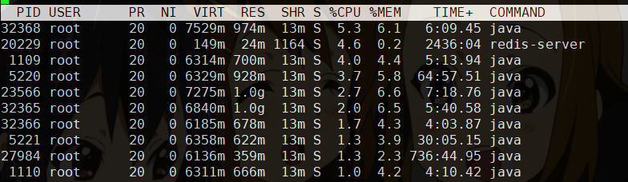
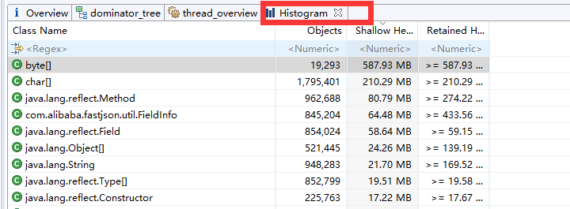

# JVM- 2 内存溢出分析


常用命令

参考<jvm调优-命令大全https://www.cnblogs.com/ityouknow/p/5714703.html>

| 命令                                                   | 说明                                                         |
| ------------------------------------------------------ | ------------------------------------------------------------ |
| top                                                    | 查系统消耗高的进程                                           |
| top –H –p #pid#                                        | 根据pid查出进程中子进程                                      |
| jstack #进程pid# \| grep #子线程pid(16)位#             | 查看占用cpu高的子线程                                        |
| **jmap –heap #pid#**                                   | **查看堆信息，可以看到堆使用情况和****jvm****配置参数**      |
| jstat –gc #pid#                                        | **(**JVM statistics Monitoring**)用**于监视虚拟机运行时状态信息的命令 **查看内存使用百分比，****jvm GC****情况，**可以显示出虚拟机进程中的类装载、内存、垃圾收集、JIT编译等运行数据。 |
| **jstat –gcutil #pid#**                                | 同-gc，不过输出的是已使用空间占总空间的百分比                |
| **jmap –dump:format=b,file=/tmp/20200101.hprof #pid#** | **生成当前****jvm****内存快照 用于后续分析**                 |
| jmap –histo:live #pid#                                 | 打印每个类的实例数量 内存占用信息 加上live可以手工触发一次fullGC |
| jinfo –flags #pid#                                     | 可以查看当前进程JVM的所有配置信息                            |
| jps -l -m                                              | JVM Process Status Tool,显示指定系统内所有的HotSpot虚拟机进程 |
| jhat                                                   | jhat(JVM Heap Analysis Tool)命令是与jmap搭配使用，jhat内置了一个微型的HTTP/HTML服务器，生成dump的分析结果后，可以在浏览器中查看(Http://localhost:7000) |


### 1.1 top



从图中来看，PID为36328的占用资源高

如果垃圾回收活动过于频繁，占用了较高的 CPU 资源，可能是由内存不足或者是新生代和旧生代分配不合理导致的等。


### 1.2 jmap

接着用**jmap**查看堆栈情况

```
[root@test:/root] jmap -heap 32368
Attaching to process ID 32368, please wait...
Debugger attached successfully.
Server compiler detected.
JVM version is 25.151-b12

using thread-local object allocation.
Parallel GC with 8 thread(s) // Parallel GC

Heap Configuration:
   MinHeapFreeRatio         = 0
   MaxHeapFreeRatio         = 100
   MaxHeapSize              = 1073741824 (1024.0MB)
   NewSize                  = 44564480 (42.5MB)
   MaxNewSize               = 357564416 (341.0MB)
   OldSize                  = 89653248 (85.5MB)
   NewRatio                 = 2 //对应jvm启动参数-XX:NewRatio=:‘新生代’和‘老生代’的大小比率
   SurvivorRatio            = 8 //对应jvm启动参数-XX:SurvivorRatio=设置年轻代中Eden区与Survivor区的大小比值 
   MetaspaceSize            = 134217728 (128.0MB)
   CompressedClassSpaceSize = 1073741824 (1024.0MB)
   MaxMetaspaceSize         = 268435456 (256.0MB)
   G1HeapRegionSize         = 0 (0.0MB)

Heap Usage:
PS Young Generation
Eden Space:
   capacity = 335544320 (320.0MB)
   used     = 74478520 (71.02825164794922MB)
   free     = 261065800 (248.97174835205078MB)
   22.19632863998413% used
From Space:
   capacity = 7864320 (7.5MB)
   used     = 7438464 (7.0938720703125MB)
   free     = 425856 (0.4061279296875MB)
   94.5849609375% used
To Space:
   capacity = 11534336 (11.0MB)
   used     = 0 (0.0MB)
   free     = 11534336 (11.0MB)
   0.0% used
PS Old Generation
   capacity = 222298112 (212.0MB)
   used     = 141324736 (134.77777099609375MB)
   free     = 80973376 (77.22222900390625MB)
   63.574420281176295% used

51342 interned Strings occupying 5596448 bytes.
```

PS Old Generation从目前来看，老年代还可以。Eden 和S0(From Space)、S1(To Space)比例失调

**(****因为JDK8新生代用的ParallelScavengeGC算法，默认在内存分配压力大的时候压缩Survivor区，从此可以看出内存分配压力过大****)**


### 1.3 jstat

查看GC情况

```
[root@test:/root] jstat -gcutil 32368
  S0     S1     E      O      M     CCS    YGC     YGCT    FGC    FGCT     GCT   
 25.23   0.00  35.70  85.99  95.42  93.88     64    3.544     2    1.598    5.142
 
 [root@test:/root] jstat -gc 32368
 S0C    S1C    S0U    S1U      EC       EU        OC         OU       MC     MU    CCSC   CCSU   YGC     YGCT    FGC    FGCT     GCT   
9728.0 9728.0  0.0   5846.5 328704.0 200373.1  187904.0   164894.9  133504.0 126570.6 15488.0 14408.1     67    3.657   2      1.598    5.255

 [root@test:/root] jstat -gc 32368 2000 20
每隔2000ms输出32368的gc情况，一共输出20次
```

结果说明

**C即Capacity 总容量，U即Used 已使用的容量**

- OC : Old区的总容量
- OU : Old区已使用的容量
- PC 当前perm（JDK1.8之前）的容量 (KB)
- PU perm的使用 (KB)
- MC 当前Metaspace(JDK1.8)的容量


**C: count  T: time**

- **YGC : 新生代垃圾回收次数**
- **YGCT : 新生代垃圾回收时间**
- **FGC : 老年代垃圾回收次数**
- **FGCT : 老年代垃圾回收时间**
- GCT : 垃圾回收总消耗时间

```
[root@test:/root] jstat -gccause 32368
  S0     S1     E      O      M     CCS    YGC     YGCT    FGC    FGCT     GCT    LGCC                 GCC                 
  0.00  98.03   2.25  87.76  94.44  92.25     69    3.719     2    1.598    5.317 Allocation Failure   No GC  
```

- LGCC：最近垃圾回收的原因
- GCC：当前垃圾回收的原因


### 1.4 jmap –dump

dump文件，便于后续分析

```
jmap –dump:format=b,file=/tmp/20200414.hprof 32368 
```

dump堆到文件,format指定输出格式，live指明是活着的对象,file指定文件名


### 1.5 jstack pid

打印堆栈信息

```
jstack 32368
```

**
**

## 2. 工具：Memory Analyzer Tool （MAT）

参考<https://www.ibm.com/developerworks/cn/java/j-lo-visualvm/>

介绍：

​    MAT是Memory Analyzer tool的缩写。指分析工具。

​    Eclipse的内存分析器是一种快速，功能丰富的Java堆分析工具，帮助你查找内存泄漏和减少内存消耗。

下载地址：https://www.eclipse.org/mat/downloads.php

基础配置：

​    安装目录下的MemoryAnalyzer.ini文件内容Xmx配置要大于dump文件，否者无法对dump文件进行分析

​    打开后，配置Windows ->  Preferences ->  Memory Analyzer -> General configuration for Memory Analyzer中的Keep unreachable objects勾选，如果不勾选的话，只会给你分析当前JVM栈用对象，Bytes display选择MB


### 2.1 Histogram视图



可以看到堆中所有对象信息，实例个数，所占用内存空间

- Objects   对象个数
- **Shallow Heap    浅堆，对象自身大小，不包括其引用**
- **Retained Heap   深堆，对象加其引用对象总大小**


### 2.2 Dominator_tree 视图

支配树视图可以查看对象深堆的大小，可以一层一层看到对象属性信息和内容，这个视图在分析当中经常用到。

有的情况并不是某个线程引起的内存溢出，而是可能**常量池中对象太大, 导致的内存溢出**, 那么在线程视图是无法分析出来的, 只能通过这个视图推敲。


### 2.3 Leak Suspects 泄漏疑点视图

自动帮你分析出可能泄漏的大对象， 一般分析的时候先大概看一下这个视图中大对象的明细能大概知道是什么对象引起的内存泄漏


### 2.4 Top Consumers 顶级消耗视图

列出深栈中最大的消耗内存的对象


## 3. 内存溢出分析

通过使用上面的工具，我们能够看到占用堆空间极大的地方，最后根据具体的业务去分析。


### 如何解决？

1、代码优化，避免对象没有及时被回收。（要知道什么时候对象会进入老年代，见<JVM-JDK1.8 https://www.processon.com/view/link/5e8f03211e085370359b6a01>）

2、根据问题场景，选择合适的JVM参数设置。例如堆空间大小设置、年轻代大小设置、Eden与survivor的比例设置、年轻代和老年代比例设置等，让垃圾对象能够得到回收，避免Full GC。