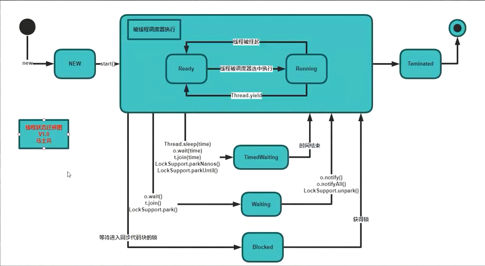
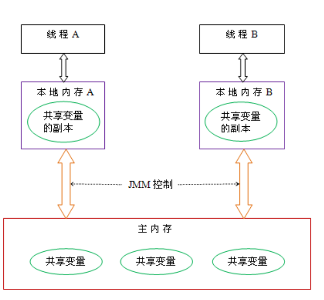
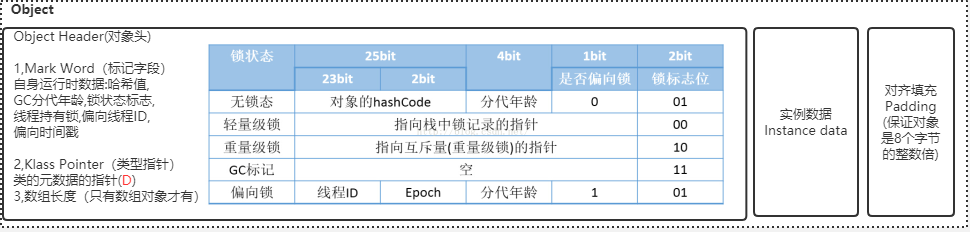
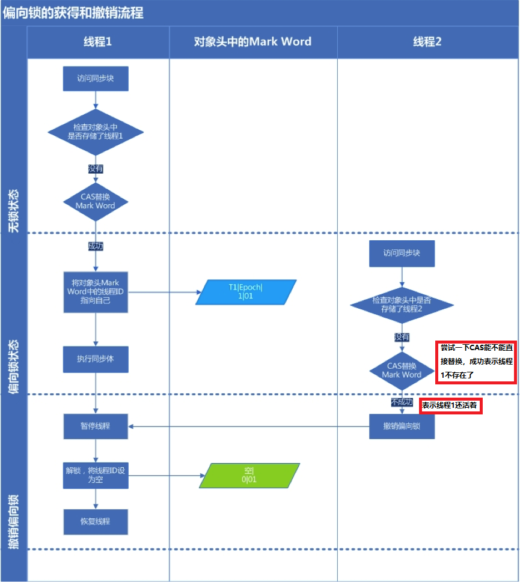
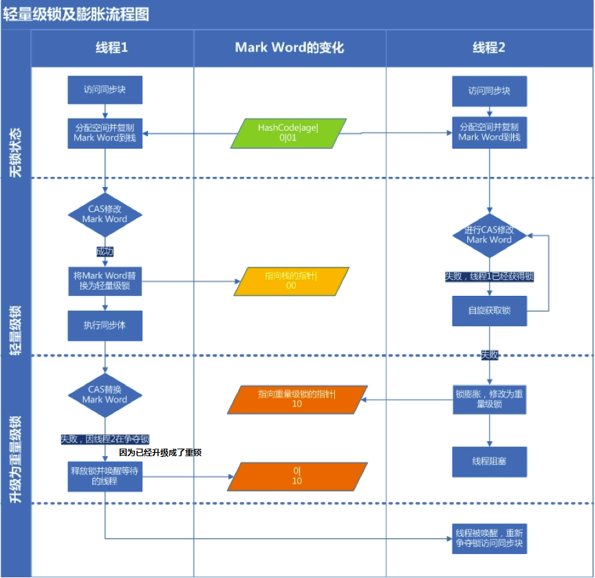
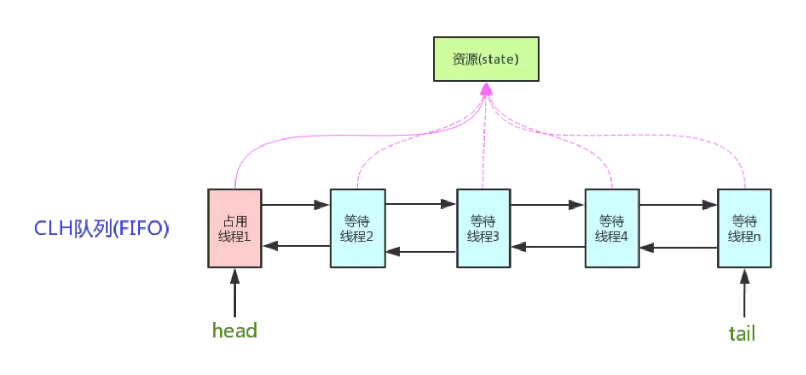
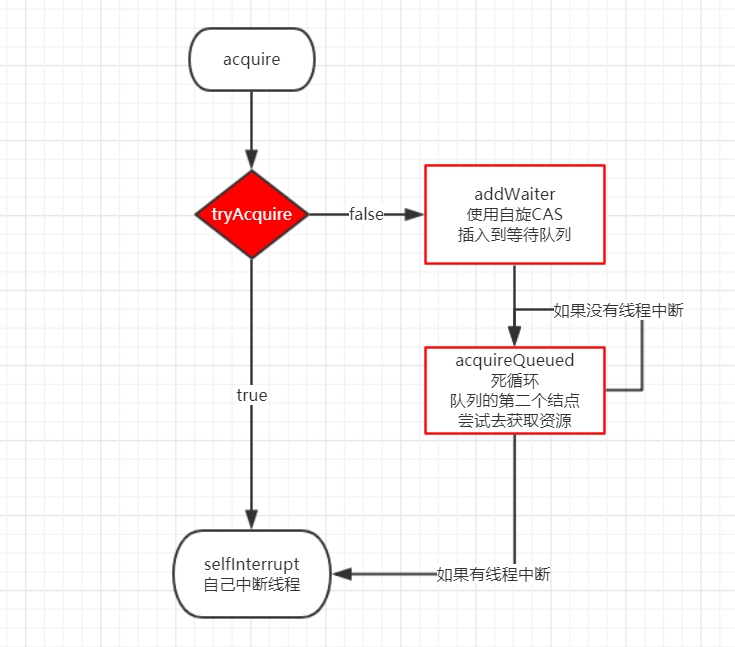
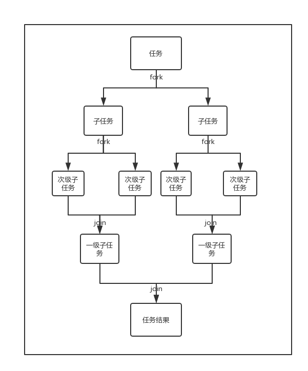
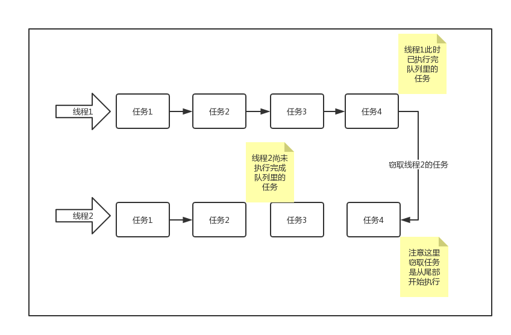
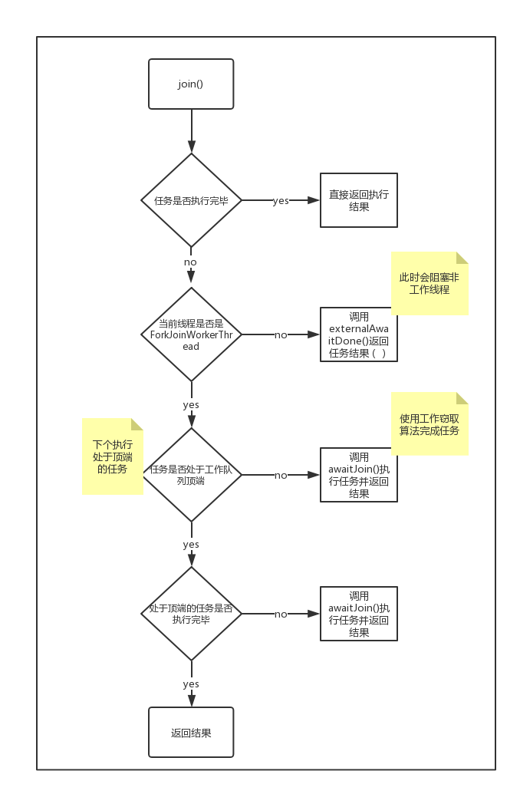

# 多线程-1并发模型之Java多线程

深入浅出Java多线程 http://concurrent.redspider.group/


廖雪峰老师Java教程 https://www.liaoxuefeng.com/wiki/1252599548343744/1304521607217185


JUC：java.util.concurrent


## 一 进程与线程的基本概念


### 1.1 进程

进程就是**应用程序在内存中分配的空间，也就是正在运行的程序**，各个进程之间互不干扰。同时进程保存着程序每一个时刻运行的状态。


此时，CPU采用**时间片轮转**的方式运行进程：CPU为每个进程分配一个时间段，称作它的时间片。如果在时间片结束时进程还在运行，则暂停这个进程的运行，并且CPU分配给另一个进程（这个过程叫做**上下文切换**）。如果进程在时间片结束前阻塞或结束，则CPU立即进行切换，不用等待时间片用完。


使用进程+CPU时间片轮转方式的操作系统，在宏观上看起来同一时间段执行多个任务，换句话说，**进程让操作系统的并发成为了可能**。虽然并发从宏观上看有多个任务在执行，但在事实上，对于**单核CPU**来说，**任意具体时刻都只有一个任务在占用CPU资源。**


### 1.2 线程

那么能不能让这些子任务同时执行呢？于是人们又提出了线程的概念，**让一个线程执行一个子任务，这样一个进程就包含了多个线程，每个线程负责一个单独的子任务。**


### 1.3 进程和线程

进程让操作系统的并发性成为了可能，而线程让进程的内部并发成为了可能。


### 1.4 区别

**多进程的方式也可以实现并发，为什么我们要使用多线程？**

多进程方式确实可以实现并发，但使用多线程，有以下几个好处：

- 进程间的通信比较复杂，而线程间的通信比较简单，通常情况下，我们需要使用共享资源，这些资源在线程间的通信比较容易。
- 进程是重量级的，而线程是轻量级的，故多线程方式的系统开销更小。


**进程和线程的区别**

进程是一个独立的运行环境，而线程是在进程中执行的一个任务。他们两个本质的区别是**是否单独占有内存地址空间及其它系统资源（比如I/O）**：

- 进程单独占有一定的内存地址空间，所以进程间存在**内存隔离**，数据是分开的，数据共享复杂但是同步简单，各个进程之间互不干扰；而**线程共享**所属进程占有的内存地址空间和资源，数据共享简单，但是同步复杂。
- 进程单独占有一定的内存地址空间，一个进程出现问题不会影响其他进程，不影响主程序的稳定性，可靠性高；一个线程崩溃可能影响整个程序的稳定性，可靠性较低。
- 进程单独占有一定的内存地址空间，进程的创建和销毁不仅需要保存寄存器和栈信息，还需要资源的分配回收以及页调度，开销较大；线程只需要保存寄存器和栈信息，开销较小。

另外一个重要区别是，**进程是操作系统进行资源分配的基本单位，而线程是操作系统进行调度的基本单位**，即CPU分配时间的单位 。


### 1.5 上下文切换


上下文切换（有时也称做进程切换或任务切换）是指 CPU 从一个进程（或线程）切换到另一个进程（或线程）。上下文是指**某一时间点 CPU 寄存器和程序计数器的内容。**

寄存器是cpu内部的少量的速度很快的闪存，通常存储和访问计算过程的中间值提高计算机程序的运行速度。

程序计数器是一个专用的寄存器，用于表明指令序列中 CPU 正在执行的位置，存的值为正在执行的指令的位置或者下一个将要被执行的指令的位置，具体实现依赖于特定的系统。

举例说明 线程A - B

1.先挂起线程A，将其在cpu中的状态保存在内存中。

2.在内存中检索下一个线程B的上下文并将其在 CPU 的寄存器中恢复,执行B线程。

3.当B执行完，根据程序计数器中指向的位置恢复线程A。

CPU通过为每个线程分配CPU时间片来实现多线程机制。CPU通过时间片分配算法来循环执行任务，当前任务执行一个时间片后会切换到下一个任务。

但是，在切换前会保存上一个任务的状态，以便下次切换回这个任务时，可以再加载这个任务的状态。所以任务从保存到再加载的过程就是一次上下文切换。

上下文切换通常是计算密集型的，意味着此操作会**消耗大量的 CPU 时间，故线程也不是越多越好**。如何减少系统中上下文切换次数，是提升多线程性能的一个重点课题。


## 二 Java多线程入门类和接口


### 2.1 线程的创建方式

1. 继承Thread

2. 实现Runnable

3. 实现Callable(带返回值 和 尝试取消)


### 2.2 Thread 与 Runnable关系

```
// Thread类源码 

// 片段1 - init方法
private void init(ThreadGroup g, Runnable target, String name,
                      long stackSize, AccessControlContext acc,
                      boolean inheritThreadLocals)

// 片段2 - 构造函数调用init方法
public Thread(Runnable target) {
    init(null, target, "Thread-" + nextThreadNum(), 0);
}

// 片段3 - 使用在init方法里初始化AccessControlContext类型的私有属性
this.inheritedAccessControlContext = 
    acc != null ? acc : AccessController.getContext();

// 片段4 - 两个对用于支持ThreadLocal的私有属性
ThreadLocal.ThreadLocalMap threadLocals = null;
ThreadLocal.ThreadLocalMap inheritableThreadLocals = null;
```


### 2.3 Thread类与Runnable接口的优劣比较

- 由于Java“单继承，多实现”的特性，Runnable接口使用起来比Thread更灵活。
- Runnable接口出现更符合面向对象，将线程单独进行对象的封装。
- Runnable接口出现，降低了线程对象和线程任务的耦合性。
- 如果使用线程时不需要使用Thread类的诸多方法，显然使用Runnable接口更为轻量。
- 所以，我们通常优先使用“实现Runnable接口”这种方式来自定义线程类。


### 2.4 Future 和 FutureTask

- 通常来说，我们使用Runnable和Thread来创建一个新的线程。但是它们有一个弊端，就是run方法是没有返回值的。而有时候我们希望开启一个线程去执行一个任务，并且这个任务执行完成后有一个返回值。
- Future只是一个接口，而它里面的cancel，get，isDone等方法要自己实现起来都是非常复杂的。所以JDK提供了一个FutureTask类来供我们使用。
- 很多高并发的环境下，有可能Callable和FutureTask会创建多次。**FutureTask能够在高并发环境下确保任务只执行一次**


## 三  线程组和线程优先级


### 3.1 线程组(ThreadGroup)

Java中用ThreadGroup来表示线程组，我们可以使用线程组对线程进行批量控制。


ThreadGroup和Thread的关系就如同他们的字面意思一样简单粗暴，每个Thread必然存在于一个ThreadGroup中，Thread不能独立于ThreadGroup存在。执行main()方法线程的名字是main，如果在new Thread时没有显式指定，**那么默认将父线程（当前执行new Thread的线程）**线程组设置为自己的线程组。


### 3.2 线程优先级

Java中线程优先级可以指定，范围是1~10。但是并不是所有的操作系统都支持10级优先级的划分（比如有些操作系统只支持3级划分：低，中，高），Java只是给操作系统一个优先级的**参考值**，线程最终**在操作系统的优先级**是多少还是由操作系统决定。


既然有1-10的级别来设定了线程的优先级，这时候可能有些读者会问，那么我是不是可以在业务实现的时候，采用这种方法来指定一些线程执行的先后顺序？


对于这个问题，我们的答案是:No!

Java中的优先级来说不是特别的可靠，**Java程序中对线程所设置的优先级只是给操作系统一个建议，操作系统不一定会采纳。而真正的调用顺序，是由操作系统的线程调度算法决定的**。


### 3.3 守护线程

如果某线程是守护线程，那如果所有的非守护线程结束，这个守护线程也会自动结束。


我们有谈到一个线程必然存在于一个线程组中，那么当线程和线程组的优先级不一致的时候将会怎样呢

所以，如果某个线程优先级大于线程所在**线程组的最大优先级**，那么该线程的优先级将会失效，取而代之的是线程组的最大优先级。


## 四 Java线程的状态及主要转化方法


### 4.1 线程状态

- NEW： 新建状态，还未调用start()
- RUNNABLE：正在运行状态，正在运行run()，RUNNABLE包括了传统操作系统线程的ready和running两个状态的
- BLOCKED：阻塞状态，运行中的线程，因为某些操作被阻塞而挂起
- WAITING：等待状态，运行中的线程，因为某些操作在等待中
- TIMED_WAITING：超时等待状态，运行中的线程，因为执行sleep()方法正在计时等待
- TERMINATED：线程已终止，因为run()方法执行完毕


假如今天你下班后准备去食堂吃饭。你来到食堂仅有的一个窗口，发现前面已经有个人在窗口前了，此时你必须得等前面的人从窗口离开才行。

假设你是线程t2，你前面的那个人是线程t1。此时t1占有了锁（食堂唯一的窗口），t2正在等待锁的释放，所以此时t2就处于BLOCKED状态。


你等了好几分钟现在终于轮到你了，突然你们有一个“不懂事”的经理突然来了。你看到他你就有一种不祥的预感，果然，他是来找你的。

他把你拉到一旁叫你待会儿再吃饭，说他下午要去作报告，赶紧来找你了解一下项目的情况。你心里虽然有一万个不愿意但是你还是从食堂窗口走开了。

此时，假设你还是线程t2，你的经理是线程t1。虽然你此时都占有锁（窗口）了，“不速之客”来了你还是得释放掉锁。此时你t2的状态就是WAITING。然后经理t1获得锁，进入RUNNABLE状态。

要是经理t1不主动唤醒你t2（notify、notifyAll..），可以说你t2只能一直等待了。


到了第二天中午，又到了饭点，你还是到了窗口前。

突然间想起你的同事叫你等他一起，他说让你等他十分钟他改个bug。

好吧，你说那你就等等吧，你就离开了窗口。很快十分钟过去了，你见他还没来，你想都等了这么久了还不来，那你还是先去吃饭好了。

这时你还是线程t1，你改bug的同事是线程t2。t2让t1等待了指定时间，此时t1等待期间就属于TIMED_WATING状态。

t1等待10分钟后，就自动唤醒，拥有了去争夺锁的资格。





### 4.2 线程中断

在某些情况下，我们在线程启动后发现并不需要它继续执行下去时，需要中断线程。目前在Java里还没有安全直接的方法来停止线程，但是Java提供了线程中断机制来处理需要中断线程的情况。


### 4.3 线程方法

```
join / yield / sleep

Thread
// 启动
public synchronized void start() {}

// 它的作用是让当前线程陷入“等待”状态，等join的这个线程执行完成后，再继续执行当前线程。
public final void join() throws InterruptedException {}

// 尝试中断
public void interrupt() {}

// 是否中断
public boolean isInterrupted() {}

// 使当前线程睡眠一段时间，会释放CPU资源，但不释放锁
public static native void sleep(long millis) throws InterruptedException;

// yield在英语里有放弃的意思，同样，这里的yield()指的是当前线程愿意让出对当前处理器的占用。
// 这里需要注意的是，就算当前线程调用了yield()方法，程序在调度的时候，也还有可能继续运行这个线程的；
public static native void yield();

// 返回对当前正在执行的线程对象的引用
public static native Thread currentThread();
```


```
wait / notify / notifyAll
Object
// 会释放CPU资源，会释放锁
// 它不是一个普通的Java方法，而是定义在Object类的一个native方法，也就是由JVM的C代码实现的。其次，必须在synchronized块中才能调用wait()方法
public final native void wait(long timeout) throws InterruptedException;

// 内部调用了this.notifyAll()而不是this.notify()，
// 使用notifyAll()将唤醒所有当前正在this锁等待的线程，而notify()只会唤醒其中一个（具体哪个依赖操作系统，有一定的随机性）
public final native void notify();
```


**获取当前方法的名称**

```
Thread.currentThread().getStackTrace()[1].getMethodName()
```


## 五 Java线程间的通信

### 5.1 线程通信

在Java中，锁的概念都是基于**对象**的，所以我们又经常称它为对象锁。


### 5.2 锁与同步

**线程同步**

线程同步是线程之间按照**一定的顺序**执行。

```
synchronized
```


### 5.3 等待/通知机制

Java多线程的等待/通知机制是基于Object类的wait()方法和notify(), notifyAll()方法来实现的。


### 5.4 信号量 - volatile

JDK提供了一个类似于“信号量”功能的类Semaphore。但本文不是要介绍这个类，而是介绍一种基于volatile关键字的自己实现的信号量通信。


volitile关键字能够保证内存的可见性，如果用volitile关键字声明了一个变量，在一个线程里面改变了这个变量的值，那其它线程是立马可见更改后的值的。


但不保证原子性


### 5.5 管道

管道是基于“管道流”的通信方式。JDK提供了PipedWriter、 PipedReader、 PipedOutputStream、 PipedInputStream。其中，前面两个是基于字符的，后面两个是基于字节流的。


### 5.6 join()

join()方法是Thread类的一个实例方法。它的作用是让当前线程陷入“等待”状态，等join的这个线程执行完成后，再继续执行当前线程。

线程 thread：join的这个线程

线程 main：当前线程

```
public static void main(String[] args) throws InterruptedException{
    Thread thread = new Thread(new ThreadA());
    thread.start();
    // 如果无，会先打印----等待线程 thread执行完毕，再执行当前线程 这句话
    thread.join();
    System.out.println("等待线程 thread执行完毕，再执行当前线程 这句话");
}
```


### 5.7 sleep() 和wait()

- wait可以指定时间，也可以不指定；而sleep必须指定时间。
- wait释放cpu资源，同时释放锁；sleep释放cpu资源，但是不释放锁，所以易死锁。
- wait必须放在同步块或同步方法中，而sleep可以再任意位置


最⼤的不同是在等待时wait会释放锁，⽽sleep⼀直持有锁。

- wait()⽅法会释放CPU执⾏权 和 占有的锁。
- sleep(long)⽅法仅释放CPU使⽤权，锁仍然占⽤；线程被放⼊超时等待队列，与yield相⽐，它会使线程较⻓时间得不到运 
- ⾏。
- yield()⽅法仅释放CPU执⾏权，锁仍然占⽤，线程会被放⼊就绪队列，会在短时间内再次执⾏
- wait和notify必须配套使⽤，即必须使⽤同⼀把锁调⽤
- wait和notify必须放在⼀个同步块中调⽤wait和notify的对象必须是他们所处同步块的锁对象。


### 5.8 ThreadLocal

可以看到，虽然两个线程使用的同一个ThreadLocal实例（通过构造方法传入），但是它们各自可以存取自己当前线程的一个值。

那ThreadLocal有什么作用呢？如果只是单纯的想要线程隔离，在每个线程中声明一个私有变量就好了呀，为什么要使用ThreadLocal？

如果开发者希望将类的某个静态变量（user ID或者transaction ID）与线程状态关联，则可以考虑使用ThreadLocal。


简单说ThreadLocal就是一种以空间换时间的做法，在每个Thread里面维护了一个以开地址法实现的ThreadLocal.ThreadLocalMap，把数据进行隔离，数据不共享，自然就没有线程安全方面的问题了


**ThreadLocal原理**

ThreadLocal 内部维护的是⼀个类似 Map 的 ThreadLocalMap 数据结构， key 为当前对象的 Thread 对象，值为 Object 对象。

```
public class Thread implements Runnable {
 ......
//与此线程有关的ThreadLocal值。由ThreadLocal类维护
ThreadLocal.ThreadLocalMap threadLocals = null;
//与此线程有关的InheritableThreadLocal值。由InheritableThreadLocal类维护
ThreadLocal.ThreadLocalMap inheritableThreadLocals = null;
 ......
}

public void set(T value) {
     Thread t = Thread.currentThread();
     ThreadLocalMap map = getMap(t);
     if (map êX null)
        map.set(this, value);
     else
        createMap(t, value);
     }
     ThreadLocalMap getMap(Thread t) {
     return t.threadLocals;
 }
```

**ThreadLocal 内存泄露问题**

ThreadLocalMap 中使⽤的 key 为 ThreadLocal 的弱引⽤,⽽ value 是强引⽤。所以，如果 ThreadLocal 没有被外部强引⽤的情况下，在垃圾回收的时候，**key 会被清理掉，⽽ value 不会被 清理掉**。这样⼀来， ThreadLocalMap 中就会出现**key为null的Entry**。假如我们不做任何措施的话， value 永远⽆法被GC 回收，这个时候就可能会产⽣内存泄露。ThreadLocalMap实现中已经考虑了这种 情况，在调⽤ set() 、 get() 、 remove() ⽅法的时候，会清理掉 key 为 null 的记录。**使⽤完 ThreadLocal ⽅法后 最好⼿动调⽤ remove() ⽅法**

```
    static class ThreadLocalMap {

        /**
         * The entries in this hash map extend WeakReference, using
         * its main ref field as the key (which is always a
         * ThreadLocal object).  Note that null keys (i.e. entry.get()
         * == null) mean that the key is no longer referenced, so the
         * entry can be expunged from table.  Such entries are referred to
         * as "stale entries" in the code that follows.
         */
        static class Entry extends WeakReference<ThreadLocal<?>> {
            /** The value associated with this ThreadLocal. */
            Object value;

            Entry(ThreadLocal<?> k, Object v) {
                super(k);
                value = v;
            }
        }
```


## 六 Java内存模型基础知识


### 6.1 并发编程模型的两个关键问题

- 线程间如何通信？即：线程之间以何种机制来交换信息
- 线程间如何同步？即：线程以何种机制来控制不同线程间操作发生的相对顺序

有两种并发模型可以解决这两个问题：

- 消息传递并发模型
- 共享内存并发模型

这两种模型之间的区别如下表所示：


**在Java中，使用的是共享内存并发模型**。


### 6.2 既然堆是共享的，为什么在堆中会有内存不可见问题？



从图中可以看出：

1. 所有的共享变量都存在主内存中。
2. 每个线程都保存了一份该线程使用到的共享变量的副本。
3. 如果线程A与线程B之间要通信的话，必须经历下面2个步骤：

1. 1. 线程A将本地内存A中更新过的共享变量刷新到主内存中去。
   2. 线程B到主内存中去读取线程A之前已经更新过的共享变量。


**所以，线程A无法直接访问线程B的工作内存，线程间通信必须经过主内存。**


注意，根据JMM的规定，**线程对共享变量的所有操作都必须在自己的本地内存中进行，不能直接从主内存中读取**。


所以线程B并不是直接去主内存中读取共享变量的值，而是先在本地内存B中找到这个共享变量，发现这个共享变量已经被更新了，然后本地内存B去主内存中读取这个共享变量的新值，并拷贝到本地内存B中，最后线程B再读取本地内存B中的新值。


### 6.3 volatile  和 synchronized

Java中的volatile关键字可以保证多线程操作共享变量的可见性以及禁止指令重排序，synchronized关键字不仅保证可见性，同时也保证了原子性（互斥性）。在更底层，JMM通过内存屏障来实现内存的可见性以及禁止重排序。为了程序员的方便理解，提出了happens-before，它更加的简单易懂，从而避免了程序员为了理解内存可见性而去学习复杂的重排序规则以及这些规则的具体实现方法。这里涉及到的所有内容后面都会有专门的章节介绍。


## 七 重排序与happens-before


### 7.1什么是重排序？

计算机在执行程序时，为了提高性能，编译器和处理器常常会对指令做重排。


指令重排一般分为以下三种：

- **编译器优化重排**

编译器在**不改变单线程程序语义**的前提下，可以重新安排语句的执行顺序。

- **指令并行重排**

现代处理器采用了指令级并行技术来将多条指令重叠执行。如果**不存在数据依赖性**(即后一个执行的语句无需依赖前面执行的语句的结果)，处理器可以改变语句对应的机器指令的执行顺序。

- **内存系统重排**

由于处理器使用缓存和读写缓存冲区，这使得加载(load)和存储(store)操作看上去可能是在乱序执行，因为三级缓存的存在，导致内存与缓存的数据同步存在时间差。

**指令重排可以保证串行语义一致，但是没有义务保证多线程间的语义也一致**。所以在多线程下，指令重排序可能会导致一些问题。


### 7.2 顺序一致性模型与JMM的保证


### 7.3 什么是happens-before?


happens-before关系的定义如下：

1. 如果一个操作happens-before另一个操作，那么第一个操作的执行结果将对第二个操作可见，而且第一个操作的执行顺序排在第二个操作之前。
2. **两个操作之间存在happens-before关系，并不意味着Java平台的具体实现必须要按照happens-before关系指定的顺序来执行。如果重排序之后的执行结果，与按happens-before关系来执行的结果一致，那么JMM也允许这样的重排序。**

happens-before关系本质上和as-if-serial语义是一回事。

as-if-serial语义保证单线程内重排序后的执行结果和程序代码本身应有的结果是一致的，happens-before关系保证正确同步的多线程程序的执行结果不被重排序改变。

总之，**如果操作A happens-before操作B，那么操作A在内存上所做的操作对操作B都是可见的，不管它们在不在一个线程。**


## 八 volatile

### 8.1 内存可见性

**内存可见性，指的是线程之间的可见性，当一个线程修改了共享变量时，另一个线程可以读取到这个修改后的值**。


### 8.2 重排序

为优化程序性能，对原有的指令执行顺序进行优化重新排序。重排序可能发生在多个阶段，比如编译重排序、CPU重排序等。


### 8.3 happens-before规则

是一个给程序员使用的规则，只要程序员在写代码的时候遵循happens-before规则，JVM就能保证指令在多线程之间的顺序性符合程序员的预期。


### 8.4 volatile的内存定义


在Java中，volatile关键字有特殊的内存语义。volatile主要有以下两个功能：

- 保证变量的**内存可见性**
- 禁止volatile变量与普通变量**重排序**（JSR133提出，Java 5 开始才有这个“增强的volatile内存语义”）

**指令重排可以保证串行语义一致，但是没有义务保证多线程间的语义也一致**。所以在多线程下，指令重排序可能会导致一些问题。


### 8.5 禁止重排序

在JSR-133之前的旧的Java内存模型中，是允许volatile变量与普通变量重排序的。那上面的案例中，可能就会被重排序成下列时序来执行：

1. 线程A写volatile变量，step 2，设置flag为true；
2. 线程B读同一个volatile，step 3，读取到flag为true；
3. 线程B读普通变量，step 4，读取到 a = 0；
4. 线程A修改普通变量，step 1，设置 a = 1；


可见，如果volatile变量与普通变量发生了重排序，虽然volatile变量能保证内存可见性，也可能导致普通变量读取错误。

所以在旧的内存模型中，volatile的写-读就不能与锁的释放-获取具有相同的内存语义了。为了提供一种比锁更轻量级的**线程间的通信机制**，**JSR-133**专家组决定增强volatile的内存语义：严格限制编译器和处理器对volatile变量与普通变量的重排序。


编译器还好说，JVM是怎么还能限制处理器的重排序的呢？它是通过**内存屏障**来实现的。


什么是内存屏障？硬件层面，内存屏障分两种：读屏障（Load Barrier）和写屏障（Store Barrier）。内存屏障有两个作用：

1. 阻止屏障两侧的指令重排序；
2. 强制把写缓冲区/高速缓存中的脏数据等写回主内存，或者让缓存中相应的数据失效。

注意这里的缓存主要指的是CPU缓存，如L1，L2等


编译器在**生成字节码时**，会在指令序列中插入内存屏障来禁止特定类型的处理器重排序。编译器选择了一个**比较保守的JMM内存屏障插入策略**，这样可以保证在任何处理器平台，任何程序中都能得到正确的volatile内存语义。这个策略是：

- 在每个volatile写操作前插入一个StoreStore屏障；
- 在每个volatile写操作后插入一个StoreLoad屏障；
- 在每个volatile读操作后插入一个LoadLoad屏障；
- 在每个volatile读操作后再插入一个LoadStore屏障。


再介绍一下volatile与普通变量的重排序规则:

1. 如果第一个操作是volatile读，那无论第二个操作是什么，都不能重排序；
2. 如果第二个操作是volatile写，那无论第一个操作是什么，都不能重排序；
3. 如果第一个操作是volatile写，第二个操作是volatile读，那不能重排序。


### 8.6 用途

从volatile的内存语义上来看，volatile可以保证内存可见性且禁止重排序。

在保证内存可见性这一点上，volatile有着与锁相同的内存语义，所以可以作为一个“轻量级”的锁来使用。但由于volatile仅仅保证对单个volatile变量的读/写具有原子性，而锁可以保证整个**临界区代码**的执行具有原子性。所以**在功能上，锁比volatile更强大；在性能上，volatile更有优势**。


例子：双重锁检验 单例模式


## 九 synchronized与锁


## 9.0 可重入锁

Java的synchronized锁是可重入锁

JVM允许同一个线程重复获取同一个锁，这种能被同一个线程反复获取的锁，就叫做可重入锁


### 9.1 synchronized

对于static方法，是没有this实例的，因为static方法是针对类而不是实例。但是我们注意到任何一个类都有一个由JVM自动创建的Class实例，因此，对static方法添加synchronized，锁住的是该类的Class实例。因为每一次锁都创建一个对象不方便，因此最简单的就是锁住当前类实例。

```
synchronized(this){}
```


JVM对于synchronized的实现：

我们知道sync锁定的是class实例，也就是对象。JVM通过在对象头中进行标记，表示是否占有锁。sync会有锁升级的一个概念。


### 9.2 临界区

我们这里介绍一下“临界区”的概念。所谓“临界区”，指的是某一块代码区域，它同一时刻只能由一个线程执行。在上面的例子中，如果synchronized关键字在方法上，那临界区就是整个方法内部。而如果是使用synchronized代码块，那临界区就指的是代码块内部的区域。

```
synchronized void test(){}
等于
void test(){
    synchronized(this){}
}

class T{
    synchronized static void test(){}
}
等于
class T{
    void test(){
        synchronized(T.class){}
        // 每一个class文件load到内存后，会生成一个对应的class对象。
    }
}
```


### 9.3 锁

Java 6 为了减少获得锁和释放锁带来的性能消耗，引入了“偏向锁”和“轻量级锁“。在Java 6 以前，所有的锁都是”重量级“锁。所以在Java 6 及其以后，一个对象其实有四种锁状态，它们级别由低到高依次是：

1. 无锁状态
2. 偏向锁状态
3. 轻量级锁状态
4. 重量级锁状态

无锁就是没有对资源进行锁定，任何线程都可以尝试去修改它，无锁在这里不再细讲。


几种锁会随着竞争情况逐渐升级，锁的升级很容易发生，但是锁降级发生的条件会比较苛刻，锁降级发生在Stop The World期间，当JVM进入安全点的时候，会检查是否有闲置的锁，然后进行降级。

关于锁降级有两点说明：

1.不同于大部分文章说锁不能降级，实际上HotSpot JVM 是支持锁降级的，文末有链接。

2.上面提到的Stop The World期间，以及安全点，这些知识是属于JVM的知识范畴，本文不做细讲。


### 9.4 对象头

前面我们提到，Java的锁都是基于对象的。首先我们来看看一个对象的“锁”的信息是存放在什么地方的。

每个Java对象都有对象头。如果是非数组类型，则用2个字宽来存储对象头，如果是数组，则会用3个字宽来存储对象头。


在32位处理器中，一个字宽是32位；在64位虚拟机中，一个字宽是64位。对象头的内容如下表：

| 长度     | 内容                   | 说明                         |
| -------- | ---------------------- | ---------------------------- |
| 32/64bit | Mark Word              | 存储对象的hashCode或锁信息等 |
| 32/64bit | Class Metadata Address | 存储到对象类型数据的指针     |


如果是数组，则会用3个字宽来存储对象头

| 长度     | 内容                   | 说明                         |
| -------- | ---------------------- | ---------------------------- |
| 32/64bit | Mark Word              | 存储对象的hashCode或锁信息等 |
| 32/64bit | Class Metadata Address | 存储到对象类型数据的指针     |
| 32/64bit | Array length           | 数组的长度（如果是数组）     |


我们主要来看看Mark Word的格式：

| 锁状态   | 29 bit 或 61 bit             | 1 bit 偏向锁标记           | 2 bit 锁标志 |
| -------- | ---------------------------- | -------------------------- | ------------ |
| 无锁     |                              | 0                          | 01           |
| 偏向锁   | 线程ID                       | 1                          | 01           |
| 轻量级锁 | 指向栈中锁记录的指针         | -                          | 00           |
| 重量级锁 | 指向互斥量（重量级锁）的指针 | -                          | 10           |
| GC标记   |                              | 此时这一位不用于标识偏向锁 | 11           |

可以看到，当对象状态为偏向锁时，Mark Word存储的是偏向的线程ID；当状态为轻量级锁时，Mark Word存储的是指向线程栈中Lock Record的指针；当状态为重量级锁时，Mark Word为指向堆中的monitor对象的指针。





### 9.5 偏向锁


Hotspot的作者经过以往的研究发现大多数情况下**锁不仅不存在多线程竞争，而且总是由同一线程多次获得**，于是引入了偏向锁。

偏向锁会偏向于第一个访问锁的线程，如果在接下来的运行过程中，该锁没有被其他的线程访问，则持有偏向锁的线程将永远不需要触发同步。也就是说，**偏向锁在资源无竞争情况下消除了同步语句，连CAS操作都不做了，提高了程序的运行性能。**


大白话就是对锁置个变量，如果发现为true，代表资源无竞争，则无需再走各种加锁/解锁流程。如果为false，代表存在其他线程竞争资源，那么就会走后面的流程。


CAS: Compare and Swap

比较并设置。用于在硬件层面上提供原子性操作。在 Intel 处理器中，比较并交换通过指令cmpxchg实现。 比较是否和给定的数值一致，如果一致则修改，不一致则不修改。


**撤销偏向锁**

偏向锁使用了一种**等到竞争出现才释放锁的机制**，所以当其他线程尝试竞争偏向锁时， 持有偏向锁的线程才会释放锁。

偏向锁升级成轻量级锁时，会暂停拥有偏向锁的线程，重置偏向锁标识，这个过程看起来容易，实则开销还是很大的，大概的过程如下：

1. 在一个安全点（在这个时间点上没有字节码正在执行）停止拥有锁的线程。
2. 遍历线程栈，如果存在锁记录的话，需要修复锁记录和Mark Word，使其变成无锁状态。
3. 唤醒被停止的线程，将当前锁升级成轻量级锁。

所以，如果应用程序里所有的锁通常处于竞争状态，那么偏向锁就会是一种累赘，对于这种情况，我们可以一开始就把偏向锁这个默认功能给关闭：

-XX:UseBiasedLocking=false。




### 9.6 轻量级锁

多个线程在不同时段获取同一把锁，即不存在锁竞争的情况，也就没有线程阻塞。针对这种情况，JVM采用轻量级锁来避免线程的阻塞与唤醒。


**轻量级锁的加锁**

JVM会为每个线程在当前线程的栈帧中创建用于存储锁记录的空间，我们称为Displaced Mark Word。如果一个线程获得锁的时候发现是轻量级锁，会把锁的Mark Word复制到自己的Displaced Mark Word里面。

然后线程尝试用CAS将锁的Mark Word替换为指向锁记录的指针。如果成功，当前线程获得锁，如果失败，表示Mark Word已经被替换成了其他线程的锁记录，说明在与其它线程竞争锁，当前线程就尝试使用自旋来获取锁。

自旋：不断尝试去获取锁，一般用循环来实现。

自旋是需要消耗CPU的，如果一直获取不到锁的话，那该线程就一直处在自旋状态，白白浪费CPU资源。解决这个问题最简单的办法就是指定自旋的次数，例如让其循环10次，如果还没获取到锁就进入阻塞状态。

但是JDK采用了更聪明的方式——适应性自旋，简单来说就是线程如果自旋成功了，则下次自旋的次数会更多，如果自旋失败了，则自旋的次数就会减少。

自旋也不是一直进行下去的，如果自旋到一定程度（和JVM、操作系统相关），依然没有获取到锁，称为自旋失败，那么这个线程会阻塞。同时这个锁就会**升级成重量级锁**。

**轻量级锁的释放：**




### 9.7 重量级锁

重量级锁依赖于操作系统的互斥量（mutex） 实现的，而操作系统中线程间状态的转换需要相对比较长的时间，所以重量级锁效率很低，但被阻塞的线程不会消耗CPU。


### 9.8 总结锁的升级流程

每一个线程在准备获取共享资源时： 第一步，检查MarkWord里面是不是放的自己的ThreadId ,如果是，表示当前线程是处于 “偏向锁” 。

第二步，如果MarkWord不是自己的ThreadId，锁升级，这时候，用CAS来执行切换，新的线程根据MarkWord里面现有的ThreadId，通知之前线程暂停，之前线程将Markword的内容置为空。

第三步，两个线程都把锁对象的HashCode复制到自己新建的用于存储锁的记录空间，接着开始通过CAS操作， 把锁对象的MarKword的内容修改为自己新建的记录空间的地址的方式竞争MarkWord。

第四步，第三步中成功执行CAS的获得资源，失败的则进入自旋 。

第五步，自旋的线程在自旋过程中，成功获得资源(即之前获的资源的线程执行完成并释放了共享资源)，则整个状态依然处于 轻量级锁的状态，如果自旋失败 。

第六步，进入重量级锁的状态，这个时候，自旋的线程进行阻塞，等待之前线程执行完成并唤醒自己。


### 9.9 优缺点

《Java并发编程的艺术》

| 锁       | 优点                                                         | 缺点                                             | 适用场景                             |
| -------- | ------------------------------------------------------------ | ------------------------------------------------ | ------------------------------------ |
| 偏向锁   | 加锁和解锁不需要额外的消耗，和执行非同步方法比仅存在纳秒级的差距。 | 如果线程间存在锁竞争，会带来额外的锁撤销的消耗。 | 适用于只有一个线程访问同步块场景。   |
| 轻量级锁 | 竞争的线程不会阻塞，提高了程序的响应速度。                   | 如果始终得不到锁竞争的线程使用自旋会消耗CPU。    | 追求响应时间。同步块执行速度非常快。 |
| 重量级锁 | 线程竞争不使用自旋，不会消耗CP                               |                                                  |                                      |


## 十 乐观锁和悲观锁


### 10.1 乐观锁和悲观锁

锁可以从不同的角度分类。其中，乐观锁和悲观锁是一种分类方式。

**悲观锁：**

悲观锁就是我们常说的锁。对于悲观锁来说，它总是认为每次访问共享资源时会发生冲突，所以必须对每次数据操作加上锁，以保证临界区的程序同一时间只能有一个线程在执行。

**乐观锁：**

乐观锁又称为“无锁”，顾名思义，它是乐观派。乐观锁总是假设对共享资源的访问没有冲突，线程可以不停地执行，无需加锁也无需等待。而一旦多个线程发生冲突，乐观锁通常是使用一种称为CAS的技术来保证线程执行的安全性。

由于无锁操作中没有锁的存在，因此不可能出现死锁的情况，也就是说**乐观锁天生免疫死锁**。

乐观锁多用于“读多写少“的环境，避免频繁加锁影响性能；而悲观锁多用于”写多读少“的环境，避免频繁失败和重试影响性能。


### 10.2 CAS

CAS的全称是：比较并交换（Compare And Swap）。在CAS中，有这样三个值：

- V：要更新的变量(var)
- E：预期值(expected) 
- N：新值(new)

比较并交换的过程如下：

判断V是否等于E，如果等于，将V的值设置为N；如果不等，说明已经有其它线程更新了V，则当前线程放弃更新，什么都不做。

所以这里的**预期值E本质上指的是“旧值”**。


我们以一个简单的例子来解释这个过程：

1. 如果有一个多个线程共享的变量i原本等于5，我现在在线程A中，想把它设置为新的值6;
2. 我们使用CAS来做这个事情；
3. 首先我们用i去与5对比，发现它等于5，说明没有被其它线程改过，那我就把它设置为新的值6，此次CAS成功，i的值被设置成了6；
4. 如果不等于5，说明i被其它线程改过了（比如现在i的值为2），那么我就什么也不做，此次CAS失败，i的值仍然为2。

在这个例子中，i就是V，5就是E，6就是N。


那有没有可能我在判断了i为5之后，正准备更新它的新值的时候，被其它线程更改了i的值呢？

不会的。因为CAS是一种原子操作，它是一种系统原语，是一条CPU的原子指令，从CPU层面保证它的原子性


java.util.concurrent.atomic下乐观锁就是CAS的一种实现

#### CAS缺点

- ABA问题。⽐如说⼀个线程one从内存位置V中取出A，这时候另⼀个线程two也从内存中取出A，并且two进⾏了⼀些操作变成了B，然 后two⼜将V位置的数据变成A，这时候线程one进⾏CAS操作发现内存中仍然是A，然后one操作成功。尽管线程one的CAS 操作成功，但可能存在潜藏的问题。从Java1.5开始JDK的atomic包⾥提供了⼀个类AtomicStampedReference来解决 ABA问题。
- 循环时间长开销大。CAS自旋的概率大，从而浪费更多的CPU资源
- 只能保证一个共享变量的原子操作


### 10.3 Java实现CAS - Unsafe类

前面提到，CAS是一种原子操作。那么Java是怎样来使用CAS的呢？我们知道，在Java中，如果一个方法是native的，那Java就不负责具体实现它，而是交给底层的JVM使用c或者c++去实现。

在Java中，有一个Unsafe类，它在sun.misc包中。它里面是一些native方法，其中就有几个关于CAS的：

```
boolean compareAndSwapObject(Object o, long offset,Object expected, Object x);
boolean compareAndSwapInt(Object o, long offset,int expected,int x);
boolean compareAndSwapLong(Object o, long offset,long expected,long x);
```


### 10.4 原子操作-AtomicInteger类源码简析

Atomic： 原子性


AtomicInteger 类主要利⽤ **CAS (compare and swap) + volatile 和 native** ⽅法来保证原⼦操作， 从⽽避免 synchronized 的⾼开销，执⾏效率⼤为提升。 CAS的原理是拿期望的值和原本的⼀个值作⽐᫾，如果相同则更新成新的值。UnSafe 类的 objectFieldOffset() ⽅法是⼀个本地⽅法，这个⽅法是⽤来拿到“原来的值”的内存地址，返回值是 valueOffset。另外 value 是⼀个volatile变量，在内存中可⻅，因此 JVM 可以保证任何时刻任何线 程总能拿到该变量的最新值。

```
public class AtomicInteger extends Number implements java.io.Serializable {
    private static final long serialVersionUID = 6214790243416807050L;

    // setup to use Unsafe.compareAndSwapInt for updates
    private static final Unsafe unsafe = Unsafe.getUnsafe();
    private static final long valueOffset;

    static {
        try {
            valueOffset = unsafe.objectFieldOffset
                (AtomicInteger.class.getDeclaredField("value"));
        } catch (Exception ex) { throw new Error(ex); }
    }

    private volatile int value;
```


### 10.5 CAS实现原子操作的三大问题


**ABA问题**

所谓ABA问题，就是一个值原来是A，变成了B，又变回了A。这个时候使用CAS是检查不出变化的，但实际上却被更新了两次。

ABA问题的解决思路是在变量前面追加上**版本号或者时间戳**。从JDK 1.5开始，JDK的atomic包里提供了一个类AtomicStampedReference类来解决ABA问题


这个类的compareAndSet方法的作用是首先检查当前引用是否等于预期引用，并且检查当前标志是否等于预期标志，如果二者都相等，才使用CAS设置为新的值和标志。


**循环时间长开销大**

CAS多与自旋结合。如果自旋CAS长时间不成功，会占用大量的CPU资源。

解决思路是让JVM支持处理器提供的**pause指令**。

pause指令能让自旋失败时cpu睡眠一小段时间再继续自旋，从而使得读操作的频率低很多,为解决内存顺序冲突而导致的CPU流水线重排的代价也会小很多。


**只能保证一个共享变量的原子操作**

这个问题你可能已经知道怎么解决了。有两种解决方案：

1. 使用JDK 1.5开始就提供的AtomicReference类保证对象之间的原子性，把多个变量放到一个对象里面进行CAS操作；
2. 使用锁。锁内的临界区代码可以保证只有当前线程能操作。


## 十一   AQS


### 11.1 AQS简介

**AQS**是AbstractQueuedSynchronizer的简称，即抽象队列同步器，从字面意思上理解:

- 抽象：抽象类，只实现一些主要逻辑，有些方法由子类实现；
- 队列：使用先进先出（FIFO）队列存储数据；
- 同步：实现了同步的功能。

那AQS有什么用呢？AQS是一个用来构建锁和同步器的框架，使用AQS能简单且高效地构造出应用广泛的同步器，比如我们提到的ReentrantLock，Semaphore，ReentrantReadWriteLock，SynchronousQueue，FutureTask等等皆是基于AQS的。

当然，我们自己也能利用AQS非常轻松容易地构造出符合我们自己需求的同步器，只要之类实现它的几个protected方法就可以了，在下文会有详细的介绍。


### 11.2  AQS的数据结构

AQS核⼼思想是，如果被请求的共享资源空闲，则将当前请求资源的线程设置为有效的⼯作线程，并且 将共享资源设置为锁定状态。如果被请求的共享资源被占⽤，那么就需要⼀套线程阻塞等待以及被唤醒 时锁分配的机制，这个机制AQS是⽤CLH队列(**Craig,Landin,and Hagersten队列是⼀个虚拟的双向队列**)锁实现的，即将暂时获取不到锁的线程加⼊到队列中。


它内部使用了一个先进先出（FIFO）的双端队列，并使用了两个指针head和tail用于标识队列的头部和尾部。其数据结构如图：




### 11.3 资源共享模式

资源有两种共享模式，或者说两种同步方式：

- 独占模式（Exclusive）：资源是独占的，一次只能一个线程获取。如ReentrantLock。
- 共享模式（Share）：同时可以被多个线程获取，具体的资源个数可以通过参数指定。如Semaphore/CountDownLatch。

一般情况下，子类只需要根据需求实现其中一种模式，当然也有同时实现两种模式的同步类，如ReadWriteLock。


### 11.4 AQS源码分析

采用的是模板方法设计模式




### 11.5 ReentrantLock - 可重入锁

说明：Java的synchronized锁是可重入锁

JVM允许同一个线程重复获取同一个锁，这种能被同一个线程反复获取的锁，就叫做可重入锁


**可重入锁**

“可重⼊锁”概念是：⾃⼰可以再次获取⾃⼰的内部锁。⽐如⼀个线程获得了某个对 象的锁，**此时这个对象锁还没有释放，当其再次想要获取这个对象的锁的时候还是可以获取的**，如果不 可锁重⼊的话，就会造成死锁。同⼀个线程每次获取锁，锁的计数器都⾃增1，所以要等到锁的计数器 下降为0时才能释放锁。


1. ReentrantLock是可重入锁，它和synchronized一样，一个线程可以多次获取同一个锁。
2. 和synchronized不同的是，ReentrantLock可以尝试获取锁：
3. synchronized会死锁，使用ReentrantLock比直接使用synchronized更安全，线程在tryLock()失败的时候不会导致死锁。ReentrantLock可以对获取锁的等待时间进行设置，这样就避免了死锁（
4. ReentrantLock可以获取各种锁的信息
5. ReentrantLock可以灵活地实现多路通知


另外，二者的锁机制其实也是不一样的。ReentrantLock底层调用的是Unsafe的park方法加锁，synchronized操作的应该是对象头中mark word。


相⽐synchronized，ReentrantLock增加了⼀些⾼级功能。主要来说主要有三点：

①等待可中断；

②可 实现公平锁；

③可实现选择性通知（锁可以绑定多个条件）


**ReentrantLock提供了⼀种能够中断等待锁的线程的机制**，通过lock.lockInterruptibly()来实 现这个机制。也就是说正在等待的线程可以选择放弃等待，改为处理其他事情。 

**ReentrantLock可以指定是公平锁还是⾮公平锁**。⽽synchronized只能是⾮公平锁。**所谓的公平 锁就是先等待的线程先获得锁**。 ReentrantLock默认情况是⾮公平的，可以通过 ReentrantLock 类的 ReentrantLock(boolean fair) 构造⽅法来制定是否是公平的。 

**synchronized关键字与wait()和notify()/notifyAll()⽅法相结合可以实现等待/通知机制**， ReentrantLock类当然也可以实现，但是需要借助于**Condition**接⼝与newCondition() ⽅法。 Condition是JDK1.5之后才有的，它具有很好的灵活性，⽐如可以实现多路通知功能也就是在⼀ 个Lock对象中可以创建多个Condition实例（即对象监视器），线程对象可以注册在指定的 Condition中，从⽽可以有选择性的进⾏线程通知，在调度线程上更加灵活。 在使⽤ notify()/notifyAll()⽅法进⾏通知时，被通知的线程是由 JVM 选择的，⽤ReentrantLock类结 合Condition实例可以实现“选择性通知” ，这个功能⾮常重要，⽽且是Condition接⼝默认提供 的。⽽synchronized关键字就相当于整个Lock对象中只有⼀个Condition实例，所有的线程都注 册在它⼀个身上。如果执⾏notifyAll()⽅法的话就会通知所有处于等待状态的线程这样会造成 很⼤的效率问题，⽽Condition实例的signalAll()⽅法 只会唤醒注册在该Condition实例中的所 有等待线程。


### 11.6 ReadWriteLock

ReadWriteLock可以解决多线程同时读，但只有一个线程能写的问题。

读锁共享，写锁独占。


### 11.7 StampedLock - 乐观锁和悲观锁

前面介绍的ReadWriteLock可以解决多线程同时读，但只有一个线程能写的问题。

如果我们深入分析ReadWriteLock，会发现它有个潜在的问题：如果有线程正在读，写线程需要等待读线程释放锁后才能获取写锁，即读的过程中不允许写，这是一种悲观的读锁。


要进一步提升并发执行效率，Java 8引入了新的读写锁：StampedLock。

StampedLock和ReadWriteLock相比，改进之处在于：读的过程中也允许获取写锁后写入！这样一来，我们读的数据就可能不一致，所以，需要一点额外的代码来判断读的过程中是否有写入，这种读锁是一种乐观锁。


可见，StampedLock把读锁细分为乐观读和悲观读，能进一步提升并发效率。但这也是有代价的：一是代码更加复杂，二是StampedLock是不可重入锁，不能在一个线程中反复获取同一个锁。


### 11.8 BlockingQueue- 阻塞队列

BlockingQueue的意思就是说，当一个线程调用这个TaskQueue的getTask()方法时，该方法内部可能会让线程变成等待状态，直到队列条件满足不为空，线程被唤醒后，getTask()方法才会返回。


java.util.Collections工具类还提供了一个旧的线程安全集合转换器，可以这么用：

Map unsafeMap = new HashMap(); Map threadSafeMap = Collections.synchronizedMap(unsafeMap);

但是它实际上是用一个包装类包装了非线程安全的Map，然后对所有读写方法都用synchronized加锁，这样获得的线程安全集合的性能比java.util.concurrent集合要低很多，所以不推荐使用。


## 十二 线程池原理


### 12.1 为什么要使用线程池

使用线程池主要有以下三个原因：

1. 创建/销毁线程需要消耗系统资源，线程池可以**复用已创建的线程**。
2. **控制并发的数量**。并发数量过多，可能会导致资源消耗过多，从而造成服务器崩溃。（主要原因）
3. **可以对线程做统一管理**。


**执⾏execute()⽅法和submit()⽅法的区别**

1. execute() ⽅法⽤于提交**不需要返回值的任务**，所以⽆法判断任务是否被线程池执⾏成功与 否；
2. submit() ⽅法⽤于提交需要返回值的任务。**线程池会返回⼀个 Future 类型的对象**，通过这个 Future 对象可以判断任务是否执⾏成功，并且可以通过 Future 的 get() ⽅法来获取 返回值， get() ⽅法会阻塞当前线程直到任务完成，⽽使⽤ get（long timeout， TimeUnit unit） ⽅法则会阻塞当前线程⼀段时间后⽴即返回，这时候有可能任务没有执⾏ 完。


### 12.2 线程池参数

涉及到5~7个参数，我们先看看必须的5个参数是什么意思：

- **int corePoolSize**：该线程池中**核心线程数最大值**

核心线程：线程池中有两类线程，核心线程和非核心线程。核心线程默认情况下会一直存在于线程池中，即使这个核心线程什么都不干（铁饭碗），而非核心线程如果长时间的闲置，就会被销毁（临时工）。

- **int maximumPoolSize**：该线程池中**线程总数最大值** 。

该值等于核心线程数量 + 非核心线程数量。

- **long keepAliveTime**：**非核心线程闲置超时时长**。

非核心线程如果处于闲置状态超过该值，就会被销毁。如果设置allowCoreThreadTimeOut(true)，则会也作用于核心线程。

- **TimeUnit unit**：keepAliveTime的单位。

TimeUnit是一个枚举类型 ，包括以下属性：

NANOSECONDS ： 1微毫秒 = 1微秒 / 1000 MICROSECONDS ： 1微秒 = 1毫秒 / 1000 MILLISECONDS ： 1毫秒 = 1秒 /1000 SECONDS ： 秒 MINUTES ： 分 HOURS ： 小时 DAYS ： 天

- **BlockingQueue workQueue**：阻塞队列，维护着**等待执行的Runnable任务对象**。


常用的几个阻塞队列：

1. 1. **LinkedBlockingQueue**

链式阻塞队列，底层数据结构是链表，默认大小是Integer.MAX_VALUE，也可以指定大小。

1. 1. **ArrayBlockingQueue**

数组阻塞队列，底层数据结构是数组，需要指定队列的大小。

1. 1. **SynchronousQueue**

同步队列，内部容量为0，每个put操作必须等待一个take操作，反之亦然。

1. 1. **DelayQueue**

延迟队列，该队列中的元素只有当其指定的延迟时间到了，才能够从队列中获取到该元素 。


好了，介绍完5个必须的参数之后，还有两个非必须的参数。

**ThreadFactory threadFactory**

创建线程的工厂 ，用于批量创建线程，统一在创建线程时设置一些参数，如是否守护线程、线程的优先级等。如果不指定，会新建一个默认的线程工厂


### RejectedExecutionHandler handler

**拒绝处理策略**，线程数量大于最大线程数就会采用拒绝处理策略，四种拒绝处理的策略为 ：

1. **ThreadPoolExecutor.AbortPolicy**：**默认拒绝处理策略**，丢弃任务并抛出RejectedExecutionException异常。
2. **ThreadPoolExecutor.DiscardPolicy**：丢弃新来的任务，但是不抛出异常。
3. **ThreadPoolExecutor.DiscardOldestPolicy**：丢弃队列头部（最旧的）的任务，然后重新尝试执行程序（如果再次失败，重复此过程）。
4. **ThreadPoolExecutor.CallerRunsPolicy**：由调用线程处理该任务。


### 12.3 线程池主要的任务处理流程

1. 线程总数量 < corePoolSize，无论线程是否空闲，都会新建一个核心线程执行任务（让核心线程数量快速达到corePoolSize，在核心线程数量 < corePoolSize时）。**注意，这一步需要获得全局锁。**
2. 线程总数量 >= corePoolSize时，新来的线程任务会进入任务队列中等待，然后空闲的核心线程会依次去缓存队列中取任务来执行（体现了**线程复用**）。
3. 当缓存队列满了，说明这个时候任务已经多到爆棚，需要一些“临时工”来执行这些任务了。于是会创建非核心线程去执行这个任务。**注意，这一步需要获得全局锁。**
4. 缓存队列满了， 且总线程数达到了maximumPoolSize，则会采取上面提到的拒绝策略进行处理。
5. 


### 12.4 四种常见线程池


#### newCachedThreadPool

当需要执行很多**短时间**的任务时，CacheThreadPool的线程复用率比较高， 会显著的**提高性能**。而且线程60s后会回收，意味着即使没有任务进来，CacheThreadPool并不会占用很多资源。


#### newFixedThreadPool

核心线程数量和总线程数量相等，都是传入的参数nThreads，所以只能创建核心线程，不能创建非核心线程。因为LinkedBlockingQueue的默认大小是Integer.MAX_VALUE，故如果核心线程空闲，则交给核心线程处理；如果核心线程不空闲，则入列等待，直到核心线程空闲。


#### 与CachedThreadPool的区别：

- 因为 corePoolSize == maximumPoolSize ，所以FixedThreadPool只会创建核心线程。 而CachedThreadPool因为corePoolSize=0，所以只会创建非核心线程。
- 在 getTask() 方法，如果队列里没有任务可取，线程会一直阻塞在 LinkedBlockingQueue.take() ，线程不会被回收。 CachedThreadPool会在60s后收回。
- 由于线程不会被回收，会一直卡在阻塞，所以**没有任务的情况下， FixedThreadPool占用资源更多**。
- 都几乎不会触发拒绝策略，但是原理不同。FixedThreadPool是因为阻塞队列可以很大（最大为Integer最大值），故几乎不会触发拒绝策略；CachedThreadPool是因为线程池很大（最大为Integer最大值），几乎不会导致线程数量大于最大线程数，故几乎不会触发拒绝策略。


#### newSingleThreadExecutor

有且仅有一个核心线程（ corePoolSize == maximumPoolSize=1），使用了LinkedBlockingQueue（容量很大），所以，**不会创建非核心线程**。所有任务按照**先来先执行**的顺序执行。如果这个唯一的线程不空闲，那么新来的任务会存储在任务队列里等待执行。


#### newScheduledThreadPool

创建一个定长线程池，支持定时及周期性任务执行。


## 十三  阻塞队列


### 13.1 阻塞队列的由来

我们假设一种场景，生产者一直生产资源，消费者一直消费资源，资源存储在一个缓冲池中，生产者将生产的资源存进缓冲池中，消费者从缓冲池中拿到资源进行消费，这就是大名鼎鼎的**生产者-消费者模式**。

该模式能够简化开发过程，一方面消除了生产者类与消费者类之间的代码依赖性，另一方面将生产数据的过程与使用数据的过程解耦简化负载。

我们自己coding实现这个模式的时候，因为需要让**多个线程操作共享变量**（即资源），所以很容易引发**线程安全问题**，造成**重复消费**和**死锁**，尤其是生产者和消费者存在多个的情况。另外，当缓冲池空了，我们需要阻塞消费者，唤醒生产者；当缓冲池满了，我们需要阻塞生产者，唤醒消费者，这些个**等待-唤醒**逻辑都需要自己实现。（这块不明白的同学，可以看最下方结语部分的链接）

这么容易出错的事情，JDK当然帮我们做啦，这就是阻塞队列(BlockingQueue)，**你只管往里面存、取就行，而不用担心多线程环境下存、取共享变量的线程安全问题。**

BlockingQueue是Java util.concurrent包下重要的数据结构，区别于普通的队列，BlockingQueue提供了**线程安全的队列访问方式**，并发包下很多高级同步类的实现都是基于BlockingQueue实现的。

BlockingQueue一般用于生产者-消费者模式，生产者是往队列里添加元素的线程，消费者是从队列里拿元素的线程。**BlockingQueue就是存放元素的容器**。


### 13.2  BlockingQueue的实现类

```
// 由数组结构组成的有界阻塞队列。内部结构是数组，故具有数组的特性
// 可以初始化队列大小， 且一旦初始化不能改变。构造方法中的fair表示控制对象的内部锁是否采用公平锁，默认是非公平锁。
ArrayBlockingQueue arrayBlockingQueue = new ArrayBlockingQueue(10);

// 默认队列的大小是Integer.MAX_VALUE，也可以指定大小。此队列按照先进先出的原则对元素进行排序。
LinkedBlockingQueue linkedBlockingQueue = new LinkedBlockingQueue(50);

// DelayQueue是一个没有大小限制的队列，
// 因此往队列中插入数据的操作（生产者）永远不会被阻塞，而只有获取数据的操作（消费者）才会被阻塞。
DelayQueue delayQueue = new DelayQueue();

// 基于优先级的无界阻塞队列（优先级的判断通过构造函数传入的Compator对象来决定），内部控制线程同步的锁采用的是公平锁。
PriorityBlockingQueue priorityBlockingQueue = new PriorityBlockingQueue();

// 这个队列比较特殊，没有任何内部容量，甚至连一个队列的容量都没有。并且每个 put 必须等待一个 take，反之亦然。
SynchronousQueue synchronousQueue = new SynchronousQueue();
```


## 十四 锁接口和类


### 14.1 锁的分类


#### 可重入锁和非可重入锁


所谓重入锁，顾名思义。就是支持重新进入的锁，**也就是说这个锁支持一个线程对资源重复加锁**。

synchronized关键字就是使用的重入锁。比如说，你在一个synchronized实例方法里面调用另一个本实例的synchronized实例方法，它可以重新进入这个锁，不会出现任何异常。

如果我们自己在继承AQS实现同步器的时候，没有考虑到占有锁的线程再次获取锁的场景，可能就会导致线程阻塞，那这个就是一个“非可重入锁”。

ReentrantLock的中文意思就是可重入锁。也说本文后续要介绍的重点类。


#### 公平锁和非公平锁

这里的“公平”，其实通俗意义来说就是“先来后到”，也就是FIFO。如果对一个锁来说，先对锁获取请求的线程一定会先被满足，后对锁获取请求的线程后被满足，那这个锁就是公平的。反之，那就是不公平的。

一般情况下，**非公平锁能提升一定的效率。但是非公平锁可能会发生线程饥饿（有一些线程长时间得不到锁）的情况**。所以要根据实际的需求来选择非公平锁和公平锁。

ReentrantLock支持非公平锁和公平锁两种。


#### 读写锁和排它锁

我们前面讲到的synchronized用的锁和ReentrantLock，其实都是“排它锁”。**也就是说，这些锁在同一时刻只允许一个线程进行访问。**

而读写锁可以再同一时刻允许多个读线程访问。Java提供了ReentrantReadWriteLock类作为读写锁的默认实现，内部维护了两个锁：一个读锁，一个写锁。通过分离读锁和写锁，使得在“读多写少”的环境下，大大地提高了性能。

注意，即使用读写锁，在写线程访问时，所有的读线程和其它写线程均被阻塞。


## 十五 并发容器集合


### 15.1 ConcurrentHashMap

ConcurrentHashMap在JDK 1.7中，提供了一种粒度更细的加锁机制来实现在多线程下更高的性能，这种机制叫分段锁(Lock Striping)。

提供的优点是：在并发环境下将实现更高的吞吐量，而在单线程环境下只损失非常小的性能。

可以这样理解分段锁，就是**将数据分段，对每一段数据分配一把锁**。当一个线程占用锁访问其中一个段数据的时候，其他段的数据也能被其他线程访问。

有些方法需要跨段，比如size()、isEmpty()、containsValue()，它们可能需要锁定整个表而而不仅仅是某个段，这需要按顺序锁定所有段，操作完毕后，又按顺序释放所有段的锁。如下图：


**JDK 1.8**

而在JDK 1.8中，ConcurrentHashMap主要做了两个优化：

- 同HashMap一样，链表也会在长度达到8的时候转化为红黑树，这样可以提升大量冲突时候的查询效率；
- 以某个位置的头结点（链表的头结点或红黑树的root结点）为锁，配合自旋+CAS避免不必要的锁开销，进一步提升并发性能。


## 十六  CopyOnWrite容器


### 16.1 什么是CopyOnWrite容器


在说到CopyOnWrite容器之前我们先来谈谈什么是CopyOnWrite机制，CopyOnWrite是计算机设计领域中的一种优化策略，也是一种在并发场景下常用的设计思想——写入时复制思想。

那什么是写入时复制思想呢？就是当有多个调用者同时去请求一个资源数据的时候，有一个调用者出于某些原因需要对当前的数据源进行修改，这个时候系统将会复制一个当前数据源的副本给调用者修改。

CopyOnWrite容器即**写时复制的容器**,当我们往一个容器中添加元素的时候，不直接往容器中添加，而是将当前容器进行copy，复制出来一个新的容器，然后向新容器中添加我们需要的元素，最后将原容器的引用指向新容器。

这样做的好处在于，我们可以在并发的场景下对容器进行"读操作"而不需要"加锁"，从而达到读写分离的目的。从JDK 1.5 开始Java并发包里提供了两个使用CopyOnWrite机制实现的并发容器 ，分别是CopyOnWriteArrayList和CopyOnWriteArraySet 。我们着重给大家介绍一下CopyOnWriteArrayList。


**优点**： CopyOnWriteArrayList经常被用于“读多写少”的并发场景，是因为CopyOnWriteArrayList无需任何同步措施，大大增强了读的性能。在Java中遍历线程非安全的List(如：ArrayList和 LinkedList)的时候，若中途有别的线程对List容器进行修改，那么会抛出ConcurrentModificationException异常。CopyOnWriteArrayList由于其"读写分离"，遍历和修改操作分别作用在不同的List容器，所以在使用迭代器遍历的时候，则不会抛出异常。

**缺点**： 第一个缺点是CopyOnWriteArrayList每次执行写操作都会将原容器进行拷贝了一份，数据量大的时候，内存会存在较大的压力，可能会引起频繁Full GC（ZGC因为没有使用Full GC）。比如这些对象占用的内存比较大200M左右，那么再写入100M数据进去，内存就会多占用300M。

第二个缺点是CopyOnWriteArrayList由于实现的原因，写和读分别作用在不同新老容器上，在写操作执行过程中，读不会阻塞，但读取到的却是老容器的数据，无法满足实时性。


思想：

- 读写分离
- 最终一致性
- 牺牲空间解决并发冲突

## 十七 通信工具类


## 十八 Fork/Join框架


### 18.1 什么是Fork/Join

Fork/Join框架是一个实现了ExecutorService接口的多线程处理器，它专为那些可以通过递归分解成更细小的任务而设计，最大化的利用多核处理器来提高应用程序的性能。

与其他ExecutorService相关的实现相同的是，Fork/Join框架会将任务分配给线程池中的线程。而与之不同的是，Fork/Join框架在执行任务时使用了**工作窃取算法**


**fork**在英文里有分叉的意思，**join**在英文里连接、结合的意思。顾名思义，fork就是要使一个大任务分解成若干个小任务，而join就是最后将各个小任务的结果结合起来得到大任务的结果。

Fork/Join的运行流程大致如下所示：



### 18.2 工作窃取算法

工作窃取算法指的是在多线程执行不同任务队列的过程中，某个线程执行完自己队列的任务后从其他线程的任务队列里窃取任务来执行。

工作窃取流程如下图所示：




值得注意的是，当一个线程窃取另一个线程的时候，为了减少两个任务线程之间的竞争，我们通常使用**双端队列**来存储任务。被窃取的任务线程都从双端队列的**头部**拿任务执行，而窃取其他任务的线程从双端队列的**尾部**执行任务。

另外，当一个线程在窃取任务时要是没有其他可用的任务了，这个线程会进入**阻塞状态**以等待再次“工作”。




## 十九 Java 8 Stream并行计算原理


## 二十 计划任务