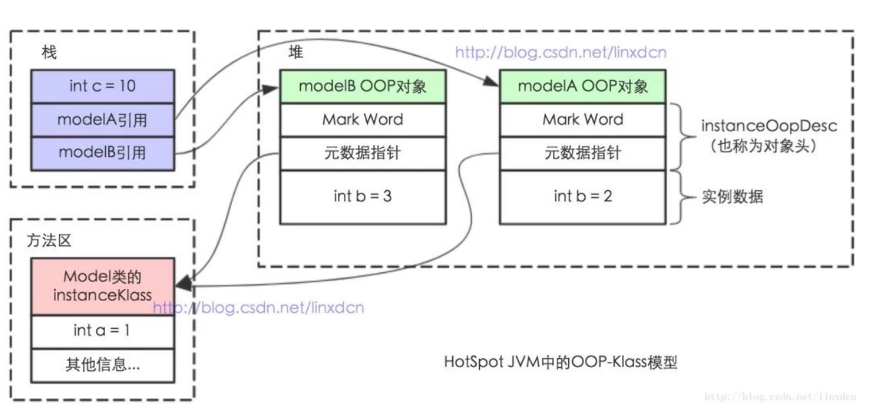

# 多线程-3 知识

## 多线程面试题

[40 道 Java 多线程面试题及答案](https://blog.csdn.net/qq_20282955/article/details/104278219)

**29、Thread.sleep(0)的作用是什么**

这个问题和上面那个问题是相关的，我就连在一起了。由于Java采用抢占式的线程调度算法，因此可能会出现某条线程常常获取到CPU控制权的情况，为了让某些优先级比较低的线程也能获取到CPU控制权，可以使用Thread.sleep(0)手动触发一次操作系统分配时间片的操作，这也是平衡CPU控制权的一种操作。

## JVM、JMM、Java对象模型

### JVM

### JMM

在JMM中，我们把多个线程间通信的共享内存称之为主内存，⽽在并发编程中多个线程都维护了⼀个⾃⼰的本地内存（这是个抽 象概念），其中保存的数据是主内存中的数据拷⻉。⽽JMM主要是控制本地内存和主内存之间的数据交互的。 

### Java对象模型

每⼀个Java类，在被JVM加载的时候，JVM会给这个类创建⼀个 instanceKlass ，保存在⽅法区，⽤来在JVM层表⽰该Java 类。当我们在Java代码中，使⽤new创建⼀个对象的时候，JVM会创建⼀个 instanceOopDesc 对象，这个对象中包含了对象头 以及实例数据。

####  