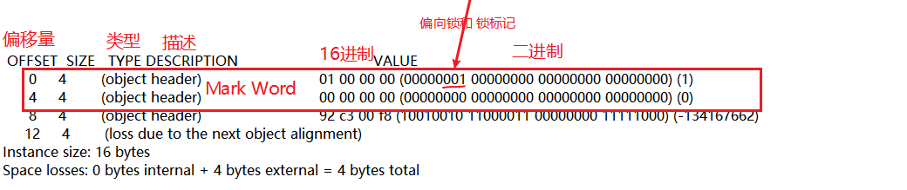

# 多线程-4 Java Object Layout

### Code

```
package com.example.thread.other;

import org.openjdk.jol.info.ClassLayout;

import java.util.concurrent.TimeUnit;

public class JavaObjectLayout {

    public static void main(String[] args) throws InterruptedException{
        final A a = new A();
        ClassLayout layout = ClassLayout.parseInstance(a);
        System.out.println("****Fresh object");
        System.out.println(layout.toPrintable());// 01, 无锁可偏向，00000 0 01

        Thread t = new Thread(() -> {
            synchronized (a){
                try {
                    TimeUnit.SECONDS.sleep(10);
                }catch (InterruptedException e){
                    return;
                }
            }
        });
        t.start();


        TimeUnit.SECONDS.sleep(1);

        System.out.println("****Before the lock");
        System.out.println(layout.toPrintable());// 00, 轻量级锁，11111 0 00


        synchronized (a){
            System.out.println("****With the lock");
            System.out.println(layout.toPrintable());// 10, 重量级锁，11011 0 10
        }


        System.out.println("****After the lock");
        System.out.println(layout.toPrintable());// 10, 锁不会降级

        System.gc();

        System.out.println("****After System.gc()");
        System.out.println(layout.toPrintable());// 如果非11，可能未gc

    }
}


class A{

}
```


### 大小端

大端是高字节存放到内存的低地址

小端是高字节存放到内存的高地址


高数据位，低数据位：0000 0000 0001 0011。左是高数据位，右是低数据位。

高地址位，低地址位：比如一个四字节内存0x10 0x20 0x30 0x40。左是低地址位，右是高地址位。根据地址的高低判断。


大小端其实就是系统对数据在内存中的存储规则。因此我们的数据分为两种方式存储。

大端模式（Big-endian）存储：数据的低数据位 放在 内存的高地址位。**这和我们的阅读习惯一样。**

小端模式（Little-endian）存储： 数据的低数据位 放在 内存的低地址位。


一般我们的都是小端


### Result





```
# WARNING: Unable to attach Serviceability Agent. You can try again with escalated privileges. Two options: a) use -Djol.tryWithSudo=true to try with sudo; b) echo 0 | sudo tee /proc/sys/kernel/yama/ptrace_scope
****Fresh object
com.example.thread.other.A object internals:
 OFFSET  SIZE   TYPE DESCRIPTION                               VALUE
      0     4        (object header)                           01 00 00 00 (00000001 00000000 00000000 00000000) (1)
      4     4        (object header)                           00 00 00 00 (00000000 00000000 00000000 00000000) (0)
      8     4        (object header)                           92 c3 00 f8 (10010010 11000011 00000000 11111000) (-134167662)
     12     4        (loss due to the next object alignment)
Instance size: 16 bytes
Space losses: 0 bytes internal + 4 bytes external = 4 bytes total

****Before the lock
com.example.thread.other.A object internals:
 OFFSET  SIZE   TYPE DESCRIPTION                               VALUE
      0     4        (object header)                           f8 ed 01 20 (11111000 11101101 00000001 00100000) (536997368)
      4     4        (object header)                           00 00 00 00 (00000000 00000000 00000000 00000000) (0)
      8     4        (object header)                           92 c3 00 f8 (10010010 11000011 00000000 11111000) (-134167662)
     12     4        (loss due to the next object alignment)
Instance size: 16 bytes
Space losses: 0 bytes internal + 4 bytes external = 4 bytes total

****With the lock
com.example.thread.other.A object internals:
 OFFSET  SIZE   TYPE DESCRIPTION                               VALUE
      0     4        (object header)                           da 07 ef 1c (11011010 00000111 11101111 00011100) (485427162)
      4     4        (object header)                           00 00 00 00 (00000000 00000000 00000000 00000000) (0)
      8     4        (object header)                           92 c3 00 f8 (10010010 11000011 00000000 11111000) (-134167662)
     12     4        (loss due to the next object alignment)
Instance size: 16 bytes
Space losses: 0 bytes internal + 4 bytes external = 4 bytes total

****After the lock
com.example.thread.other.A object internals:
 OFFSET  SIZE   TYPE DESCRIPTION                               VALUE
      0     4        (object header)                           da 07 ef 1c (11011010 00000111 11101111 00011100) (485427162)
      4     4        (object header)                           00 00 00 00 (00000000 00000000 00000000 00000000) (0)
      8     4        (object header)                           92 c3 00 f8 (10010010 11000011 00000000 11111000) (-134167662)
     12     4        (loss due to the next object alignment)
Instance size: 16 bytes
Space losses: 0 bytes internal + 4 bytes external = 4 bytes total

****After System.gc()
com.example.thread.other.A object internals:
 OFFSET  SIZE   TYPE DESCRIPTION                               VALUE
      0     4        (object header)                           09 00 00 00 (00001001 00000000 00000000 00000000) (9)
      4     4        (object header)                           00 00 00 00 (00000000 00000000 00000000 00000000) (0)
      8     4        (object header)                           92 c3 00 f8 (10010010 11000011 00000000 11111000) (-134167662)
     12     4        (loss due to the next object alignment)
Instance size: 16 bytes
Space losses: 0 bytes internal + 4 bytes external = 4 bytes total

Disconnected from the target VM, address: '127.0.0.1:61021', transport: 'socket'

Process finished with exit code 0
```