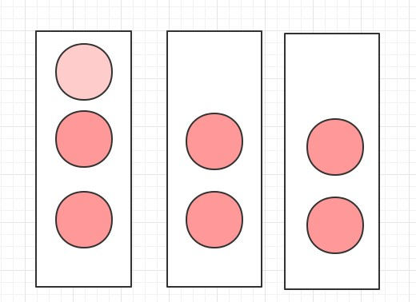

# 多线程 - Phaser


Phaser：“移相器，相位器”的意思。


Phaser更像是多个循环的屏障CyclicBarrier，**不同的是我们可以在下一次移除不需要的屏障。**JDK1.7开始




用途：

- Phaser，int phase：第几个阶段，从0开始, int registeredParties：需要多少个线程
- phaser.arriveAndDeregister(); //Deregiste移除注册
-  phaser.arriveAndAwaitAdvance();//等待着往前走


```java
import java.util.Random;
import java.util.concurrent.Phaser;

public class PhaserDemo {
    static class PreTaskThread implements Runnable {

        private String task;
        private Phaser phaser;

        public PreTaskThread(String task, Phaser phaser) {
            this.task = task;
            this.phaser = phaser;
        }

        @Override
        public void run() {
            for (int i = 1; i < 4; i++) {
                try {
                    // 第二次关卡起不加载NPC，跳过
                    if (i >= 2 && "加载新手教程".equals(task)) {
                        continue;
                    }
                    Random random = new Random();
                    Thread.sleep(random.nextInt(1000));
                    System.out.println(String.format("关卡%d，需要加载%d个模块，当前模块【%s】",
                            i, phaser.getRegisteredParties(), task));

                    // 从第二个关卡起，不加载NPC
                    if (i == 1 && "加载新手教程".equals(task)) {
                        System.out.println("下次关卡移除加载【新手教程】模块");
                        phaser.arriveAndDeregister(); // 移除一个模块
                    } else {
                        phaser.arriveAndAwaitAdvance();// 等待着往前走
                    }
                } catch (InterruptedException e) {
                    e.printStackTrace();
                }
            }
        }
    }

    public static void main(String[] args) {
        Phaser phaser = new Phaser(4) {
            // 当registeredParties满足时自动调用，这里是4
            @Override
            protected boolean onAdvance(int phase, int registeredParties) {
                System.out.println(String.format("第%d次关卡准备完成", phase + 1));
                // int phase：第几个阶段, int registeredParties：需要多少个线程
                // 当满足时就结束
                return phase == 3 || registeredParties == 0;
            }
        };

        new Thread(new PreTaskThread("加载地图数据", phaser)).start();
        new Thread(new PreTaskThread("加载人物模型", phaser)).start();
        new Thread(new PreTaskThread("加载背景音乐", phaser)).start();
        new Thread(new PreTaskThread("加载新手教程", phaser)).start();
    }
}
```


结果：

```
关卡1，需要加载4个模块，当前模块【加载背景音乐】
关卡1，需要加载4个模块，当前模块【加载人物模型】
关卡1，需要加载4个模块，当前模块【加载新手教程】
下次关卡移除加载【新手教程】模块
关卡1，需要加载3个模块，当前模块【加载地图数据】
第1次关卡准备完成
关卡2，需要加载3个模块，当前模块【加载人物模型】
关卡2，需要加载3个模块，当前模块【加载地图数据】
关卡2，需要加载3个模块，当前模块【加载背景音乐】
第2次关卡准备完成
关卡3，需要加载3个模块，当前模块【加载背景音乐】
关卡3，需要加载3个模块，当前模块【加载人物模型】
关卡3，需要加载3个模块，当前模块【加载地图数据】
第3次关卡准备完成
```

