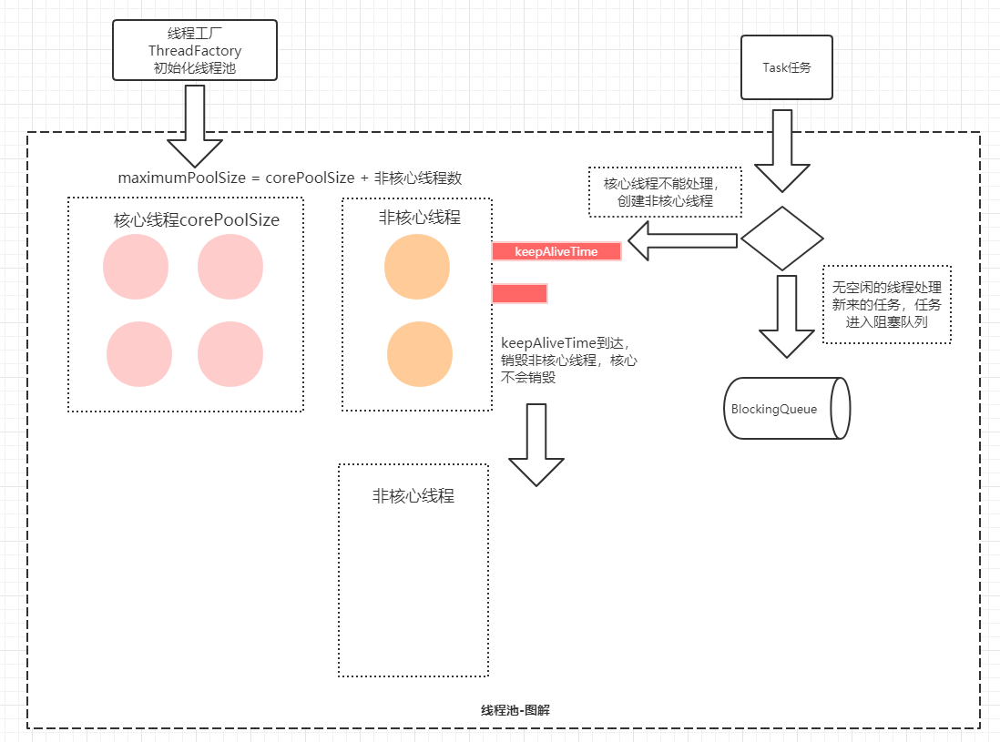

# 多线程 - 线程池


## 为什么要使用线程池

使用线程池主要有以下三个原因：

1. 创建/销毁线程需要消耗系统资源，线程池可以**复用已创建的线程**。
2. **控制并发的数量**。并发数量过多，可能会导致资源消耗过多，从而造成服务器崩溃。（主要原因）
3. **可以对线程做统一管理**。


## 线程池分类

- ThreadPoolExecutor
- ForkJoinPool


## Executor架构体系

Java中的线程池顶层接口是Executor接口，Executor提供了线程执行的方法execute()，ExecutorService提供了线程中断方法，并且还提供了一个新的线程异步执行的方法submit()。ThreadPoolExecutor是其基本实现

ExecutorService

​		AbstractExecutorService (java.util.concurrent)
​				ThreadPoolExecutor (java.util.concurrent)
​				ForkJoinPool (java.util.concurrent)


### execute()和submit()区别

Executor提供基本的执行方法是execute，但是缺点是改方法没有返回值。因此在ExecutorService中又提供了带返回值的线程执行方法submit

```java
public interface Executor {

    /**
     * Executes the given command at some time in the future.  The command
     * may execute in a new thread, in a pooled thread, or in the calling
     * thread, at the discretion of the {@code Executor} implementation.
     *
     * @param command the runnable task
     * @throws RejectedExecutionException if this task cannot be
     * accepted for execution
     * @throws NullPointerException if command is null
     */
    void execute(Runnable command);
}


// -----------------------------------------------------------------------------------------
public interface ExecutorService extends Executor {
    Future<?> submit(Runnable task);
```


**区别：**

- execute() ：提交无返回值的任务，所以无法判断任务在线程池中是否执行成功。
- submit() ：异步提交，线程池会返回⼀个 Future 类型的对象。**调用Future的get()方法，会阻塞当前线程直到任务完成**。也可以调用 get（long timeout， TimeUnit unit） 设置阻塞的时长。


因此，使用线程池的时候，需要注意对象引用不要用线程池顶级接口Executor，否则无法调用submit()方法

```java
public static void main(String[] args) {
    ThreadPoolExecutor pool1 = new ThreadPoolExecutor(
            5,
            10,
            10L,
            TimeUnit.MINUTES,
            new LinkedBlockingDeque<>(50),
            Executors.defaultThreadFactory(),
            new ThreadPoolExecutor.AbortPolicy()
    );

    // pool1.submit();
    // pool1.execute();

    Executor pool2 = new ThreadPoolExecutor(
            5,
            10,
            10L,
            TimeUnit.MINUTES,
            new LinkedBlockingDeque<>(50),
            Executors.defaultThreadFactory(),
            new ThreadPoolExecutor.AbortPolicy()
    );
    // pool2无submit，因为对象引用是线程池顶级接口Executor
    // pool1.execute();
}
```


### Future

Future：未来的意思

我们可以使用Runnable和Thread来创建一个新的线程，但是问题是没有返回值。

因为在jDK1.5提供了Callable，那这个值怎么拿？就是通过Future去获取，而FutureTask是其实现类，FutureTask既是一个Future，也是一个Task。

注：CompletableFuture是更高级的Future，提供了更多特性。

**关键字：Future、FutureTask、CompletableFuture**


## ThreadPoolExecutor

接下来，看看线程池的基本实现类，ThreadPoolExecutor，一共提供了7个参数。

```java
ThreadPoolExecutor pool = new ThreadPoolExecutor(
        5,
        10,
        10L,
        TimeUnit.MINUTES,
        new LinkedBlockingDeque<>(50),
        Executors.defaultThreadFactory(),
        new ThreadPoolExecutor.AbortPolicy()
);
```


## 线程池参数

重要的参数！重要的参数！重要的参数！


### corePoolSize

corePoolSize：核心线程数


**什么是核心线程数解释**

线程池中有两类线程，核心线程和非核心线程。

- 核心线程默认情况下会**一直存在**于线程池中，即使这个核心线程什么都不干（铁饭碗）
- 而非核心线程如果长时间的闲置，就会被销毁（临时工）。


### maximumPoolSize

maximumPoolSize：最大线程数

最大线程数 = 核心线程数 + 非核心线程数


### keepAliveTime

keepAliveTime：非核心线程存时长

非核心线程如果处于闲置状态超过该值，就会被销毁。如果设置allowCoreThreadTimeOut(true)，则也会作用于核心线程。

keepAliveTime = 0 则非核心线程执行完毕后直接销毁结束，不存活。


### unit

unit：keepAliveTime的单位，例如：TimeUnit.MINUTES 分


#### BlockingQueue

BlockingQueue：阻塞队列

当**线程**数满了，没有空余的线程执行**任务**时，任务就进入了等待队列（阻塞队列）。BlockingQueue一般用于生产者-消费者模式

注：这里有个线程和任务的概念。阻塞队列的概念见【多线程 -并发容器】一章


四种阻塞队列：

1. LinkedBlockingQueue：链式阻塞队列，底层数据结构是**链表**，默认大小是Integer.MAX_VALUE，也可以指定大小。

2. ArrayBlockingQueue：数组阻塞队列，底层数据结构是**数组**，需要指定队列的大小。

3. SynchronousQueue：同步队列，内部容量**为0**，put需等待take，take需等待put。

4. DelayQueue：延迟队列，按照延迟时间入队，**延迟时间到了才能从队列中获取到该元素**。


### ThreadFactory

创建线程的工厂 ，ThreadFactory提供了一个接口newThread。

意味着，可以在创建线程时统一设置一些参数。

注：默认的线程工厂是在Executors类中，Executors.defaultThreadFactory()。前面我们提到了Executor，两者命名有些相近，后面会讨论。

```java

public interface ThreadFactory {

    /**
     * Constructs a new {@code Thread}.  Implementations may also initialize
     * priority, name, daemon status, {@code ThreadGroup}, etc.
     *
     * @param r a runnable to be executed by new thread instance
     * @return constructed thread, or {@code null} if the request to
     *         create a thread is rejected
     */
    Thread newThread(Runnable r);
}

// ---------------------------------------------------------------------------------------------------------------------------
static class DefaultThreadFactory implements ThreadFactory {
    private static final AtomicInteger poolNumber = new AtomicInteger(1);
    private final ThreadGroup group;
    private final AtomicInteger threadNumber = new AtomicInteger(1);
    private final String namePrefix;

    DefaultThreadFactory() {
        SecurityManager s = System.getSecurityManager();
        group = (s != null) ? s.getThreadGroup() :
                              Thread.currentThread().getThreadGroup();
        namePrefix = "pool-" +
                      poolNumber.getAndIncrement() +
                     "-thread-";
    }

    
    public Thread newThread(Runnable r) {
        Thread t = new Thread(group, r,
                              namePrefix + threadNumber.getAndIncrement(),
                              0);
        if (t.isDaemon())
            // 设置为非守护线程
            t.setDaemon(false);
        if (t.getPriority() != Thread.NORM_PRIORITY)
            // 设置优先级为默认
            t.setPriority(Thread.NORM_PRIORITY);
        return t;
    }
}
```


### RejectedExecutionHandler

RejectedExecutionHandler：拒绝策略

当线程数量 > maximumPoolSize时，线程池存不下了，就需要一种拒绝策略处理。


四种拒绝策略 ：

1. ThreadPoolExecutor.AbortPolicy：丢弃任务，并抛出RejectedExecutionException异常。**默认拒绝处理策略**，
2. ThreadPoolExecutor.DiscardPolicy：丢弃新来的任务，但是不抛出异常
3. ThreadPoolExecutor.DiscardOldestPolicy：丢弃最早的任务，然后重新尝试执行程序（如果再次失败，重复此过程）
4. ThreadPoolExecutor.CallerRunsPolicy：由调用的线程处理该任务，即调用`execute`方法的线程来执行


注：ThreadPoolExecutor.CallerRunsPolicy存在一个风险：会创建大量的线程，导致线上OOM。

当然如果业务量没那么高还是可以使用，能够保证消息不丢失。

如果不了解线程业务量，建议使用默认策略，即AbortPolicy丢失并抛异常。


拒绝策略不止四种，上面只是提供的拒绝策略。当然我们也可以自定义拒绝策略，只需实现RejectedExecutionHandler即可。

例如：将消息保存下来。

```java
public class SavePolicy implements RejectedExecutionHandler {

    @Override
    public void rejectedExecution(Runnable r, ThreadPoolExecutor executor) {
        // send to mq
    }
}
```


### 小结

线程池中核心线程数、最大线程数、非核心线程数存活时间及其单位、阻塞队列，这五个参数是必须自定义的，是非常重要的参数。

对于创建线程工厂与拒绝策略不是必须自定义的，我们可以使用默认的设置。


线程池的流程如下图：




## Executor和Executors


## 线程池主要的任务处理流程

1. 线程总数量 < corePoolSize，无论线程是否空闲，都会新建一个核心线程执行任务（让核心线程数量快速达到corePoolSize，在核心线程数量 < corePoolSize时）。**注意，这一步需要获得全局锁。**
2. 线程总数量 >= corePoolSize时，新来的线程任务会进入任务队列中等待，然后空闲的核心线程会依次去缓存队列中取任务来执行（体现了**线程复用**）。
3. 当缓存队列满了，说明这个时候任务已经多到爆棚，需要一些“临时工”来执行这些任务了。于是会创建非核心线程去执行这个任务。**注意，这一步需要获得全局锁。**
4. 缓存队列满了， 且总线程数达到了maximumPoolSize，则会采取上面提到的拒绝策略进行处理。
5. 


### 四种常见线程池


#### newCachedThreadPool

当需要执行很多**短时间**的任务时，CacheThreadPool的线程复用率比较高， 会显著的**提高性能**。而且线程60s后会回收，意味着即使没有任务进来，CacheThreadPool并不会占用很多资源。


#### newFixedThreadPool

核心线程数量和总线程数量相等，都是传入的参数nThreads，所以只能创建核心线程，不能创建非核心线程。因为LinkedBlockingQueue的默认大小是Integer.MAX_VALUE，故如果核心线程空闲，则交给核心线程处理；如果核心线程不空闲，则入列等待，直到核心线程空闲。


#### 与CachedThreadPool的区别：

- 因为 corePoolSize == maximumPoolSize ，所以FixedThreadPool只会创建核心线程。 而CachedThreadPool因为corePoolSize=0，所以只会创建非核心线程。
- 在 getTask() 方法，如果队列里没有任务可取，线程会一直阻塞在 LinkedBlockingQueue.take() ，线程不会被回收。 CachedThreadPool会在60s后收回。
- 由于线程不会被回收，会一直卡在阻塞，所以**没有任务的情况下， FixedThreadPool占用资源更多**。
- 都几乎不会触发拒绝策略，但是原理不同。FixedThreadPool是因为阻塞队列可以很大（最大为Integer最大值），故几乎不会触发拒绝策略；CachedThreadPool是因为线程池很大（最大为Integer最大值），几乎不会导致线程数量大于最大线程数，故几乎不会触发拒绝策略。


#### newSingleThreadExecutor

有且仅有一个核心线程（ corePoolSize == maximumPoolSize=1），使用了LinkedBlockingQueue（容量很大），所以，**不会创建非核心线程**。所有任务按照**先来先执行**的顺序执行。如果这个唯一的线程不空闲，那么新来的任务会存储在任务队列里等待执行。


#### newScheduledThreadPool

创建一个定长线程池，支持定时及周期性任务执行。


### BlockingQueue- 阻塞队列

BlockingQueue的意思就是说，当一个线程调用这个TaskQueue的getTask()方法时，该方法内部可能会让线程变成等待状态，直到队列条件满足不为空，线程被唤醒后，getTask()方法才会返回。


java.util.Collections工具类还提供了一个旧的线程安全集合转换器，可以这么用：

Map unsafeMap = new HashMap(); Map threadSafeMap = Collections.synchronizedMap(unsafeMap);

但是它实际上是用一个包装类包装了非线程安全的Map，然后对所有读写方法都用synchronized加锁，这样获得的线程安全集合的性能比java.util.concurrent集合要低很多，所以不推荐使用。

1. 


### 13.2  BlockingQueue的实现类

```
// 由数组结构组成的有界阻塞队列。内部结构是数组，故具有数组的特性
// 可以初始化队列大小， 且一旦初始化不能改变。构造方法中的fair表示控制对象的内部锁是否采用公平锁，默认是非公平锁。
ArrayBlockingQueue arrayBlockingQueue = new ArrayBlockingQueue(10);

// 默认队列的大小是Integer.MAX_VALUE，也可以指定大小。此队列按照先进先出的原则对元素进行排序。
LinkedBlockingQueue linkedBlockingQueue = new LinkedBlockingQueue(50);

// DelayQueue是一个没有大小限制的队列，
// 因此往队列中插入数据的操作（生产者）永远不会被阻塞，而只有获取数据的操作（消费者）才会被阻塞。
DelayQueue delayQueue = new DelayQueue();

// 基于优先级的无界阻塞队列（优先级的判断通过构造函数传入的Compator对象来决定），内部控制线程同步的锁采用的是公平锁。
PriorityBlockingQueue priorityBlockingQueue = new PriorityBlockingQueue();

// 这个队列比较特殊，没有任何内部容量，甚至连一个队列的容量都没有。并且每个 put 必须等待一个 take，反之亦然。
SynchronousQueue synchronousQueue = new SynchronousQueue();
```


## Fork/Join


### 18.1 什么是Fork/Join

Fork/Join框架是一个实现了ExecutorService接口的多线程处理器，它专为那些可以通过递归分解成更细小的任务而设计，最大化的利用多核处理器来提高应用程序的性能。

与其他ExecutorService相关的实现相同的是，Fork/Join框架会将任务分配给线程池中的线程。而与之不同的是，Fork/Join框架在执行任务时使用了**工作窃取算法**


**fork**在英文里有分叉的意思，**join**在英文里连接、结合的意思。顾名思义，fork就是要使一个大任务分解成若干个小任务，而join就是最后将各个小任务的结果结合起来得到大任务的结果。

Fork/Join的运行流程大致如下所示：


### 18.2 工作窃取算法

工作窃取算法指的是在多线程执行不同任务队列的过程中，某个线程执行完自己队列的任务后从其他线程的任务队列里窃取任务来执行。

工作窃取流程如下图所示：


值得注意的是，当一个线程窃取另一个线程的时候，为了减少两个任务线程之间的竞争，我们通常使用**双端队列**来存储任务。被窃取的任务线程都从双端队列的**头部**拿任务执行，而窃取其他任务的线程从双端队列的**尾部**执行任务。

另外，当一个线程在窃取任务时要是没有其他可用的任务了，这个线程会进入**阻塞状态**以等待再次“工作”。


