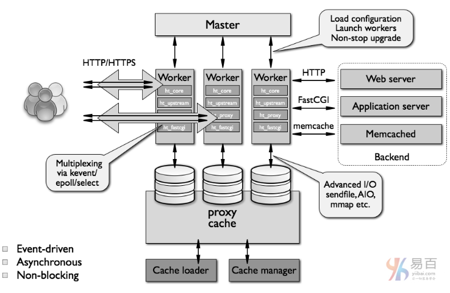

# 3 Nginx

## 1. 认识Nginx

Nginx：http://nginx.org/   http://nginx.org/en/docs/

中文文档：https://www.nginx.cn/doc/

Nginx教程：https://www.yiibai.com/nginx/nginx-advantages.html#article-start

万字详解： https://juejin.im/post/5ea931866fb9a043815146fb


*Nginx* (engine x) 是一个高性能的[HTTP](https://baike.baidu.com/item/HTTP)和[反向代理](https://baike.baidu.com/item/反向代理/7793488)web服务器，同时也提供了IMAP/POP3/SMTP[服务](https://baike.baidu.com/item/服务/100571)。


Nginx是**C编程**语言编写的，拥有自己的库，其标准模块不会超出系统的C库，除了**zlib，PCRE和OpenSSL**之外。如果不需要，或者由于潜在的许可证冲突，可以选择将其从**./configurate构建中**排除。


## 2. Nginx能做什么

- 反向代理
- 负载均衡
- HTTP服务器(包含动静分离)
- 正向代理


## 3. 安装

```
下载 wget http://nginx.org/download/nginx-1.6.2.tar.gz
解压 tar zxvf nginx-1.6.2.tar.gz

检查配置 ./configure
会打印出缺少的配置 .... not found
安装缺少的依赖
yum install pcre-devel
yum install zlib zlib-devel
yum install openssl openssl-devel

编译 make 
安装 make install

启动 /**/sbin/nginx
默认是 /usr/local/nginx/sbin/nginx
```

常用命令

```
nginx -s reload  # 向主进程发送信号，重新加载配置文件，热重启
nginx -s reopen  # 重启 Nginx
nginx -s stop    # 快速关闭
nginx -s quit    # 等待工作进程处理完成后关闭
nginx -T         # 查看当前 Nginx 最终的配置
nginx -t -c <配置路径>    # 检查配置是否有问题，如果已经在配置目录，则不需要-c
```


systemctl 是 Linux 系统应用管理工具 systemd 的主命令，用于管理系统，我们也可以用它来对 Nginx 进行管理，相关命令如下：

```
systemctl start nginx    # 启动 Nginx
systemctl stop nginx     # 停止 Nginx
systemctl restart nginx  # 重启 Nginx
systemctl reload nginx   # 重新加载 Nginx，用于修改配置后
systemctl enable nginx   # 设置开机启动 Nginx
systemctl disable nginx  # 关闭开机启动 Nginx
systemctl status nginx   # 查看 Nginx 运行状态

./nginx -s reload 重新加载配置文件
```


## 4. ./configure

使用configure命令配置构建。 它定义了系统的各个方面，包括允许使用nginx进行连接处理的方法。 最后它创建一个Makefile。 configure命令支持以下参数：

**--prefix = path** **- 定义将保留服务器文件的目录**。 这个同一个目录也将用于由configure(除了库源的路径)和nginx.conf配置文件中设置的所有相关路径。 它默认设

置为/usr/local/nginx目录。

更多参数设置见：https://www.yiibai.com/nginx/configure.html#article-start

```
./configure --sbin-path=/usr/local/nginx/nginx --conf-path=/usr/local/nginx/nginx.conf 
--pid-path=/usr/local/nginx/nginx.pid --with-http_ssl_module --with-pcre=../pcre-8.40 --with-zlib=../zlib-1.2.11
```


## 5. nginx工作

**nginx有一个主进程和几个工作进程**。 主进程的主要目的是读取和评估配置，并维护工作进程。 工作进程对请求进行实际处理。 nginx采用基于事件的模型和依赖于操作系统的机制来有效地在工作进程之间分配请求。 工作进程的数量可在配置文件中定义，并且可以针对给定的配置进行修改，或者自动调整到可用CPU内核的数量

```
ps -ax | grep nginx
```




```
main        # 全局配置，对全局生效
├── events  # 配置影响 Nginx 服务器或与用户的网络连接
├── http    # 配置代理，缓存，日志定义等绝大多数功能和第三方模块的配置
│   ├── upstream # 配置后端服务器具体地址，负载均衡配置不可或缺的部分
│   ├── server   # 配置虚拟主机的相关参数，一个 http 块中可以有多个 server 块
│   ├── server
│   │   ├── location  # server 块可以包含多个 location 块，location 指令用于匹配 uri
│   │   ├── location
│   │   └── ...
│   └── ...
└── ...
```


## 6. nginx.conf

nginx由配置文件中指定的指令控制的模块组成，指令分为：

- 简单指令，以分号(;)结尾
- 块指令，以大括号({开始，以})结束

如果块指令可以在大括号内部有其他指令，则称为上下文(例如：events，http，server和location)。


```
location [ = | ~ | ~* | ^~] uri {
    ...
}
```

- = 精确匹配路径，用于不含正则表达式的 uri 前，如果匹配成功，不再进行后续的查找；
- ^~ 用于不含正则表达式的 uri； 前，表示如果该符号后面的字符是最佳匹配，采用该规则，不再进行后续的查找；
- ~ 表示用该符号后面的正则去匹配路径，区分大小写；
- ~* 表示用该符号后面的正则去匹配路径，不区分大小写。跟 ~ 优先级都比较低，如有多个location的正则能匹配的话，则使用正则表达式最长的那个；


全局变量

Nginx 有一些常用的全局变量，你可以在配置的任何位置使用它们

```
#user  nobody;
worker_processes  1;

# 错误日志路径
#error_log  logs/error.log;
# notice为日志级别 例如info、warn、notice、alert
#error_log  logs/error.log  notice;
#error_log  logs/error.log  info;

#pid        logs/nginx.pid;


events {
    use epoll;     # 使用epoll的I/O模型(如果你不知道Nginx该使用哪种轮询方法，会自动选择一个最适合你操作系统的)
    worker_connections 1024;   # 每个进程允许最大并发数
}


# 虚拟服务器 http块
http {
    include       mime.types;
    default_type  application/octet-stream;

    # $表示变量 可以使用set，map和geo指令定义自定义变量
    # 设置访问日志格式
    #log_format  main  '$remote_addr - $remote_user [$time_local] "$request" '
    #                  '$status $body_bytes_sent "$http_referer" '
    #                  '"$http_user_agent" "$http_x_forwarded_for"';

    # 访问日志
    #access_log  logs/access.log  main;
    
    # 默认情况下，NGINX会自动处理文件传输，并在发送文件之前将其复制到缓冲区中
    sendfile        on;
    # 在一个数据包中发送HTTP响应头
    #tcp_nopush     on;

    # 超时时间
    #keepalive_timeout  0;
    keepalive_timeout  65;

    # 压缩 默认情况下，NGINX仅使用MIME类型text/html压缩响应
    #gzip  on;
    # 指定压缩类型
    # gzip_types text/plain application/xml;
    # 压缩的响应的最小长度，默认20
    # gzip_min_length 20;
    # gzip_proxied no-cache no-store private expired auth
    
    # 支持解压缩
    # gunzip on;

    # 启动一个服务器 server块
    server {
        listen       80;
        server_name  localhost;

        #charset koi8-r;

        # 访问日志
        #access_log  logs/host.access.log  main;
        
        include /etc/nginx/mime.types; # 文件扩展名与类型映射表 
        default_type application/octet-stream; # 默认文件类型 
        include /etc/nginx/conf.d/*.conf; # 加载子配置项
        
        # 跨域 设置header 或者 通过反向代理
        add_header 'Access-Control-Allow-Origin' $http_origin; # 全局变量获得当前请求origin，带cookie的请求不支持* 
        add_header 'Access-Control-Allow-Credentials' 'true'; # 为 true 可带上 cookie 
        add_header 'Access-Control-Allow-Methods' 'GET, POST, OPTIONS'; # 允许请求方法 
        add_header 'Access-Control-Allow-Headers' $http_access_control_request_headers; # 允许请求的 header，可以为 * 
        add_header 'Access-Control-Expose-Headers' 'Content-Length,Content-Range';


        # 匹配url    
        location / {
            # root路径
            root   html;
            
            index  index.html index.htm;
            deny 172.168.22.11;   # 禁止访问的ip地址，可以为all
         allow 172.168.33.44； # 允许访问的ip地址，可以为all
            
            # 返回指定状态码
            # return 200;
            
            # 指令控制分配给请求的缓冲区的大小和数量
            # proxy_buffers 16 4k;
            # proxy_buffer_size 2k;
            
            # 禁用特定位置的缓冲
            # proxy_buffering off;
            
        }
    
        # 根据错误码指定错误页
        #error_page  404              /404.html;

        # redirect server error pages to the static page /50x.html
        #
        error_page   500 502 503 504  /50x.html;
        location = /50x.html {
            root   html;
        }

        # proxy the PHP scripts to Apache listening on 127.0.0.1:80
        # 支持正则表达式，正则表达式之前要有个~
        #location ~ \.php$ {
        #    proxy_pass   http://127.0.0.1;
        #}

        # pass the PHP scripts to FastCGI server listening on 127.0.0.1:9000
        #
        #location ~ \.php$ {
        #    root           html;
        #    fastcgi_pass   127.0.0.1:9000;
        #    fastcgi_index  index.php;
        #    fastcgi_param  SCRIPT_FILENAME  /scripts$fastcgi_script_name;
        #    include        fastcgi_params;
        #}

        # deny access to .htaccess files, if Apache's document root
        # concurs with nginx's one
        #
        #location ~ /\.ht {
        #    deny  all;
        #}
    }


    # another virtual host using mix of IP-, name-, and port-based configuration
    #
    #server {
    #    listen       8000;
    #    listen       somename:8080;
    #    server_name  somename  alias  another.alias;

    #    location / {
    #        root   html;
    #        index  index.html index.htm;
    #    }
    #}


    # HTTPS server
    #
    #server {
    #    listen       443 ssl;
    #    server_name  localhost;

    #    ssl_certificate      cert.pem;
    #    ssl_certificate_key  cert.key;

    #    ssl_session_cache    shared:SSL:1m;
    #    ssl_session_timeout  5m;

    #    ssl_ciphers  HIGH:!aNULL:!MD5;
    #    ssl_prefer_server_ciphers  on;

    #    location / {
    #        root   html;
    #        index  index.html index.htm;
    #    }
    #}
}
```


## 7. 优化积压队列

其中一个重要因素是NGINX可以处理传入连接的速度。 一般规则是建立连接时，将其放入监听套接字的“侦听”队列中。 在正常负载下，有一个低队列，或根本没有队列。 但是在高负载下，队列可能会急剧增长，这可能会导致性能不均衡，连接丢失和延迟。


查看当前的侦听队列:

```
netstat -lan
```

为了达到最佳性能，您需要增加NGINX在操作系统和NGINX配置中排队等待接收的最大连接数。


第一步：打开文件：/etc/sysctl.conf，将下面一行添加到文件并保存文件：

```
net.core.somaxconn = 4096
```

第二步：如果将somaxconn键设置为大于512的值，请更改NGINX listen指令的backlog参数以匹配：

```
server {
    listen 80 backlog 4096;
    # The rest of server configuration
}
```


## 8. 应用

https://www.yiibai.com/nginx/nginx-main-use-scenes.html


正向代理和反向代理：

简单概括下就是，**服务器代理**被称为反向代理，**客户端代理**被称为正向代理。


- 举个正向代理的例子，**我(客户端)**没有绿码出不了门，但是**朋友(代理)**有，**我(客户端)**让**朋友(代理)**去超市买瓶水，而对于**超市(服务器)**来讲，他们感知不到**我(客户端)**的存在，这就是正向代理。  
- 举个反向代理例子，**我(客户端)**让**朋友(代理)**去给我买瓶水，并没有说去哪里买，反正**朋友(代理)**买回来了，对于**我(客户端)**来讲，**我(客户端)**感知不到**超市(服务器)**的存在，这就是反向代理。


修改配置后重新读取配置

```
nginx -s reload
```


### 8.1 反向代理

反向代理(Reverse Proxy)方式是指以代理服务器来接受internet上的连接请求，然后将**请求转发**给内部网络上的服务器，并将从服务器上得到的结果返回给internet上请求连接的客户端

```
server {  
        listen       80;                                                        
        server_name  localhost;                                              
        client_max_body_size 1024M;

        location / {
             # proxy_pass 指定的代理服务器的协议，名称和端口
            proxy_pass http://localhost:8080;
            proxy_set_header Host $host:$server_port;
        }
}
```


### 8.2 正向代理

对于目标服务器来讲，感受不到真实的客户端，**与它通信的是代理客户端。**

```
# resolver 配置正向代理的DNS服务器
resolver 114.114.114.114 8.8.8.8;
    server {
        resolver_timeout 5s;
        # 正向代理的端口
        listen 81;
        access_log  e:/wwwrootproxy.access.log;
        error_log   e:/wwwrootproxy.error.log;

        location / {
            proxy_pass http://$host$request_uri;
        }
    }
```


### 8.3 负载均衡

简单而言就是当有2台或以上服务器时，根据规则随机的将请求分发到指定的服务器上处理，负载均衡配置一般都需要同时配置反向代理，通过反向代理跳转到负载均衡。


Nginx目前支持自带3种负载均衡策略，还有2种常用的第三方策略。


1）RR(默认)

```
 # 配置负载均衡
 upstream myserver {
        server localhost:8080;
        server localhost:8081;
}

server {
    listen       81;                                                        
    server_name  localhost;                                              
    client_max_body_size 1024M;

    location / {
        proxy_pass http://test;
        proxy_set_header Host $host:$server_port;
    }
}
```


2）权重


3）ip_hash

```
upstream myserver {
        ip_hash;
        server localhost:8080;
        server localhost:8081;
    }
```


4）fair(第三方)

按后端服务器的响应时间来分配请求，响应时间短的优先分配。

```
upstream backend {
        fair;
        server localhost:8080;
        server localhost:8081;
    }
```


5）url_hash(第三方)

按访问url的hash结果来分配请求，使每个url定向到同一个后端服务器，后端服务器为缓存时比较有效。 在upstream中加入hash语句，server语句中不能写入weight等其他的参数，hash_method是使用的hash算法。注：hash需要注意服务新增或删除问题

```
 upstream backend {
        hash $request_uri;
        hash_method crc32;
        server localhost:8080;
        server localhost:8081;
    }
```


### 8.4 HTTP服务器

Nginx本身也是一个静态资源的服务器

```
server {
        listen       80;                                                        
        server_name  localhost;                                              
        client_max_body_size 1024M;


        location / {
               root   E:/wwwroot;
               index  index.html;
           }
    }
```


### 8.5 动静分离

动静分离是让动态网站里的动态网页根据一定规则把不变的资源和经常变的资源区分开来，动静资源做好了拆分以后，我们就可以根据静态资源的特点将其做缓存操作，这就是网站静态化处理的核心思路。

```
upstream test{  
       server localhost:8080;  
       server localhost:8081;  
    }  

    server {  
        listen       80;  
        server_name  localhost;  

        location / {  
            root   e:/wwwroot;  
            index  index.html;  
        }  

        # 所有静态请求都由nginx处理，存放目录为html  
        location ~ .(gif|jpg|jpeg|png|bmp|swf|css|js)$ {  
            root    e:/wwwroot;  
        }  

        # 所有动态请求都转发给tomcat处理  
        location ~ .(jsp|do)$ {  
            proxy_pass  http://test;  
        }  

        error_page   500 502 503 504  /50x.html;  
        location = /50x.html {  
            root   e:/wwwroot;  
        }  
    }
```