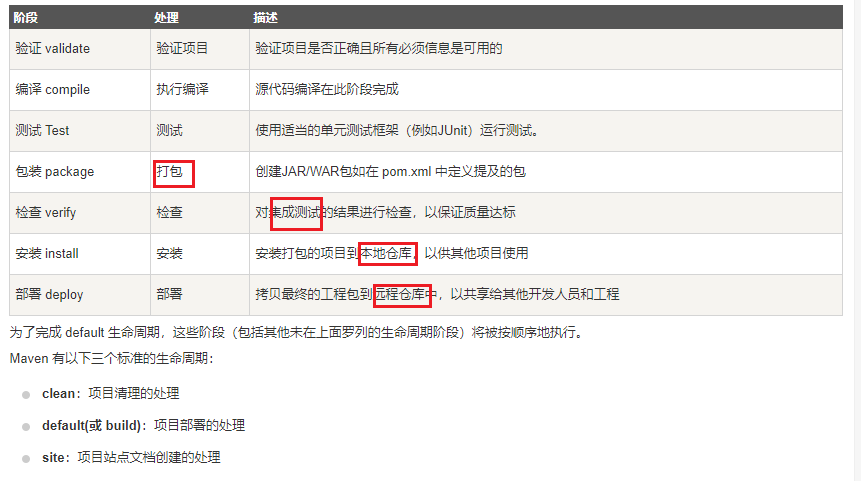
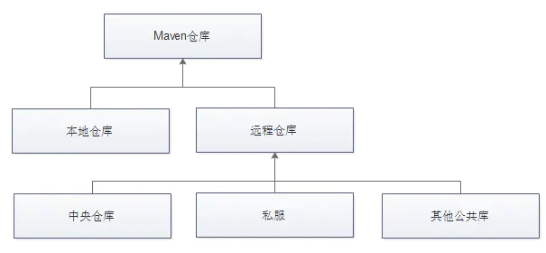
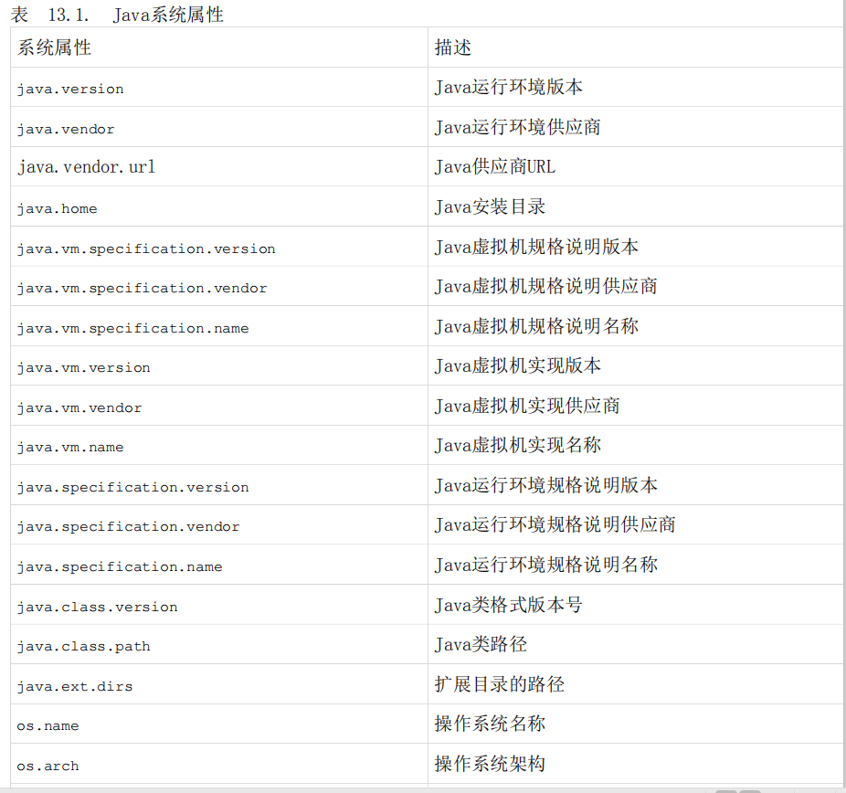

# 2 Maven

## 前言

maven学习笔记，阅读官方文档(http://maven.apache.org/guides/index.html)为主，其它为辅，在这里并不会写太多基础的东西。

maven仓库：https://mvnrepository.com/


## 认识Maven

Maven是一个项目构建工具，在 Maven 中通过 POM(解释：Project Object Model) 项目对象模型的概念来管理项目。在 Maven 中每个项目都相当于**一个对象**，对象（项目）之间可以**依赖、继承、聚合**。

注：从源码中我们可以看到Maven是Java编写的，所以运行Maven需要安装Java。


> 一个更正式的 Apache Maven的定义：
>
> Maven是一个项目管理工具，它包含了一个项目对象模型 (Project Object Model)，一组标准集合，一个项目生命周期(Project Lifecycle)，一个依赖管理系统(Dependency Management System)，和用来运行定义在生命周期阶段(phase)中插件(plugin)目标(goal)的逻辑。 当你使用Maven的时候，你
>
> 用一个明确定义的项目对象模型来描述你的项目，然后 Maven 可以应用横切的逻辑，这些逻辑来自一组共享的（或者自定义的）插件。


- 约定优于配置（Convention Over Configuration）
- 约定了工程目录
- 好的文档才有使用者


## 安装

从源代码中，我们知道Mavne是由Java语言编写的，所以要有Java的运行时环境。


设置环境变量

```
C:\Users\>set M3_HOME=D:\workspace\apache-maven-3.6.1
C:\Users\>set PATH=%PATH%;%M3_HOME%\bin
```


## Maven生命周期

Maven生命周期有几个阶段：clean、default、site

每一个命令由特定的插件完成，例如：compile，对应的插件是maven-compile-plugin





**Default** 

- **validate**: validate the project is correct and all necessary information is available
- **compile**: compile the source code of the project
- **test**: test the compiled source code using a suitable unit testing framework. These tests should not require the code be packaged or deployed
- **package**: take the compiled code and package it in its distributable format, such as a JAR.
- **integration-test**: process and deploy the package if necessary into an environment where integration tests can be run 集成测试
- **verify**: run any checks to verify the package is valid and meets quality criteria
- **install**: install the package into the local repository, for use as a dependency in other projects locally
- **deploy**: done in an integration or release environment, copies the final package to the remote repository for sharing with other developers and projects.

**Default阶段外的两个生命周期**

- **clean**: cleans up artifacts created by prior builds
- **site**: generates site documentation for this project


## GAV - 坐标

初次看到这个简称的时候还以为我看错了，确定不是Gay？

其实GAV指的是groupId、artifactId、version

groupId：公司或者组织的唯一标志+项目名

artifactId：项目的唯一ID，项目的模块

version：版本号

```
<dependency>
    <groupId>com.google.guava</groupId>
    <artifactId>guava</artifactId>
    <version>${google.guava.version}</version>
</dependency>
```


## Packing 打包相关生命周期

**ejb** **/** **ejb3** **/** **jar** **/** **par** **/** **rar** **/** **war**

- POM：<packaging>pom</packaging>一般是父类 。 它生成的构件只是它本身。

没有代码需要测试或者编译，也没有资源需要处理

- JAR：jar包形式，默认，最常用的
- EJB：EJB，或者说企业Java Bean，是企业级Java中模型驱动开发的常见数据访问机

制。Maven提供了对EJB 2和3的支持。你必须配置EJB插件来为EJB3指定打包类型，否则该插件默认认为EJB为2.1，并寻找某些EJB配置文件是否存在。

- WAR：web
- EAR：EAR可能是最简单的Java EE结构体，它主要包含一个部署描述符application.xml文件，一些资源和一些模块。


## 依赖管理机制

- **type**:依赖的类型，对于项目坐标定义的packaging。大部分情况下，该元素不必声明，其默认值为jar
- **scope**:依赖的范围
- **optional**:标记依赖是否可选
- **exclusions**:用来排除传递性依赖


### Scope - 依赖作用域

不同的作用域对程序的影响，主要有四个阶段影响：编译、运行、测试、打包

常用：provided、test、compile


- **compile**: 默认取值 compile 标识，当前依赖包，参与项目的编译、运行、测试、打包
- **provided**: provided 标识参与项目的编译、运行、测试，但是不参与打包，如Servlet-API
- **runtime**: runtime 标识不参与项目编译，参与项目的运行、测试、打包，例如JDBC
- **test**: test 标识只在编译测试代码和运行测试代码的时候需要，别的都不用，打包的时候也不会包含。例如Junit
- **system**: system 用于我们开发的一些二方库，但是不发布到网上，可以使用这种场景去使用。默认这种 jar 不会打包进去，需要我们配置一下。参与项目的编译、运行、测试。system范围依赖与provided类似，如果你将一个依赖范围设置成系统范围，你必须同时提供一systemPath元素。注意该范围是不推荐使用的（你应该一直尽量去从公共或定制的Maven仓库中引用依赖
- **import**： 一般我们会在父工程使用这个作用域。表示从其它的 pom.xml 导入 dependency 的配置。比如我们自己的父工程，只想要 springboot 的依赖管理


System配置

```
<dependencies>
    <dependency>
        <groupId>org.example</groupId>
        <artifactId>maven-d.jar</artifactId>
        <version>1.0-SNAPSHOT</version>
        <scope>system</scope>
        <systemPath>${basedir}/lib/maven-d.jar</systemPath>
    </dependency>
</dependencies>
<build>
    <plugins>
        <plugin>
            <groupId>org.springframework.boot</groupId>
            <artifactId>spring-boot-maven-plugin</artifactId>
        </plugin>
    </plugins>
    <resources>
        <resource>
            <directory>${basedir}/lib</directory>
            <targetPath>BOOT-INF/lib/</targetPath>
            <includes>
                <include>**/*.jar</include>
            </includes>
        </resource>
    </resources>
</build>
```


import管理

```
<dependencyManagement>
    <dependencies>
        <dependency>
            <groupId>org.springframework.boot</groupId>
            <artifactId>spring-boot-dependencies</artifactId>
            <version>${spring-boot.version}</version>
            <type>pom</type>
            <scope>import</scope>
        </dependency>
    </dependencies>
</dependencyManagement>
```


### 依赖版本范围

- (, )不包含量词，开区间
- [, ]包含量词，闭区间

```
<dependency>
    <groupId>junit</groupId>
    <artifactId>junit</artifactId>
    <version>[3.8,4.0)</version>
    <scope>test</scope>
</dependency>
```


### 依赖管理

```
父pom.xml
  <dependencyManagement>
    <dependencies>
      <dependency>
        <groupId>group-a</groupId>
        <artifactId>artifact-a</artifactId>
        <version>1.0</version>
        
        <exclusions>
          <exclusion>
            <groupId>group-c</groupId>
            <artifactId>excluded-artifact</artifactId>
          </exclusion>
        </exclusions>
      </dependency>

    </dependencies>
  </dependencyManagement>
  
  子pom.xml,不需要指定版本
  <dependencies>
    <dependency>
      <groupId>group-a</groupId>
      <artifactId>artifact-a</artifactId>
    </dependency>
 
    <dependency>
      <groupId>group-a</groupId>
      <artifactId>artifact-b</artifactId>
      <!-- This is not a jar dependency, so we must specify type. -->
      <type>bar</type>
    </dependency>
  </dependencies>
```


### 依赖传递遵循的两个规则

也称依赖调解

- 最短路径原则
- 最先声明原则（看dependency标签的先后声明顺序）

依赖调解有两大原则：

1. 路径最近者优先 比如项目有A有这样的依赖关系：A->B->C->X(1.0)、A->D->X(2.0),X是A的传递性依赖，但是两条依赖路径上有两个版本的X，所以根据第一原则，A->D->X(2.0)路径短，所以X(2.0)会被解析使用 2. 第一声明者优先 如果路径都一样长的话，第一原则就不行了，比如 A->B->Y(1.0)、A->C->Y(2.0),Y(1.0)和Y(2.0)的路径一样，所以这时候根据第二原则，先声明的被解析。


注：依赖传递性需Scope为compile范围


### optional - 可选依赖


如图，项目中A依赖B，B依赖于X和Y，如果所有这三个的范围都是compile的话，那么X和Y就是A的compile范围的传递性依赖，但是如果我想X,Y不作为A的传递性依赖，不给他用的话。就需要下面提到的配置可选依赖。

```
<optional>true</optional>
```

就表示可选依赖了，这样A如果想用X,Y就要直接显示的添加依赖了。


### Exclusions - 排除依赖

```
<dependencies>
    <dependency>
      <groupId>sample.ProjectA</groupId>
      <artifactId>Project-A</artifactId>
      <version>1.0</version>
      <scope>compile</scope>
      <exclusions>
        <exclusion>  <!-- declare the exclusion here -->
          <groupId>sample.ProjectB</groupId>
          <artifactId>Project-B</artifactId>
        </exclusion>
      </exclusions> 
    </dependency>
  </dependencies>
```


### 仓库



1、本地仓库：mvn clean install

2、远程仓库：mvn clean deploy

- 私服：搭建在局域网中，一般公司都会有私服，私服一般使用nexus来搭建。具体搭建过程可以查询其他资料
- 中央仓库：架设在Internet上，像刚才的springframework就是在中央仓库上

**优先本地** 


### 部署到远程仓库

```
<distributionManagement>
    <repository>
      <id>mycompany-repository</id>
      <name>MyCompany Repository</name>
      <url>scp://repository.mycompany.com/repository/maven2</url>
    </repository>
  </distributionManagement>
```


### Super Pom

$M3_HOME/lib/maven-model-builder-x.x.x.jar，然后访问路径org/apache/maven/model/pom-4.0.0.xom


### Java系统属性

Maven暴露所有来自于java.lang.System的属性。任何你能从System.getProperty()获取的属性都能以Maven属性的形式引用。下面的表格列出了所有可用的系统属性：




## 常用POM配置


### 依赖管理 （统一版本号）

```
父pom.xml
  <dependencyManagement>
    <dependencies>
      <dependency>
        <groupId>group-a</groupId>
        <artifactId>artifact-a</artifactId>
        <version>1.0</version>
        
        <exclusions>
          <exclusion>
            <groupId>group-c</groupId>
            <artifactId>excluded-artifact</artifactId>
          </exclusion>
        </exclusions>
      </dependency>

    </dependencies>
  </dependencyManagement>
  
  子pom.xml,不需要指定版本
  <dependencies>
    <dependency>
      <groupId>group-a</groupId>
      <artifactId>artifact-a</artifactId>
    </dependency>
 
    <dependency>
      <groupId>group-a</groupId>
      <artifactId>artifact-b</artifactId>
      <!-- This is not a jar dependency, so we must specify type. -->
      <type>bar</type>
    </dependency>
  </dependencies>
```


### 插件管理

pluginManagent


### 继承-父类

```
<parent>
    <groupId>org.springframework.boot</groupId>
    <artifactId>spring-boot-starter-parent</artifactId>
    <version>2.1.8.RELEASE</version>
</parent>
```


### 聚合 - modules  (一键安装各个模块工程)

一般都是在父工程

```
<project xmlns="http://maven.apache.org/POM/4.0.0"
  xmlns:xsi="http://www.w3.org/2001/XMLSchema-instance"
  xsi:schemaLocation="http://maven.apache.org/POM/4.0.0
                      https://maven.apache.org/xsd/maven-4.0.0.xsd">
  <modelVersion>4.0.0</modelVersion>
 
  <groupId>org.codehaus.mojo</groupId>
  <artifactId>my-parent</artifactId>
  <version>2.0</version>
  <packaging>pom</packaging>
 
  <modules>
    <module>my-project</module>
    <module>another-project</module>
    <module>third-project/pom-example.xml</module>
  </modules>
</project>
```


### 设置打包方式

```
<packaging>jar</packaging>
<packaging>pom</packaging>
```


### Properties （统一版本号）

```
<properties>
     <project.build.outputTimestamp>2019-10-02T08:04:00Z</project.build.outputTimestamp>
</properties>
```


### Profile(-P 参数)

```
mvn  -P profile-1  指定配置环境，例如 mvn -P test
mvn  -P !profile-1  指定不是某环境，例如 mvn -P !test

pom.xml中配置
<profiles>
    <profile>
        <!--测试环境配置参数据 -->
        <id>test</id>
        <properties>
            <env>test</env>
        </properties>
        <activation>
            <activeByDefault>true</activeByDefault>
        </activation>
    </profile>
    <profile>
        <!--开发环境配置参数据 -->
        <id>dev</id>
        <properties>
            <env>dev</env>
        </properties>
    </profile>
    <profile>
        <!--生产环境配置参数据 -->
        <id>production</id>
        <properties>
            <env>production</env>
        </properties>
    </profile>
</profiles>

Setting中也可以进行配置
```


### 部署到远程仓库

```
<distributionManagement>
    <repository>
      <id>mycompany-repository</id>
      <name>MyCompany Repository</name>
      <url>scp://repository.mycompany.com/repository/maven2</url>
    </repository>
  </distributionManagement>
```


### -D

> "-D<name>=<value>"这种格式不是Maven定义的，它其实是Java用来设置系统属性的方式，可以通过“java -help”查看
>
> Java的解释。Maven的bin目录下的脚本文件仅仅是把属性传入Java而已


### -U参数

虽然，快照的情况下，Maven 在日常工作中会自动获取最新的快照， 你也可以在任何 maven 命令中使用 -U 参数强制 maven 现在最新的快照构建。

```
mvn clean package -U
```


### 跳过单元测试

-DskipTests，不执行测试用例，但编译测试用例类生成相应的class文件至target/test-classes下。

```
-Dmaven.test.skip=true，不但跳过单元测试的运行，也跳过测试代码的编译。
或-DskipTests=true
```

跳过失败

```
mvn test -Dmaven.test.failure.ignore=true
```


### 依赖树

mvn dependency:tree


### 插件

```
父pom.xml
<build>
    <plugins>
        <!-- 引入 spring boot maven 插件： 1、打包项目为可执行的jar包(mvn package) 2、启动项目 (mvn spring-boot:run) / java -jar xxxx.jar -->
        <plugin>
            <groupId>org.springframework.boot</groupId>
            <artifactId>spring-boot-maven-plugin</artifactId>
            <dependencies>
                <!-- Spring-Loaded项目提供了强大的热部署功能，添加/删除/修改 方法/字段/接口/枚举 等代码的时候都可以热部署 -->
                <dependency>
                    <groupId>org.springframework</groupId>
                    <artifactId>springloaded</artifactId>
                    <version>${springloaded.version}</version>
                </dependency>
            </dependencies>
            <executions>
                <execution>
                    <goals>
                        <goal>repackage</goal>
                    </goals>
                    <!--                        <configuration>-->
                    <!--                            <skip>${repackage.skip}</skip>-->
                    <!--                        </configuration>-->
                </execution>
            </executions>
            <configuration>
                <!-- 跳过单元测试 -->
                <skip>${repackage.skip}</skip>
                <mainClass>${main.class}</mainClass>
                <layout>ZIP</layout>
            </configuration>
        </plugin>

        <!-- 打包时，同时构建源码包 -->
        <plugin>
            <artifactId>maven-source-plugin</artifactId>
            <executions>
                <execution>
                    <id>attach-sources</id>
                    <phase>package</phase>
                    <goals>
                        <goal>jar-no-fork</goal>
                    </goals>
                </execution>
            </executions>
        </plugin>
    </plugins>
</build>

子pom.xml
<build>
    <plugins>
        <plugin>
            <groupId>org.apache.maven.plugins</groupId>
            <artifactId>maven-compiler-plugin</artifactId>
            <configuration>
                <source>1.8</source>
                <target>1.8</target>
            </configuration>
        </plugin>
        <!-- 热部署 -->
        <plugin>
            <groupId>org.springframework.boot</groupId>
            <artifactId>spring-boot-maven-plugin</artifactId>
            <configuration>
                <mainClass>${main.class}</mainClass>
                <fork>true</fork>
            </configuration>
        </plugin>
    </plugins>
    <resources>
        <resource>
            <directory>src/main/resources/profile/${env}</directory>
            <excludes>
                <exclude>bak/**</exclude>
            </excludes>
            <!-- 过滤资源 -->
            <filtering>true</filtering>
        </resource>
        <resource>
            <directory>src/main/resources/</directory>
            <excludes>
                <exclude>profile/**</exclude>
            </excludes>
            <filtering>false</filtering>
        </resource>
    </resources>
</build>
```


### 常用命令脚本

说明：执行与构建过程相关的Maven命令，必须进入到pom.xml所在目录

```
mvn clean install -pl xx-ws/ -am -Dmaven.test.skip=true -P dev -U -e 安装到本地仓库
mvn clearn deploy xxx.jar,xxx2.jar -Dmaven.test.skip=true -P test -U 部署到远程仓库
mvn clearn package xxx.jar,xxx2.jar -Dmaven.test.skip=true -P test -U 打包成jar
```


### 如何打包一个可以直接运行的Spring Boot jar包

```
<plugin>

    <groupId>org.springframework.boot</groupId>

    <artifactId>spring-boot-maven-plugin</artifactId>

    <executions>

        <execution>

            <goals>

                <goal>repackage</goal>

            </goals>

        </execution>

    </executions>

</plugin>
```


### 推荐阅读

- [你确定 Maven 相关的东西全部了解吗](https://juejin.im/post/5edcc333e51d4578448005cc#heading-14)
- [Maven入门，读完这篇就够了](https://juejin.im/post/5a4a5e2bf265da4322418d7f#heading-11)
- [知乎-maven要学习哪些内容？](https://www.zhihu.com/question/341978968)
- [Nexus仓库搭建及配置详解](https://zhuanlan.zhihu.com/p/26303165)