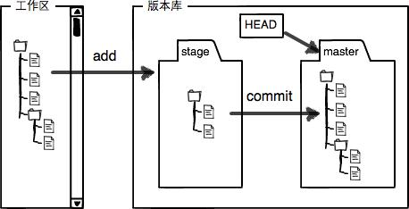

# 3 Git

### 1.1 git的由来


很多人都知道，Linus在1991年创建了开源的Linux，从此，Linux系统不断发展，已经成为最大的服务器系统软件了。


Linus虽然创建了Linux，但Linux的壮大是靠全世界热心的志愿者参与的，这么多人在世界各地为Linux编写代码，那Linux的代码是如何管理的呢？

事实是，在2002年以前，世界各地的志愿者把源代码文件通过diff的方式发给Linus，然后由Linus本人通过手工方式合并代码！


你也许会想，为什么Linus不把Linux代码放到版本控制系统里呢？不是有CVS、SVN这些免费的版本控制系统吗？因为Linus坚定地反对CVS和SVN，这些集中式的版本控制系统不但速度慢，而且必须联网才能使用。有一些商用的版本控制系统，虽然比CVS、SVN好用，但那是付费的，和Linux的开源精神不符。


不过，到了2002年，Linux系统已经发展了十年了，代码库之大让Linus很难继续通过手工方式管理了，社区的弟兄们也对这种方式表达了强烈不满，于是Linus选择了一个商业的版本控制系统BitKeeper，BitKeeper的东家BitMover公司出于人道主义精神，授权Linux社区免费使用这个版本控制系统。

安定团结的大好局面在2005年就被打破了，原因是Linux社区牛人聚集，不免沾染了一些梁山好汉的江湖习气。开发Samba的Andrew试图破解BitKeeper的协议（这么干的其实也不只他一个），被BitMover公司发现了（监控工作做得不错！），于是BitMover公司怒了，要收回Linux社区的免费使用权。


Linus可以向BitMover公司道个歉，保证以后严格管教弟兄们，嗯，这是不可能的。实际情况是这样的：

Linus花了两周时间自己用C写了一个分布式版本控制系统，这就是Git！一个月之内，Linux系统的源码已经由Git管理了！牛是怎么定义的呢？大家可以体会一下。

Git迅速成为最流行的分布式版本控制系统，尤其是2008年，GitHub网站上线了，它为开源项目免费提供Git存储，无数开源项目开始迁移至GitHub，包括jQuery，PHP，Ruby等等。

历史就是这么偶然，如果不是当年BitMover公司威胁Linux社区，可能现在我们就没有免费而超级好用的Git了。


Git是一个开源的分布式版本控制系统，用于敏捷高效地处理任何或小或大的项目。Git 是 Linus Torvalds 为了帮助管理 Linux 内核开发而开发的一个开放源码的版本控制软件。Git 与常用的版本控制工具 CVS, Subversion 等不同，它采用了分布式版本库的方式，不必服务器端软件支持。


### 1.2 Git 与 SVN 区别

GIT不仅仅是个版本控制系统，它也是个内容管理系统(CMS),工作管理系统等。


如果你是一个具有使用SVN背景的人，你需要做一定的思想转换，来适应GIT提供的一些概念和特征。

Linus一直痛恨的CVS及SVN都是集中式的版本控制系统，而Git是分布式版本控制系统，集中式和分布式版本控制系统有什么区别呢？


先说集中式版本控制系统，版本库是集中存放在中央服务器的，而干活的时候，用的都是自己的电脑，所以要先从中央服务器取得最新的版本，然后开始干活，干完活了，再把自己的活推送给中央服务器。中央服务器就好比是一个图书馆，你要改一本书，必须先从图书馆借出来，然后回到家自己改，改完了，再放回图书馆。


集中式版本控制系统最大的毛病就是必须联网才能工作，如果在局域网内还好，带宽够大，速度够快，可如果在互联网上，遇到网速慢的话，可能提交一个10M的文件就需要5分钟，这还不得把人给憋死啊。


那分布式版本控制系统与集中式版本控制系统有何不同呢？首先，分布式版本控制系统根本没有“中央服务器”，每个人的电脑上都是一个完整的版本库，这样，你工作的时候，就不需要联网了，因为版本库就在你自己的电脑上。既然每个人电脑上都有一个完整的版本库，那多个人如何协作呢？比方说你在自己电脑上改了文件A，你的同事也在他的电脑上改了文件A，这时，你们俩之间只需把各自的修改推送给对方，就可以互相看到对方的修改了。


和集中式版本控制系统相比，分布式版本控制系统的安全性要高很多，因为每个人电脑里都有完整的版本库，某一个人的电脑坏掉了不要紧，随便从其他人那里复制一个就可以了。而集中式版本控制系统的中央服务器要是出了问题，所有人都没法干活了。


在实际使用分布式版本控制系统的时候，其实很少在两人之间的电脑上推送版本库的修改，因为可能你们俩不在一个局域网内，两台电脑互相访问不了，也可能今天你的同事病了，他的电脑压根没有开机。因此，分布式版本控制系统通常也有一台充当“中央服务器”的电脑，但这个服务器的作用仅仅是用来方便“交换”大家的修改，没有它大家也一样干活，只是交换修改不方便而已。


Git 与 SVN 区别点：

1、GIT是分布式的，SVN不是：这是GIT和其它非分布式的版本控制系统，例如SVN，CVS等，最核心的区别。

2、GIT把内容按元数据方式存储，而SVN是按文件：所有的资源控制系统都是把文件的元信息隐藏在一个类似.svn,.cvs等的文件夹里。

3、GIT分支和SVN的分支不同：分支在SVN中一点不特别，就是版本库中的另外的一个目录。

4、GIT没有一个全局的版本号，而SVN有：目前为止这是跟SVN相比GIT缺少的最大的一个特征。

5、GIT的内容完整性要优于SVN：GIT的内容存储使用的是SHA-1哈希算法。这能确保代码内容的完整性，确保在遇到磁盘故障和网络问题时降低对版本库的破坏。




之前搭载博客的教程里其中一条命令就是

```
$ ssh-keygen -t rsa -C "youremail@example.com"
```


由于你的本地Git仓库和GitHub仓库之 间的传输是通过SSH加密的，所以，需要一点设置： 第1步：创建SSH Key。在用户主目录下，看看有没有.ssh目录，如果有，再看看这个目录下 有没有id_rsa和id_rsa.pub这两个文件，如果已经有了，可直接 跳到下一步。如果没有，打 开Shell（Windows下打开Git Bash），

创建SSH Key： $ ssh-keygen -t rsa -C "youremail@example.com"

你需要把邮件地址换成你自己的邮件地址，然后一路回车，使用默认值即可，由于这个Key 也不是用于军事目的，所以也无需设置密码。 如果一切顺利的话，可以在用户主目录里找到.ssh目录，里面有id_rsa和id_rsa.pub两个文件，这两个就是SSH Key的秘钥对，id_rsa是私钥，不能泄露出去，id_rsa.pub是公钥，可以放⼼心地告诉任何人。


为什么GitHub需要SSH Key呢？因为GitHub需要识别出你推送的提交确实是你推送的，而不是别人冒充的，而Git支持SSH协议，所以，GitHub只要知道了你的公钥，就可以确认只有你自己才能推送。 当然，GitHub允许你添加多个Key。假定你有若干电脑，你一会儿在公司提交，一会儿在 家⾥里提交，只要把每台电脑的Key都添加到GitHub，就可以在每台电脑上往GitHub推送 了。 友情提示，在GitHub上免费托管的Git仓库，任何人都可以看到喔（但只有你自己才能改）。所以，不要把敏感信息放进去。


### 2.1 本地仓库repository

```
配置
git help(帮助)
git help config（配置帮助）
git config --list （查看配置情况）
git config --global user.name "name"（global全局设置）
git config --global user.email"email@example.com"
git config core.editor vim
git config color.ui true
git config merge.tool vimdiff
git config --global alias i init(alias:别名。把init改为i，以后i就代表init。其他也是一样修改)

初始化仓库
git init（创建一个新的本地仓库）
ls -ah  （h:hide，查看隐藏的文件.git）
git add （添加到Stage或者index暂存区） git commit -m "说明"（提交到仓库）
= git commit -a -m "说明"

查看状态
git status（仓库当前状态）
git diff (查看difference)
git diff HEAD -- readme.txt(查看readme和当前版本的不同)
git log(查看操作记录)
git reset --hard HEAD^
(版本回退到上一次，上上一次是HEAD^^,HEAD表示当前版本，--hard：意思暂时不知道)
git reset --hard commit_id(commit_id用git log查看)


git rm file （删除文件）
git checkout -- file (丢弃工作区的修改，注意file和-之间有空格。我们还没git add时，这时我们还是在工作区。checkout：结账离开。)
```

###  

### 2.2 远程仓库

```
ssh-keygen -t rsa -C "youremail@example.com"
(本地git仓库和github仓库之间的传输时通过SSH加密的，id_rsa是私钥，id_rsa.pub是公钥)

git remote add origin SSH
(关联远程库。SSH: git@github.com:用户名/库名.git,远程仓库的名称就是origin)
git remote rm origin （移除远程库的绑定）

git push -u origin master（第一次推送master分支的所有内容）
git push origin master(本地库的内容推送到远程)
ssh -T -v git@github.com（ssh的debug命令）

git clone SSH或者https
（Git支持多种协议，包括https，但通过ssh支持的原生git协议速度最快。）

有些人会遇到问题
Host key verification failed.
fatal: Could not read from remote repository.

Please make sure you have the correct access rights
and the repository exists.
这个就是因为你的是windows，你用https连接会比较好，把SSH改为你的https链接就成功了。
```


### 2.3 分支管理

```
git branch dev  和git checkout dev
= git checkout -b dev (branch:分支)
git branch (查看当前分支，前分支前面会标一个*号。)
git checkout master
(切换到master。跟我们前面的git checkout -- file 有点像，不要搞混)
git merge dev (在master分支下，合并所有分支。merge：合并)
gti branch -d dev (删除dev分支)
```


### 2.4 解决冲突

```
当Git无法自动合并分支时，就必须首先解决冲突。解决冲突后，再提交，合并完成。
用git log --graph命令可以看到分支合并图。

通常，合并分支时，如果可能，Git会用Fast forward模式，但这种模式下，删除分支后，会丢掉分支信息。
如果要强制禁用Fast forward模式，Git就会在merge时生成一个新的commit，这样，从分支历史(git log --graph)上就可以看出分支信息。
git merge --no-ff -m"说明" dev  (ff: fast forward)


在实际开发中，我们应该按照几个基本原则进行分支管理：
首先，master分支应该是非常稳定的，也就是仅用来发布新版本，平时不能在上面干活；
那在哪干活呢？干活都在dev分支上，也就是说，dev分支是不稳定的，到某个时候，比如1.0版本发布时，再把dev分支合并到master上，在master分支发布1.0版本；
你和你的小伙伴们每个人都在dev分支上干活，每个人都有自己的分支，时不时地往dev分支上合并就可以了。


bug分支
git stash (把当前工作分支状态储存，stash：储存)
之后我们就可以切换到master修复bug。修复完后回到我们还没完成的工作分支
git stash list (查看工作现场)
一是用git stash apply恢复，但是恢复后，stash内容并不删除，你需要用git stash drop来删除；
另一种方式是用git stash pop，恢复的同时把stash内容也删了.这样你git stash list 就看不到了


开发一个新feature，最好新建一个分支；
如果要丢弃一个没有被合并过的分支，可以通过git branch -D <name>强行删除。
```


### 2.5 多人协作

```
git remote(查看远程库的信息)
git remote -v (查看详细的远程库的信息)
git push origin master
git push origin dev(推送其他分支)
git pull(下载最新的并在本地仓库合并)
建立本地分支和远程分支的关联，
使用git branch --set-upstream branch-name origin/branch-name
```


### 2.6 标签

```
git tag v1.0.0
git tag (查看所有标签)
git show v1.0.0 (查看标签信息)
git tag -a v1.2.1 -m "version1.2.1 released" (-m加上说明）
-s用私钥签名一个标签,签名采用PGP签名，用PGP签名的标签是不可伪造的.必须首先安装gpg（GnuPG）
git tag -d v1.0.0(本地删除标签)

git push origin v1.0.0 (推送特定标签到远程)
git push origin --tags (推送本地所有标签到远程)
git push origin :refs/tags/<tagname>（删除一个远程标签）
```


### 2.7 克隆

git clone SSH或https（克隆他人的仓库到本地）


### 2.8  放弃跟踪文件

在git工作区的根目录下创建一个特殊的.gitignore文件，把忽略的文件名放进去，这样git就会放弃跟踪，不会再显示这个文件untracked files


### 2.9 命令字典

```
# </git>
## Stash（储存）
git stash list （查看储存历史）
git stash show [<stash>]
git stash branch [<branchname>][<stash>]
git stash save [<msg>]
git stash pop 
git stash drop [<stash>]
git stash clear
git stash apply [<stash>]


## Workspace（工作空间）
git status (查看仓库状态)
git diff (查看不同)
git diff <commit or branch> (查看当前分支或者和文件与仓库的不同，你可以使用HEAD比较文件和当前版本的不同)
git add <file... or dir...> (把当前目录或者修改的文件添加到暂存区index)
git add -u (把当前目录添加到暂存区， 类型命令git commit -a)
git rm <file(s)...> (删除文件)
git mv <file(s)...> （移动文件）
git commit -a [-m ' msg'] (msg:message说明。 提交文件到本地仓库，添加说明)
git checkout -- <file(s) ... or  dir> （取消修改，未git add时）  
git reset --hard (版本回退)
git checkout <branch> (切换到分支)
git checkout -b <name of new branch > (新建一个分支)
git merge <commit or branch> (合并分支)
git rebase <upsteam> 
git cherry-pick <commit> (合成所有提交到当前分支)
git revert <commit>
git clone <repo> （克隆仓库）
git pull <remote> <refspec>  
git reset --hard  <remote>/<branch>
git clean


## index（暂存区）
git reset HEAD <file(s)...>
git reset --soft HEAD^ 
git diff -cached [<commit>]


## Local Repository（本地仓库）
git commit [-m 'msg'] （提交到本地仓库）
git commit --amend
git log （查看分支情况）
git diff <commit>  （查看不同）
git branch （查看所有分支）
git branch -d <branch> （删除分支）
git branch --track <new><remote/branch>
git fetch <remote> <refspec>
git push 
git push <remote> <branch>
git push <remote> <branch>:<branch>


## Upstream Repository （上游仓库）
git branch --track <new> <remote/branch>
git clone repo （克隆远程仓库）
git pull <remote> <refspec> 
git reset --hard <remote>/<branch> (版本回退)
git fetch <remote> <refspec> 从仓库书签中下载所有的历史）
git branch -r
git push <remote> : <branch>


## Configue Tooling（配置工具）
git config --global user.name "name"
git config --global user.email "email@example.com"
git config core.editor vim
git config color.ui true
git config merge.tool vimdiff 
git config --list （查看配置情况）
git help config （查看配置帮助）


## create Repository（创建仓库）
git init [project-name] （创建本地仓库）
git clone [url] （克隆仓库）


## Make Changes（查看改变）
git status （查看文件情况）
git diff  （查看不同）
git add [file] （添加到暂存区）
git diff --staged  
git reset [file] （本地分支版本回退） 
git commit -m "[descriptive message]" （提交到本地仓库，并附带说明）


## Group Changes （组织变化）
git branch （查看所有分支）
git branch [branch-name] （创建一个分支）
git checkout [branch-name] （切换到分支）
git merege [branch] （合并分支）
git branch -d [branch-name] （创建并切换到分支）


## Refactor Filenames（删除文件）
git rm [file] （删除文件，本地不会保留文件）
git rm --cached [file]  （删除文件，本地会留着）
git mv [file-original] [file-renamd] （移动文件）


## Review history（查看历史）
git log （查看当前分支情况）
git log --follow [file] （查看更详细的情况，包括重命名）
git diff [first-branch]...[second-branch] （查看不同）
git show [commit] （查看某个commit的历史）


## Suppress Tracking（压制跟踪）
git ls-files --other --ignored --exclude-standard （忽略文件跟踪）


## Redo Commits（重新提交）
git reset [commit哈希 值] （本地分支版本回退） 
git reset --hard [commit_id]  (版本回退)


## Save Fragments（保存当前）
git stash （保存现场工作）
git stash pop （恢复现场工作）
git stash list （查看工作储存历史）
git stash drop （删除工作储存历史）


## Synchronize Changes（同步改变）
git fetch [bookmark] （从仓库书签中下载所有的历史）
git merge [bookmark]/[branch] （连接书签分支到当前的分支）
git push [alias] [branch]  （上传所有分支到github）
git pull （下载远程库更新的东西）
```