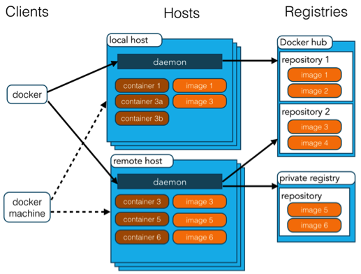

# 4 Docker

## Docker应用容器引擎** **

> Docker 是一个开源的应用容器引擎，基于 [Go 语言](http://www.runoob.com/go/go-tutorial.html) 并遵从Apache2.0协议开源。
>
> Docker 可以让开发者打包他们的应用以及依赖包到一个轻量级、可移植的容器中，然后发布到任何流行的 Linux 机器上，也可以实现虚拟化。容器是完全使用沙箱机制，相互之间不会有任何接口（类似 iPhone 的 app）,更重要的是容器性能开销极低。


通俗的说，就类似于一个Ghost镜像系统，平时普通的是纯净版，装完了系统后才装软件，而Docker则像是一个事先装好一些软件的镜像系统。如果想要在其他服务器安装环境，只要运行Docker镜像就行了，就不用再安装tomcat，MySQL这些了。Docker支持将软件编译成一个镜像，然后在镜像中配置好各种软件，将镜像发布，然后其他使用者就可以直接用这个镜像了。运行中的镜像称为容器，容器启动非常块。


## Docker架构



Docker Image(镜像)用于**创建Docker Container(容器)的模板**，打包保存的东西

而Docker Container(容器)则是一个或一组独立运行的**应用**，运行的程序


## 相关命令

### docker search 镜像名

搜索镜像，实际上到https://hub.docker.com/这里找


### docker pull 镜像名 | docker pull 镜像名:版本名称

下载镜像，当运行一个不存在的镜像名的时候，就会自动下载


### docker images

查看所有镜像


### docker rmi  镜像id

删除镜像


### docker run -p 端口 --name container-name -d images-name

运行， --name后面参数是自定义名词，-d后台运行， -p端口映射，images-name镜像名称（注：如果不加版本，默认是lastest，可以加，如ubuntu:14.04）

-i: 交互式操作

-t: 终端

/bin/bash：放在镜像名后的是命令，这里我们希望有个交互式 Shell，因此用的是 /bin/bash


### 进入容器

在使用 -d 参数时，容器启动后会进入后台。此时想要进入容器，可以通过以下指令进入：

docker attach

docker exec：推荐大家使用 docker exec 命令，因为此退出容器终端，不会导致容器的停止


### docker ps

查看运行中的容器， -a查看所有的容器


### docker start /stop container-name/container-id

通过容器的名称或者id 启动 / 停止容器


### docker logs container-name/container-id

查看容器日志


### docker tag [OPTIONS] IMAGE[:TAG] REGISTRYHOST/NAME[:TAG]

docker tag ubuntu:15.10 runoob/ubuntu:v3 添加标签


### docker启动

```
$ docker run --name some-mysql -p 3306:3306 -e MYSQL_ROOT_PASSWORD=my-secret-pw -d mysql:tag

>docker run -itd --name redis -p 6379:6379 redis
077135d8e979b90e3d879de83f7676aaeece48c336d0e8077053a6bf2920ed04

>docker run -itd --name mysql -p 3306:3306 -e MYSQL_ROOT_PASSWORD=kaguya mysql
050426128be5c3eb0830f2508873935753994878cbb07315b5efc43124a42b20

> docker run -itd --name mongo -p 27017:27017 mongo --auth

> docker run --name nginx -p 8080:80 -d nginx
```


## 制作自己的 Docker 容器

需要编写Dockerfile文件，具体参考网上