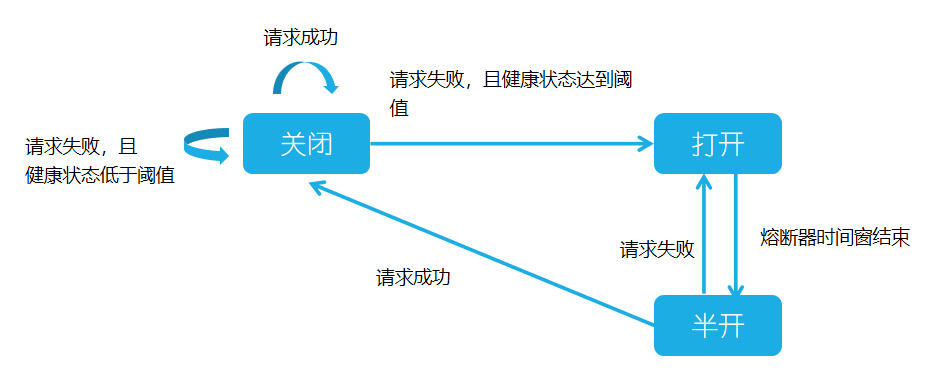
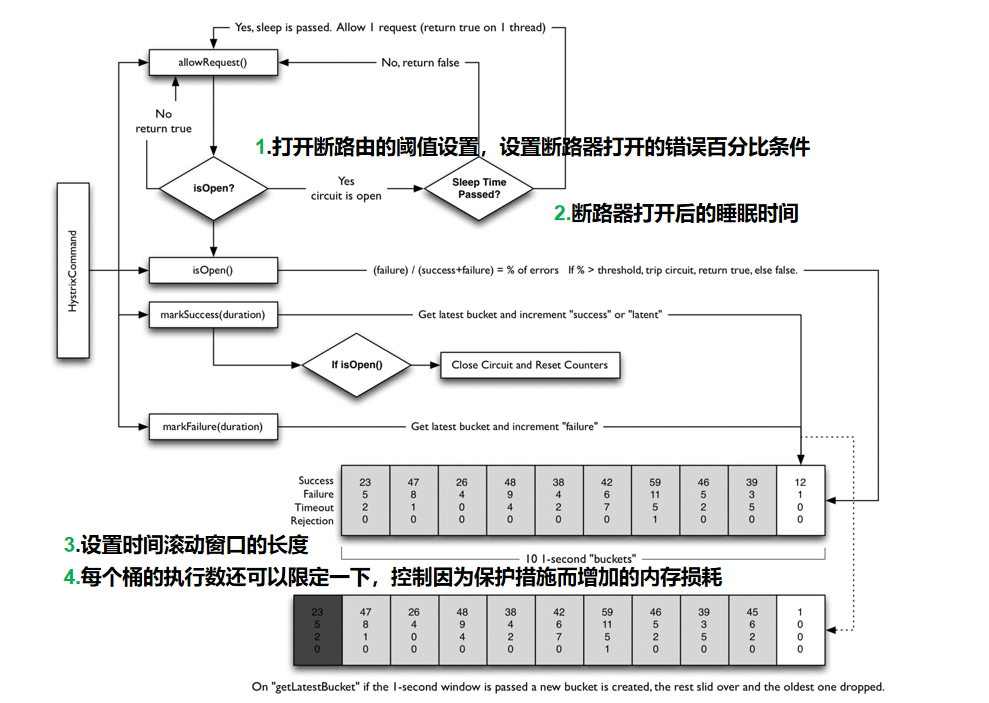
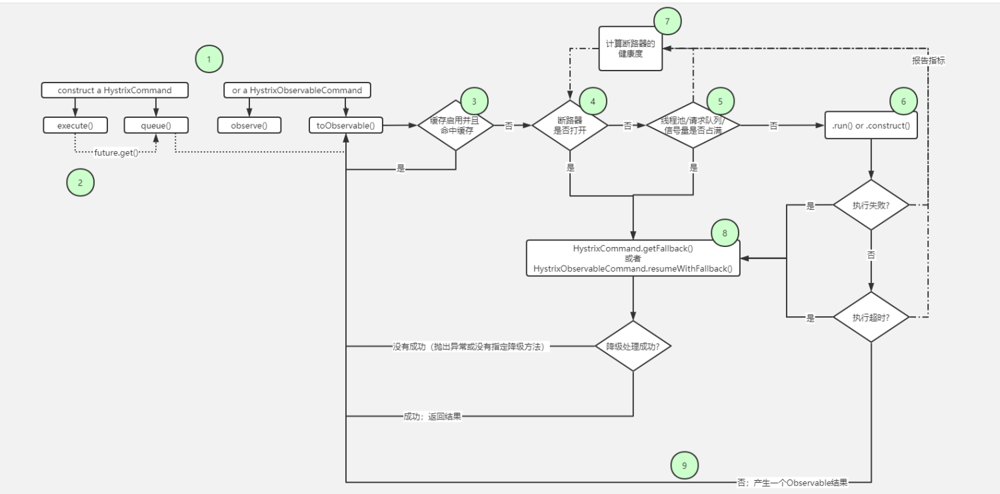

# 7 深入学习Spring Cloud Netflix

Spring Cloud Netflix通过自动配置和绑定到Spring环境和其他Spring编程模型的习惯方式来为Spring Boot应用程序提供Netflix OSS集成。通过几个简单的注释，您可以快速启用和配置应用程序中的常见模式，并通过经过测试的Netflix组件构建大型分布式系统。提供的模式包括服务发现（Eureka），断路器（Hystrix），智能路由（Zuul）和客户端负载平衡（Ribbon）。


## Fegin

Feign是一种声明式、模板化的HTTP客户端。在Spring Cloud中使用Feign, 我们可以做到使用HTTP请求远程服务时能与调用本地方法一样的编码体验，开发者完全感知不到这是远程方法，更感知不到这是个HTTP请求。 


### Fegin使用

1. @FeignClient
2. @EnableFeignClients

```java
import com.example.order.service.OrderWsService;
import com.example.order.web.config.OrderServiceFallbackFactory;
import com.example.order.web.config.OrderServiceRemoteConfiguration;
import org.springframework.cloud.openfeign.FeignClient;

@FeignClient(name="${order.provider.server.name}", url="${order.provider.server.url:}",
        configuration= OrderServiceRemoteConfiguration.class,
        fallbackFactory = OrderServiceFallbackFactory.class)
public interface OrderServiceRemote extends OrderWsService {
}

// --------------------------------------------------------------------------------------
@EnableFeignClients(basePackages = {"com.example.order"}) //启动Feign客户端
```


### FeignClient说明

```java
/**
 * Annotation for interfaces declaring that a REST client with that interface should be
 * created (e.g. for autowiring into another component). If ribbon is available it will be
 * used to load balance the backend requests, and the load balancer can be configured
 * using a <code>@RibbonClient</code> with the same name (i.e. value) as the feign client.
 *
 * @author Spencer Gibb
 * @author Venil Noronha
 */
@Target(ElementType.TYPE)
@Retention(RetentionPolicy.RUNTIME)
@Documented
public @interface FeignClient {

    /**
     * The name of the service with optional protocol prefix. Synonym for {@link #name()
     * name}. A name must be specified for all clients, whether or not a url is provided.
     * Can be specified as property key, eg: ${propertyKey}.
     * @return the name of the service with optional protocol prefix
     */
    @AliasFor("name")
    String value() default "";

    /**
     * The service id with optional protocol prefix. Synonym for {@link #value() value}.
     * @deprecated use {@link #name() name} instead
     * @return the service id with optional protocol prefix
     */
    @Deprecated
    String serviceId() default "";

    /**
     * This will be used as the bean name instead of name if present, but will not be used
     * as a service id.
     * @return bean name instead of name if present
     */
    String contextId() default "";

    /**
     * @return The service id with optional protocol prefix. Synonym for {@link #value()
     * value}.
     */
    @AliasFor("value")
    String name() default "";

    /**
     * @return the <code>@Qualifier</code> value for the feign client.
     */
    String qualifier() default "";

    /**
     * @return an absolute URL or resolvable hostname (the protocol is optional).
     */
    String url() default "";

    /**
     * @return whether 404s should be decoded instead of throwing FeignExceptions
     */
    boolean decode404() default false;

    /**
     * A custom <code>@Configuration</code> for the feign client. Can contain override
     * <code>@Bean</code> definition for the pieces that make up the client, for instance
     * {@link feign.codec.Decoder}, {@link feign.codec.Encoder}, {@link feign.Contract}.
     *
     * @see FeignClientsConfiguration for the defaults
     * @return list of configurations for feign client
     */
    Class<?>[] configuration() default {};

    /**
     * Fallback class for the specified Feign client interface. The fallback class must
     * implement the interface annotated by this annotation and be a valid spring bean.
     * @return fallback class for the specified Feign client interface
     */
    Class<?> fallback() default void.class;

    /**
     * Define a fallback factory for the specified Feign client interface. The fallback
     * factory must produce instances of fallback classes that implement the interface
     * annotated by {@link FeignClient}. The fallback factory must be a valid spring bean.
     *
     * @see feign.hystrix.FallbackFactory for details.
     * @return fallback factory for the specified Feign client interface
     */
    Class<?> fallbackFactory() default void.class;

    /**
     * @return path prefix to be used by all method-level mappings. Can be used with or
     * without <code>@RibbonClient</code>.
     */
    String path() default "";

    /**
     * @return whether to mark the feign proxy as a primary bean. Defaults to true.
     */
    boolean primary() default true;

}
```


## 服务雪崩

推荐阅读：[服务雪崩效应](https://blog.csdn.net/syilt/article/details/95035435)


### 介绍

服务雪崩效应是一种因**服务提供者**的不可用导致**服务调用者**的不可用,并将不可用逐渐放大的过程。当服务调用者使用**同步调用**时，会产生大量的**等待线程**占用系统资源。一旦线程资源被耗尽，服务调用者提供的服务也将处于不可用状态，于是服务雪崩效应产生了。


服务雪崩的过程可以分为三个阶段：

1. 服务提供者不可用；
2. 重试加大请求流量；
3. 服务调用者不可用；


### 原因

- 硬件故障 
- 程序BUG 
- 缓存击穿 
- 用户大量请求 


### 处理策略

- 流量控制
- 改进缓存模式
- 服务自动扩容
- 服务调用者降级服务


## Hystrix

推荐阅读：

- [防雪崩利器：熔断器 Hystrix 的原理与使用](https://www.jianshu.com/p/e75d98b573a6)
- [为什么要使用断路器Hystrix](https://www.cnblogs.com/xyhero/p/53852cf0245c229fe3e22756a220508b.html)


Hystrix 是一个帮助解决分布式系统交互时超时处理和容错的类库, 它拥有保护系统的能力。 


### Hystrix的设计原则

- 资源隔离
- 熔断器
- 命令模式


#### 资源隔离

Hystrix通过将每个依赖服务分配独立的线程池进行资源隔离, 从而避免服务雪崩。


#### 熔断器



服务的健康状况 = 请求失败数 / 请求总数

熔断器开关 由关闭到打开的状态转换 是通过当前 服务健康状况和设定阈值比较决定的


#### 命令模式

Hystrix的命令模式，通过继承HystrixCommand类，来代理服务调用逻辑(run方法), 并在命令模式中添加了服务调用失败后的降级逻辑(getFallback). 同时我们在Command的构造方法中可以定义当前服务线程池和熔断器的相关参数 。




hystrix处理流程





1. 熔断模式：这种模式主要是参考电路熔断，如果一条线路电压过高，保险丝会熔断，防止火灾。放到我们的系统中，如果某个目标服务调用慢或者有大量超时，此时，熔断该服务的调用，对于后续调用请求，不在继续调用目标服务，直接返回，快速释放资源。如果目标服务情况好转则恢复调用。


1. 隔离模式：这种模式就像对系统请求按类型划分成一个个小岛的一样，当某个小岛被火少光了，不会影响到其他的小岛。例如可以对不同类型的请求使用线程池来资源隔离，每种类型的请求互不影响，如果一种类型的请求线程资源耗尽，则对后续的该类型请求直接返回，不再调用后续资源。这种模式使用场景非常多，例如将一个服务拆开，对于重要的服务使用单独服务器来部署，再或者公司最近推广的多中心。这种模式称为：舱壁模式。


1. 限流模式：上述的熔断模式和隔离模式都属于出错后的容错处理机制，而限流模式则可以称为预防模式。限流模式主要是提前对各个类型的请求设置最高的QPS阈值，若高于设置的阈值则对该请求直接返回，不再调用后续资源。这种模式不能解决服务依赖的问题，只能解决系统整体资源分配问题，因为没有被限流的请求依然有可能造成雪崩效应。   


### HystrixCommand配置说明

参数设置：

- com.netflix.hystrix.HystrixCommandProperties
- com.netflix.hystrix.HystrixThreadPoolProperties
- ......

```java
public @interface HystrixCommand {

    /**
     * The command group key is used for grouping together commands such as for reporting,
     * alerting, dashboards or team/library ownership.
     * <p/>
     * default => the runtime class name of annotated method
     *
     * @return group key
     */
    String groupKey() default "";

    /**
     * Hystrix command key.
     * <p/>
     * default => the name of annotated method. for example:
     * <code>
     *     ...
     *     @HystrixCommand
     *     public User getUserById(...)
     *     ...
     *     the command name will be: 'getUserById'
     * </code>
     *
     * @return command key
     */
    String commandKey() default "";

    /**
     * The thread-pool key is used to represent a
     * HystrixThreadPool for monitoring, metrics publishing, caching and other such uses.
     *
     * @return thread pool key
     */
    String threadPoolKey() default "";

    /**
     * Specifies a method to process fallback logic.
     * A fallback method should be defined in the same class where is HystrixCommand.
     * Also a fallback method should have same signature to a method which was invoked as hystrix command.
     * for example:
     * <code>
     *      @HystrixCommand(fallbackMethod = "getByIdFallback")
     *      public String getById(String id) {...}
     *
     *      private String getByIdFallback(String id) {...}
     * </code>
     * Also a fallback method can be annotated with {@link HystrixCommand}
     * <p/>
     * default => see {@link com.netflix.hystrix.contrib.javanica.command.GenericCommand#getFallback()}
     *
     * @return method name
     */
    String fallbackMethod() default "";

    /**
     * Specifies command properties.
     *
     * @return command properties
     */
    HystrixProperty[] commandProperties() default {};

    /**
     * Specifies thread pool properties.
     *
     * @return thread pool properties
     */
    HystrixProperty[] threadPoolProperties() default {};

    /**
     * Defines exceptions which should be ignored.
     * Optionally these can be wrapped in HystrixRuntimeException if raiseHystrixExceptions contains RUNTIME_EXCEPTION.
     *
     * @return exceptions to ignore
     */
    Class<? extends Throwable>[] ignoreExceptions() default {};

    /**
     * Specifies the mode that should be used to execute hystrix observable command.
     * For more information see {@link ObservableExecutionMode}.
     *
     * @return observable execution mode
     */
    ObservableExecutionMode observableExecutionMode() default ObservableExecutionMode.EAGER;

    /**
     * When includes RUNTIME_EXCEPTION, any exceptions that are not ignored are wrapped in HystrixRuntimeException.
     *
     * @return exceptions to wrap
     */
    HystrixException[] raiseHystrixExceptions() default {};

    /**
     * Specifies default fallback method for the command. If both {@link #fallbackMethod} and {@link #defaultFallback}
     * methods are specified then specific one is used.
     * note: default fallback method cannot have parameters, return type should be compatible with command return type.
     *
     * @return the name of default fallback method
     */
    String defaultFallback() default "";
}
```


#### HystrixCommand支持同步、异步两种方式

- 同步：execute()，默认调用get()阻塞方法（默认）  
- 异步：queue()，异步执行，返回Future<T>对象，可以手工调用get()方法 


#### HystrixObservableCommand只支持异步方式  

1. observe()：Hot Observable类型，当被调用时，立即触发命令，每次被订阅，都会执行onNext()（默认）

observableExecutionMode = ObservableExecutionMode.EAGER

1. toObservable()：Cold Observable类型，只有被订阅时，才会触发命令

observableExecutionMode = ObservableExecutionMode.LAZY


#### execution.isolation 配置 

- strategy：设置hystrix执行的隔离策略 THREAD（默认）、SEMAPHORE  
- imeoutInMilliseconds：设置超时时间，默认：1000毫秒  
- execution.timeout.enabled：设置是否启用超时时间，默认：true  
- thread.interruptOnTimeout：设置超时后是否要将它中断，默认：true  
- thread.interruptOnCancel：设置执行被取消时，是否要将它中断，默认：true
- semaphore.maxConcurrentRequests：设置信号量最大并发数，默认：10 


#### fallback.isolation配置 

- semaphore.maxConcurrentRequests：设置服务降级后，降级方法的最大并发数，默认：10  
- fallback.enabled：设置是否启用服务降级，默认：true  


#### circuitBreaker配置  

- enabled：设置服务调用失败后，是否使用熔断器来跟踪其健康指标和熔断请求，默认：true
- requestVolumeThreshold：设置熔断器熔断的最小请求数，默认：20  
- sleepWindowInMillisceonds：设置熔断器打开后睡眠的时间，默认:5000毫秒 
- errorThresholdPercentage：设置服务请求失败的最大比例，默认：50%  
- forceOpen：设置熔断器强制打开，拒绝所有请求，默认：false  
- forceClosed：设置熔断器强制关闭，默认：false  


#### metrics配置  

- rollingStats.timeInMilliseconds：设置熔断器收集指标信息的持续时间，默认：10000毫秒 
- rollingStats.numBuckets：设置收集指标信息“桶”的数量，默认：10  enabled：设置是否使用百分比数来跟踪和计算指标信息，默认：true 
- rollingPercentile.timeInMilliseconds：设置百分比统计的持续时间，默认：60000毫秒  
- rollingPercentile.numBuckets：设置百分比统计时“桶”的数量，默认：6  
- rollingPercentile.bucketSize：设置“桶”记录最大执行次数，默认100  
- healthSnapshot.itervalInMilliseconds：设置采集影响熔断器状态的健康快照的间隔时间，默认：500毫秒  


#### requestContext配置 

- requestCache.enabled：设置是否开启缓存，默认true  
- requestLog.enabled：设置执行的事件是否打日志印到HystrixRequestLog中，默认：true 


#### collapser配置 

- maxRequestsInBatch：设置一次请求合并的最大数，默认：Integer最大值  
- timerDelayInMilliseconds：设置合并请求的延迟时间，默认：10毫秒 


#### threadPool配置  

- coreSize：设置执行命令线程池的核心数量，也是最大并发量，默认：10  
- maxQueueSize：设置线程池的最大队列数，默认：-1  
- queueSizeRejectionThreshold：设置队列拒绝的阀值， maxQueueSize设置为：-1时，此属性无效，默认：5 


## Ribbon

Ribbon是一个客户端的负载均衡器，可以提供很多HTTP和TCP的控制行为。Feign拥有重试机制，主要是因为它集成了Ribbon模块，所以如果你使用了Feign，Riboon也同样被应用了。 

```properties
# hystrix
# 超时熔断时间
hystrix.command.default.execution.isolation.thread.timeoutInMilliseconds=50000

大于>    
    
# ribbon
# 请求处理的超时时间
ribbon.ReadTimeout=20000
```

为了确保Ribbon重试的时候不被熔断，我们就需要让Hystrix的超时时间大于Ribbon的超时时间，否则Hystrix命令超时后，该命令直接熔断，重试机制就没有任何意义了。  


## 常用配置

### Feign


```properties
# Feign配置
# 开启Hystrix降级
feign.hystrix.enabled=true
# 配置请求GZIP压缩
feign.compression.request.enabled=true
# 配置响应GZIP压缩
feign.compression.response.enabled=true
# 配置压缩支持的MIME TYPE
feign.compression.request.mime-types=text/xml,application/xml,application/json
# 配置压缩数据大小的下限
feign.compression.request.min-request-size=2048
```


### Hystrix

```properties
# hystrix.command配置
# 关闭command超时功能（可以默认使用读取超时）
hystrix.command.default.execution.timeout.enabled=false
# 设置熔断超时时间，方法上需加上@HystrixCommand，否则无效
hystrix.command.default.execution.isolation.thread.timeoutInMilliseconds=10000
# 配置具体方法的熔断超时时间，serverMethod：方法名称
# hystrix.command.接口名称#方法名(参数类型).execution.isolation.thread.timeoutInMilliseconds=5000
# 例如：
# hystrix.command.OrderServiceRemote#getUser(String).execution.isolation.thread.timeoutInMilliseconds=5000

# hystrix.threadpool配置
# 设置线程数大小为10，默认为10 也就是说最大并发为10
hystrix.threadpool.default.coreSize =10
```

### Ribbon

```properties
# ribbon配置
# 请求连接超时时间
ribbon.ConnectTimeout=600
# 请求处理超时时间 如果开启了hystrix.command.default.execution 的timeout 建议该时间大于hystrix的timeout
ribbon.ReadTimeout=6000
# 切换实例的重试次数 1次
ribbon.MaxAutoRetriesNextServer=1
# 对所有操作请求都进行重试
ribbon.OkToRetryOnAllOperations=false
# 对当前实例的重试次数 1次
ribbon.MaxAutoRetries=0
```


## Feign client规范

```java
• FeignClient 
（以下示例 代码有采用了api抽离jar包的方式，所有FeignClient的接口继承了API中的接口）
1. 强制使用熔断使用fallbackFactory降级
2. 方法返回统一封装为自定义ResponseMsg
@RequestMapping("/api")
public interface FeignDemo {
    @RequestMapping("/demo")
    ResponseMsg<String> hello();
}

@FeignClient(name = "feign-service", path = "/service", fallbackFactory = FeignFallbackFactory.class)
public interface FeignDemoClient extends FeignDemo {
}
• FallBackFactory
1. 统一封装异常
2. 合理的输出错误日志（方法有参数时必须把参数输出）
3. 统一封装返回值自定义ResponseMsg（可以根据异常封装更清晰的msg，不要直接返回null）
4. fallback为发生错误或服务降级时执行代码（建议Feign后端全局捕获异常，从而使服务器内部错误不参与降级阈值的统计）
@Slf4j
@Component
public class FeignFallbackFactory implements FallbackFactory<FeignDemoClient> {
    @Autowired
    private FeignGetErrorMsg feignGetErrorMsg;
    @Override
    public FeignDemoClient create(Throwable cause) {
        FeignError feignError = feignGetErrorMsg.getFeignError(cause);
        return new FeignDemoClient() {
            @Override
            public ResponseMsg<String> hello() {
                log.error("{}", feignError.getMsg(), cause);
                return new ResponseMsg.Builder<String>(false)
                        .errorCode(feignError.getErrorCode())
                        .message(feignError.getMsg())
                        .build();
            }
        };
    }
}


@Getter
public enum FeignError {
    READ_TIME_OUT("READ_TIME_OUT", "读取超时"),
    CONNECT_TIME_OUT("CONNECT_TIME_OUT", "连接超时"),
    HYSTRIX_OPEN("HYSTRIX_OPEN", "Hystrix熔断开启"),
    HYSTRIX_TIME_OUT("HYSTRIX_TIME_OUT", "Hystrix执行超时"),
    INTERNAL_SERVER_ERROR("INTERNAL_SERVER_ERROR", "服务器内部错误");
    private String errorCode;
    private String msg;
    FeignError(String errorCode, String msg){
        this.errorCode = errorCode;
        this.msg = msg;
    }
}


@Component
public class FeignGetErrorMsg {
    public static final String HYSTRIX_CIRCUIT_SHORT_CIRCUITED_AND_IS_OPEN = "Hystrix circuit short-circuited and is OPEN";
    public static final String READ_TIMED_OUT = "Read timed out";
    public static final String CONNECT_TIMED_OUT = "connect timed out";
    /**
     * 根据错误封装异常
     * 使用者可自行修改
     * @param cause
     * @return
     */
    protected FeignError getFeignError(Throwable cause) {
        String msg = cause.getMessage();
        if (cause instanceof RuntimeException) {
            if (HYSTRIX_CIRCUIT_SHORT_CIRCUITED_AND_IS_OPEN.equals(msg)) {
                return FeignError.HYSTRIX_OPEN;
            }
        } else if (cause instanceof SocketTimeoutException) {
            if (READ_TIMED_OUT.equals(msg)) {
                return FeignError.READ_TIME_OUT;
            } else if (CONNECT_TIMED_OUT.equals(msg)) {
                return FeignError.CONNECT_TIME_OUT;
            }
        } else if (cause instanceof HystrixTimeoutException) {
            return FeignError.HYSTRIX_TIME_OUT;
        }
        return FeignError.INTERNAL_SERVER_ERROR;
    }
}

• Response Error Decode
（只有客户端跟服务器建立连接，返回http错误才会进入这个方法）
1. 自定义CustomHystrixBadRequestException extends HystrixBadRequestException 服务器内部错误的请求不要进入熔断（影响熔断开启的阈值的统计）
2. 不走fallback的错误使用@ControllerAdvice + @ExceptionHandler进行全局捕获
3. 其他未捕获异常走fallback
@Slf4j
@Configuration
public class FeignConfig {
    @Bean
    public ErrorDecoder errorDecoder() {
        return new ErrorDecoder() {
            @Override
            public Exception decode(String methodKey, Response response) {
                try {
                    if (response.body() != null) {
                        String body = Util.toString(response.body().asReader());
                        JSONObject jsonObject = JSONObject.parseObject(body);
                        log.error("后端报错:{}", jsonObject);
                        // 判断服务器未补获的异常
                        Integer status = jsonObject.getInteger("status");
                        // 判断自定义异常 兼容以前版本（后续新代码不建议server端直接抛异常给前端）
                        Boolean success = jsonObject.getBoolean("success");
                        if (status != null) {
                            if (status == 500) {
                                // 封装成CustomHystrixBadRequestException不进入fallback
                                return CustomHystrixBadRequestException
                                        .buildFailException(false, status.toString(), jsonObject.getString("error"));
                            } else {
                                return SystemException
                                        .buildFailException(false, status.toString(), jsonObject.getString("error"));
                            }
                        } else if(success != null && !success) {
                            ResponseMsg msg = JSONObject.parseObject(body, ResponseMsg.class);
                            return CustomHystrixBadRequestException
                                    .buildFailException(msg.isSuccess(), msg.getErrorCode(), msg.getMessage());
                        }
                    }
                } catch (Exception e) {
                    log.error("处理Feign的异常信息失败！", e);
                }
                // 处理其他异常情况
                return SystemException
                        .buildFailException(false, "unknow error", "unknow error");
            }
        };
    }
}

@ControllerAdvice
@Slf4j
public class GlobalExceptionHandler {
    @ExceptionHandler(value = CustomHystrixBadRequestException.class)
    @ResponseBody
    public ResponseMsg HystrixBadRequestExceptionhandler(CustomHystrixBadRequestException e, HttpServletRequest req) {
        log.error("hystrix bad request exception", e);
            return new ResponseMsg.Builder<String>(e.isSuccess())
                    .errorCode(e.getErrorCode())
                    .message(e.getMessage())
                    .build();
    }
    @ExceptionHandler(value = Exception.class)
    @ResponseBody
    public ResponseMsg handler(Exception e, HttpServletRequest req) {
        log.error("global catch exception", e);
        return new ResponseMsg.Builder<String>(false)
                .errorCode("Internal Server Error")
                .message("Internal Server Error")
                .build();
    }
}
```

   