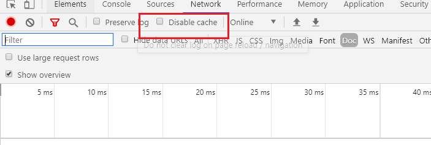

# 前端问题

### 1 js加载顺序问题

注意js要放到后面，不然导致页面渲染出错，尤其是vue，另外注意js的先后顺序。


### 2 js清除浏览器缓存

界面缓存

1、location.reload()：用于刷新当前文档。会从缓存获取当前文档。

2、**location.reload(true)**：无论文档的最后修改日期是什么，都会绕过缓存，从服务器上重新下载


浏览器的清除缓存——F12

第一种，开发调试时：禁用缓存

disable cache 不会刷新session storage



第二种


### 3 Ajax请求json数据映射问题

加上contentType: 'application/json;charset-UTF-8',

```javascript
$.ajax({
    url: "/getUserInfo3",
    type: "POST",


    data: JSON.stringify(vm.info),
    // 回调函数
    success: function(result){
      console.log(result);
      alert(result.username);
    }
});
```


### 4 CORB

将ajax请求中的dataType属性设置为“jsonp”，jsonp是专门用来解决跨域访问而诞生的。


### 5. boostrap 表格自适应

```
 <table class="table table-bordered table-hover" style="word-break:break-all; word-wrap:break-all;">
```