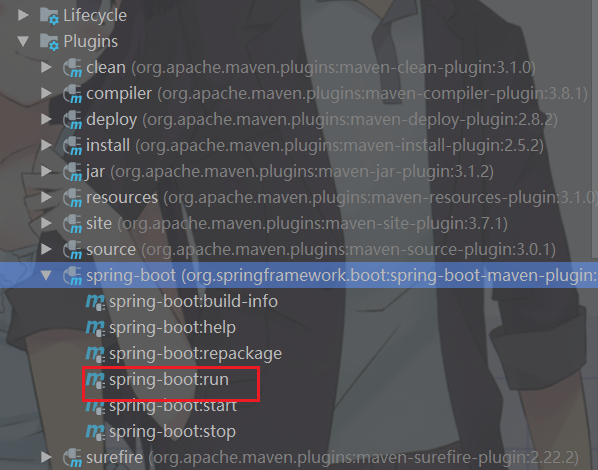
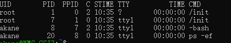

# 问题整理


记录一些个人踩过的坑以及解决方法，是坑也是心得，也是开发技巧。


### 1 Disconnected from the target VM, address: '127.0.0.1:56091', transport: 'socket

当启动SpringBoot项目时，并没有指明错误的原因，只有短短的几行信息。在这里，可以使用Maven的spring-boot插件启动，可以看到更多打印信息，然后再通过信息去排查原因。




### 2 BeanUtils.copyProperties()浅拷贝

惨，在debug的时候看到数据是复制过来了，没注意到List<Object>里面的Object不是同一个，而是复制源对象里面的List里的对象，说好的泛型呢。解决方法是：自定义一个集合，遍历复制对象，然后将对象添加进去即可。


### 3 循环里面不用去批量调用服务

应减少调用次数，如果必须批量调用，应限制其大小上限。另外避免大事务。


### 4 Maven打包问题

多个包打成一个包，其他包在lib里面

如果改了一个服务的代码，不一定是要发布这个服务，首先要看这个问题的入口是在哪里，然后和调用（改代码的服务）是什么关系，是pom打包关系还是远程调用。

如果是打包，则应该发另一个包。


### 5 mq队列消息堆积

原因：消费时间过长，消息生产速度过快。

一方面消息没控制好数量，另一方面，消息消费的时候调用别人的接口，然后正好对着别人的服务器挂了，**自己这边超时设置的时间过长**。导致消费的速度很慢。其实这也说明了熔断的重要性。


### 6 SVN无法提交，被lock了

1）commit message描述信息过长

2）格式不对

```
Desc:第一次提交 
Reviewer: AkaneMurakawa
```


3）提交时候有其他文件正在被使用，比如excel


### 7如何查看服务是否启动




```
ps -ef | grep 服务名 用户名后面对应的pid 
杀死服务 kill -9 对应的pid
```


### 8 Lombok 作用域

在lambda表达式中访问外层作用域和老版本的匿名对象中的方式很相似。你可以直接访问标记了final的外层局部变量，或者实例的字段以及静态变量。

```
@ToString(callSuper = true)
```


### 9 keytool导入证书问题

导入的时候，会说找不到文件


默认的JAVA_HOME：`C:\Program Files\Java\jdk1.8.0_131`**路径有空格，**

1. **看文件是否只读**
2. **如果权限不足，请使用管理员运行。**


### 10 Navicat导入数据读取不到文件

excel文件必须是打开的，另外sheet即表名。


### 11 MyBatis的坑

空值则会抛异常，所以插入数据或者查询用到**in**需要考虑是否会空，是否需要做空的判断。这跟Mybatis的解析Mappe.xml有关。


### 12 Archery审核平台自增问题

用的Archery审核平台，插入的时候未注意是自增的，插入的内容超过了最大值。结果竟然成功了，还把自增的值改成了最大值。下一次再插入的时候就报错了。

坑，自测数据库插入超过了是报错了。教训：用SQL审核平台的时候，插入数据一定要注意自增问题。并且回滚的话，并不能改变自增值。


### 13 java.Net.UnknownHostException

第一步，查看hostname

```
> hostname 例如hostname为：test

如何修改hostname
> hostname 名称
```

第二步，修改hosts

```
> vim /etc/hosts
新增内容:
127.0.0.1 test localhost localhost.localdomain localhost4 localhost4.localdomain4
127.0.0.1 test

说明这里的test就是新增内容，为hostname
```

最好就是默认为localhost。


### 14 fiddler抓包工具

需代理8888端口，安卓模拟器或浏览器设置代理之后，需重启。


### 15 Jenkins编译失败问题

原因：

1. 找不到包
2. 缺少代码
3. 代码错误


对于找不到包，分析的主要有几个方面：

1. cannot find symbol XXX，是由于该工程依赖了其它工程，而其他工程未重新打包导致的。解决方式就是将对应的工程重新编译即可。
2. 但是有时重新编译了还是不行，这个时候首先要看是否共用的是同一个maven(之前就踩过这个坑)，因为测试环境上往往是安装到本地仓库的(参见maven的生命周期)。如果还是不行，查看依赖的版本是否对应。


对于缺少代码，没什么好说的，就是将检查重新提交到 GIT/SVN即可。

对于代码错误，常见的是缺少配置文件，或是Spring中循环依赖，都会导致编译失败。


### 16 mybatis分页插件自动分页

参数中有pageNum，pageSize 则会自动添加分页，因此要注意SQL中是否有LIMIT，否则就会报SQL语法错误

```properties
pagehelper.support-methods-arguments=true
```

另外，可使用PageHelper.clearPage();清楚分页


### 17 SQL执行

**当查询生产数据时，要避免全表扫描，以免影响生产数据库。**

**另外，当修改表结构时候，应该避免作业高峰期。**


### 18 Feign问题

如果请求参数过长，可能造成status 400错误，解决方式：换成@RequestBody

一些特殊字符或者参数过长的时候，一定要注意，不要用queryString，字符串拼接。

